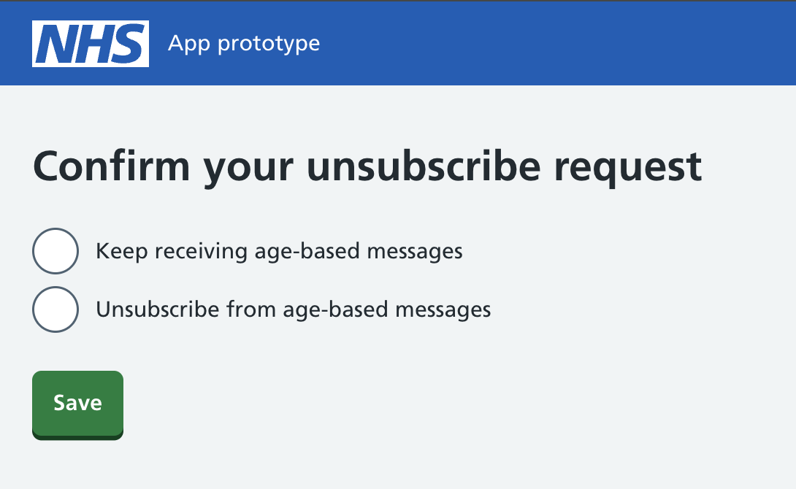

The opt-out journey has been a significant area of design work within the age-based messaging (ABM) programme.

While current cohorts are enrolled through a consensual model where participants explicitly agree to receive messages, the long-term ambition is to move towards a national service where eligible parents and carers are automatically enrolled. This reflects the anticipated public health value of delivering timely, evidence-based information throughout a child's early years.

As automatic enrolment increases, to adhere to the principles of consensual design, users must be able to easily stop receiving messages if the service no longer meets their needs. For this reason, the opt-out journey forms a critical part of the service experience, ensuring participants remain in control of their communications.

This work is particularly important because ABM is not delivering traditional appointment reminders or transactional communications. Instead, it provides developmental information, advice and support over a five-year period, creating unique considerations around consent, relevance, engagement and user control.

So far in the pilot, only two people have opted out- however we have gone for a different consensual model as we are asking users if they would like to partake in our trial. This has resulted in a large proportion of users disagreeing beforehand which may skew our results of the lack of opt-outs. The plan after our pilot is to resume our consensual model of automatically enroling users ourselves. 

## User needs

Through design workshops and research, we identified the following user needs for the opt-out journey:

- as a parent, I want to easily stop receiving messages when they are no longer useful to me

- as a parent, I want to be able to restart messages if my circumstances or needs change

- as a parent, I want to understand what I am opting out of and what will happen when I unsubscribe

- as the NHS, we need to accurately record user preferences and ensure users no longer receive messages once they have opted out

## Design constraints

Several constraints influenced the design of the opt-out journey.

### Digital exclusion

The current journey requires internet access. Users must leave the NHS App message and navigate through a web-based flow before they can manage their subscription preferences.

### Identity verification

To protect user preferences and prevent accidental changes, users are required to verify their identity before completing the unsubscribe journey. This adds friction to the journey but is currently a necessary security requirement.

### Re-subscription

At present there is no defined route for users to opt back into the service once they have unsubscribed. This presents a challenge given that ABM spans five years and users' information needs are likely to change over time.

### NHS App constraints

ABM messages are delivered within existing NHS App patterns and components. This limits the extent to which message presentation and preference management can be customised.

### Preference management

The NHS App previously explored a broader "manage your preferences" capability. However, this work did not progress due to insufficient evidence of user value at the time, limiting available infrastructure for ABM preference management within the apps interface.

## Content considerations

One of the key design questions centred around language and user expectations.

We explored a number of different approaches, including:

- opt out - can imply a user previously opted in

- unsubscribe - suggests a permanent decision

- manage preferences - implies a greater level of control and ongoing management of communications

Understanding users' mental models and expectations became a key focus of the research.

## Research approach

Participants were shown ABM messages within the NHS App before being asked to:

- Explain their understanding of the service
- Locate and complete the unsubscribe journey
- Explain their expectations of an "unsubscribe" journey and how they would expect to rejoin the service if they changed their mind

The research explored both usability and users' expectations around message preferences.

## What we learned

### Relevance is the biggest driver of opt-out

Participants were generally comfortable with receiving messages automatically. The primary reason users said they would opt out was not automatic enrolment itself, but a lack of relevance. Messages perceived as generic, repetitive or not applicable to their circumstances were more likely to result in disengagement or opt-out behaviour.

### Users expect preference management rather than a final Opt-Out

Users expected a greater degree of control and often separated messages into two categories:

- important NHS information, such as vaccinations, appointments and health-related actions

- advice, support and developmental guidance

- several participants expressed a desire to receive essential health information while opting out of less relevant content. This suggests that users think in terms of managing preferences rather than simply leaving the service altogether

### Users were unclear about the ABM Service

Many participants believed messages were being sent by health visitors, midwives or GPs. Others associated the messages with Best Start in Life and viewed these as the same service.

As a result, participants often struggled to understand:

- who owned the service

- why they were receiving messages

- how they would rejoin the service in future

This lack of service identity created confusion throughout the unsubscribe and re-subscription experience. Users viewed subscription management as reversible and expected they would be able to change their decision as their circumstances evolved.

## Design decisions

Based on the research, we have prioritised the following areas for further exploration:

As a result, we will:

- strengthen the ABM service identity and clarify its relationship with Best Start in Life/other communications

- improve message content to better communicate the value and purpose of messages

- explore preference management options rather than a simple unsubscribe model

- investigate pause and resubscription journeys

- assess whether message categories/tiers could provide users with greater control

## Next steps

We will continue testing service iterations throughout the remaining cohort period.

Alongside this, we will:

- refine the ABM service proposition and identity

- review the relationship between ABM and existing parent-facing communications

- develop the content strategy to ensure messaging remains relevant and valuable over time

- explore opportunities for preference management and re-subscription

- validate whether message categorisation provides meaningful user value without adding complexity

The long-term goal is to create an experience that balances public health benefits with user autonomy, ensuring users remain informed, engaged and in control throughout their child's journey.

