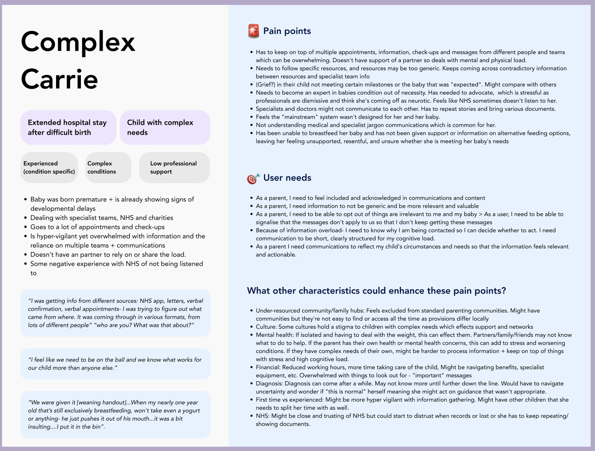

As the pilot developed, it became clear that age-based messaging (ABM) could evolve in a number of different directions. There was a need to establish a clearer strategic direction and align on where the service could create meaningful value for parents, public health and the wider NHS.

The re-discovery phase started with identifying assumptions about the service and understanding where evidence already existed to support or challenge them. This evolved into a programme of workshops, stakeholder engagement and evidence reviews designed to better understand user needs, public health priorities and future opportunities for the service.

This work resulted in the creation of a vision statement and two problem statements, allowing us to consider the challenge from both a parent and NHS perspective.

## Our Vision Statement
To set a clear direction and avoid scope creep, we established this vision:
*A future where every parent and carer has clear, credible and relevant information throughout their child's early years, empowering them to make informed decisions and take the right action at the right time.*

## Our Problem Statement(s)
### Parent perspective
*Parents and carers lack clear, timely information about their child's health and development, leaving them unsure how to support them and turning to less reliable sources.*

### NHS perspective
*Key public health indicators show that opportunities to improve children's health and development are frequently missed. Limited routine contact and traditional health promotion approaches mean parents and carers do not always receive timely, relevant information. This reduces opportunities to improve outcomes, prevent illness and reduce health inequalities.*

## Stakeholder workshops
We have already conducted a series of stakeholder workshops including a content strategy workshp and a clinical hazard workshop to identify key stakeholders and their needs. We are continuing to facilitate workshops to continue information gathering to identify how best we can bring value to the NHS, public health and parents.

Workshop participants include:

- health visitors

- midwives

- GPs and nurses

- Best Start in Life representatives

- 0-19 teams

- representatives from potential future rollout areas

These workshops are helping shape future strategy and priorities.

### Clinical and public health considerations
We are working with healthcare professionals, public health representatives and NHS stakeholders to understand:

- clinical safety considerations

- public health priorities

- feasibility of proposed topics

- potential risks

This includes work completed through a dedicated Clinical Hazard Workshop.

## Outcomes we are exploring

As part of discovery, we are defining which outcomes age-based messaging is best placed to influence. These include:

- awareness of important health interventions and services
- understanding of child health and development
- taking action at the right time
- confidence and reassurance for parents and carers
- navigation to appropriate services and support
- public health outcomes such as improved uptake of vaccinations, checks and preventative interventions

This work will help determine future content, success measures and evaluation criteria.

## User archetypes
The archetypes were developed using findings from Red Book, Growth Chart and age-based messaging research. Rather than fixed personas, they represent common needs, behaviours and barriers that may affect engagement with child health information and services.

At a high level, users sit within two broad groups: first-time parents and multi-child parents. Within these groups, we identified four broad subgroup categories of circumstances that may create barriers to engagement:

- parents facing personal and wellbeing challenges

- parents facing access and engagement barriers

- parents navigating complex child health journeys

- secondary carers and parents with diverse family, cultural and caregiving contexts

These categories are not mutually exclusive and many parents may experience barriers across multiple groups at different points in their journey.
Personal circumstances may influence how they interact with the service, including parents experiencing digital exclusion, language barriers, low confidence, financial pressures, complex family circumstances, caring responsibilities, or additional child health needs. We also included Health Visitors as important groups within the wider service ecosystem.

### What we learned about parent pain points

Across archetypes, several themes emerged:

- information is difficult to find and not well surfaced

- information is fragmented across different services and resources

- content can feel unclear, overly clinical or lacking context

- parents are not always supported to understand what is normal

- guidance is not always timely, relevant or actionable

- parents are expected to connect information themselves across services and channels

### Worst case scenarios
The archetypes also helped us explore worst-case scenarios if user needs are not met, helping identify risks and inform prioritisation decisions.

Across the archetypes, common risks included:

- parents disengaging from the service

- loss of trust in NHS communications

- important information, support or interventions being missed

- increased reliance on informal or unreliable sources of information

- secondary caregivers becoming excluded from the child's health journey

- families with additional needs receiving information that feels inappropriate or irrelevant

These scenarios helped us identify areas of risk and ensure the service remains focused on delivering meaningful value to parents, carers and healthcare professionals.
Next Steps

## Next steps

Completing the current workshop programme

- aligning on a long-term ABM strategy

- reviewing pilot outcomes and analytics

- conducting user interviews with pilot participants

- understanding value to parents, public health and the NHS

- identifying opportunities for future rollout and scaling

The pilot findings will play an important role in determining how age-based ,messaging evolves and where it can create the greatest meaningful impact.
