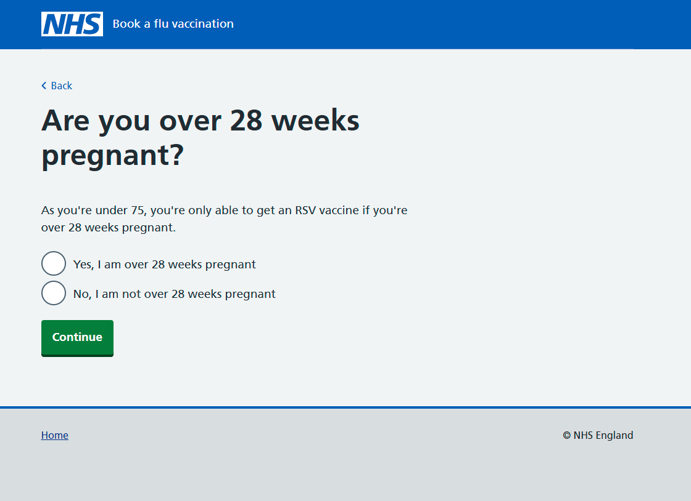
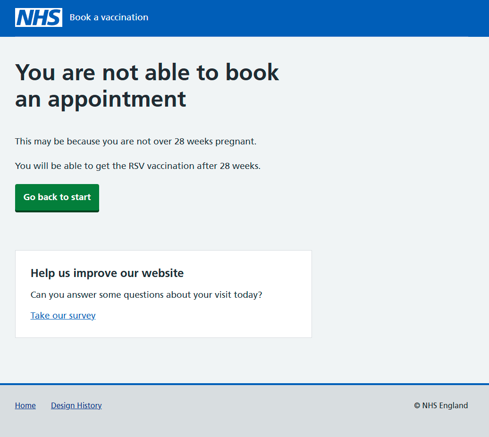

As part of the RSV expansion we explored the options for adding a route for people who are 28 weeks pregnant or more.

We hypothesised that the easiest way to include this route would be via a self-referral page.

## What we did

We designed a new screen which is shown when a citizen is not age eligible.

This follows the familiar pattern for self-referral that we use in the Covid-19 and Flu journeys. The main difference is that we've asked the user directly whether they are pregnant. This is because covid and flu have more groups that qualify for self-referral.

We designed a new kick out screen, to be shown where users have selected that they are not over 28 weeks pregnant.

## Findings

Users understood the self referral screen, and were able to understand the requirement to be over 28 weeks pregnant to book the vaccine.

As all participants understood the 28 week eligibility rule for getting the RSV vaccine they were not surprised when they saw the screen indicating they could not book an appointment because they were not yet eligible.

Some participants suggested they would like to book in advance, in anticipation of being over 28 weeks pregnant when they get the vaccine. As NBS currently only shows availability 21 days in advance, this would have to be explored as part of a bigger expansion to allow pregnant people to potentially book further in advance than 21 days.
