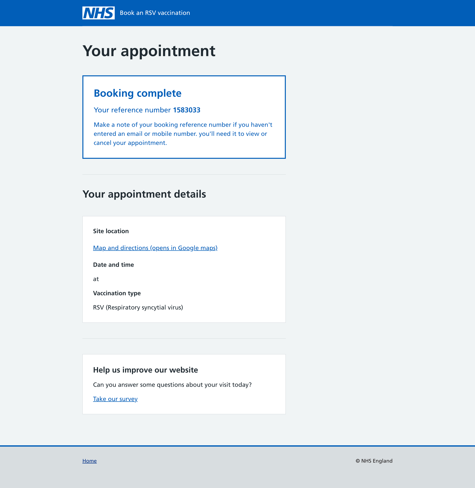
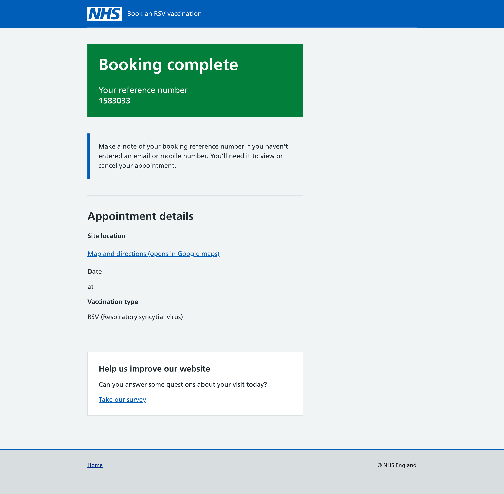

After the introduction of the panel component to the NHS design system, we took the opportunity to make improvements to our booking complete screens.

## The existing screen

The existing screen used cards to show users information about their booking.

Using cards can help to highlight key information, but using them exclusively on this screen made it difficult to understand which information was the most important, as it all appears to be similarly prioritised.

## What we did

We used the new panel component to show the user confirmation that their booking was complete, and changed the way some of the information on the screen was presented.

We also used inset text to highlight some key information about saving booking reference numbers

### The new screen

## Findings

The majority of users found the new screen straightforward, and understood that their booking had been completed successfully. Users were clear about the details of their appointment, including the time, date, and vaccine type.
