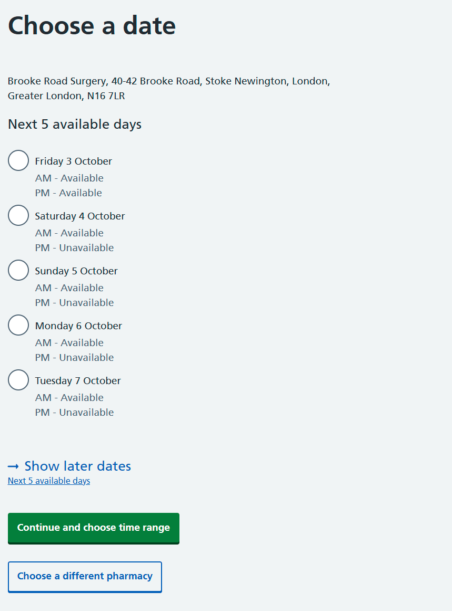
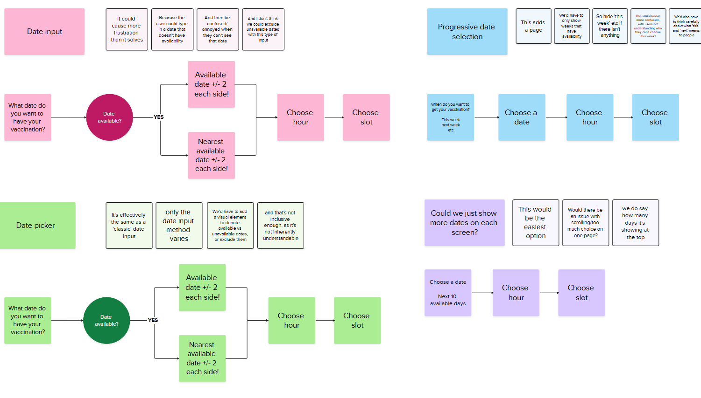
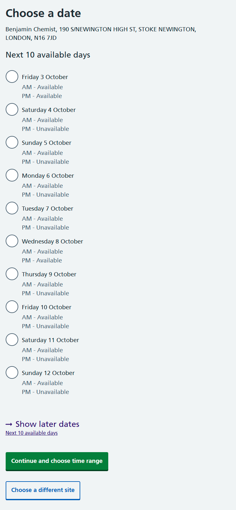

Our analytics on the National Booking Service (NBS) showed that 25% of users were clicking ‘show later dates’ when trying to find a suitable date for their appointment in NBS. 

Based on this, we explored ways to improve the date selection process, making it easier for users to find a date that suits them without having to click through multiple pages. 

###  The existing design

The existing design used radios to show 5 dates per page, with pagination to show later dates. 

## What we did   

We thought about different ways we could ask users to pick a date.  We need to allow users to only choose dates with availability. 

A lot of ways of collecting or choosing dates could potentially allow users to enter or choose dates that didn’t have open availability.  This could lead to frustration for users, and if they select several dates in a row without open availability, this could even lead users to drop out of the journey. 

We decided that the simplest approach to this issue would be to increase the amount of dates shown on the page.  

We kept the number of dates at the top of the screen to try and avoid issues with page length and scrolling. 

   

 

## Findings   

During research most users considered 10 dates to be more than enough, and felt they'd easily be able to find a time that suits them.   

We released the new version of the page into the live service on the 15th of July. Since then we have observed a 72.4% decrease in the proportion of visitors to this page clicking ‘show later dates’.  

These findings help validate our hypothesis that expanding the number of dates shown on the page would allow users to more easily find an appointment that suits their schedule without having to click through multiple pages. 