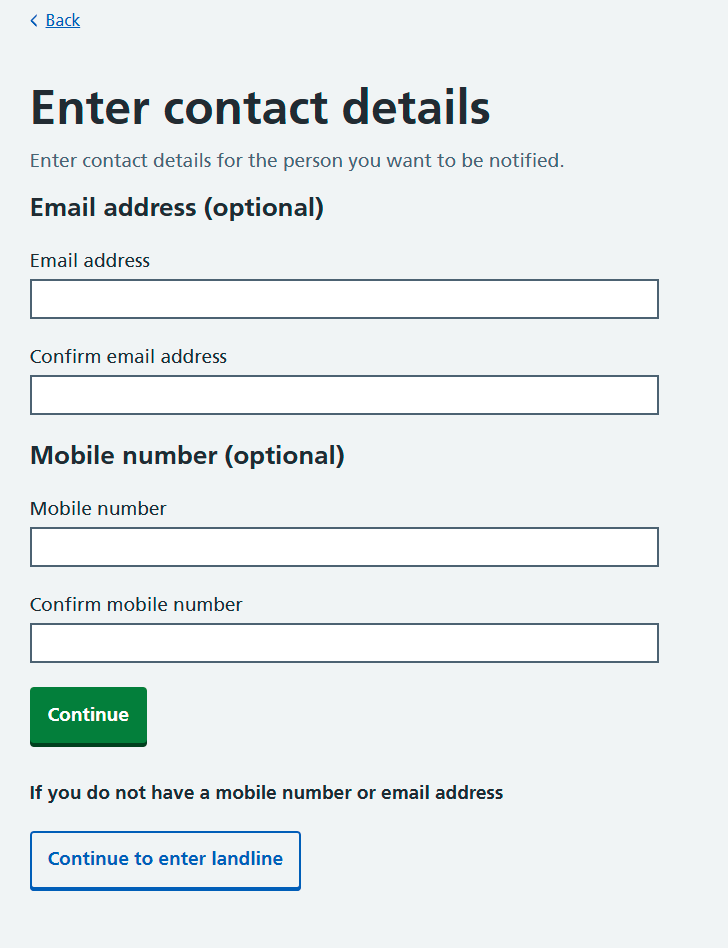
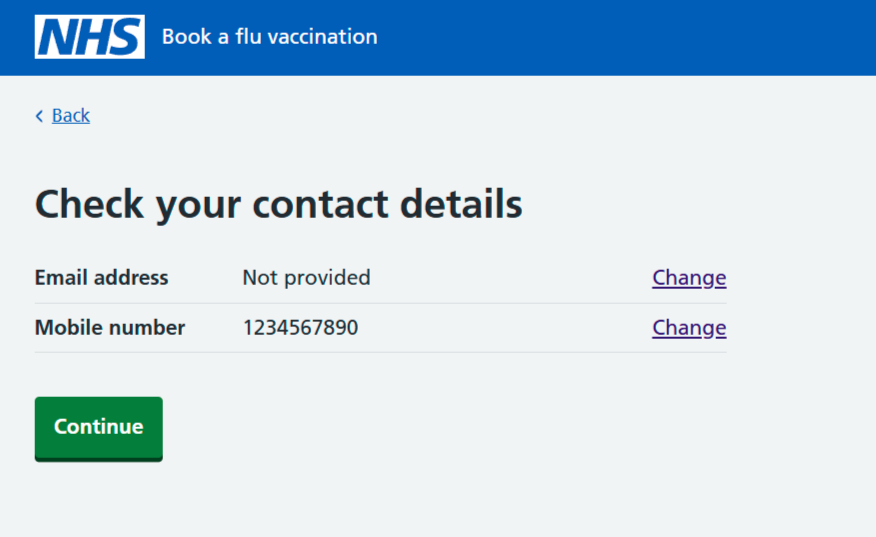

The feedback from an accessibility audit on the National Booking Service (NBS) told us the way we collect contact details on NBS was not very accessible.

### The existing design

The existing screen used four inputs to ask users to enter either a mobile number or email address, with double inputs required for both types of contact information.

Because we need to be able to give users the option of giving us a mobile number or an email address (or both, if they choose). All fields on the screen were marked as optional.   

This created an accessibility issue. If users tried to click continue without entering any information, the service would show an error message, asking them to enter at least one method of communication.

 

## What we did   

Because we ask users on the previous page whether they consent to receiving confirmation and reminder messages about their vaccination appointments, we require them to provide us with at least one method of communication. 

We noticed that the pattern used in the existing contact details page did not match the guidance in the nhs.uk design system. 

We decided to use checkboxes with a conditional reveal to help users enter their contact information.  We also added a text divider, with an option to allow users to tell us if they don’t have a mobile or email. Users who select this option can enter a landline number instead. 

   

We added a screen where we allowed users to check the details they had just provided, and correct them if they had made a mistake. 

   

 

## Findings   

During user testing, participants found the updated screens straightforward and were able to provide their preferred contact method without issue. Users appreciated the opportunity to double check the information for mistakes.