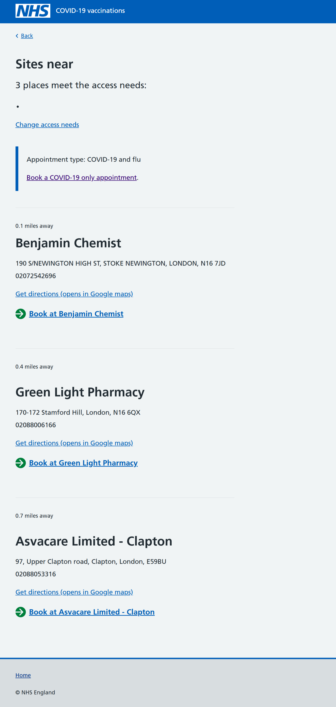
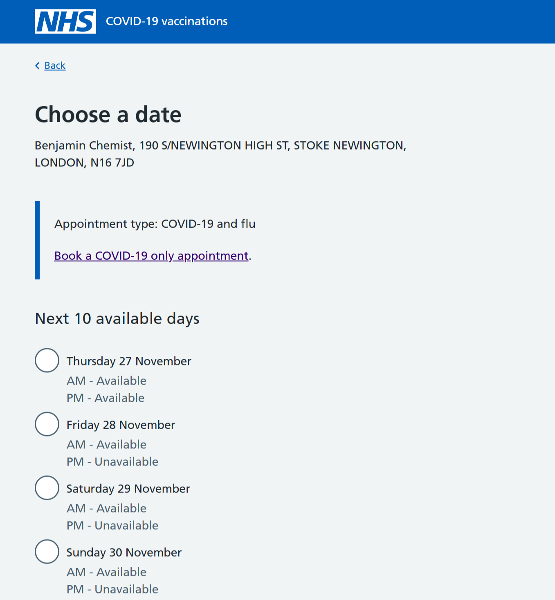
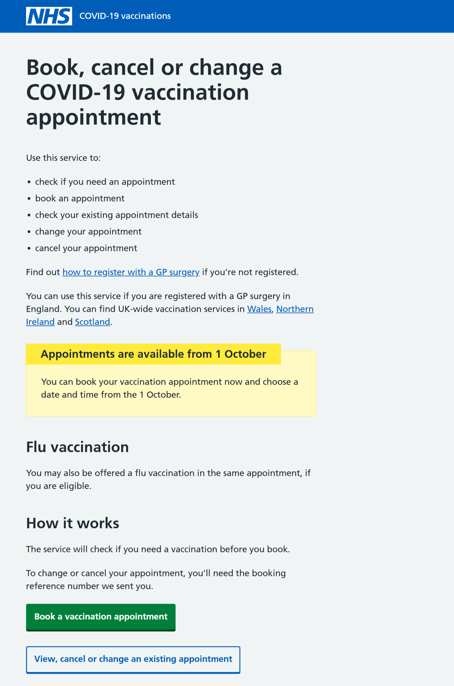
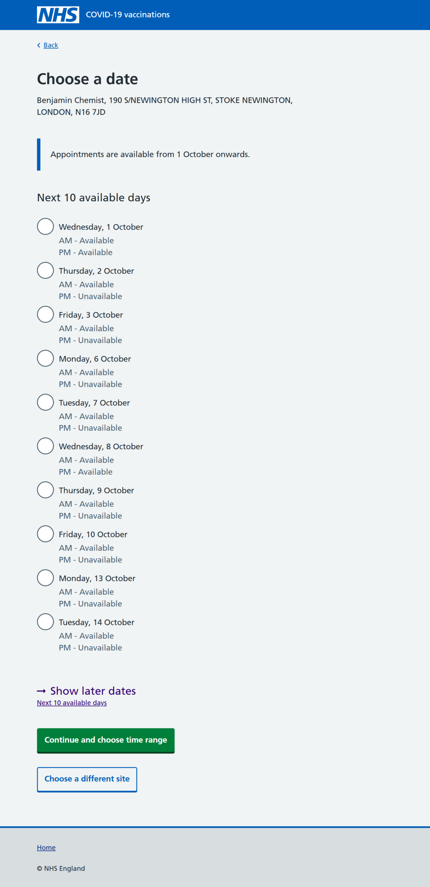
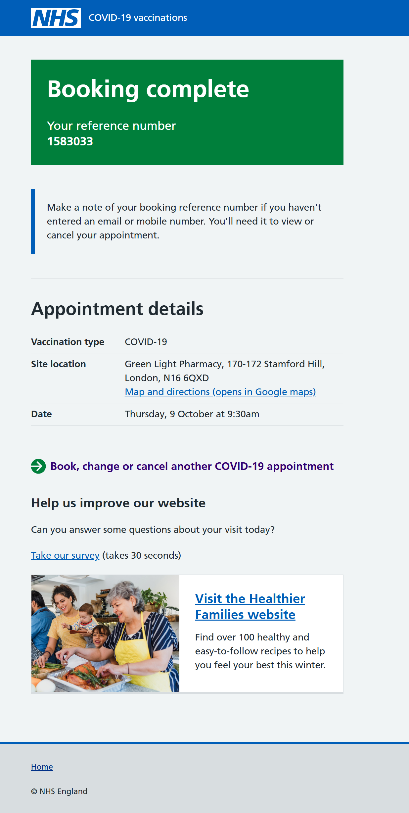

As part of our preparation for the Autumn-winter 2025 flu and COVID campaigns, we’ve added some new features and made some improvements to the Book a vaccination journey.

The improvements and changes we’ve made include:
- changing from co-administration to single vaccination
- campaign opening content
- a link on our confirmation page, for users to return to the start of the journey

## Changing from co-administration to single vaccination

When booking a vaccination appointment, users can choose to get their flu and COVID vaccines in the same appointment (co-admin).

Co-admin availability can sometimes be limited, so to give users more flexibility, we added the option to switch from co-admin to single jab at a couple of key points in the booking journey

### Site selection screen

We show the switching option on the site list page. If users find co-admin offerings near them are limited, they can switch to a single vaccine appointment and hopefully find a more suitable site near them.

### Date choice screen

We also show the switching option on the date selection page.  This allows users to switch back to single vaccine appointments if co-admin availability is low at the site they’ve chosen.

## Campaign opening content

For the autumn-winter 2025 campaign, we opened the online booking journey on 1 September 2025.  However appointments were only available from 1 October 2025.  We wrote some content for certain screens to help users understand why they could not book a date before 1 October.

### Start page

We used a warning callout on the service start pages for Flu and COVID-19.

### Date list page

We used inset text on the date selection page.

## Return to start link

We’ve previously had feedback from users that they would like to be able to make bookings for more than 1 person at a time.  We plan to implement joint bookings, but this won’t be until later in the campaign.  To help users who need to book for more than 1 person, we added a link to our confirmation page, to allow users to return to the start of the journey.

