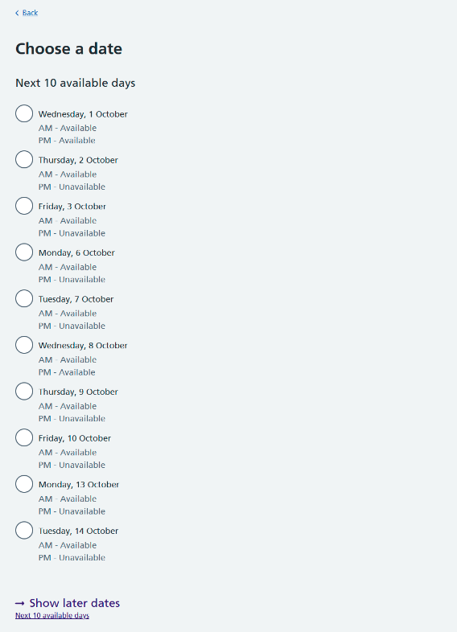
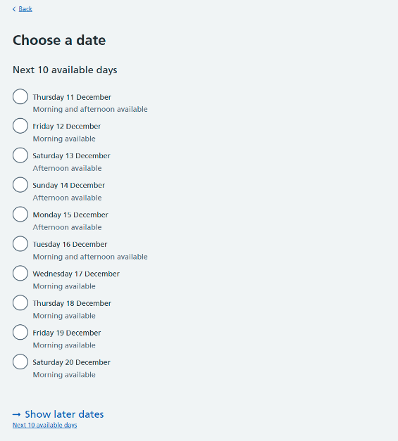
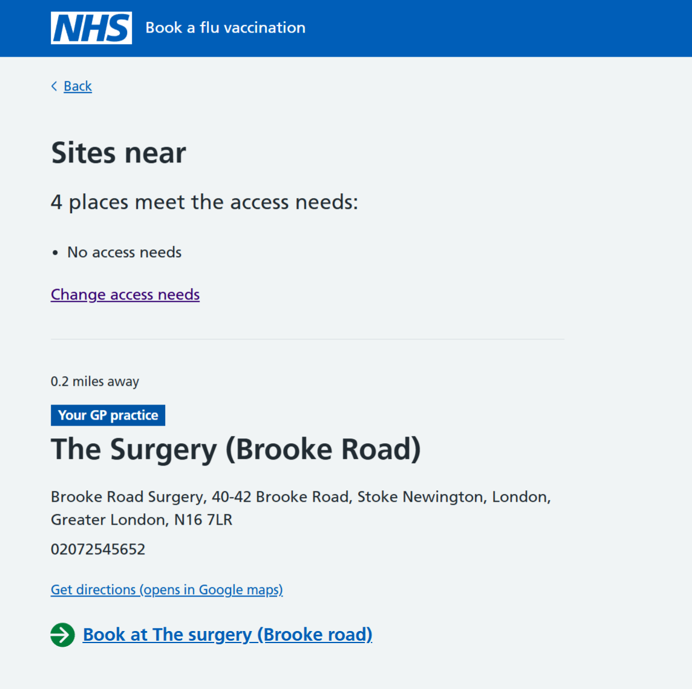
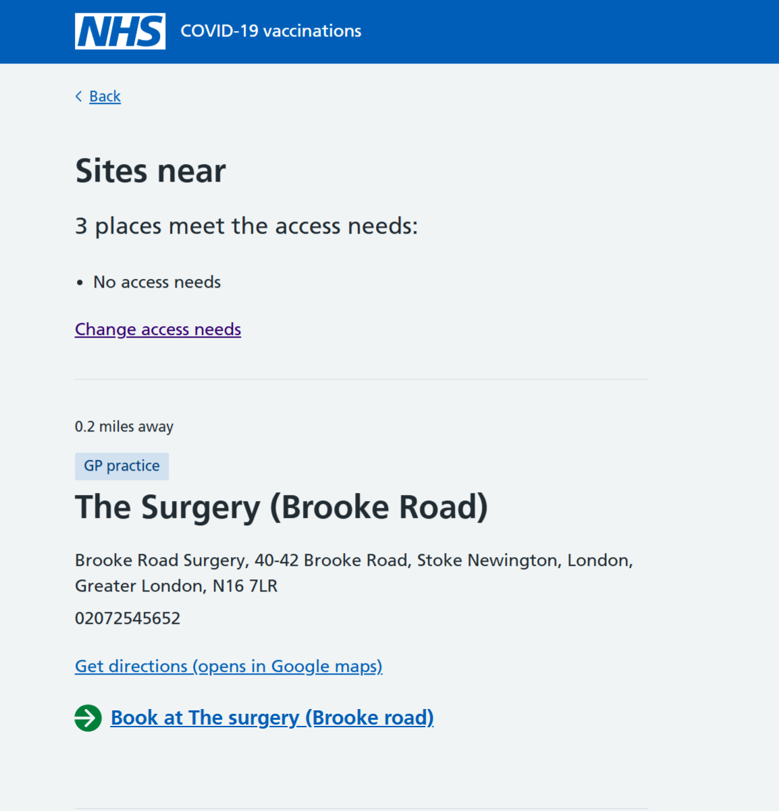

During summer 2025 we ran some pop-up, in-person user research sessions. We wanted to reach and test the book a vaccination service (NBS) with groups who are often under-represented, including:

- people from minority ethnic backgrounds
- individuals with English as a second language
- people with lower digital confidence
- those less likely to take part in online research
- people who are not usually represented in NHS panel recruitment

This method enabled us to engage directly with groups who are often under-represented in research, giving them the opportunity to share feedback on the booking journey.

Running research in person gives us a good perspective on how people interact with our service.  We were able to observe user behaviour in a real life setting, and get new insights.

## What we did

The pop-up research was conducted over 2 days in local libraries in London and Birmingham.  We set up an NHS-branded stand, and spoke to 10 participants individually. Each session lasted around 10 to 30 minutes.

The pop-up approach engaged a diverse mix of participants across ages, backgrounds, and confidence levels.

## What we found

### Key reflections

Running this research in person meant that we heard from people who do not usually take part in digital research, including those less confident online.  It showed us barriers that users face that we do not usually see in remote research.

The sessions highlighted a gap between digital and non-digital users – users confident with digital tools were happy booking through NBS, while less confident users preferred to book via their GP or pharmacy walk-ins.

We learned that terminology and clarity matter for users with lower digital literacy or English as a second language.

The research reinforced the importance of designing for inclusion, with multiple booking routes remaining essential.

### What worked well for users

Ease of use – Participants described the booking journey as simple and were able to move through the journey easily.

Participants found several features of the booking journey reassuring and helpful, including: 

- clear details around vaccination sites, giving them confidence that sites were suitable for their needs
- being able to tell us what their access needs are helped them feel reassured that their needs would be considered
- the appointment confirmation page was helpful, and participants understood that they could change or cancel their appointment if needed

### Challenges and barriers

Some participants had lower digital confidence and preferred to book through their GP or pharmacy instead of booking on NBS.

Some of the language used on NBS was unclear to users, including:

- access needs terms like ‘step-free’ or ‘text relay’ were not always clear to participants
- terms like AM and PM to describe time and availability were not always understood

Participants with lower digital confidence experienced some usability issues, including:

- mistaking tags and labels for buttons and clicking them
- struggling to spot things like action links on certain pages

## What we changed

We used the findings from the pop-up research to make some improvements to NBS, to try and make it easier for as many people to use as possible.

### Improving the availability display

We used feedback from this research to improve the way we show daily availability.  The research showed that some people found the terms AM and PM unclear.

We iterated content on this screen, to make it easier to read and understand, particularly for users with English as a second language, and users with lower digital confidence.

### Improving how we display GP practices

We observed users during the pop-up research trying to click on the ‘GP practice’ tag on the site list page, expecting it to behave like a button.  We’ve also observed this during remote user research for this page.

We changed our design to use the NHS App tag, which has been modified to improve accessibility, and make it look less like a clickable button.

## Next steps

In further testing, the changes we made have been well understood by our users.  We released the AM/PM availability content in December 2025.  We plan to implement the GP practice tag during Spring 2026.