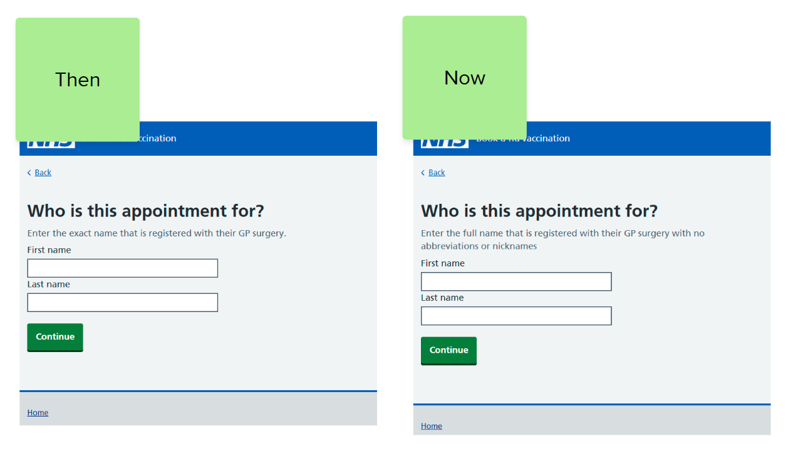
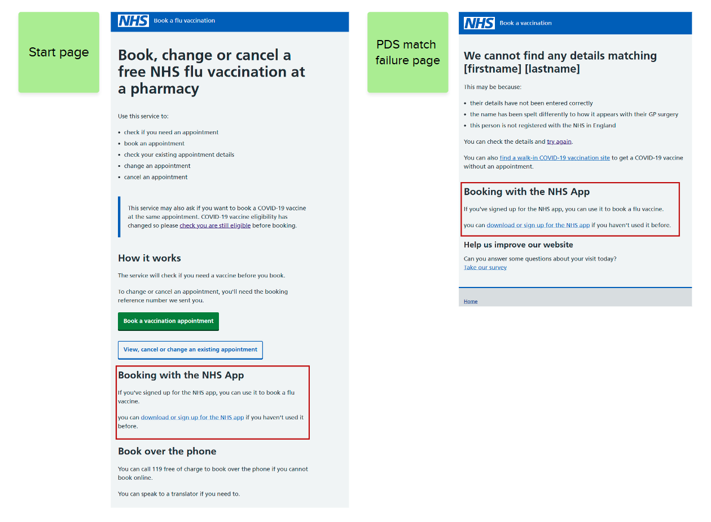
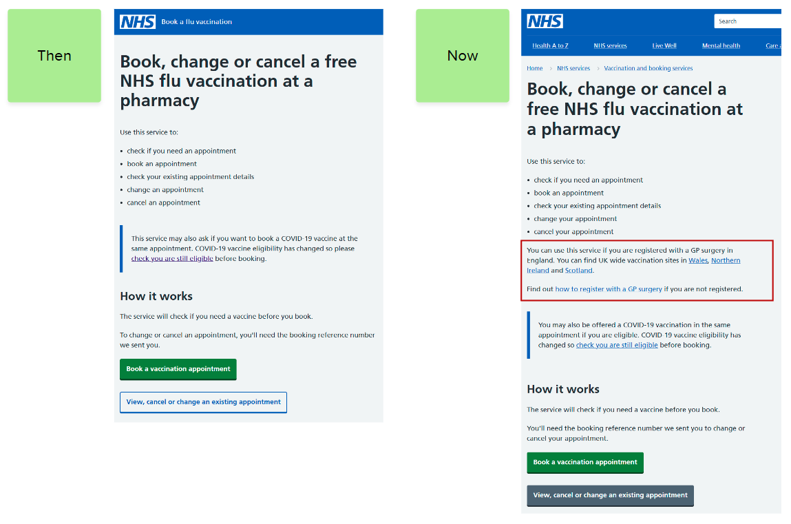
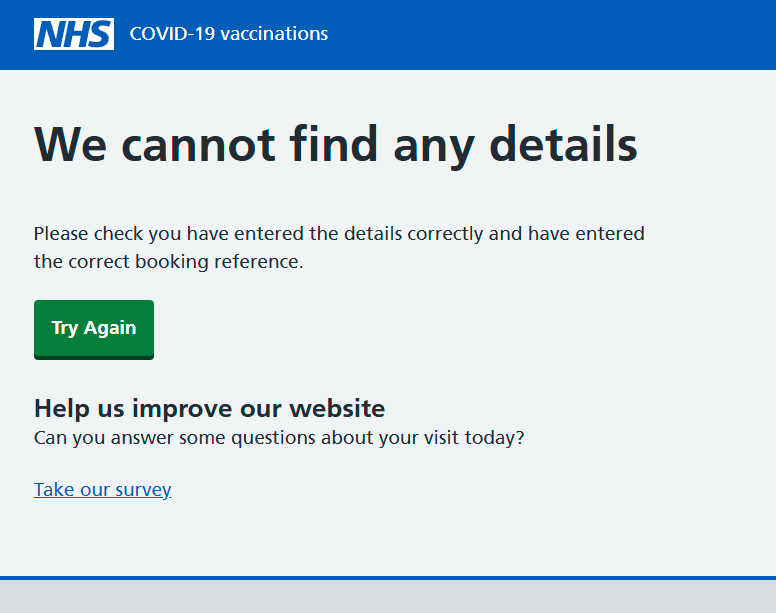
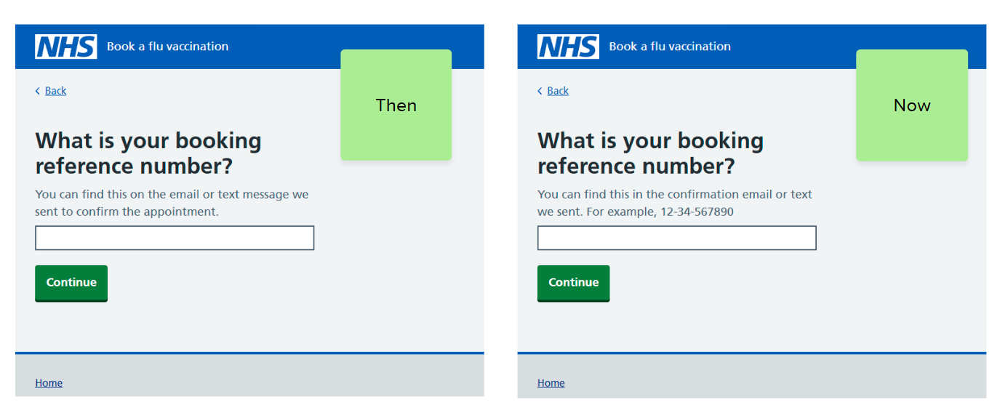
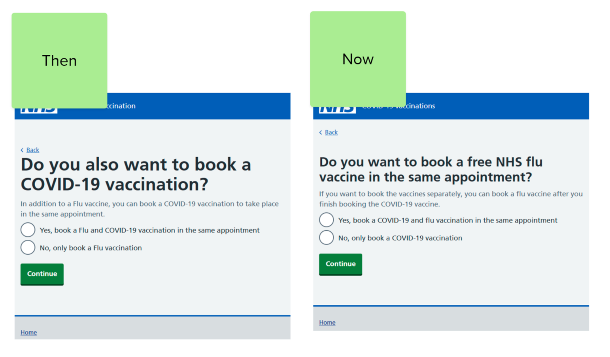
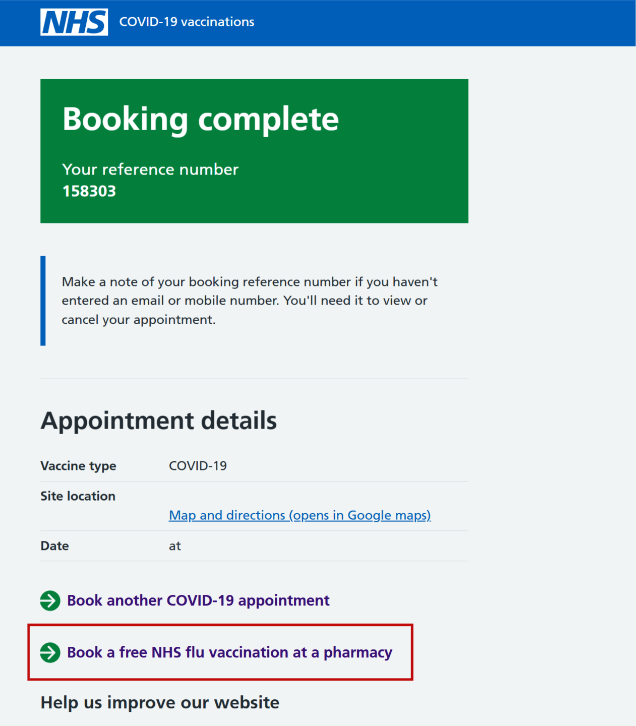

The autumn-winter 2025 season for Flu and COVID-19 saw more than 5 million appointments booked using the online booking service. We've used analytics data, survey feedback and user research to identify ways to help people use the Book a vaccination service (NBS).

Monitoring responses to our user satisfaction survey told us that users struggle with:

- matching personal details using the Personal Demographics Service (PDS)
- finding existing bookings to change or cancel
- understanding co-administration and eligibility requirements

## Issues matching personal details with PDS

Survey feedback told us that people were struggling to match their personal details with PDS, leading to frustration. A closer look at the feedback told us there were several reasons for this, including:

- issues with name entry (incorrect spellings on PDS, or people potentially using shortened names or nicknames)
- people who are not registered with a GP in England trying to use PDS
- incorrect information on PDS, meaning that people cannot get a match with their current details, such as their postcode

To try and solve these problems, we implemented some small iterations to the service.

### Helping users enter names correctly and in full

We made a change to the hint text on the name screen to try and help users understand how to enter their name correctly.  The name must match their PDS record exactly.

### Signposting to the NHS App

We added some content to tell users that they can use the NHS app to book vaccinations if they are signed up as app users.

 Using the app means the user has logged in and we know who they are, so they do not need to enter their personal details.  We added this content on the start page, and the PDS match failure page.

### Helping users who are not registered with a GP in England

Users must be registered with a GP in England to use NBS.  Some of the survey feedback told us that some people who are based in Scotland and Wales are trying to use NBS, and seeing a PDS match failure.

We added some content to our start pages to help users from other UK countries understand how they can access vaccinations and booking services.

## Finding existing bookings

Some users left feedback on our survey that they were unable to find their bookings.  This meant they could not change or cancel their appointments.

When a user cannot find their booking in NBS, we show a ‘booking not matched’ screen.

To match a booking in NBS, we need users to enter:

- their booking reference number
- their name
- their NHS number or postcode
- their date of birth

Requiring this much information to match a booking makes it time consuming and frustrating for users to try again when they haven’t matched their booking successfully.  It also makes it difficult for us to understand where users are failing and entering incorrect information.

### Helping users enter reference numbers correctly

We changed the reference number screen to help users make sure they’ve entered the correct reference number, in the correct format.

We also added validation and error messages to the reference number input to help users recover from errors before they leave the page.

We’re also exploring reducing the amount of information that we ask users to enter when trying to find their bookings.

## Helping users understand co-administration and vaccine booking options

People booking using NBS can choose to have their flu and COVID-19 vaccines in the same appointment (co-administration) if they are eligible.

We saw in survey feedback that some people do not feel comfortable getting the vaccines in the same appointment but still want to get both on different days.  Users were often not aware that the vaccine they were being offered as a co-administration option was available to book separately.

To try and help users understand their options when booking appointments, we added some content to the co-administration page to let users know that they would be able to book separately if they need to.

We also added links to the booking complete page, to let users book the other vaccine (COVID-19 or Flu) for another day.  We show the link if the user has not booked a co-administration appointment.

## Next steps

Most of these changes were released on the 11 December 2025.  We will be monitoring our user feedback and analytics data, to understand how these changes have helped our users.
