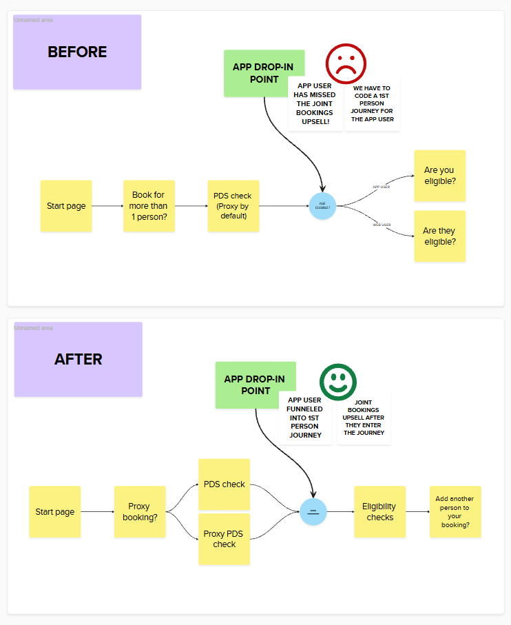
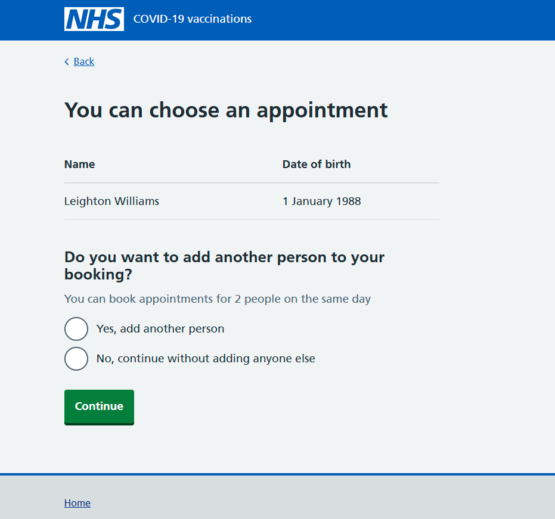
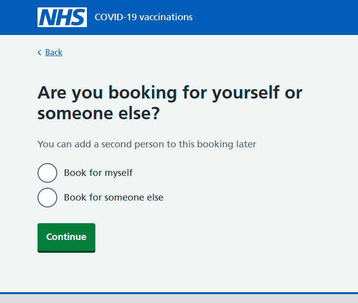

We encourage people to use the NHS App to access services where possible. Because NHS App users are already securely logged in, they can access services more easily than if they use a web browser.

The National Booking Service (NBS) includes several optional features, such as:

- joint bookings
- booking for another person (a proxy booking)
- getting 2 vaccines in 1 appointment (co-administration)

NBS also checks users against the Personal Demographics Service (PDS) when they log in. This helps us identify who the appointment is for and check if they are eligible.

Previously, NBS asked users whether they wanted to do a joint booking at the start of the journey, before we verified their identity.  We’d also implemented a ‘proxy by default’ journey where we were using agnostic language instead of having different versions of the same journey for people who were booking for themselves, and people who were booking for others.

These features made sense in the web-based version of NBS.  But we realised when we started to integrate with the app, that we had inadvertently made it slightly more difficult for ourselves

## The problem

Because NHS App users are already verified, and the initial stage of our integration only included app users who were booking for themselves, our agnostic language model in the web based NBS journey didn’t quite fit the app.  Initially, we needed to create some dynamic language handling, to make sure that app users saw first person language throughout the journey.

We then encountered another issue with joint bookings.  As the web-based NBS journey asked users about joint bookings before the PDS authentication step, this meant that the already authenticated app user would miss this step when they entered NBS from the app.  We needed to design a different version of joint bookings for the app, which would mean more work for the dev team, and more work to maintain the different journeys.

We knew that we needed to be more integrated with the app, and that keeping the service in its current state would be increasingly difficult as we expand NBS in line with our strategy.

## What we did

We mapped out the NBS user journey to see where we could move key decisions. We needed these decision points to happen after a user enters from the NHS App.

Designing the service this way makes integration much easier. Users can drop into the booking process from the app and continue smoothly. It also reduces our workload, as we only need to build and maintain one version of NBS for both the website and the app.

### Changing when we ask about joint bookings.

We moved the joint bookings question so that it appeared after the first person has been authenticated and added to the booking journey.  This means it will appear after the app user has joined the journey.

### Changing how we approach proxy user journeys

First we changed how we handle proxy and first person journeys.  We introduced a filter question at the start of the NBS web journey, to ask users if they are booking for themselves or another person.

This lets us decide how to handle language later in the journey.  App users are currently always first person users, so we can send them into our first person journey.

In future proxy journeys might become available via the NHS app, and if that happens we’ll be able to direct those users to our proxy journey very easily now that we’ve made this change.

## Next steps

The two changes we’ve talked about here are small, but they’ll have a big impact on the way we scale NBS, and how we integrate with the app.

These changes have been implemented, and our aim for the future is to design with an ‘app first’ mindset, which should help us make sure we don’t design things for the web journey which make integration with the app more difficult in future.