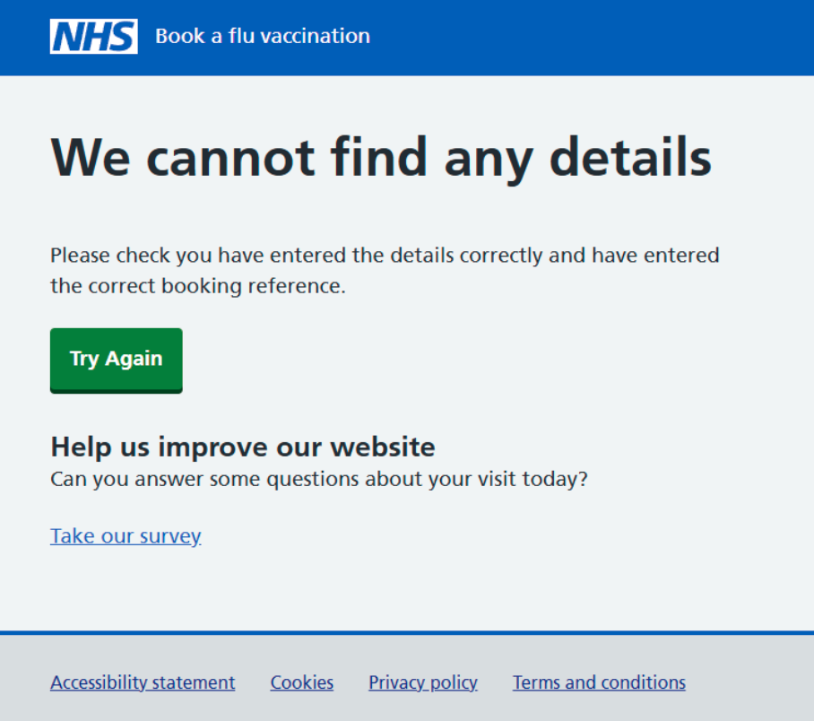
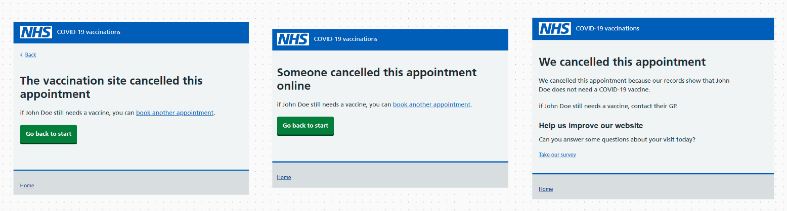
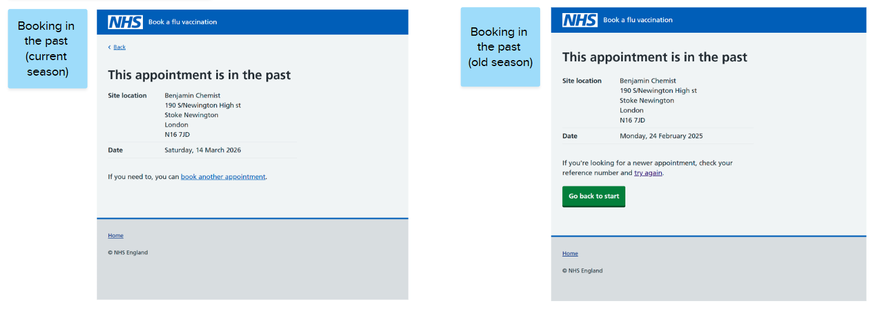
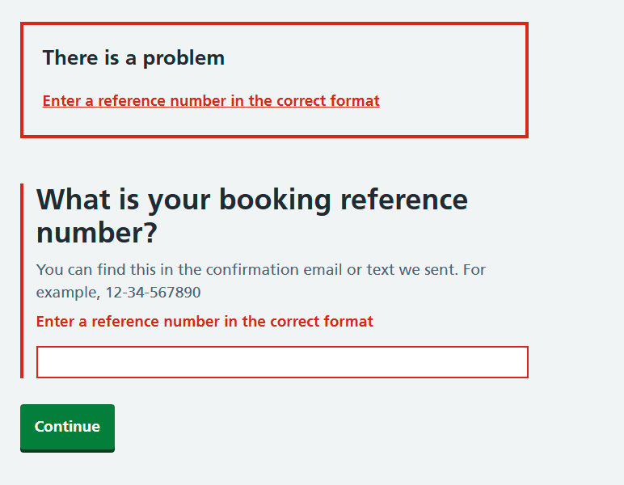

During the autumn/winter 2025 season, we got feedback from our users that finding their bookings when they wanted to change or cancel them was difficult and frustrating.  Users were frustrated that they had to give us all their personal information again, when they had provided this when initially making their booking.

Often when users were searching for bookings, they saw this screen:

This screen would appear when:

- users had entered the wrong reference number
- users had entered some of their personal details incorrectly when trying to find the booking
- the booking had been cancelled (for any reason)
- the booking was in the past (expired) 

Because the ‘we cannot find any details’ screen would appear for several different reasons, users did not understand where they had made an error when searching for their booking.  If a booking was cancelled or expired, it meant that the screen was appearing for some users even though they had put the correct details in.

It also meant that we couldn’t use analytics or survey data to determine if users were making errors, or were searching for expired or cancelled appointments.

## What we did 

We explored several different ways to improve the booking process, and also improve our analytics data around this. 

### Making it easier for users to find bookings 

To match a booking in NBS, we need users to enter their:

- booking reference number
- name
- NHS number or postcode
- date of birth  

Requiring this much information to match a booking makes it time consuming and frustrating for users to try again when they have not found their booking.

> I had to enter a booking reference which clearly recognises my existing appointment yet the system requires a lot of information to be re-entered even though you already have it. Why can't it be displayed simply for confirmation?

> Needed to change an appointment. Put in reference number. Even so, still had to put in ALL the info as for original booking. This is unnecessary. Time wasting.

We reduced the amount of information needed to find a booking to:

- reference number
- date of birth

This should make it much easier for users to recover and try again if they did enter incorrect details.

### Showing cancelled and expired bookings

We also explored the idea of showing a screen to let users know if the booking they were trying to find had been cancelled or had expired (was in the past).  This should reduce the amount of users who see a screen telling them their booking cannot be found, even if they’ve entered the correct booking details.

#### Cancelled bookings

We’ll show a dynamic screen for cancelled bookings, that shows the cancellation reason, and provides a link to re-book if NBS cannot detect that the person has been vaccinated.

#### Expired bookings

We’ll show a dynamic screen for expired bookings, with slightly different content based on whether the expired booking is in the current season, or an earlier season.  For expired bookings in the current season, we’ll include a link to re-book if NBS cannot detect that the person has been vaccinated.

### Helping users enter reference numbers correctly

We looked at multiple methods to help users enter reference numbers correctly.

We added hint text to help users understand how to enter the reference number correctly, including an example of the reference number format.  We talked about that change in a [previous post about responding to insights]([link to the prev post](/book-a-vaccination/2025/12/responding-to-insights/)). We added an error message to help users enter the number in the correct format.

We also added some post-input formatting, where we can insert the hyphens in the correct places if users haven’t entered them.  This gives users more flexibility on how to enter their reference number.

## Next steps

We implemented the improved booking matching using only reference number and date of birth in February.  The booking reference validation was released in December 20256.  We’re planning to release the cancelled and expired booking screens later in 2026.

We plan to monitor our survey feedback, and we expect to see a reduction in negative feedback relating to finding existing bookings.  We also plan to use our analytics data to determine how many users are seeing the cancelled and expired booking screens.

Having this data should tell us if there are lots of users searching for cancelled or expired bookings, and it will also help us to reflect on our feedback from autumn-winter 2025, and understand if the negative feedback we saw was driven by users not being able to see cancelled or expired bookings.
