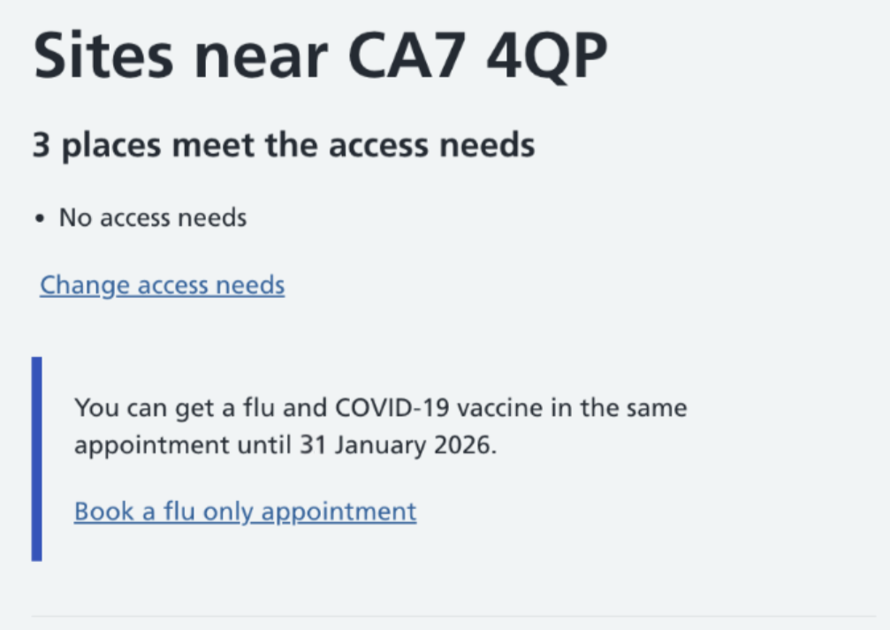
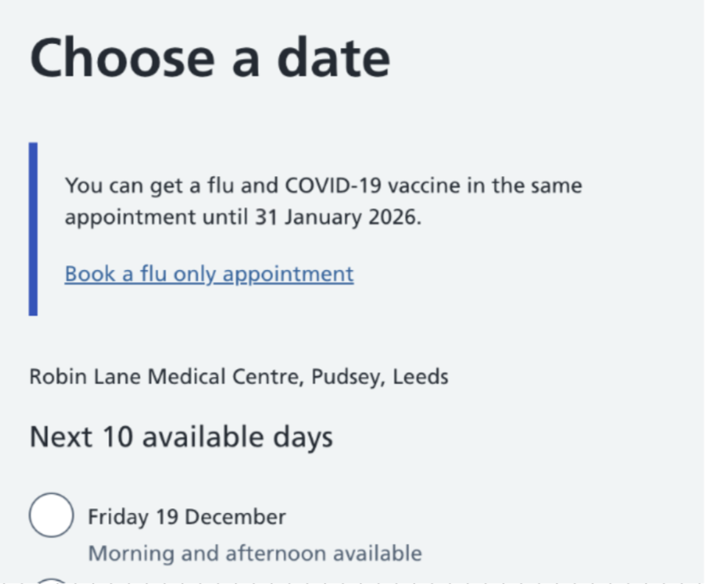
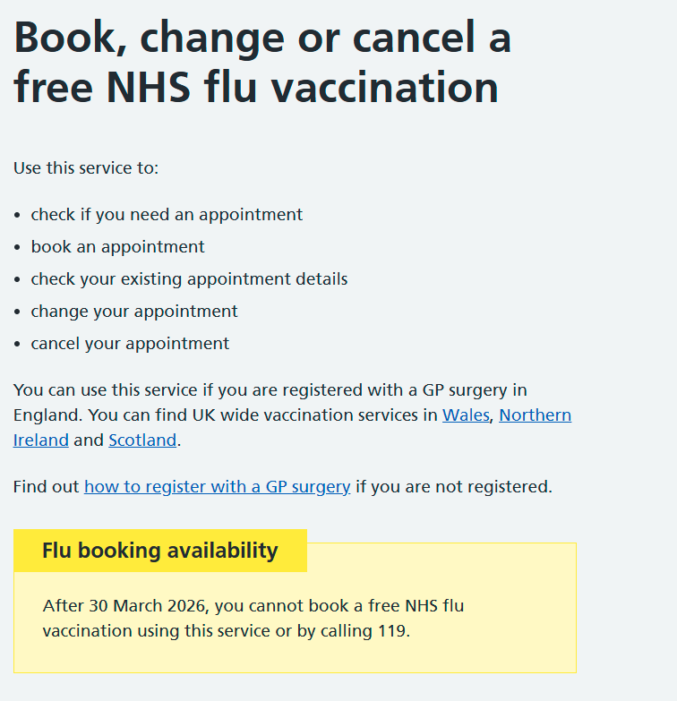
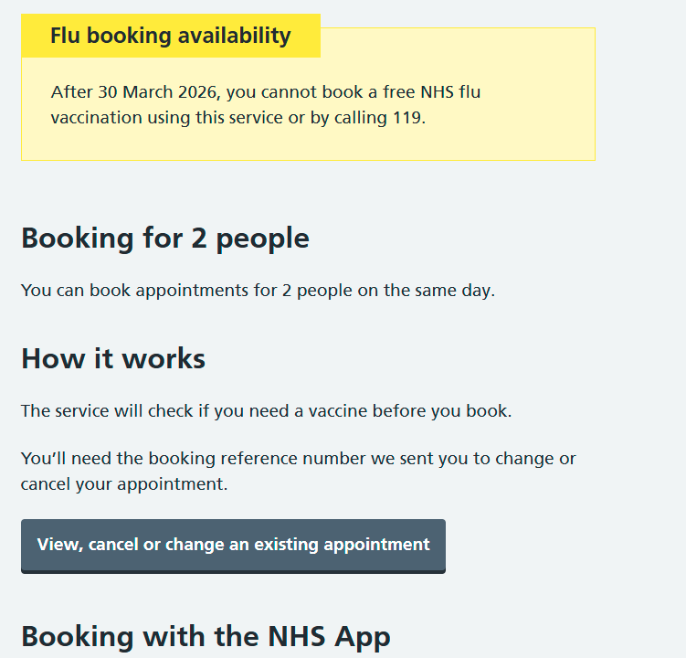
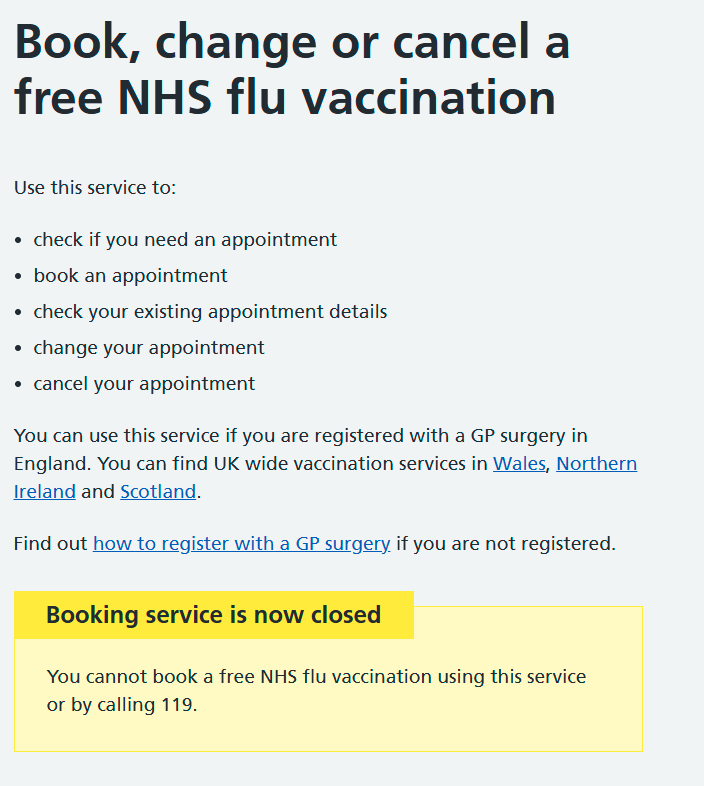
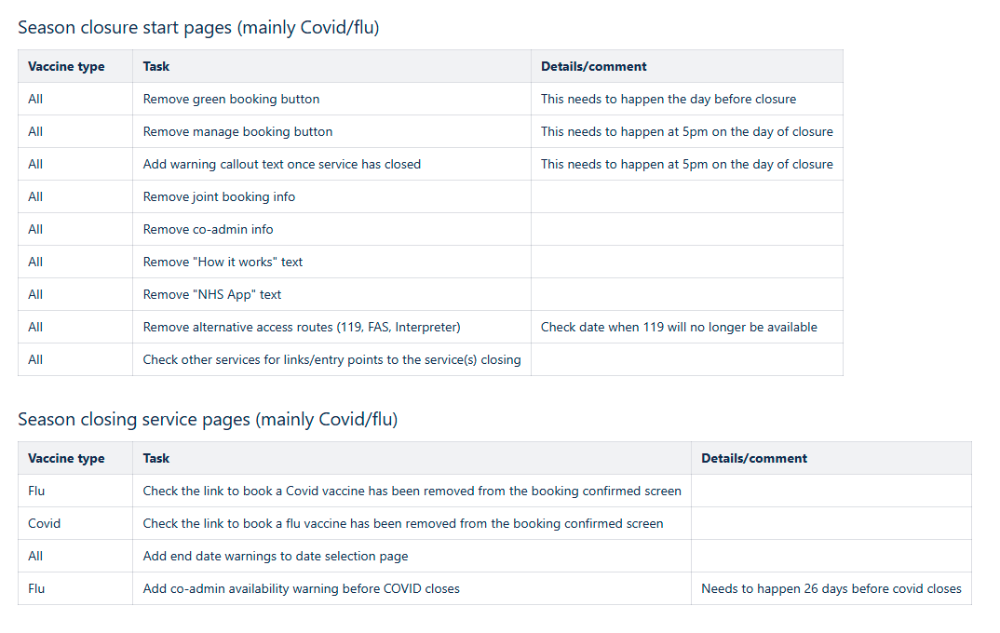

The beginning of 2026 saw the flu and COVID-19 services close for the autumn-winter season.  COVID-19 closed on 31 January 2026, and flu closed on 31 March 2026. 

Each season, we make some changes to the service, to help users understand when and why they will no longer be able to get COVID-19 and flu vaccines. 

## Staggered Closure 

Because COVID-19 closes before flu, people will not be able to book the 2 vaccines in one appointment (co-administration) after 30 January 2026.   

To help people who are trying to book co-administration appointments on the flu journey, we’ve added some content to the service.  It explains that co-administration appointments are not available after a certain date and offers the user the option to switch to a single jab if they can’t find a suitable site or date. 

### Site list page 

 

### Date list page 

## Seasonal closure content 

Book a vaccination shows appointments 25 days in advance.  When there are less than 25 days left before availability closes for the season, users will see fewer dates. 

We’ve added some content to the service, to let users know that they will not be able to book appointments after the services close for autumn-winter. 

### Start page – closure warning content 

When there are 14 days left before a seasonal service closes, we update the start pages with warning content, to help users understand that the service won’t be available after a certain date 

 

### Start page – closed content 

We take a staggered approach to seasonal closures.  Because you cannot make same-day bookings on NBS, we remove the ‘book now’ button on the final day of the season.

 

The next day, we remove all information about booking methods, and add some content explaining to users that the service is now closed. 

 

 

### Removing links from other services 

During the A/W25 season, we added some links to the end of our flu and COVID-19 journeys, to help users who wanted to book the vaccines separately.  Because COVID-19 closes before flu, we need to remove the link to COVID-19 from the end of the flu service.  We also need to make sure that we remove the link to book flu from the end of the COVID-19 service before the start of the spring season, as flu won’t be available during spring. 

 

## Creating a process for seasonal vaccine campaigns 

Because COVID-19 and flu are seasonal vaccinations, the campaigns open and close at different times of year.  We know we need to make sure that the things we’ve talked about in this post are done at the start and end of each campaign, so we’ve created a checklist for season start and end.  This should help us to make sure our users:  

- can find their way into our service when it opens 
- understand when and why vaccines won’t be available when the service closes 

We’ll use the checklist every time there’s a seasonal change. We’ll also document changes that we make each season, to make it easier for the team to open and close the seasonal campaigns in the future. 

 
