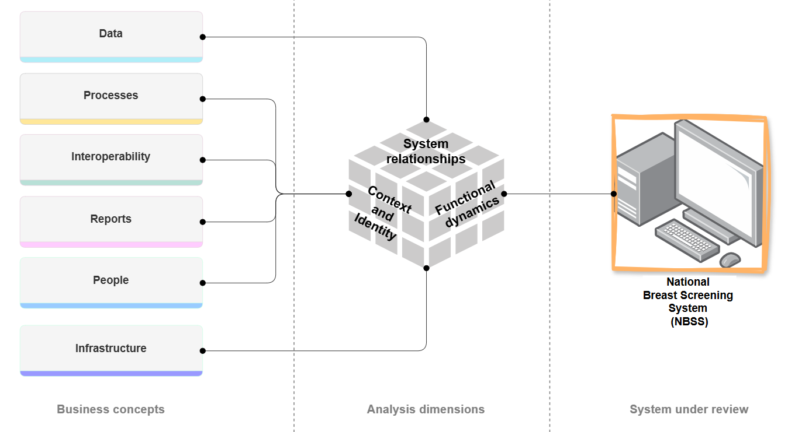
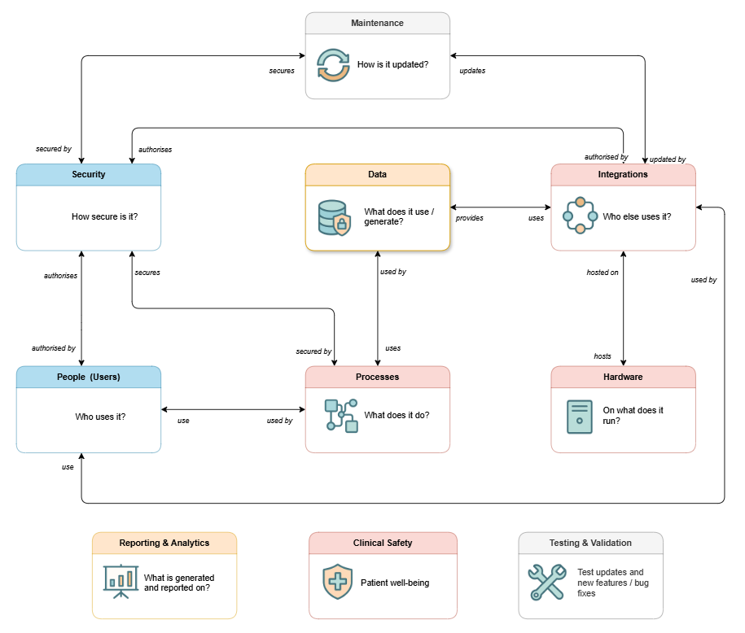
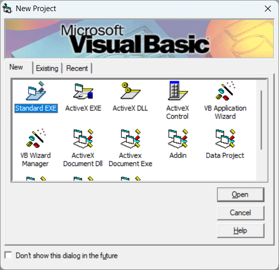
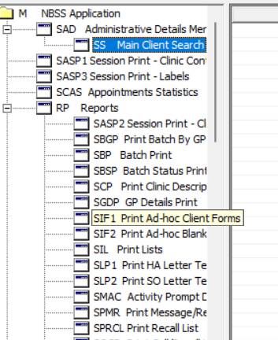
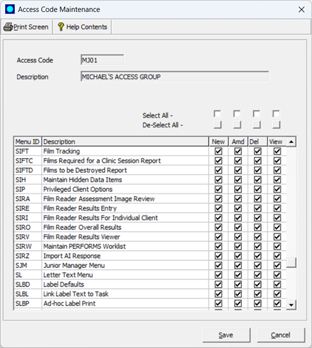
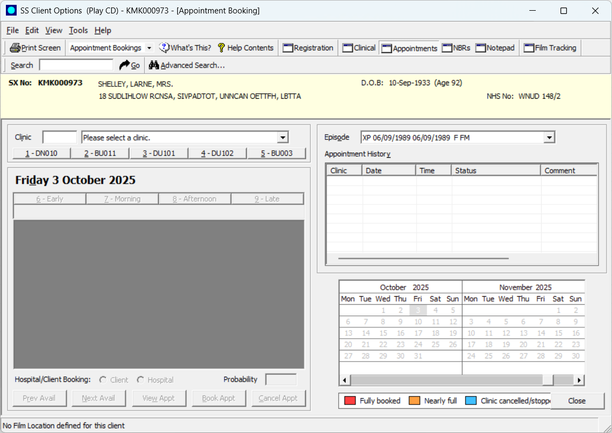
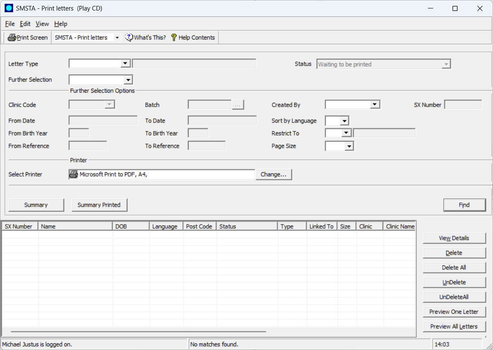
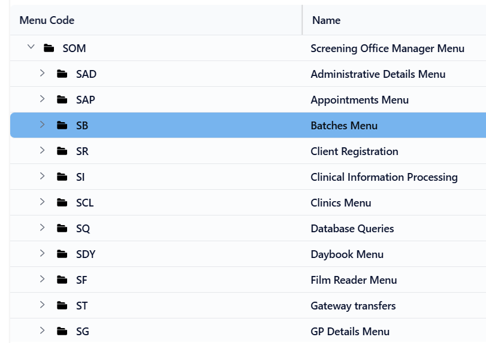
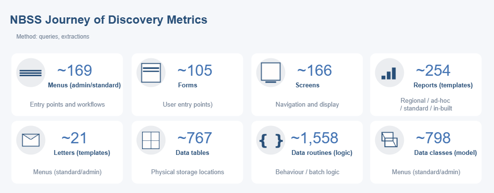

<!-- markdownlint-disable -->

_In this first series of articles, we discuss how the Pathway Team set about on our journey of discovery into the National Breast Screening System (NBSS). In this article we'll discuss how the journey started, what we  uncovered and where we are today in our journey._

_**Audience**: helps screening, operations, technical, product colleagues to quickly reason about NBSS._

## TL;DR

> * **From opaque legacy to practical insights**: replacing  mission-critical systems is more than code migration; it requires _data reasoning_.
> * We mapped _**what users do**_ (menu codes, journeys), _**what is stored**_ (forms, screens, reports, tables), and _**how data changes**_ (routines, classes).
> * **How we worked**: automated metadata extraction to build an inventory and quantify complexity; items represent decision points, business rules and data trails.
> * **Key findings**: function codes drive workflows; a few codes (e.g. ``SAD`` and ``SMSTA``) lead to clusters of screens, reports and routines; one code can touch multiple forms and tables; one report can source data from diverse data-paths making tracing logic harder without an inventory.
> * **Operational impact**: opaque artefacts complicate migration; our investigation helps teams answer in minutes, not days, reducing risk and speeding planning.
> * **Benefits**: enables feature parity checks, deepens understanding of data risks, supports migration planning and show how services improve on baseline.

---

## Introduction

The Pathway Team set out to create a single source of truth for NBSS, UK's operational breast-screening system used by Breast Screening Offices to _invite_, _track_ and _manage screening pathways_ and runs as a Windows desktop client, leveraging Crystal Reports for report extracts.

As we prepare for a new service, our team's goal is simple: document each part of the system that matters to screening teams (including function codes and screens through to reporting extracts and underlying data), and translate those findings into practical insights for clinical and operational colleagues.

### Why we analysed it

We're addressing capabilities and improvements across the screening program based on Breast Screening Office (BSO) feedback[^1], ensuring applicable feature parity where it matters most.

We also want to provide useful insights to all teams concerning the internals/data held within the system that would otherwise be locked up in user guides, help manuals, its-in-my-head, or the need for correct data status.

---

## Foundation

This section describes the steps we took to lay a foundation of understanding and the things we looked at in this phase.

### How we analysed it

* Establish a framework to guide analysis
* Analyse data components and structures
* Analyse software components
* Analyse reports and letters
* Analyse user processes
   

#### Establish a framework

We began by establishing a **custom analysis framework**[^2] to set the direction for analysing business concerns such as _data_, and _processes_. This allows us to aggregate into easy-to-digest dimensions that support _higher-level reasoning_ about the system.

Adjacent to that we also break down business concept into smaller **real-world concepts** and ask one pertinent architectural/use-case question to ground the _why_ of that concept.

#### Analyse data components and structures
In this phase we interrogated the database technology to grasp the contents and structures and how they relate to the NBSS system.

#### Analyse software components
With this parallel step, we went through all the source code of the system to gain a deeper understanding of how the system has been assembled, how data flows through it and how it results in one or more outputs.

####  Analyse reports/letters
With this step, we looked at all reports and letters produced by the system. Given that NBSS bases most of its reports and letters on SAP Crystal Reports templates, we focused mainly on these—there are also several MS Word (.docx) letters not in scope for this article.

#### Analyse user processes
For this phase, we looked into how certain processes are fulfilled in the system i.e. the user flow between various input screens.

_The custom framework helped to ground our analysis as we moved deeper to better understand the system._

---

## Understand

To better comprehend the system's capabilities, we first obtained access to an NBSS installation. While gaining access to NBSS was not 100% pain-free, once available, it was time to begin the real journey.

**Database tech**

Data is the core of any system, without which, processes, extracts, and inputs are meaningless. Therefore, our first analysis phase was to establish a catalog of the structures, understand how the database technology works, list the types of data contained within in it, how  to access the data, and how to extract it.

NBSS data sits on InterSystems Caché/IRIS, an **object database** with a full SQL layer. Data resides in multidimensional **globals** (nested key-value files stored on disk) projected into _tables_ for SQL and _classes_ for objects, so analysts can use whichever access mode suits their needs[^4].

For example, ``^Client(123,"Episode",45)=...`` references a global titled ``Client`` with subscripts ``123``, ``Episode``, and ``45``.

**Product development**

NBSS is a Windows desktop client built in VB6 with custom UI controls and tooling (e.g., Crystal Reports scheduling). The VB6 IDE is no longer supported on modern 64-bit Windows, but the VB6 runtime continues to ship and be supported on current Windows versions for existing applications (limited support for serious regressions and security issues; follows Windows lifecycle)[^5].

**Why we can't upgrade to .NET**
Modernising older VB6 projects is non-trivial due to issues like COM dependencies, legacy control packs, and differences in error handling and UI models between VB6 and .NET. Other issues include:

* the internal NBSS custom controls, vendor-specific control packs depend on the native Microsoft Common Controls library which no longer is the base foundation in a .NET world; porting becomes more difficult without a considerable rewrite.
* there is no in-place, binary-compatible upgrade path from VB6 to VB.NET. Older projects move from a COM-based, reference-counted, late-binding runtime (VB6) to a managed, CLR-based, exception-driven platform (.NET).
* VB6 uses ``On Error GoTo`` for non-exception flows, while .NET uses ``exception`` handling.
* There are layout differences, different UI event models, focus/activation, and z-order quirks. This means that complex VB6 forms or custom ``UserControls`` often have to be rewritten.
* Older VB6 projects commonly depend on OCX controls and VB6 runtime-era Common Controls. There are no native .NET equivalents for many of these.

>:bulb: _Custom tools and controls were excluded from analysis as they deal with UI elements or support functionality._

**Documentation**

We also looked at existing internal Confluence content and Jira boards for topics related to NBSS. This presented a clearer view of repetitive or missing focus areas which we noted for our journey of discovery.

(please see the author's previous analysis work[^6] which was used to add to our new discovery content)

_With a basic understanding in place, we moved onto exploring the system in more detail._

---

## Explore

We documented our initial findings on Confluence pages according to our assessment perspective, for example we covered **technical** assessment[^7] and **process** assessment[^8]. Beyond these perspectives, we focused heavily on _data_, specifically:

* **user journeys** throughout NBSS
* data **capture and manipulation** across screens
* system/data/security **architecture**
* **artefacts**, like reports and letters
* **integrations**

### :bulb: Journeys start with a "function code"
Initial discovery identified that all system functionality is accessed via specific function codes configured for the user group to which a logged-on user belongs.

_Function-oriented navigation_

Function codes are simple constructs that
* defines a short code and description
* (possibly) triggers an external command
* links to a Visual Basic project, OR
* links to a configured form

The system allows defining function codes for **``Standard``** and **``Administrator``** user types. ``Standard`` are typically screening office managers or junior office managers; ``Administrator`` can exercise more control over the configuration of the system and who generally require _deeper knowledge_ of the inner workings of NBSS.

The NBSS function codes are a _starting point_ into screening workflows, like printing reports or editing data, and users can typically start with any function code available to them.

#### Permissions

**Role-based access controls (RBAC)**

NBSS secures function codes in a **user group**. The following image shows permissions set for a given user group, which also apply to all users in that group:

_Configuring permissions for a user group_

NBSS permissions handling is similar to the RBAC model but without provision for _fine-grained_ access control.

In RBAC, **users** are assigned to a named **role** which contains a bundle of **permissions**. In NBSS, a **user group** acts like a role and menu-function permissions (see above) are permissions.

It's increasingly common for modern systems to **extending RBAC**  and use **ABAC** (attribute-based access control) or a mixture of ABAC+RBAC to provide **context-aware permissions**[^9]. ABAC grants permissions based on one or more _attributes of the logged-on user_. For example, an access condition like _Clinicians may view results only for sites within their BSO location and only for active episodes_ might use attributes like ``site``, ``status``, or ``organisation`` to apply appropriate permissions.

#### Frequency

**Which functions are most important?**
While there are many function codes to select from, some are utilised more often than others. For example: **``SAD``** which deals with Client functionality like creating client registration, managing clinical details, appointments, referrals or even film information:

_Main client entry screen_

or **``SMSTA``** which deals with different types of letters:

  _Main letter printing screen_

**What can standard user types do?**
Functionality available is determined by the function codes configured for a given user group by an administrator. Below is a typical Screening Office Manager menu excerpt we used to map function codes:

_A sample menu structure for a screening office manager_

|Entry menu code|	Description|
|-|-|
| ``SAD``	| Manage authorities, code dictionaries, system parameters and screening office details.|
| ``SAP``	| Appointments, clinic reception desk, clinic, film reading whiteboard, rebooking DNAs, session prints|
| ``SB``	| Batch functionality, completion, print, edit, specification, attach to a clinic, or print by status
| ``SR``	| Client registrations, exceptions, duplicates or lookalikes.
| ``SI``	| Clinical processing, DNA episodes, mammography data entry, results entry, close routine episodes, print ad-hoc forms.
| ``SCL``	| Clinics functionality, including clinic diaries, create/print clinics, rebook appointments.
| ``SDY`` |	Daybook functionality like exporting a worklist or importing a daybook summary.
| ``SF``	| Capture film reader overall results, individual client entry, PERFORMS worklist, or image assessment review.
| ``ST``	| Receive and transmit data between NHAIS.
| ``SG``	| Manages/prints GP (practice) details.
| ``SL``	| Adhoc label/legacy printing, configure letter tasks.
| ``SSM``	| Client search entry, film tracking/destruction, privileged client options, resend PACS messages associate clients to trials.
| ``SM``	| Miscellaneous tasks like activity prompts and reprinting letters.
| ``SP``	| Print adhoc reports, call/recall/ntd lists, or report schedules/tasks.
| ``STA``	| Statistics and tables: AGEX, ASSEX, BASOX, CREGX, DLEX, SEXA, KC62 (single client prints/Dept. Health/cytology/histology/WBN QA/lymph node), film reader QA

### :bulb: User journey data discovery

As users navigate through the system, there are many places they can manipulate, view or print data. To highlight the extent of these data points across the system, we identified several areas involved with data, as shown below:

_User journey data metrics_

|Category | Description |
|-|-|
| Menus | Starting function codes to access system functionality. These functions codes are configured separately for standard or administrator user types. |
| Forms | Unique visual input forms to enter and view information. |
| Screens | Simple navigation views or print parameters forms. |
| Reports | Structured report templates that are either <li>``ad-hoc`` - custom user reports, <li>``standard`` - used by most services, <li>``regional`` - higher-level for a region, <li>``built-in`` - defined in the system by default. |
| Letters | Structured report templates printed for clients. |
| Data tables | Physical object storage locations. |
| Data routines | Program code to create, update or transform NBSS data. |
| Data classes | Program structures that typically represents tables. |

---

### Next Steps
The Pathway Team will continue to
* index all system knowledge, data and processes to provide a workable, queryable index that allows us to reason about the system without hindrance.
* support a usable glossary of function code, form, screen, report, letter, class, routine, globals.
* outline journey exemplars (SAD, SMSTA) supported by the index.

[^1]: [What we learned - Improved data requirements](https://design-history.prevention-services.nhs.uk/breast-screening-pathway/2025/09/what-we-learned-about-breast-screening-data/)

[^2]: [Assessment framework - How? What? Why?](https://nhsd-confluence.digital.nhs.uk/spaces/DTS/pages/1128218608/NBSS+Assessment)

[^3]: Object-persistence stores data as objects and not as rows and columns in traditional relational storage.

[^4]: [Persistent Objects and InterSystems SQL](https://docs.intersystems.com/irisforhealthlatest/csp/docbook/DocBook.UI.Page.cls?KEY=GORIENT_persistence)

[^5]: [Support Statement for Visual Basic 6.0 on Windows](https://learn.microsoft.com/en-us/previous-versions/visualstudio/visual-basic-6/visual-basic-6-support-policy)

[^6]: [Business Events Analysis - What events are needed from NBSS](https://nhsd-confluence.digital.nhs.uk/spaces/DTS/pages/864402677/National+Breast+Screening+System+NBSS)

[^7]: [Technical Assessment - What does data, processes and software look like?](https://nhsd-confluence.digital.nhs.uk/spaces/DTS/pages/1128221319/Technical+assessment)

[^8]: [Process Assessment - What processes are available and what do they do?](https://nhsd-confluence.digital.nhs.uk/spaces/DTS/pages/1154651197/Processes+assessment)

[^9]: [Guide to Attribute Based Access Control (ABAC) Definition and Considerations](https://nvlpubs.nist.gov/nistpubs/specialpublications/nist.sp.800-162.pdf)
