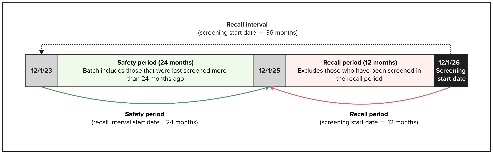
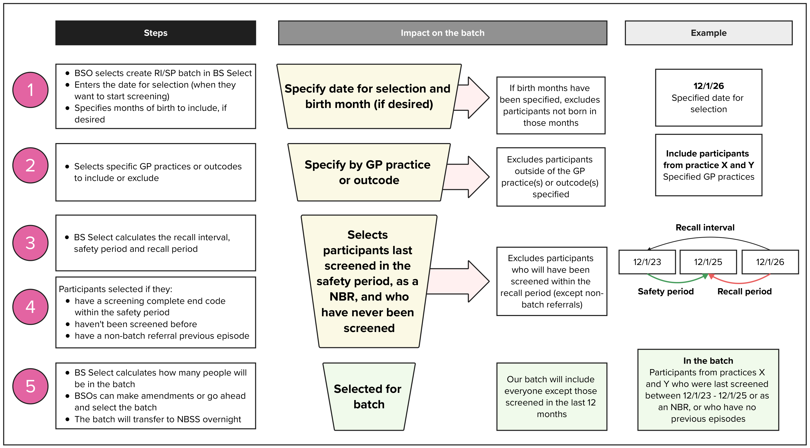
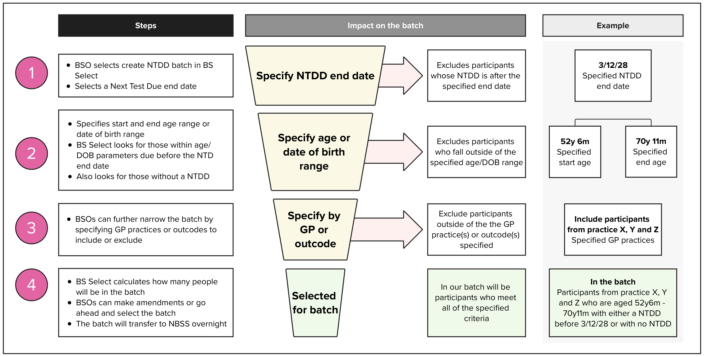

<!-- markdownlint-disable -->

We’re conducting discovery research into how Breast Screening Offices (BSOs) plan their services and invite people to screening. Our goal is to understand the  current processes and identify ways to make it simpler and more effective in future.

In this post, we share what we’ve learned about two of the main methods of batching BSOs use to select eligible participants for breast screening.

## What is batching?

Breast screening is currently offered every 3 years to those eligible for routine screening, meaning BSOs need to plan for each eligible person to be screened once every 36 months. This planning process is called round planning. 

Batching is a process where BSOs select groups of eligible participants to invite to screening based on their round plan. While round planning looks ahead to plan for the future using estimations from past data, batching happens closer to the screening date and uses actual demand and capacity data.

Batching  is done in the Breast Screening (BS) Select system where BSOs can use  two main methods to create batches:
- Recall  Interval / Safety Period (RI/SP)
- Next Test Due Date (NTDD) 

There is also an additional method of batching called the Routine Failsafe. This is a type of Next Test Due Date batch but with fixed parameters. Failsafe batches are typically run monthly and pick up any participants who would be overdue by the end of the next month, such as people who have moved into the area.

Once a batch has been created in BS Select, it is sent overnight to the BSO’s local instance of NBSS where they can allocate appointments and send invitations.  

## Understanding batching methods

### Recall  Interval / Safety Period (RI/SP) batching

RI/SP is a method of batching which uses the screening start date entered by the BSO to calculate three key periods that are used to determine who is selected in the batch. These are:
- the recall interval (the screening start date minus 36 months)
- the safety period (the recall interval start date plus 24 months)
- the recall period (the screening start date minus 12 months)

#### How does RI/SP batching work?

RI/SP batching looks backwards to see who was screened in the 36 months before the planned screening start date. This 36-month period is called the recall interval. 

BS Select then looks forward 24 months from the start of the recall interval. The period between these two dates is called the safety period. People last screened during this time can be safely invited again. 

The 12 months between the end of the safety period and the screening start date is called the recall period. People who were last screened during this period are excluded because it’s too soon to invite them again. 

The only exception to this exclusion is participants whose last screening episode was a Non-Batch Referral (NBR). This means a screening episode was created for them in NBSS outside of a routine batch – for example:
- GP referrals (where a GP has contacted the service on a participant’s behalf)
- self-referrals (where a participant over the age of 71 requests to be screened)

Participants with a NBR screening episode in the last 12 months are not excluded from the RI/SP batch. 

With this in mind, the RI/SP batch will include:
- participants who were last screened during or before the safety period
- eligible participants who haven’t been screened before
- participants whose previous screening episode was a Non-Batch Referral, even if this was during the recall period

##### Narrowing down the RI/SP batch
BSOs can split RI/SP batches by month of birth – for example, to only include participants born between January and March. 

They can also include or exclude specific GP practices or outcodes (the first part of a participant’s postcode). This helps create smaller, more targeted batches which align with when and where screening is planned. 

We heard from our research that many BSOs invite all participants from a GP practice at once. This sets up a regular cycle of screening participants from each GP practice once every three years. Anyone who moves into the area between visits is picked up in the monthly failsafe batch if they will be overdue before the BSO’s next visit. 

 

### Next Test Due Date (NTDD) batching

Next Test Due Date (NTDD) batching selects participants based when they are next due to be invited  for screening.   

#### How is Next Test Due Date calculated?

Once a participant has completed a routine screening episode, BS Select receives an end code from NBSS. This is a two or three letter code which tells BS Select why participant’s screening episode was closed – for example:
- SC = Screening Complete
- DNA = Did Not Attend 

BS Select uses the end code to calculate their next test due date, which is set to three years after either:
- the date of their first offered appointment (DoFOA), or
- their screening episode date if a date of first offered appointment doesn’t exist

If the participant hasn’t been invited previously, their NTDD stays blank. 

For non-batch referral screening episodes, NTDDs will only be updated if the participant was screened. Their NTDD will be set to either three years after their actual screening date, or the episode date if an actual screening date doesn’t exist. 

#### How does NTDD batching work?

NTDD batching starts with the user selecting a Next Test Due (NTD) end date – this tells the batch to only include participants who are due before that date.

BSOs can set an age or date of birth range to select participants between, as well as specifying particular GP practices or outcodes to include or exclude from the batch. This helps the user to filter the batch down to match their expected capacity for the screening visit.

We also learned that BSOs may sometimes choose to split a GP practice into smaller cohorts – for example, for very large practices, or where two practices located far apart have merged and it makes more sense to screen them at separate locations.

Once these parameters have been set, the NTDD batch will include participants:
- with an NTDD before the specified end date
- who are within the age or date of birth range selected
- who match one of the chosen GP practices or outcodes

## So, what’s the difference?

The main difference we’ve understood between RI/SP and NTDD batching is how participants are selected. RI/SP looks at when participants were last screened, whereas NTDD looks at when they are next due for screening. 

RI/SP is more of a cohort-led approach and will include everyone eligible from the specified GP practices or outcodes, except those who were screened in the 12 months before screening will start (unless it was a non-batch referral). This means most people in an area will have similar next test due dates, enabling the BSO to visit once every three years and screen almost everyone in one go. 

The monthly failsafe batch can then be used to pick up anyone who moves into the area and would be overdue before the next visit. 

On the other hand, NTDD is more of an individual-led approach. An NTDD batch will only include participants who are due for screening before the chosen NTD end date. This helps avoid over-inviting participants and gives BSOs more flexibility to prioritise people who are due soon or already overdue, which can help with managing backlogs or unexpected changes. 

## Next steps

So far, we’ve reviewed previous work and visited some BSOs to build our understanding of demand and capacity planning, including batching. 

Next, we want to learn more about BSOs with different approaches to planning and those with unique locations or populations to plan for. 

This will help ensure that a future solution to improving the process of demand and capacity planning can be designed with all services and their diverse needs in mind.