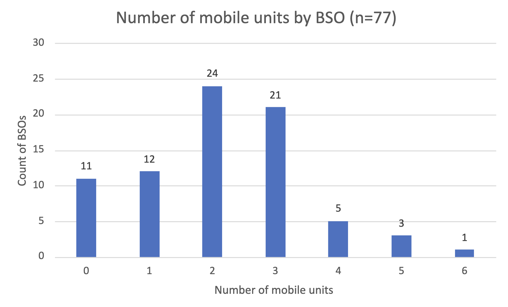

A lot of our research has so far been focused on understanding breast screening in hospitals and health centres. This kind of screening location is known as a ‘static unit’. This is in contrast to breast screening done in mobile vans or units.  

In this design history, we start to describe what we know about breast screening in mobile vans. Our understanding is based on: 

- a survey with all 77 BSOs (breast screening offices) 

- looking back at past interviews and visits  

- visiting a mobile van  

## Why screen at a mobile site? 

The original vision for the breast screening programme was outlined in the Forrest report (1986). The report suggested a delivery model for breast screening consisting of: 

- static units in a hospital or health centre 

- mobile units rotating around local communities 

The key intent was to bring screening centres to where people are, reducing the need to travel and increasing participation.

The Forrest report [suggested](https://assets.publishing.service.gov.uk/media/5be181cd40f0b604c0d235fc/Withdrawn_Organising_a_breast_screening_programme_2002.pdf) that each screening unit should cover a general population of approximately 471,000 people, which, at the time, equated to a target screening population of 41,150 or 12,000 screening attendees per unit per year.  

The [current breast screening guidance](https://www.gov.uk/government/publications/breast-screening-leading-a-service/breast-screening-best-practice-guidance-on-leading-a-breast-screening-service) suggests that a BSO should cover a general population between 500,000 and 1,000,000. In 2018, the median eligible screening population per BSO was 93,000 people. This means that annually, one third, about 31,000 participants, would be invited and about 23,250 would attend (based on 75% uptake).

Historically it was believed that for such a large population, travel distances would be too great, making mobile units a key part of service delivery.

This thinking informed the current breast screening model where:

- mobile vans rotate around their whole population every 3 years 

- there is a concept of a round plan that is maintained by the programme manager 

- participants are sometimes invited to their nearest van location rather than when they are due

This model has successfully been in operation for about 40 years.

## What’s inside a mobile van

The van we visited had a staircase leading up to a door. Inside, to the left was a small reception area where participants were checked in. Behind the reception was a small staff kitchenette.  

To the right of the entrance was a small waiting area for 2 to 4 people. Further inside there were 2 small changing rooms and a larger room with the mammography machine.

Inside the van participants followed a one-way system so that once the mammogram image was taken, the participant could change and walk out of the other end, down a staircase.

## How much screening do we do on mobile vans nationally?

Through the national BSO survey, we found that out of 77 BSOs: 

- 64 BSOs (83%) have mobile units 

- 11 BSOs (14%) do not have mobile units 

- 2 BSOs (2%) have mobile units that never move

In addition to the 153 static screening sites, mobile vans rotate around 651 mobile sites nationally, along with 12 prisons, 7 immigration centres and 2 secure hospitals. So out of a total of 836 locations, 662 are mobile locations, although only a fraction of those are in use at any one time.

Anecdotally, we heard that 60 to 80% of all screening happens on mobile vans. We need to check and refine this figure by, for example, mining the clinic codes or [BS Select](https://www.service-catalogue.nhs.uk/services/breast-screening-select) data.  

## BSOs usually have 2 or 3 mobile vans

Most BSOs have 3 or fewer mobile units, but there are some outliers with 4, 5 and even 6 mobile units. 

On average, vans make their way around 8 mobile locations per year. The highest number of mobile locations that a BSO visits every 3 years is 37 (this BSO has 2 mobile vans).  

Typically BSOs use the same mobile screening locations and visit those locations in a predictable cycle. This is known as the round plan. 

## Most popular places to host screening facilities

The most popular locations for hosting screening were: 

- hospitals (237) 

- supermarkets (176) 

- GP surgeries (151)  

- community or leisure centres (69)

There were also 21 ‘detained estates’, which include prisons, immigration centres and secure hospitals and 1 military location.

## The biggest challenges with mobile locations

60 BSOs told us that they increasingly experience difficulties with mobile van locations. Reasons included: 

- supermarkets installing electric car charging points and requiring parking spaces back (we were told mobile vans can take up 8 to 9 parking spaces) 

- land changing ownership or being built on 

- councils needing the land for other uses or wanting to start electric car charging 

Some BSOs thought that there were too few incentives or budget for hosting mobile vans. There was competition for space with other screening programmes like [lung screening](https://design-history.prevention-services.nhs.uk/lung-health-check/).

There are also seasonal limitations to using certain locations: 

- supermarkets need space during Christmas 

- seaside locations need space during summer holidays 

- public holidays and events (like football matches) require space

Not all locations are suitable for hosting a mobile van – locations need to have certain qualities and facilities such as:

- reliable water and power supply 

- toilets 

- parking space for staff and screening participants 

- safety during the daytime and at night when vans can be vandalised; the surroundings need to be well maintained (shrubbery and pests were mentioned) 

- being conveniently connected by public transport and by car 

## Internet connection and offline working

Of the 66 BSOs that had mobile vans, 77% had internet access. Of those, 83% experienced connection difficulties.

> Out in mobile units, radiographers need paper to identify ladies, as some mobile units struggle with connectivity due to rural locations. There will be situations where the service can't go paperless.
> -- BSO programme manager

The van we visited had an internet dongle, but staff told us that the signal was unreliable and varied by location and weather.  

For this reason, all paperwork was printed the day before at the static site and taken to the van by staff. At the end of the day, staff drove the paperwork back to the static location where it was processed.  

We know that some BSOs use couriers for transporting paperwork and images between the mobile van and the office.

> Live network connections drop out a lot and cause stress. It locks the radiographer in the record so they can’t find the client. They are stuffed!
> -- BSO programme manager

During our visit we saw first-hand that the entire process was possible without relying on the internet, including:

- various paper templates that recorded who was expected to attend, if they attended, and how many images were taken 

- the use of the NBSS Daybook (offline version of the national breast screening service) with data transferred to a memory stick  

- the use of DiMEx (digital mammography image export system) technology for transporting mammogram images on a hard drive

Back in the office, the paper and NBSS attendance, along with the DiMEx images were processed and uploaded to the relevant systems, such as NBSS and PACS.  

While DiMEx was the standard process for the van we visited, some other BSOs told us that they would use it for backup:

> We are rolling out Wi-Fi in our vans but if Wi-Fi doesn’t work, we might switch back to DiMEx
> -- BSO programme manager

## Different mobile van capacity depending on location

Some BSOs have shared cars that staff drive between the office (static unit) and the mobile van location. 

Where this was the case, staff started work when they arrived at the static site (say, 8am). But the first appointment on the van would be much later, as staff needed to pick up paperwork, drive and set up on the van.  

The van that we visited started at 9:42am that day.  

In other BSOs, staff travel directly to the van. Travel arrangements and expenses largely depend on Trust policies.

Some BSOs have a zoning system for paying staff for travel (for example, zone A – 15 minutes of travel time, zone B – 30 minutes of travel, etc). Some BSOs try to send staff to vans that are closest to where they live and are mindful of how much travel time they accrue. We heard from one BSO that permanent staff cannot work on mobile vans more than 3 days a week due to guidelines.  

## What this means for design

- Travel time to the van is a key consideration in planning, both for travel time from staff home to the mobile unit and for travel between the static unit and mobile unit. 

- The same van may have different capacity based on its location or its staffing levels. 

- BSOs need flexibility to start and end screening at different times depending on travel time or the van’s location.  

- BSOs need an accurate estimate of the time it takes to drive from the main site to the van, considering conditions that affect driving (weather, traffic, etc). 

- Travel reimbursement rules might be contentious and are based on Trust policies so it’s important to treat them sensitively. 

- We need to consider offline solutions, solutions with very limited internet connection or ways to ensure connectivity in all mobile screening locations. 

## Next steps
Mobile vans operate in more constrained and unstable contexts compared with static units, including intermittent internet connection and large amounts of paperwork and offline workarounds to compensate for that.  

A lot of screening happens in vans, yet there hasn't been a lot of research done on the vans to understand the experience of staff and participants. An area our future research will aim to address. 