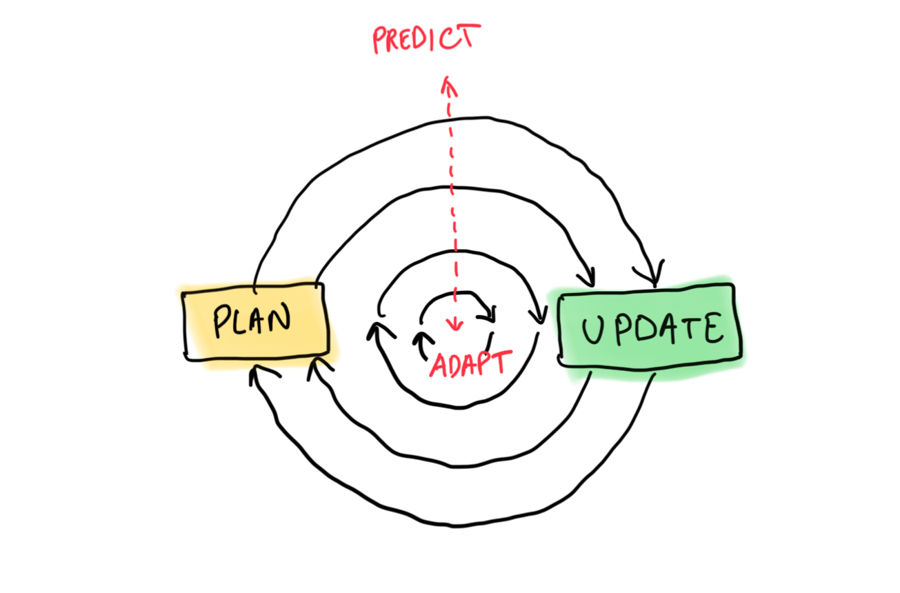
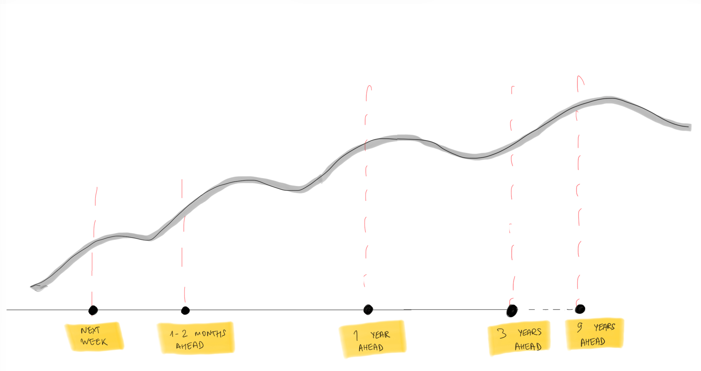
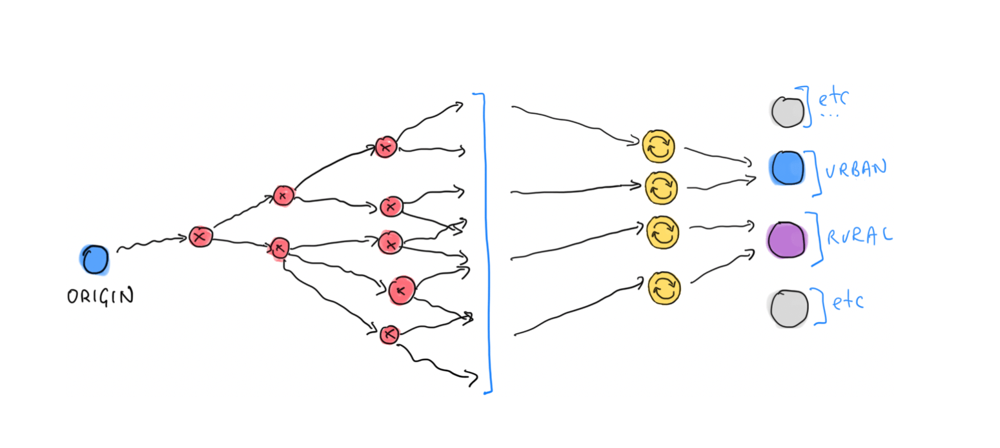
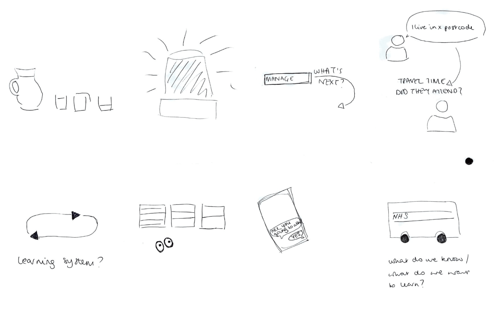
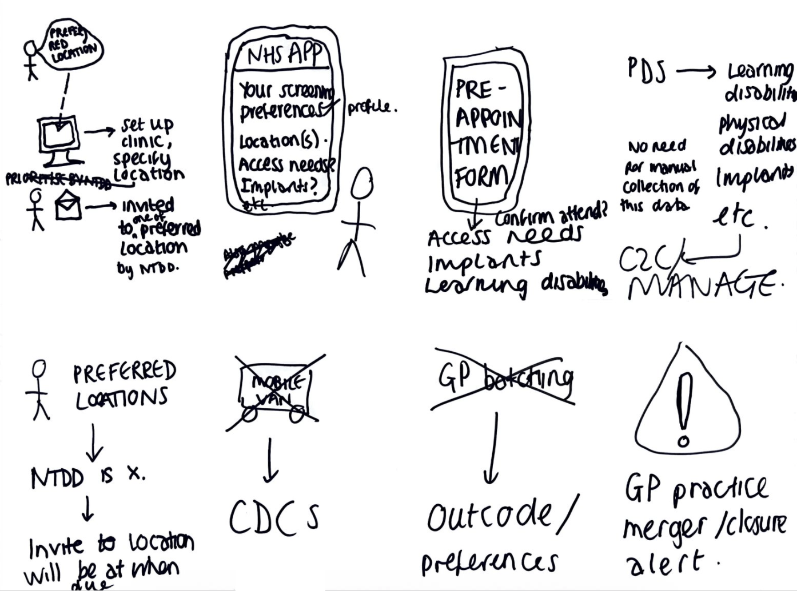

At the end of November 2025 our team was asked to understand why breast screening offices (BSOs) were increasingly struggling to screen all of their population within a 3-year period.

We knew from past research and design activities that the current processes BSOs used for capacity planning were complex, manual and differed nationally. At a workshop with the digital breast screening teams, we identified capacity planning as a key area for transformation, extending the image taking and image reading parts of the service that we were already building.

To understand the challenges of forecasting and capacity planning, we conducted a series of design and research activities - including BSO visits - that jointly made up a discovery.

Here we explain what we learned about forecasting and planning during the discovery and, more specifically, in the BSO visits.

## What we did

Between November 2025 and February 2026 we conducted 15 BSO interviews (13 face-to-face, 2 remote) covering 14 different BSOs.

We knew BSOs did things differently. For example, most use mobile vans that house a mobile version of a static breast screening unit. Many BSOs visit their communities in a predictable, 3-year cycle. But not all BSOs use mobile vans and some cycle around their population every year. BSOs serve different sizes of population and kinds of geography. They have unique challenges and have developed own responses to those.

We picked a diverse range of BSOs to visit:

-   **rural and** **urban:** in terms of geography and populations served

-   **static and mobile:** predominant mode of delivering screening

-   **small and large** population served

-   **unusual practices:** yearly visits to sites, simple planning artefacts, etc.

We knew we couldn't visit everyone so by targeting the 'edges' along these dimensions, we hoped to see challenges amplified and that other BSO experiences would fall somewhere along the behavioural spectrum.

We travelled around the country in small teams of 2 or 3 people and spent several hours with each programme manager or another person responsible for planning.

We made a deliberate decision to focus less on the current round length planning tool and more on what BSOs needed to achieve at every stage and what tools they used to meet those needs. We wanted to ground understanding in the needs and not an existing product (we already had evidence about all the ways in which it wasn\'t working).

### Round length and slippage

Round length is the formal term to denote the time between when someone is screened. Allocating screening participants to screening team capacity, room capacity and mobile unit locations is known as round planning.

The round length for breast screening is currently 36 months - it is one of the standards that breast screening offices in England are required to meet.

There are 2 levels for the round length standard:

- **acceptable:** that BSOs screen 90% of their population in under 36 months

- **achievable:** that BSOs screen 99% of their population in under 36 months

Increasingly, BSOs are struggling to achieve these, with about a [fifth of BSOs failing](https://digital.nhs.uk/data-and-information/publications/statistical/breast-screening-programme/england---2023-24/qualitystatement2324) to meet the 90% (acceptable) standard in 2024-2025. This is known as 'slippage'. The more this happens, the higher the risk of cancers going undetected for longer, harming people and reducing the effectiveness of the breast screening programme.

## What we learned about forecasting

### Planning for multiple horizons

We already knew from past research that planning had two major lenses: strategic (long-term, 36 months ahead) and operational (short-term, known as 'batching'). After visiting BSOs, we realised that planning was more complex and nuanced.

Capacity planning was an iterative process requiring planning for multiple horizons, coordinating and meticulous counting of participants across the pathway (including surgical) and beyond (GPs, locations, etc).

> We are continuously planning, rather than what we used to do years ago - a bigger planning session
> -- BSO

The different horizons served to answer different questions:

- **multiple rounds ahead:** smoothing peaks over time and planning for population changes

- **1 round ahead:** provisional screening schedule in each location (if moving vans) and knowing if they'll meet the round length

- **1-2 months ahead:** setting staff rotas, sending participant invites and informing GPs

- **each week:** adapting the plan based on staff sickness and screening nrate in a location, refining the plan

### The circularity of peaks and staffing

Any surge or dip in the number of people screened will be repeated in 3, 6 and 9 years, or until it is smoothed out by inviting people early. This is because broadly the same people in the same locations are screened every 3 years.

Peaks in screening can occur after celebrity campaigns encouraging people to be screened or due to injections of funding (like to aid COVID-19 recovery). They can also occur when GP practices merge and new populations suddenly need to be screened in an area.

These peaks do not just affect the screening capacity -- they will send ripples throughout the pathway and everyone who interacts with it. This includes image reading, technical and abnormal recalls, assessments, MDT (multi-disciplinary team) meetings, pathology and surgical capacity.

Beyond that, GP practices that have their populations screened every 3 years will get a spike of screening results to process, increasing the likelihood of causing a bottleneck and a delayed results recording.

Staffing across the screening pathway is the biggest barrier to planning and absorbing surges in demand. Staffing levels beyond screening - for example, if someone needs to be invited back to biopsy and goes on to have surgery also needs to be considered.

### Paper and spreadsheets 

Paper and spreadsheets tend to power BSOs' planning efforts and generally seem to work well for them.

These tools and practices developed over time:

-   the systems (including but not limited to BS Select and NBSS) require manual data entry as their integration is technically difficult and has not been historically prioritised

-   the lack of integration led to a reliance on humans to connect the data between systems leading to an increased risk of mistakes

-   where this led to incidents (such as when someone was not invited when they were due or when the right results were not sent to the right person), BSO staff created processes to double and triple check that no one is missed

These tools are often complex and there may only be 1 or 2 people in the BSO who understand how to use them. This is a huge risk to the resilience of the programme when staff leave or retire.

### Batching tailored to geography and location

When we started, we thought that the batching method was largely binary ([either using NTDD or RISP](https://design-history.prevention-services.nhs.uk/breast-screening-pathway/2025/12/understanding-batching/)). But in reality, BSOs tailored how they were grouping people differently:

-   by GP practice location or group

-   by participant location

-   by mobile van location

-   by next test due date

-   By a combination of factors

Batching was complex and BSOs didn't always understand the principles of the batching method. Instead, they relied on the knowledge they inherited from predecessors or neighbouring BSOs, passing down good and bad practices, along with batching methods and the sequence in which sites are visited.

## What this means for the new service

For staff to be willing to adopt the new service, it needs to match the flexibility of their current tools, but feel less risky and provide greater reassurance that no one has been missed at every step of the process.

We believe that the value of a new digital service would increase for BSOs if it was joined up with the mammogram taking and image reading parts of the service already being built by team [Manage breast screening](https://design-history.prevention-services.nhs.uk/manage-breast-screening/).

The new digital service will not solve staffing difficulties, but it needs to make those issues visible to help BSOs get the support they need to address those - for example, with their commissioners.

We started work with the national programme team to make further changes that will allow the product teams to build a much simpler service. This is something we are progressing separately.

## New team taking this forward

We ran an ideation workshop with the new cohort to clinic team who will be taking this work forward. Some of the ideas that came up in the workshop were:

-   The service meticulously making sure no one is lost and reassuring users

-   Intelligent alerts to prevent incidents

-   A system that gathers data and gets better over time

-   A joined-up system that knows about the users, including about their disabilities or preferred locations

-   Integration with the app to send and receive invites and confirm attendance

The new cohort to clinic team will be taking these, and other ideas, further.