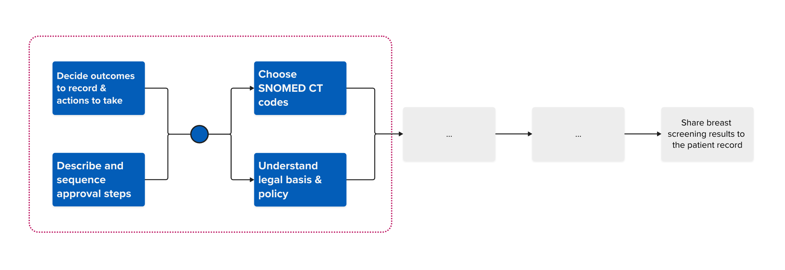

3 million paper result letters are sent by breast screening offices (BSOs) to general practices (GPs) every year. A year ago we ran a discovery to [understand if we could solve this problem nationally](https://design-history.prevention-services.nhs.uk/explore-team/2025/06/insights-and-opportunities-for-sharing-breast-screening-results-with-gp-surgeries/).

The reality was more complex than we imagined.

The legacy NBSS system runs in 75 local instances - we'd need to implement a solution in every BSO. The patient record is managed by 2 dominant GP IT providers – who would need to make changes, adding a dependency on their delivery roadmaps.

So even a medium-term solution would be unpredictable, costly and time-consuming.

Our discovery exposed the limitations of NBSS and helped inform a [decision to replace](../../../../manage-breast-screening/2025/07/the-future-of-nbss/) it with a modern breast screening service.

## New breast screening service pilot

Since the discovery, team [Manage breast screening](../../../../manage-breast-screening/) have launched a live pilot of the first slice of the new breast service in Humberside - our pilot partners. We are months away from being able to generate results in the new breast screening service.

This means we are no longer held back by getting data out of NBSS. We can move forward but some challenges remain.
ß
## Decide what outcomes to record

We already know that we need to record the following outcomes, or screening results:

- normal (routine recall): participant invited again in 3 years
- did not attend: participant didn't attend and will be invited again
- technical recall: mammogram not of sufficient quality, participant invited back
- recall for assessment (abnormal result): further investigation needed

We still need to consider whether new outcomes, like [partial mammography](../../../../manage-breast-screening/2026/02/improving-the-partial-mammogram-process/), are needed and agree the full list with the delivery teams. We should also consider what action, if any, should GPs take when receiving the information.

## Describe and sequence approval steps

As this work relies on GP IT systems, there are various approval steps and gateways that we'll need to go through. Last time we looked into this problem, some of these steps were:

- Digital services for integrated care (DSIC) front door
- Joint GP IT Liaison (JGPITL)
- Joint GP IT Committee (JGPITC)
- GP IT roadmap

We need to confirm if these are still the right steps and the order in which we should go through them, and if there are any dependencies.

We are speaking to other teams who we can collaborate with and learn from. One of those is the [Patient data manager](https://digital.nhs.uk/services/patient-data-manager) (PDM) team, who are simplifying integration with GP IT systems. Another is the [Health check online team](../../../../nhs-health-check-online/), who are piloting a solution with PDM.

## Choose SNOMED CT codes

If we wanted to automate the processing of breast screening results, we'd need to tag them with machine-readable codes that GP IT systems can understand and act upon. For example:

- a normal breast screening result can be automatically filed to the patient record
- an abnormal result can be flagged to GPs, who can decide what action to take, such as offering the person support while they go through the assessment

There are already [SNOMED CT](https://digital.nhs.uk/services/terminology-and-classifications/snomed-ct) (Systematised Nomenclature of Medicine - Clinical Terms) codes to denote breast screening outcomes, the most used codes being:

- Mammography normal (finding) [`168749009`](https://termbrowser.nhs.uk/?perspective=full&conceptId1=168749009&edition=uk-edition&release=v20260311&server=https://termbrowser.nhs.uk/sct-browser-api/snomed&langRefset=999001261000000100,999000691000001104)
- Breast neoplasm screening normal (finding) [`171175005`](https://termbrowser.nhs.uk/?perspective=full&conceptId1=171175005&edition=uk-edition&release=v20260311&server=https://termbrowser.nhs.uk/sct-browser-api/snomed&langRefset=999001261000000100,999000691000001104)

We also know that other programmes, like [Bowel cancer screening](../../../../bowel-screening/), clearly signal through their codes that these are results of a national screening programme:

- Bowel cancer screening programme faecal occult blood test normal (finding) [`375211000000108`](https://termbrowser.nhs.uk/?perspective=full&conceptId1=375211000000108&edition=uk-edition&release=v20260311&server=https://termbrowser.nhs.uk/sct-browser-api/snomed&langRefset=999001261000000100,999000691000001104)

And that the results come from a test (now replaced by a FIT test):

- Bowel cancer screening programme: faecal occult blood result (observable entity) [`368481000000103`](https://termbrowser.nhs.uk/?perspective=full&conceptId1=368481000000103&edition=uk-edition&release=v20260311&server=https://termbrowser.nhs.uk/sct-browser-api/snomed&langRefset=999001261000000100,999000691000001104)

We may decide to use one of the existing SNOMED CT codes or apply for new ones. Applying for new SNOMED CT codes depends on deciding what results we will need to record.

New SNOMED CT codes are released twice a year – in April and November and can take several months to approve.

## Understand policy implications

Importantly, we need to understand the legal basis for processing and exchanging this data and consider whether these changes will have any policy implications. If they do, we need to allow time to build the necessary consensus.

## Conclusion

Each of these 4 steps is complex and dependent on others. Our choices will be driven by getting a solution to a small number of BSO partners and GP administrators as safely and as quickly as possible, so we can start learning from their feedback.

Next, we will describe the detail of each of the 4 challenge areas.
