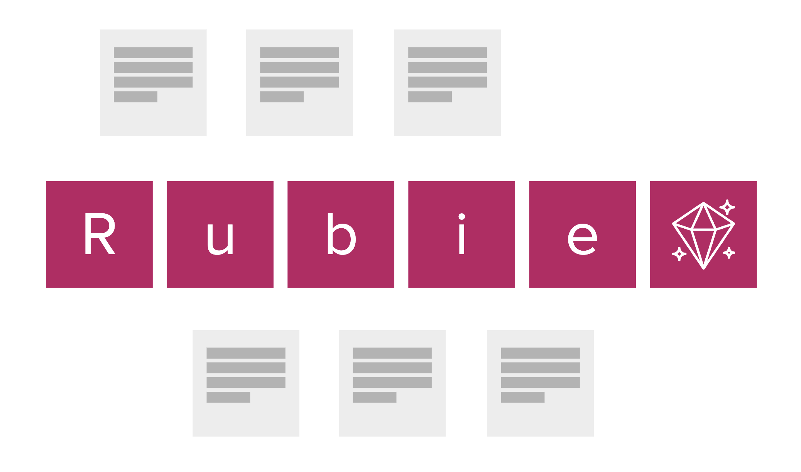

Naming things is hard. And getting a group of people to agree on that name can be even more difficult. Here's the story of how we came to name the new digital breast screening service: Rubie. 

## First: some context

The new digital breast screening service will replace several legacy systems: the main one is called NBSS (National Breast Screening System), there is also BSIS and BS Select. Some of these systems have been in use for decades, so people are well used to the acronyms.  

We figured that people would probably call it 'the new NBSS' and while that's... ok... we really wanted to show that the new system will do everything the existing systems do - but also more. We wanted to get across that this was something different. We wanted a name that was _appealing_.

## We started at the beginning - where else? 

As the [GDS service naming standard](https://www.gov.uk/service-manual/design/naming-your-service) will tell you, you should start by describing what the service does. So we did.  

A small group of people who were good with words and ideas, all working on the service and led by [Liz Lutgendorff](https://www.linkedin.com/in/elizabethlutgendorff/), brainstormed nouns and verbs associated with breast screening.  

We also had some extra considerations from [Sarah Fisher](https://www.linkedin.com/in/sarah-fisher-6149b1242/) of our senior leadership team, and feedback from those who use the service. The name should describe _one_ breast screening service, national in scope and separate from the symptomatic service. It needed to avoid negative or unfortunate connotations. And it also needed to be a word or easy-to-say acronym or initialism.  

## A quick aside

At the moment, we're describing one of the teams and what they're building as 'manage breast screening'. Of course, this gets shortened to 'Manage'. Immediately we're losing context and meaning when we're calling a service 'Manage'.  

Everything is about the management of something, so this just doesn't work hard enough. This is why we had the extra considerations.

## Back to the story

The first group came out with some potential names:

- Manage and Organise Breast Screening (MOBS)

- Deliver Breast Screening (DeBS)

- Plan and Manage Breast Screening (PaMBS)

- Plan and Deliver Breast Screening in England (PaBSE)

- Manage Breast Screening in England (MaBSE)

- Manage and Provide Breast Screening (MaPS)

We felt that we had some good contenders but none that immediately charmed us.  

## We got feedback... and took a break (not in that order)

We paused actively thinking about the name for several months because things were happening with the build.

When it came to start testing the service, naming it so that we could refer to it meaningfully became more of a priority. We shared the shortlist with everyone working on breast screening and asked them to comment - and also to submit their own ideas.

This is where the breakthrough came.

Someone suggested a verb we had not considered - 'run' - leading to the suggestion 'Run Breast Screening (RBS)'. By adding 'in England' (and taking some liberties with the acronym) we arrive at Rubie (**Ru**n **B**reast Screening **i**n **E**ngland).

At an all-teams day, we put the final shortlist to a vote and Rubie was a clear winner.

## The meaning of Rubie

Rubie resonates because of what it symbolises:  

- **hardness and durability** - rubies are one of the hardest natural materials: the aim is for the new service to be around for decades to come

- **clarity** - rubies are valued for their depth and purity: we want the new service to be clear in what it does and communicates to participants, clinicians and admin staff

- **vitality and courage** - rubies are associated with life force: attending breast screening takes courage and is ultimately about saving lives

Star rubies reveal a six-pointed star when light hits them. Something hidden, made visible. This captures the essence of breast screening and honours the important work of image readers who find cancers that can only be seen on mammograms.

## What we learned

Naming a service is not straightforward. Time, iteration and a diversity of views are all allies. We would not have reached Rubie through the initial brainstorm alone.

The easy option would have been to call the service 'the new NBSS', but we wanted to signal a leap forward and give the new service a chance to create its own associations and identity.

