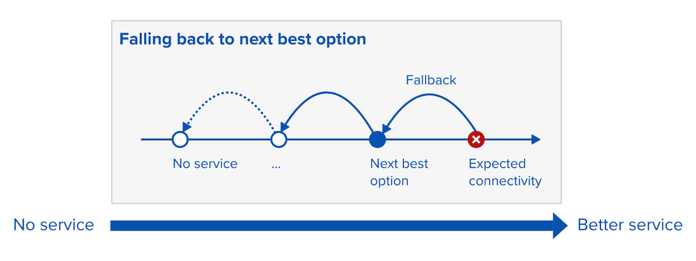
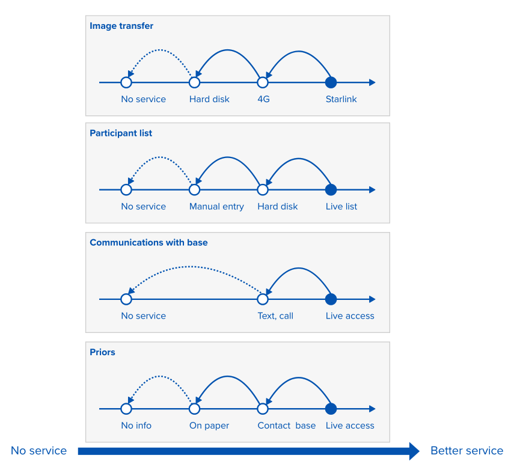
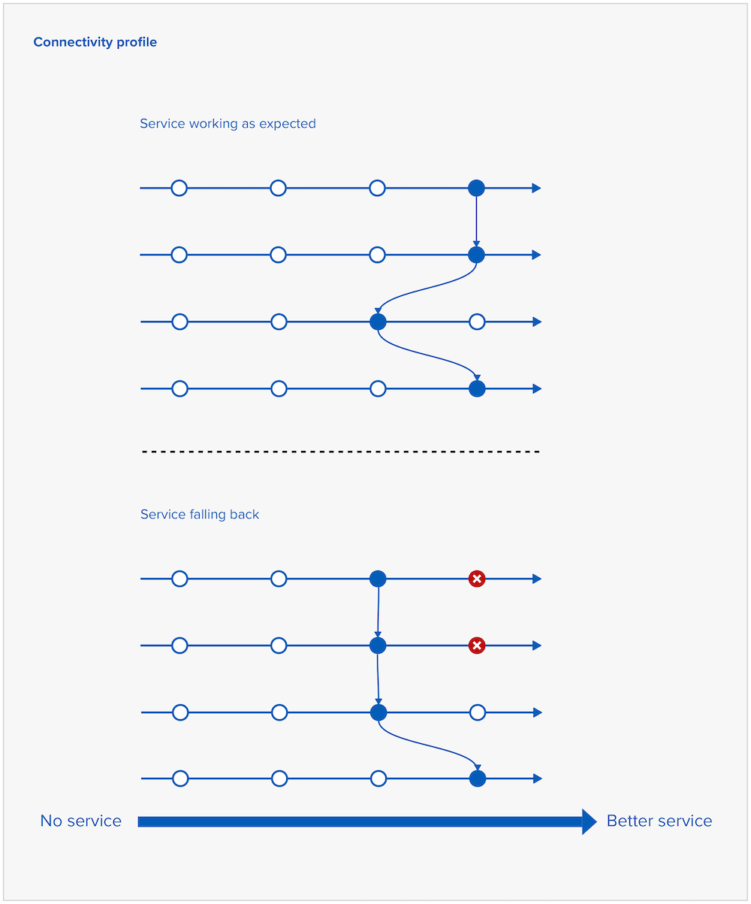

In our previous [design history on mobile vans](../../03/breast-screening-in-mobile-vans/), we described what breast screening on mobile units looks like and noted that of those BSOs that had internet access, 83% experienced difficulties. 

To understand connectivity issues more deeply, we ran 8 interviews with 7 breast screening offices (BSOs) between April and May 2026. 

This post focuses on two things: the connectivity spectrum and the role of fallbacks in maintaining a resilient service.

## A connection is needed for several different tasks

The first important learning is that internet connection is not a single capability that is either present or absent. Different tasks require internet connectivity, for example:

- preparing and accessing the list of participants expected to attend, known as a worklist

- transferring mammogram images from the modality machine to the Trust's PACS (Picture archiving and communication system)

- checking a participant's previous screenings (priors) before or during their appointment

- communicating with the base (the BSO at the static unit)

Printing was mentioned as a task that could be useful for fallback paperwork but often not possible, because printers require a working network and space. Both in short supply on mobile vans. 

## Each of the tasks has a well-defined progression of fallbacks

Stopping screening and cancelling clinics is seen as the worst-case scenario, which they want to avoid. For that reason, BSOs have defined what each task falls back to when connection is lost. They designed their operating procedures around failing safely, not around avoiding failure.

When connection fails for a task, it reverts to the more manual version. While staff show adaptability, this is also a source of stress. 

> Signal drops never brings us to a halt, does it? At the end of the day, we can continue with it as it is

So for each task there is a connectivity spectrum:

- on the right: more automated, less error-prone, more reliable
- on the left: more manual, requiring physical transportation 

Fallback progression by task (from best to worst): 

- Image transfer: satellite (Starlink), 4G (sometimes with more than 1 SIM for more resilience), hard disk, no service
- Participant list: live list, hard disk, manual entry, no service
- Communication with base: live access, texting or calling, no service
- Getting priors: live access, contact base, paper (prepared at base), no information (taking participant's word)

## Paper is seen as a security blanket

Every BSO we spoke to still uses paper in some form, including those with the most reliable connectivity. Paper “feels safer” and is a “security blanket” when the connection drops. 

Staff needed to know that if something fails, they’d be able to fall back quickly, as they were under extreme time pressure to screen every 6 to 8 minutes.

## Delays still happen on reliable networks

The BSO with the top-tier satellite connection (using Starlink in 2 of their 4 vans) synchronised images and worklists overnight and not in real time. However, a resilient connection (Starlink falling back to 4G from 2 different providers) allows them to run NBSS live and eliminate most of the paperwork. 

A reasonably well-connected BSO told us that there is a delay in uploading images, which can take from minutes to hours, even with a live connection. This is because their provider, Visbion, has a built-in delay as images travel through the network. 

The delays are the reason why internet speed alone is not an accurate measure of how well connected the vans are. 

## Bad connectivity impacts efficiency and safety

A particular frustration is the lack of access to systems like PACS and RIS (Radiology information system), where past images (priors) and reports are stored. Mammographers need to access those especially in situations where participants have implants, metal or very large breasts. 

One BSO told us that when they can’t access PACS history, they either call the office or take the participant’s word for not having had a recent mammogram (to stay within IRMER requirements). Calling base for every participant is impractical, as staff are under time pressure to screen in 6 to 8 minutes. But asking participants isn’t always accurate and has led to incidents in the past. 

## Different vans have different connectivity profiles

A connectivity profile (the extent to which a van is connected in a location) could be a helpful framework for understanding the scale of variation. 

One BSO might mostly work online, while another BSO might mostly work offline. 

The well-connected van will fall back to less desirable ways of working that are another BSO’s standard way of working:

> Fall back is going back to olden times of paper and transferring via a hard disk

A connectivity profile is also context-dependent. Bad weather, moving to another location or even school holidays (when 'all the kids are on their phones') can require a van to fall back to a less desirable way of working for a given task. 

> Let’s say that you come to work and the signal on that morning because of rain, because of thunder or something is particularly bad

Waiting until connection is restored is also a form of fallback (to upload the images). 

## Dealing with technical issues adds pressure on staff

One BSO helped us realise that clinicians like mammographers and radiologists have not historically had to deal with so much technology. Their job was to take mammograms and read them (originally on film). These days not only are they expected to use many different IT systems, but also to troubleshoot them when things break. 

> Some of our mammographers were working with wet films, now they work with digital films. They are faced with so much technology, VPN in the van. If you ask them what this means, they don’t know but have to engage with it. Not only modality scanners, but on top of Seno Iris! Applications that help format 2D into 3D. They deal with a lot of IT, they still only have 6 minutes to treat a patient. They still have to troubleshoot in that time.

## Summarising connectivity needs at BSOs

This work has helped us establish that our future aims should include that users in mobile van units can:

- continue screening safely when the connection drops
- fall back on the next best connectivity solution, adapting quickly and minimising time lost
- feel reassured and trust the service