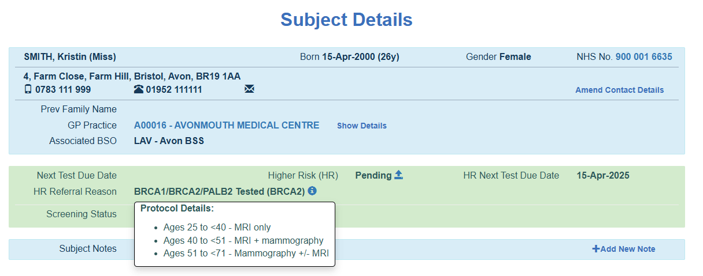
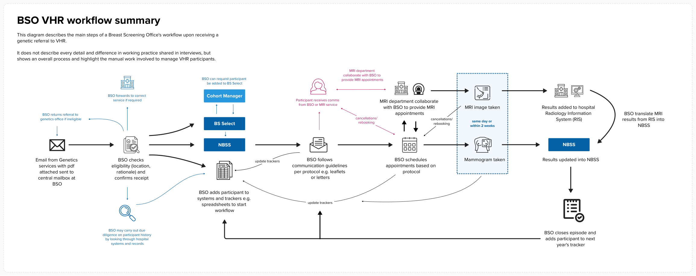

Very High Risk (VHR) breast screening is a service provided to people who are at exceptionally high risk of breast cancer. The cohort of eligible participants may be identified through: 

- genetic testing 
- equivalent risk, for example a family member is diagnosed, but you have not been tested 
- oncology services, where someone has experienced radiotherapy to breast tissue in the past (between the ages of 10-35)  

The volumes of eligible participants are relatively small compared to routine breast screening. However, research shows that the admin required to manage these cases is considerably higher. This is mainly due to more complex protocols and the lack of interoperable systems between services. 

| Pathway               					  | Estimated eligible population   | Estimated % who require assessment          |
| ----------------------------------------------------------------| ------------------------------- | --------------------------------------------|
| Routine                					  | ~ 6.5 million (over 3 years)    | ~ 4–7%  					  |
| Moderate risk/ family history (Not part of national screening)  | ~ 300k–600k                     | ~ 5–10% 					  |
| Very High Risk (VHR)           				  | ~ 17k (based on 2024-25 data)   | ~ 7–12% (can be higher with MRI protocols)  |

> [!NOTE]
> Data sourced from [NHS](https://digital.nhs.uk/data-and-information/publications/statistical/breast-screening-programme/england-2024-2025/mainreport2425), NICE and GOV.UK sources. Routine and VHR are based on breast screening reporting data, however Moderate risk are evidence informed estimates  

## Key differences between routine screening and VHR screening: 

1. **Eligibility** – VHR Screening has tight [eligibility criteria](https://www.gov.uk/government/publications/breast-screening-higher-risk-women-surveillance-protocols/tests-and-frequency-of-testing-for-women-at-very-high-risk--2). Referrals can be made from age 18, but they will not be invited until they are 20 years old, or older, depending on their reason for referral. Routine screening starts at age 50.

2. **Screening protocol** – depending on their reason for referral, age and breast density, they may be offered an MRI only, mammogram only or both.

3. **Frequency** - VHR participants are invited annually instead of every 3 years with Routine. This includes those who self refer into VHR after age 70.

Once a person is identified and referred to breast screening services (BSOs), they are placed on different screening protocols depending on their circumstances. This screenshot from BS Select shows how protocols differ based on someone's age and the gene identified. 

 

### VHR participants start screening earlier than routine

If someone is identified as VHR before the routine screening age (50), they will be invited before their 50th birthday. However, if a referral is made for someone under the age of 18, it will be rejected by the BSO as they are ineligible for an adult screening programme. 

The referral organisation is required to re-refer them when they reach 18. Services will record participants from age 18, in a 'pending' status until they reach the minimum age for invitation based on their screening protocol.

Age also determines whether someone is offered a mammogram, MRI or both:

* Aged between 25 to <40 requires MRI only 

* Aged 40 to <51 are eligible for MRI + mammography 

* Aged 51  to <71 are eligible for mammography and an MRI if their breast density is high (determined by their first mammogram, and reviewed yearly when new mammography images are available) 

### Services need context about why someone has been referred to VHR 

**Different genes require different screening protocols.** Some genes are more susceptible to radiation than others. Protocols reflect a level of risk that changes with age, and the efficacy of mammography which differs depending on someone’s breast density 

Some people are considered to have **equivalent risk** of developing breast cancer. This risk is assumed until they complete gene testing.  

* Risk is identified using the [CanRisk tool](https://www.canrisk.org/) or [Tyrer Cuzick](https://ibis.ikonopedia.com/) software.  
* For example, a person may have a 50% chance of carrying a high-risk pathogenic variant if they have a first-degree relative with the BRCA1, BRCA2, or TP53 mutation.  
* These participants may remain on VHR until they reach routine screening age, where they are required to complete a genetic test to stay on VHR. 

Those who have experience **previous radiotherapy**, for example, during treating for lymphoma, will have received a high dose of ionising radiation to breast tissue. Where this was administered between the ages of 10 and 35 (when breast tissue is especially susceptible) there is a high risk of [secondary breast cancer](https://www.hodgkinsinternational.com/late-effects/breast-cancer-late-effects/).  

### Prior screening can provide information about breast density 

If someone is over 50, their most recent mammogram is used to determine breast density. Those with dense breasts continue to be offered a mammogram and an MRI. MRI is more sensitive than x-rays and should make it easier to identify cancers within dense tissue. 

Those without dense breasts are offered a mammogram only – mammography is very effective in this group so that MRI is unlikely to add information. 

 

## How BSOs manage VHR cohorts 

We recently completed some research to understand more about the process of managing VHR referrals from Genetics services via the [NICPR portal](https://digital.nhs.uk/ndrs/our-work/genomics/nicpr). We spoke with 10 Breast Screening Offices (BSOs) and 4 Geneticists. We learned there is local variation in how VHR is managed by the breast screening offices. This section describes some common components of their workflow. 

 

1. **Acknowledge and check a referral** – BSOs will sense check someone’s eligibility (right area, right age) and return or redirect referrals if they are ineligible for that office.  

2. **Check if a person is in the system** – BSOs will check BS Select and NBSS for a person’s details. If they aren’t there, they are responsible for [adding them](/select/2025/09/our-new-digital-process-for-adding-participants/). We learned that some participants may not receive any contact from a BSO until they are due to be invited to screening. This could mean a several year gap between genetic referral, and hearing from the service. 

3. **Complete due diligence** – Several BSOs described hunting through hospital systems to collect evidence of letters or treatments that might offer an insight into someone’s health journey so far. This helped BSOs tailor their communication to someone, for example, if they have already elected to have a bilateral mastectomy.

4. **Update trackers** – BSOs may supplement digital tools with their own spreadsheets to keep track of their VHR cohort. This keeps a record of: 
  - when they were referred and from where 
  - why they are eligible, such as which gene is present  
  - their next test due date 
  - their protocol (based on why they are eligible) 
  - when they have been contacted and status updates (this includes those who are “pending” which means they are not yet eligible based on their protocol) 
  - last menstrual cycle, which is relevant for MRI 
  - incidental findings from MRI (where the MRI may pick up other issues in the lungs or heart that require onward referral to other services) 

5. **Identify who’s due for invitation** – BS Select will automatically calculate a Next Test Due Date (NTDD), but many BSOs will copy this date into their trackers. This helps them track their workflow, and next urgent tasks depending on their protocol, for example, if MRI is in their protocol, it requires an 8-week window. "Mammogram only" requires a 4-week window 

6. **Invite a person to their mammogram or MRI (or both):** 
  - Ideally, if someone needs a mammogram and an MRI, it would be completed on the same day, at the same site. This is not always possible. BSOs aim to ensure a mammogram and an MRI take place within 2 weeks of each other. 
  - Some participants may choose to attend one appointment, and not the other 

7. **Close episodes and add a person to next year’s tracker** - VHR participants are invited annually 

## MRI appointments create additional complexity

MRI appointments are more complex to manage (see [VHR guidance for MRI](https://www.gov.uk/government/publications/breast-screening-screening-of-higher-risk-women/breast-screening-guidance-for-organising-a-very-high-risk-vhr-screening-programme#liaison-withmriservices:~:text=and%20confirming%20eligibility-,5.,Liaison%20with%20MRI%20services,-6.)). Some sites run VHR only clinics, and others choose to mix VHR participants with their routine participants to complete mammograms. This is thought to make it easier for someone to attend. They may add a note to the appointment to help radiographers understand why someone might turn up who is under 50.

Completing MRIs is much more difficult to manage; MRIs can only be carried out at sites who meet reporting requirements and have the correct facilities. This can mean some BSOs outsource their MRI participants to other BSOs. These BSOs may outsource everything from invitation to outcome, or just the MRI itself. 

Hormonal fluctuations can cause normal breast tissue to look bright and active in MRI images, increasing the risk of false positives. Services aim to complete MRIs in the first half of a person’s menstrual cycle (between day 6-16 ideally). This means BSOs are asking participants for their menstrual cycle dates, and coordinating with the MRI teams at the Trust to book appointments within that window. Some BSOs will aim to complete mammograms on the same day, or within 2 weeks of the MRI appointment. 

Further complexity is added due to the fact that MRI appointments cannot be managed in NBSS, and MRI teams cannot access NBSS.This means participant and appointment information is held by the MRI team in the hospital systems. In England this is usually [CRIS](https://www.magentus.com/clinical-systems/radiology/?r=e), Cancer Radiology Information System. This system is also used for completing MRI reports, requiring BSO admin staff to manually interpret reports and update NBSS with outcomes to complete their VHR screening workflow. 

We also heard, as we have with routine screening, that symptomatic services can often take priority within a trust. This makes it difficult to offer MRI appointments far in advance, as symptomatic services want to ensure they protect their capacity 

## The manual workload  

> I think VHR is one of the most complicated parts of breast screening. It needs to be acknowledged how manual it is.
> -- VHR Coordinator in a BSO

Research indicated that there is significant manual work required by BSOs to manage the VHR service. This is largely down to: 

1. Lack of interoperability between different organisations' systems along the pathway (NDRS, Breast Screening, MRI units), for example:
* using email to share referrals and confirmation of receipt  
* word documents and pdfs used to record and share participant data 
* manual entry of VHR specific information into NBSS and BS Select 
* no or delayed visibility of MRI appointments 
* duplicating MRI reports posted in Hospital RIS and NBSS 

2. Insufficient product capability to manage and track VHR specific information 

3. A general worry about “missing” someone, resulting in localised trackers and spreadsheets to help manage workload and urgent tasks. (Some services will print out “packets” for each VHR participant and keep a record of their VHR journey – this provides greater visibility to staff) 

The majority of BSOs we spoke to had at least one, if not several people dedicated to managing the VHR service. Their role relies on inherent knowledge about VHR and is required to: 
* keep track of incoming referrals  
* keep trackers updated so they know who’s due for invitation and what for 
* keep up to date with the latest VHR guidance and eligibility criteria  
* ensure invitations and appointments are offered in time, and for the correct protocols 
* ensure results are kept updated in NBSS 
* ensure participants have the correct status based on service outcomes 

To put this into perspective, one site shared that they required a staff ratio of 1:225 for VHR compared to around 1:20,800 for Routine. That is, each VHR participant requires around 92 times more manual effort than a routine participant, equivalent to over 9,200%. 

So, although proportionally, VHR represents a much smaller cohort of people, it still represents a significant opportunity to reduce administrative burden, and free up time within BSOs to focus on patient care.
