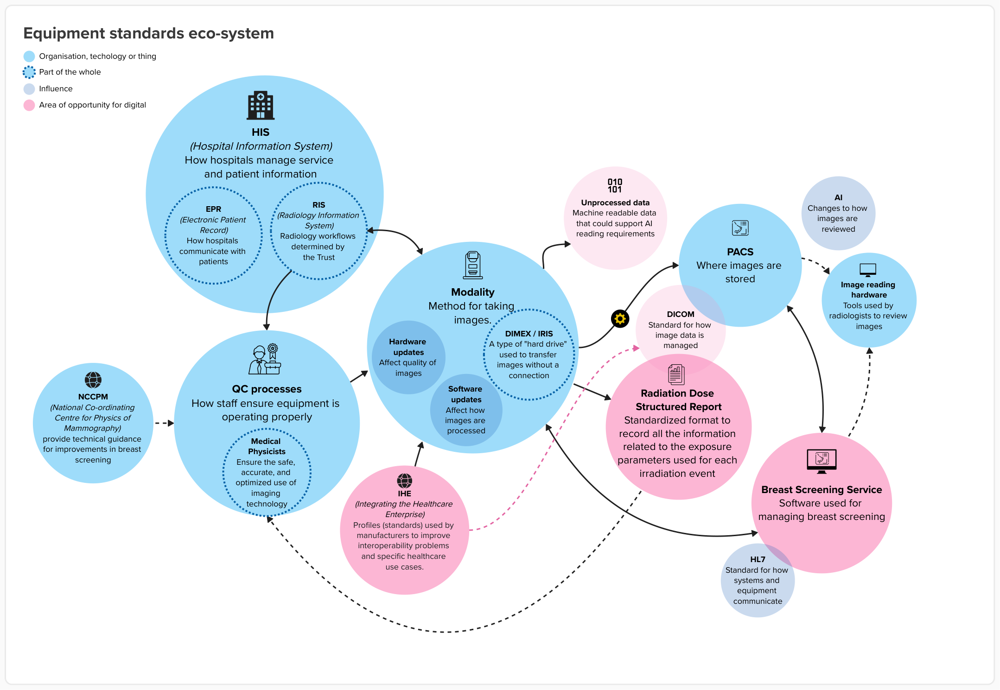

For breast screening to work safely and efficiently, different digital systems need to share the right information at the right time.  

This design history is focused on how: 
1. the worklist, or list of appointments, is shared with imaging equipment such as a mammogram machine. 
2. appointments are recorded and matched with images taken on the imaging equipment (known as a “modality”).
3. images move from imaging equipment to the Trust’s image storage system (known as “PACS”). You can read more about this in our work with mobile vans.
4. Rubie can access image storage systems to support image reading. 
5. Rubie can share information with other screening systems, such as radiology or pathology systems. 

The diagram below shows where data is shared in the breast screening pathway. This includes hospital systems, quality control and service delivery. The areas in pink show where digital approaches could improve outcomes: 
* how unprocessed image data could be used 
* information stored with medical images (DICOM) 
* standards that help systems share information (IHE) 
* structured reporting of radiation dose 
* how Rubie connects with other systems 

## Different suppliers make integration more complex 

A survey completed in 2025 provided insight into which suppliers are used across breast screening in England. We asked breast screening offices (BSOs) to confirm their provider for PACS and mammogram machines. 

We learned that there are more than 15 different PACS providers. However, most systems were provided by five companies. 

Mammogram machines were more consistent, with the survey indicating four main manufacturers. 

The experience of using these products will also vary depending on which software version of PACS is installed and which type of mammogram machine is in use. The manufacturer and version can vary within the same hospital, and it is not consistent across breast screening. Trust procurement teams are likely to manage procurement decisions on broader criteria than breast screening only. PACS can sometimes be dedicated to breast screening, but they are generally considered hospital-wide systems with dedicated PACS managers. [^1] Some mammogram machines and other imaging modalities may also be used by symptomatic services. 

[^1]: [A PACS Manager job description](https://beta.jobs.nhs.uk/candidate/jobadvert/C9392-24-0494) 

## Local set-up affects image quality and data 

Each hospital or Trust will have medical physicists who are responsible for ensuring x-ray and ultrasound imaging equipment captures images of sufficient quality to support early detection of breast cancer. They also ensure radiation doses from x-rays are kept as low as reasonably achievable. 

 Tool used to simulate breast tissue and (right) the test image shown on screen to check performance of the x-ray machine.")

The breast screening programme requires daily, weekly and monthly checks to be carried out on mammography equipment. These checks “ensure that equipment is working within agreed standards and parameters and functioning safely.”[^2] With guidance from medical physicists, breast screening teams will check: 
* modality machine calibration or degradation 
* compression and image quality from modalities 
* radiation dose from modalities 
* that monitors are operating effectively (for image viewing) 

Data from regular quality control checks is collated and shared by services with SQAS every six months. [^3] 

[^2]: [Routine mammography control test equipment report](https://assets.publishing.service.gov.uk/media/5a806de2e5274a2e87db9c32/nhsbsp-equipment-report-1303.pdf)
[^3]: [Breast screening quality assurance guidance for Mammographers](https://www.gov.uk/government/publications/breast-screening-quality-assurance-for-mammography-and-radiography/guidance-for-breast-screening-mammographers#quality-assurance-framework)

### Image processing has an impact on outcomes 

Each modality manufacturer captures images differently. They also apply different post-processing to image data. Data need to be processed to optimise images for a human interpretation. 

The difficulty with processed data is that how it is processed depends on the manufacturer's hardware and software versions, which are not currently monitored or recorded consistently. This makes it difficult to monitor how processing affects outcomes, for example, whether one manufacturer's settings support better or worse cancer detection than another. 

Unprocessed data is generally more suitable for research and analysis, as it allows the user to determine how data should be interpreted. This is difficult to do with processed data, as the transformation that enhances an image for human interpretation cannot be reliably undone. 

## Standards that help systems share information 

This design history will not document every standard applicable to breast screening. However, there are several standards and organisations that are relevant to the development of Rubie. 

### Digital imaging and communications in medicine (DICOM) 

DICOM defines what data should be stored alongside a medical image, and how equipment should communicate and share that data. DICOM standards have been in use for more than 30 years. [^4] They are a mandatory international standard required by mammography equipment manufacturers. 

[^4]: [Thirty years of the DICOM standard, Michelle Larobina, 2023](https://www.mdpi.com/2379-139X/9/5/145)

A DICOM file (.dcm) combines image data with a rich header containing metadata, such as patient demographics, acquisition parameters and study details. 

DICOM is important for Rubie because it affects how: 
1. images should be sent to PACS systems 
2. mammogram data should be retrieved from servers
3. modality worklists should be managed (patient and procedure details) 

### DICOM Metadata
| Patient               	| Study			  | Series                 				| Image		     		|
| ------------------------------| ------------------------| ----------------------------------------------------|-------------------------------|
| Patient ID			| Study ID		  | Modality 					  	| Rows				|
| Patient Name			| Study Date/Time         | Manufacturer					| Columns			|
| Patient BirthDate  		| Study Description	  | Model Name/SW Version  				| Pixel Size			|
| Patient Sex			| Institution Name	  | Patient Position					| Photometric Interpretation	|
| Patient Weight		| Referring Physician. 	  | Body Part Examined + Modality-Specific Attributes	| Planar Configuration		| 
| 				| 			  | 							| Samples per Pixel		| 
*Table of DICOM Metadata reproduced from MDPI article "Thirty years of the DICOM standard" by Michele Larobina* [^4] 

DICOM ensures that images produced by one provider’s machine can be viewed and archived on systems from another.  

It also defines how data is exchanged over networks, and supports over 80 modalities, including radiology, cardiology, pathology, dentistry, and ophthalmology. 

In mammography, a DICOM file contains image data (the breast image itself) and metadata (DICOM tags); structured information describing: 
* the patient 
* how the image was acquired 
* how it should be displayed 
* how it relates to other images and exams 

This data is critical to ensuring an image can be safely assessed. 

### Health level seven (HL7) 

HL7 is used to exchange electronic health information, such as demographics, scheduling information, and clinical reports, between healthcare systems. Messages are composed of segments, known as fields and composites, such as “PID” for patient identification. 

HL7 requires every message to start with “MSH” (message header). This defines the sender, receiver, and message type. These messages can trigger real-world events, such as admissions or orders. This standard is important for Rubie because the service needs to interact with a Trust’s PACS and modality systems. 

> [!IMPORTANT] HL7 message example
> MSH|^~\&|SENDING_APP|SENDING_FAC|RECEIVING_APP|RECEIVING_FAC|202604261000||ADT^A01|MSG00001|P|2.3PID|||PATID1234^5^M11||DOE^JOHN^||19800101|M|||123 STREETST^^CITY^12345||(555)5555555|||PV1||I|2000^2012^01||||1234^SMITH^JOHN^ |||||||||||||||||||||||||||||||||202604261000   

There is a more modern evolution of HL7 known as “fast healthcare interoperability resources” (FHIR). This exists for the same purpose as HL7 but is more suitable for modern applications. [^5] However, we believe most incumbent hospital systems are more likely to rely on HL7 in the near term. 

[^5]: [FHIR vs HL7 explained](https://rhapsody.health/blog/fhir-vs-hl7-explained/)

### Integrating the healthcare enterprise (IHE) profiles 

IHE profiles provide technical specifications that define how healthcare hardware and software should exchange information (using standards such as DICOM and HL7). They document specific scenarios, workflows, and data format requirements. 

IHE maintains a wiki of profiles, including several related to mammography, for example: 

* [MAMMO](https://wiki.ihe.net/index.php/Mammography_Image) - Mammography Image specifies how mammography images and evidence objects are created, exchanged, used and displayed.  

* [DBT](https://wiki.ihe.net/index.php/Digital_Breast_Tomosynthesis) - Digital breast tomosynthesis specifies how mammography and digital breast tomography images and evidence objects are created, exchanged, used and displayed. 

* [Scheduled Workflow](https://wiki.ihe.net/index.php/Scheduled_Workflow) - Integrates the ordering, scheduling, imaging acquisition, storage and viewing activities associated with radiology exams. 

Digital Screening is interested in the application of these profiles because the service needs to communicate with modalities and PACS systems. An updated IHE profile will reduce the risk of poor interoperability. 

IHE standards related to mammography workflows and reporting are also useful resources for the development of Rubie. 

### National imaging registry (NIR) 

The National Imaging Registry (NIR) is a cloud-based system that supports the secure sharing and discovery of diagnostic imaging across NHS imaging networks in England. It enables clinicians to access imaging carried out by other organisations, without needing to request or transfer physical media. 

It intends to act as a national service that supports collaboration across imaging networks by: 
* enabling clinicians to discover and access imaging and reports held by other organisations 
* supporting access to external imaging data to inform diagnosis and treatment 
* ensuring imaging information can be accessed where it is needed 

This is relevant for breast screening because image readers sometimes need to request a person’s prior screening images from a different breast screening office to support their assessment. This can create delays in the process. Products being “NIR ready” could reduce or remove the need to request images before recording an opinion, depending on implementation. 

## Decisions now could affect future use of AI 

Equipment standards also influence approaches to data capture and storage, including metadata. Metadata is a key component of more recent developments in mammography. The EDITH trial and BRAID trial rely on metadata to understand how an image has been captured and how it can be suitably processed for trial purposes. 

> FFDM systems can produce images in both the raw and clinical display representations, and these display formats differ across manufacturers. Clinical display images are processed (that is, enhanced) with algorithms developed by the respective manufacturers for improved diagnostic capability. Due to the size of images and storage considerations, the raw data is often discarded leaving only this processed data available for examination.
> -- [Vachon et al., 2013](https://pmc.ncbi.nlm.nih.gov/articles/PMC3672765/#:~:text=Film%20mammography%20and%20FFDM%20have,processed%20representations%20with%20breast%20cancer.)

When an image is taken at a modality, such as a mammogram machine, it produces two sets of data known as “processed” and “unprocessed/raw”. Processed data is transferred to the Trust’s PACS and optimises images through improved contrast and sharpness so they can be interpreted by a human at their workstation. AI tools have generally been trained on processed data because that is what is available through current processes. 

In the future, services may want to provide unprocessed data to AI tools. Unprocessed data is more suitable for machine analysis because it removes the inconsistencies created by different image processing approaches, which vary by manufacturer and product version [^6]. Unprocessed data is not regularly stored because larger file sizes create significant digital storage and archiving challenges [^7]. 

[^6]: [Digital mammography research report comparing raw and processed data](https://pmc.ncbi.nlm.nih.gov/articles/PMC5055533/)
[^7]: [Guidance: Breast screening: digital breast tomosynthesis](https://www.gov.uk/government/publications/breast-screening-digital-breast-tomosynthesis/breast-screening-digital-breast-tomosynthesis)

## What this means for Rubie 

Rubie will need to work safely across services that use different imaging equipment, image storage systems and local set-ups. This means interoperability needs to be part of the design, testing and roll-out from the start. 

We need to: 

* work with suppliers early, including manufacturers of imaging equipment and image storage systems 

* test Rubie with the different systems and configurations used by breast screening services 

* include interoperability checks in onboarding, so local issues are identified before go-live 

* make decisions about data and metadata that support future developments, including AI 

This will help reduce integration risks and make it easier for services to adopt Rubie consistently. It will also help avoid short-term decisions that could limit how breast screening uses data in the future. 
