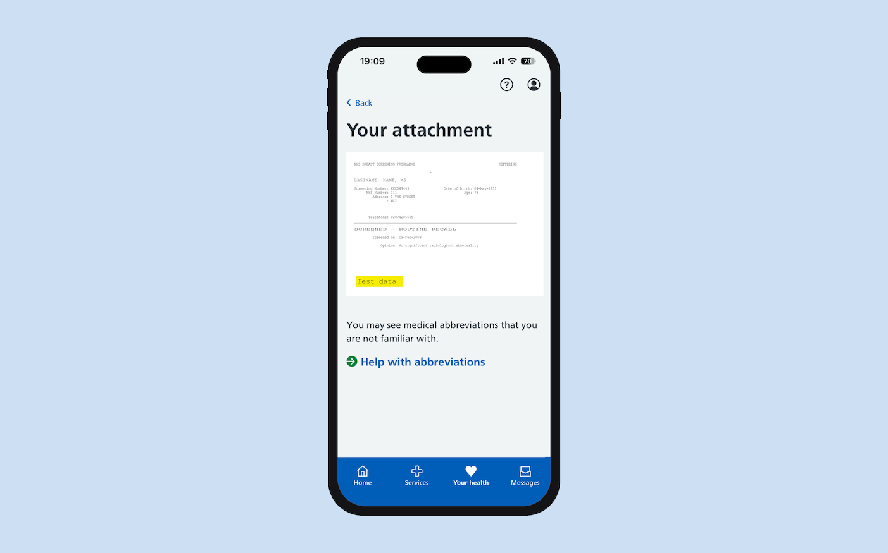

Breast screening results are [largely still sent as PDF and paper](../../../../explore-team/2025/03/what-we-learned-about-sharing-breast-and-bowel-results-with-gps/) to GP practices, where they are added to the patient record. 

## GP admin burden

Results sent in this way arrive uncoded, which means that practices cannot define software rules to process them automatically. The vast majority of breast screening results, approximately 97%, are normal and require no further action, so they can be auto-filed. This filing work is currently done manually by GP admin staff. This is important because this is what adds a breast screening result to the patient record, which can be seen on the NHS App. 

## Unreliable data limiting interventions

Different GP practices adopted different coding practices, and there is inconsistency nationally - not just across practices, but also within practices. Staff need training to achieve consistency, which adds to the [admin overhead](https://www.kingsfund.org.uk/insight-and-analysis/long-reads/lost-in-system-need-for-better-admin). One practice told us they discovered their inconsistent coding went back 15 years, which required a big piece of work to fix. When coding is incorrect, practices cannot find all people who have never been screened or who have not been attending. This has a direct link to health inequalities as participants from the most [deprived backgrounds are less likely to attend](https://breastcancernow.org/about-us/media/statements/we-respond-to-new-analysis-from-cancer-research-uk-revealing-that-cancer-death-rates-are-almost-60-higher-for-people-living-in-the-most-deprived-areas-of-the-uk). The lack of data means it’s harder to intervene. 

Cumulatively, this results in a lack of timely and accurate national data about who attends screening, how the screening programme leads to detection of cancer and what interventions could lead to improvements. 

## Poor participant experience

When [results are shown in the NHS App](../../../../managing-my-health/2026/07/helping-users-do-more-with-results/), SNOMED CT (Systematised nomenclature of medicine - clinical terms) codes like 'Breast neoplasm screening normal (finding)' can sometimes be externalised. This can be distressing, as some participants are worried this means they have cancer. 

It has been pointed out that breast screening is behind other programmes like, bowel cancer screening, that [already have their own SNOMED CT](../../04/before-integrating-with-GP-IT/) codes to denote screening results. 

## New codes for breast screening

The breast screening pathway team is proposing that we apply for new breast cancer screening SNOMED CT codes that: 

- are clearly-written, so they are understood by clinicians and participants
- clearly signal that these are the results of the national breast screening programme
- serve the immediate needs of Rubie (Run breast screening in England) development
- are extendable to include other uses in the future

An example of such a code could be: `Breast cancer screening national programme - normal (finding)`

## We will need to decide

- which new SNOMED CT codes to create
- which existing SNOMED CT codes to adopt
- which bits of data do not require a SNOMED CT code, and can be passed as a message instead
- whether we want to point to further information, like phone numbers, for reassurance

## How we'll go about it

We will consult teams developing digital breast screening:

- [manage breast screening](../../../../manage-breast-screening/) - to understand breast screening outcomes they are designing into Rubie
- [cohort to clinic](../../../../cohort-to-clinic/) - to understand their needs, although this work feels less pertinent to this team
- breast content team - to help us write the text of the codes, striking a better balance between clinical nomenclature and usability

We will consult internal experts:

- the programme team
- clinicians
- colleagues involved in past work

We will consult GPs:

- GP contacts 
- various GP committees and forums

We will also consult breast screening participants about their experience of seeing their results. 

We will apply to SNOMED CT, hoping for an initial set of breast screening SNOMED CT codes to be published by April 2027. 