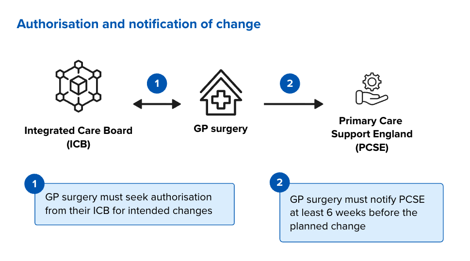
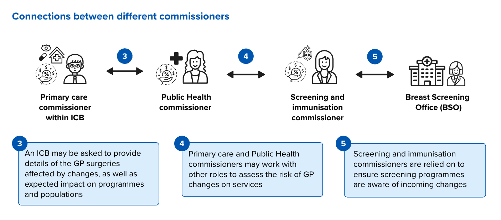
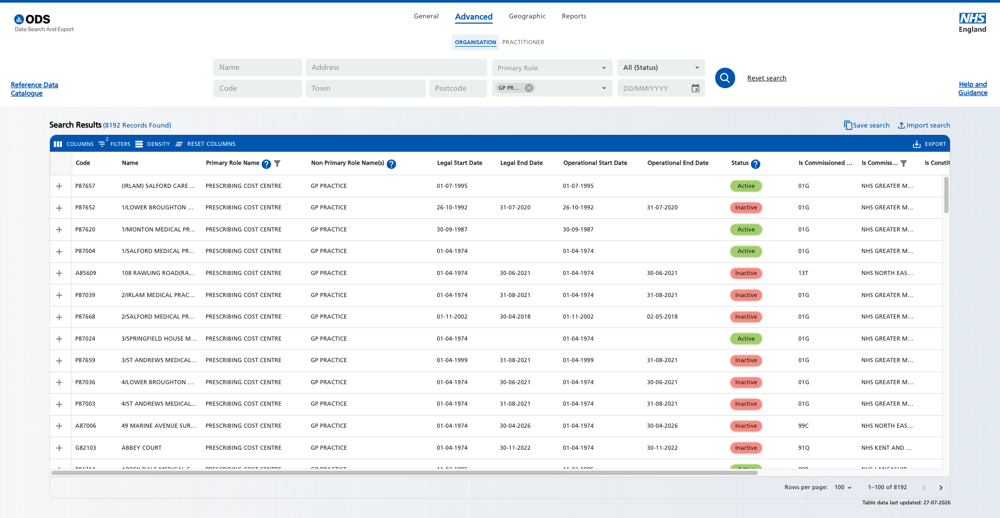
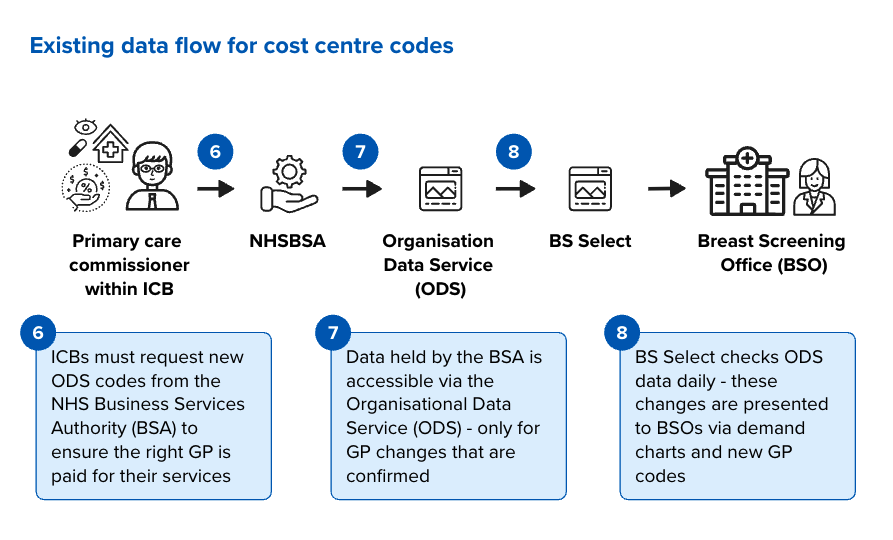

We investigated whether BSOs could find out about GP surgery changes earlier. We found that this is unlikely because proposed changes are commercially sensitive and local communication processes vary. 

## Why GP surgery changes matter? 

Prior research into capacity planning in breast screening highlighted that breast screening offices (BSOs) can often face sudden surges in demand. This is because: 

1. BSOs tend to organise their screening location and duration around the population attached to specific GP codes. 
2. BSOs plan in 3-year rounds with estimates presented in BS Select. Planning involves matching their capacity to demand and “smoothing the peaks” - this involves inviting participants earlier to avoid a breach in their due date. 
3. When GP surgeries open, merge, or close, populations move between GP codes. This can increase the number of eligible people in an area. 

The pathway team investigated whether BSOs could find out about GP surgery changes earlier, so they could plan for changes in demand. 

### How mergers and closures take place 

Over the last decade, there has been a trend for GP surgeries merging to form larger practices. [^1] These larger GP surgeries may include several offices and can cover completely different geographical areas. 

> Between 2013 and 2023, the number of general practices fell by 20% from 8044 to 6419; the average practice list size increase by 40% from 6967 to 9724 patients. The total population covered by providers with over 100 000 registered patients reached 2.3 million in 2023 compared to 0.5 million in 2017.
> -- Pettigrew LM, Petersen I, Mays N, et al

[^1]: [Pettigrew LM, Petersen I, Mays N, et al: The changing shape of English general practice: a retrospective longitudinal study using national datasets describing trends in organisational structure, workforce and recorded appointments](https://bmjopen.bmj.com/content/14/8/e081535)

GP surgery closures and mergers are commercially sensitive. It can take years for a decision to complete. An agreement can fall through even after years of work. This means the intention to close or merge may not be reliable until the agreement is finalised. This may explain why BSOs find these changes quite sudden. 

### GPs seek authorisation for the change 

Integrated Care Boards (ICBs) are the primary care commissioners. They hold the contracts with GPs and ensure access to care for the public, and access to funds for providers. They are the first to be notified of intended changes. 

A GP surgery must seek authorisation from their ICB to make any changes. ICBs must complete section 3 of the [Practice Mergers and Closures notification form](https://pcse.england.nhs.uk/services/practice-mergers-and-closures) used to notify Primary Care Support England (PCSE) at least 6 weeks before the planned change.  

### Programme risk assessment  

A primary care commissioner within an ICB may have an agreement with the public health/improvement commissioners for their region. As ICBs and public health commissioners cover a range of programmes, we expect the approach to this will vary across England.  

One discussion with public health commissioners highlighted the importance of relationships between ICBs and public health to ensure changes to GPs are communicated as early as possible. We were shown a risk assessment pro forma; filled in by an ICB, and used by public health commissioners and affected programmes to assess risks to service delivery. For example, where a service may not have the capacity to take on a substantial increase in population. 

Once changes are confirmed, primary care commissioners within the ICB are expected to notify public health commissioners, who in turn notify affected Trusts, Programme and Service managers, including Screening and Immunisation commissioners. 

### Raising awareness and planning for change 

Data about GP changes seems to exist offline via word documents and email communication.  

Once a change is confirmed, an ICB can request changes to prescription cost centres. This ensures funds are allocated correctly to providers. The NHS Business Services Authority (NHSBSA) is responsible for managing prescription codes.  

These codes are shared with the [Organisational Data Service (ODS)](https://www.odsdatasearchandexport.nhs.uk/), which is why we may hear users refer to “ODS codes” for GPs. 

BS Select, a tool used by BSOs to plan their service delivery, will check ODS daily to ensure up to date GP codes are presented to users. This is where we heard about “population spikes” in [earlier research into forecasting and planning](/breast-screening-pathway/2026/03/what-bsos-told-us-about-forecasting-and-planning/).  

## How new practices are created 

A new GP practice being set up is a much rarer event than a merger or closure. 

A new surgery may be required when the population is expected to increase enough that it is needed. This might be cited in an area’s [Local Plan](https://www.gov.uk/government/publications/new-homes-fact-sheet-4-new-homes-and-healthcare-facilities/fact-sheet-4-new-homes-and-healthcare-facilities) or could be recommended by the ICB in response to increasing demand. 

In this case, an ICB will have completed a business case to support setting up a new GP surgery. The new surgery will need to register with the Care Quality Commission (CQC) by completing a 77 page registration form. This process is rigorous and should only be started once the locations and staff are in place to provide the service.  

The registration process can take months and may include a CQC visit. [^2] 

[^2]: [CQC website](https://www.cqc.org.uk/guidance-regulation/registration/register-provider) 

Notifying commissioners and services will follow a similar process to mergers. However, we know at present that a completely new ODS code requires additional background work in breast screening: 
* Cohort Manager raises an exception when a participant update is received from Cohorting as a Service (CaaS) that includes a GP practice that is not mapped to a BSO. 
* BS Select 2nd line support resolves the exception by searching for the GP practice in ODS. They pull the practice name and address into BS Select and link the practice to a BSO. 
* Sometimes the BSO is obvious based on the GP practices postcode, other times 2nd line support will agree with the BSO or Breast Screening Programme where to link the practice. 

## National processes exist, but local communication varies 

Sharing information about changes to GP surgeries relies on a mix of formal notifications to regulators and arm's length bodies, as well as informal communication between commissioning roles at a local, regional and national level. 

GP mergers, closures, or new GP surgeries are not a routine or predictable occurrence, which could also influence how and when information is shared. 

We know commissioners and programmes value this information but accessing it can rely on them knowing who to contact in an ICB if they do not receive updates automatically. This is made more difficult when there are national restructures, such as the change from CCGs to ICBs, or the requirement for ICBs to cut running costs by 50% by October 2026. [^3] These restructures impact service boundaries and responsibilities and make it harder to maintain established relationships across commissioning boundaries. 

[^3]: [The King's Fund article on ICB cuts and what they could mean](https://www.kingsfund.org.uk/insight-and-analysis/blogs/icb-cuts-what-does-it-mean)

Another area we expect there to be inconsistency is how service providers, such as BSOs, find out about GP changes. While we know in some regions there are standard operating procedures (SOPs) for commissioners to share updates with affected services, we do not know if this is consistent nationally.  

## Conclusions 

GP surgery changes are commercially sensitive. Information about proposed changes may not be reliable until the change is confirmed. 

We do not think it is possible to reliably identify GP surgery changes earlier through national data. 

There may be two opportunities to improve the current experience:  
1. Support commissioners to create consistent SOPs for sharing GP surgery changes. 
2. Provide tools to help BSOs manage peaks in demand. 

The more organisations involved, the harder it may be to keep communication routes consistent. 

