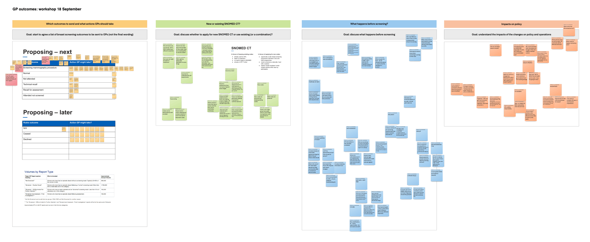

As part of designing Rubie, we want to send breast screening outcomes to the GP record in a structured digital format. To help with this, we ran an internal workshop with colleagues representing clinical, digital and policy perspectives. 

We wanted to consider how best to use [SNOMED CT](https://digital.nhs.uk/services/terminology-and-classifications/snomed-ct) to communicate useful information to GPs from the breast screening programme. We also wanted to look beyond the initial implementation to later enhancements in communication between GPs and Rubie.  

What we discussed reflects our understanding now. Our recommendations may change as we continue to engage clinical and policy experts, and gather more evidence. Some points we discussed remain ideas that will need to be fleshed out and taken through formal approval processes. 

In the workshop there was agreement that we should: 

- have a separate SNOMED CT concept for the mammography procedure from the national breast screening programme 
- apply for new SNOMED CT concepts for the national breast screening programme up to the assessment outcome (normal or referred to treatment)

## Why a new mammography procedure concept 

A separate concept will help distinguish mammograms taken as part of the national screening programme from those taken for other reasons. For example, mammograms may be taken because of symptoms, as part of follow-up after surgery to check for recurrence of cancer or for a small number of other reasons. We believe that reflecting these differences in SNOMED CT concepts will give GPs useful context.  

How often someone is invited depends on why they're being invited, which makes it hard to work out when their next appointment is due. Participants may expect their GP to know this. In the future, we anticipate we will need to distinguish very high risk (VHR) screening from routine screening, and find a way to show GPs the different invitation intervals. 

## We do not need separate concepts for left and right breasts 

Indicating which breast a suspected abnormality is in does not alter management from the GP perspective. Ahead of an invitation to assessment, participants are not informed about which breast the areas of concern were seen in. This is to avoid the participant getting anxious about one breast in particular. Most critically, a participant would be concerned if, further along the pathway, the other breast became the focus. It is important not to fix expectations before the outcome of assessment is known.  

## Screening remit ends with assessment outcome 

The breast screening pathway ends when someone's assessment outcome is normal or when they are handed over to the treatment team following a cancer diagnosis. This transition needs to be properly designed so that care continues seamlessly. The outcome of assessment needs to be clearly communicated to the GP. 

Non-attendance at assessment needs special care. These are people with areas of concern requiring further tests, so engaging them is key. GPs and primary care teams already play an important role here. In the future, their communication can be better facilitated by Rubie.

## Pre-screening communications

[Guidance](https://www.gov.uk/government/publications/breast-screening-screening-office-management/breast-screening-screening-office-management#communications-with-gp-practices) requires breast screening offices (BSOs) to send pre-invitation packs to GPs 6 weeks before participants are invited.  

But a GP practice manager told us this either does not happen in their practice or happens inconsistently: 

> [!NOTE]
> “Breast screening can never tell us which of our patients they invited. We only get told when they didn’t attend, by which time it’s too late to encourage attendance, as vans might have left the area.” 

From the programme’s perspective, GP endorsement still helps improve uptake, even after non-attendance.  

BSOs expect GPs to respond with a list of participants who require reasonable adjustments. But BSOs told us they are also frustrated by inconsistent or missing responses. As one BSO put it: 

> [!NOTE]
> “We rely on GPs to know who is transgender, who’s had a mastectomy, and we get so little information. The data at the beginning would really help. They've been in GP land for 50 years before us, they must have a good picture.”  

Rubie should enable the kind of communication that is required by the guidance. This would lead to better screening attendance and a better participant experience.

Ideas we discussed included: 

- continuous communication with GPs 
- better join-up with other breast pathways (moderate risk, very high risk and symptomatic) 
- marking the pre-invite in someone's record, so GPs can target awareness-raising activities better

## Continuous, live view of someone’s needs

Even when BSOs get access needs data from GPs, this information can be unreliable. We should consider other ways of getting it, for example by asking the person directly or by integrating with electronic patient record (EPR) systems. This could tell us if someone has had a mastectomy - and so should not be invited or requires specific reasonable adjustments to support them to attend their appointment. 

Different solutions and integrations might be needed, including: 

- pre-screening questionnaire 
- GP IT 
- reasonable adjustment flag  
- EPR
- recording every mammogram taken in a single national register  
- private treatment records 
- cross-pathway data 
- pathology

It's important to retain information from one episode to the next and decide which source is authoritative for each type of data. Different types of pre-appointment information will have different implications, so each needs to be treated differently and retained accordingly. For example, a mastectomy is permanent but a frozen shoulder is temporary.

## Less laborious, more effective role for GPs

We'd like GPs to see the data they need to act on, and still be able to find other data they may want later. We can work with GPs to co-design a role in breast screening that is simpler, less manual and more effective for them. Saving time and effort on both sides could free up BSOs and GPs to spend more time on health promotion and other valuable work.