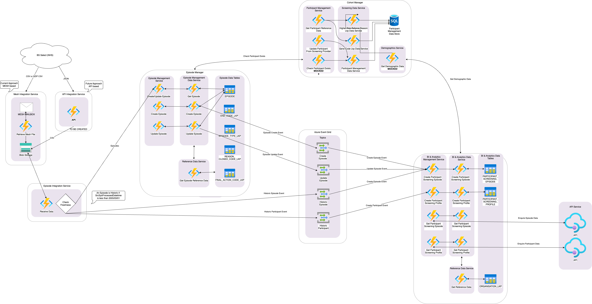

## Context

> [!NOTE]
> This work was completed by Team Analyse, which was disbanded in June 2025. Elements of the work will be carried forward by the newly formed Breast Screening Reporting team. Team Analyse supported reporting and analytics use cases with the goal of empowering staff with data and insights.

Here, we describe two experiments to move screening event data from source systems, through the National Screening Platform, and into a data warehouse. Such data pipelines form the basis of a strategic shift towards getting more out of our data.

The National Screening Platform (NSP) was part of the [Digital Transformation of Screening (DToS) programme](https://transform.england.nhs.uk/key-tools-and-info/digital-screening/).
An NHS England [accountability statement](https://assets.publishing.service.gov.uk/media/678f876da91b5e12ffef84c8/NHSE-annual-accountability-statement-public-health-functions-2022-to-2023.pdf) described the NSP as:

> digital and data capabilities and services to support all current and planned national screening programmes, replacing out-of-date technical and digital systems.

It used an event-driven architecture, where operational data was passed between systems in the form of business events.

The solution architecture is [here](https://nhsdigital.github.io/dtos-solution-architecture/structurizr/site/master/). Note however that, in June 2025, Digital Screening began to prioritise end-to-end service delivery over common design patterns (like NSP). So, we expect the architecture to develop in a more bottom-up approach rather than a top-down one.

Team Analyse supported reporting and analytics use cases (rather than operational ones). We spent the last quarter (2025-Q1) proving how best to move business events from NSP systems to a data warehouse to enable reporting and analytics. Pulling events from source systems through NSP was an integral part of the strategy to meet downstream use cases. These were to be delivered through the Federated Data Platform (FDP) reporting/dashboard suite.

We tried two common data pipeline patterns: Extract-Transform-Load (ETL), and Extract-Load-Transform (ELT). We found that ELT fit our use case better. More detail below.

## Pipeline approach 1: Extract, Transform, and Load

### Approach

Team Analyse built and tested an ETL MVP ('Release 0') pipeline. Code is in: [NHSDigital/dtos-service-insights](https://github.com/NHSDigital/dtos-service-insights). The low-level technical architecture is shown below.

Input data was Subject (aka Participant) and Episode data from BSSelect, read from a MESH mailbox. (The plan was to move to an API model, something akin to the Service Layer concept that came later.) Data was processed through a series of Azure Functions, **one event at a time**. Event schemas were validated, foreign keys were checked, and there were plans to integrate with Cohort Manager to get demographics data. Curated datasets were stored in a SQL Server database. Data would be served through an API.

We ended up with high-quality, enriched data that was in the new, NSP format, which was agnostic to screening programme.

### Results

Performance testing showed we could process 30,000 Episode rows in 45 minutes and 11,000 Subject rows in 2 minutes. The story was the same in both cases: Azure Functions are fast at processing a single event, but over the course of thousands of calls, overhead accumulates. This wasn’t quick enough. In production, we could expect one to two million messages (aka events) per month.

At around the same time as we did this testing, the target data warehouse changed from the Common Data Platform (CDP) to the Federated Data Platform. We factored in the new data warehouse target as well as the performance test results when designing our second pipeline test, which is explained below.

## Pipeline approach 2: Extract, Load and Transform

### Approach

Pipeline approach 1 (ETL) showed that moving data piecemeal through a data pipeline didn’t perform as well as a batch process might. We could also simplify the Episode and Subject processing logic, which would reduce complexity and save time. So, it made sense to take a step back and reassess our approach.

Team Analyse built and tested a second approach: an ELT pipeline. Code is in: [NHSDigital/dtos-analyse-data-pipeline](https://github.com/NHSDigital/dtos-analyse-data-pipeline).

Learning from approach 1, we decided on a KISS 'copy-paste' pipeline that would only ever see 'NSP-flavoured' business events (i.e. events where the source-system data schema had been remapped to the NSP data model), and all we had to do was write these events to a data warehouse for downstream processing into dashboards.

We built a faster, containerised pipeline (local and cloud, dev) to move messages:

1. From test BSSelect data source (local environment only) comprising:
   1. A database instance (dockerised Postgres) where record changes triggered events to be emitted to...
   2. An 'Event Poster' (dockerised Python app) that caught events and posted them to...
2. A (Team-Analyse-version of a) Service Layer (Azure Function App) that sent messages to...
3. A message bus (Azure Service Bus) that triggered...
4. A 'Foundry Relay' (Azure Function App) that received batches of messages and wrote them to...
5. The FDP data warehouse (Palantir Foundry)

The pipeline had basic tests, but they were not run in CI, and it had one end-to-end test that did run in CI.

It’s worth noting that the material part of the pipeline was the Foundry Relay (step 4). The Service Layer and central message bus (steps 2 and 3) were lightweight representations of other NSP components being built at the same time. The plan was to switch across to the real components later.

### Results

We ran:

1. A handful of events from step 1 to step 5 to prove we could move event data end-to-end.
2. 10,000 events from step 2 to step 5 in eight hours to get a benchmark time to process a realistic daily BSSelect load.
   1. Slow because the Foundry Relay was reading batches of 10 messages at a time.
3. 2,500,000 events from step 3 to step 5 in 3 hours to get a benchmark time to process a realistic monthly BSSelect load.
   1. Faster because the Foundry Relay was reading batches of 1,000 messages at a time.

## Next steps

As mentioned, in June 2025 Digital Screening began to prioritise end-to-end service delivery first. Team Analyse changed as part of this. Some of the core team went to support other products, like Select. The rest remained to form a new team, Breast Screening Reporting that focusses only on the breast screening pathway and will, in the first instance, dump cuts of data from source systems and restore them into FDP for downstream analytics.

The pipeline work described above will inform any future event data pipelines in this space.
