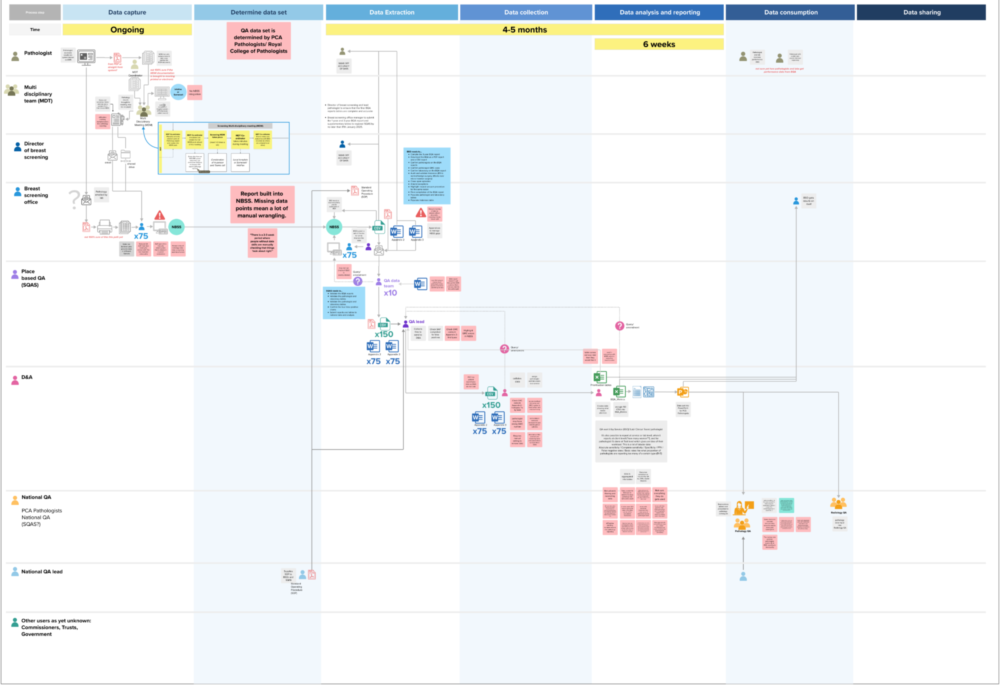

**Note: this work was completed by Team Analyse. It will be carried forward by the Breast Screening Pathway Team and/or Breast Screening Reporting.**

We were given a heads up that pathology reporting, specifically the Breast Screening Quality Assurance (BQA) report, would be a good place to create value quickly in breast screening reporting because the entire process is currently painfully manual.

## What is the BQA report?

When a clinician sees a lesion (an area they need to investigate) on a mammogram, a biopsy is taken and tested in a lab. The pathology lab creates a report from which data is manually entered into NBSS.

BQA collects this data and is part of the way the Breast Screening Programme:

- understands clinician and BSO performance
- identifies problems
- informs decisions to correct them

## Why it is worth looking at?

We believe there are opportunities here to:

- reduce manual work
- uplift the richness and accuracy of data
- create scalable value

## What we wanted to learn

We aimed to:

- better understand BQA reporting challenges and their impact
- identify the root causes of issues and current pain points
- form an opinion on how to make a significant improvement

## What we did

### Mapped the process

We mapped the process from data capture through to sharing of reports and analysis. This showed us where manual work is currently required, and where issues are arising in a complex process involving many people. This meant we could identify the opportunities to improve.

### Conducted interviews

We interviewed the two PCA (professional clinical advisor) pathologists who oversee quality assurance of pathology in breast screening to understand their perspective on the process and learn more about the data they need, including any gaps.

### Observed the process and the challenges on the ground

We visited 5 BSOs on multi-faceted research trips. This included looking at pathology reporting to understand variances between BSOs and the reality of this work in context.

### Collected examples to test with

Pathology reports (with identifying data removed) were collected to understand the original data that admin staff enter into the system. This helped us understand how much variation there is in the formatting of source data.

## What we found

Firstly we observed a variety of dedicated people doing their best to work with old systems. They have no choice but to spend a lot of time on arduous manual tasks to complete BQA reporting. Seeing passionate, dedicated, time-poor people having to complete painfully slow tasks that should not exist is a great motivator to create something better.

### PCA pathologists view

PCA pathologists represent the Royal College of Pathology and set the standards. They can tell that certain types of BQA data are problematic, despite the great effort by BSOs and QA teams, and this is due to challenges with the way data is currently captured. They also told us that NBSS has not kept pace with newer, more sophisticated technology meaning we are currently missing opportunities to improve our understanding.

There is no suggestion that admin staff are doing anything wrong. PCA pathologists know that BQA data is challenging and complex for admin staff and we cannot expect them all to get it right all the time.

Note that BQA data is entered after care decisions have been made in the Multi Disciplinary Team meeting (MDT) so these issues do not impact breast screening participants. Also, QA team view

### QA staff view

Due to system limitations such as lack of data validation local QA staff have to spend time manually checking data and BSOs need time to make any amendments, which need to be checked again. Because there is no central system, QA staff must manually collect, compile and submit data in CSV files and MS Word documents to D&A.

### D&A team view

The report currently takes approximately five months prepare due to the manual nature of checking and data collection. This means that analysis is delayed.

When they do receive the data, the D&A team are currently spending large amounts of time doing manual work checking, cleaning and reconciling data before it is usable. As one analyst said “it takes two weeks to do the report, which is ridiculous.”

### BSO view

#### Inputting data from pathology lab reports is stressful and time consuming

Smaller BSOs do not have dedicated data staff so this work is undertaken by people with multiple other tasks. They find this work very stressful as they are very aware that this is complex data that should not be interpreted. When seeking clarification some BSOs have no access to the pathologist who wrote the report.

Larger BSOs employ people whose only role is data entry – not just pathology data. Some of these staff are extremely experienced and it’s not a role that a person new to breast screening can easily step into.

#### Pathology lab reports are not consistent

BSO admin staff have to look through reports for the data they have to enter into NBSS. Some pathology reports are in a ‘storytelling’ style, others are what is known as ‘synoptic reports’. Synoptic reports echo the fields in the NBSS system, making it easier to find and enter the right data. The synoptic format would also be easier to extract data from with a digital tool.

**Replicas (without data) of: synoptic pathology report with structured data that mirrors NBSS fields (left), and the more common ‘storytelling’ report where admin staff need to hunt for the data they need (right)**

#### The annual reporting process is time consuming and manual

Manual work continues at BQA reporting time. BSOs need to:

- compile the 3-year BQA report
- download the BQA as a PDF report and a CSV report
- confirm pathologists on the BQA reports
- confirm pathologist GMC code
- confirm laboratory on the BQA report
- audit and validate Instances (B5 to normal/benign surgery, B5b to non/micro-invasive surgery)
- close open episodes
- amend exceptions
- highlight where there has been a repeat vacuum procedure for the same lesion
- create final compilation of the BSO BQA report
- populate pathologist and laboratory tables in an appendix
- populate Instances table in a second Appendix

BQA’s manual nature is causing a delay of 5 months between data collection and broader analysis.

## What we found in the end to end process

Many of causes of manual work for D&A originate at the manual data entry (data capture) stage. These include:

- entry fields available in NBSS not meeting all data entry needs
- NBSS report outputs don’t contain all the data that is useful
- data quality issues typical of manual data entry

### Key finding

By analysing the map and understanding the journey, we saw that if we were able to solve for data capture, many of the issues experienced later in the reporting process would no longer exist.

This would mean:

- ​reduced reporting time by approximately 5 months
- reduced or removed manual data entry in 75 BSOs - multiple hours saved, weekly
- reduced or removed manual work when collating BQA data at reporting time in 75 BSOs - multiple hours, - annually
- reduced or removed manual checking at reporting time – multiple hours, annually
- reduced or removed manual work and data wrangling by D&A team before analysis – multiple hours, annually
- enriched data set enabling a more complete analysis of pathology

There would also be the potential to:

- remove the triplication of manual data entry by three separate teams, saving multiple hours weekly across all Trusts
- test automated data capture for use in other parts of the NHS
- incentivise the use of synoptic reports which would provide more consistent, structured data

Other benefits of working with existing paper processes include:

- less reliance on third party change such as pathology labs and their systems
- being able to start now

The diagram shows how we might be able to streamline the process, reduce manual work and remove duplication.

## What’s next

BQA pathology reporting takes place in NBSS, a system that will now be replaced. The ‘reporting module’ shown in the above diagram could constitute part of this replacement. Therefore this work points to requirements of a new system.

The highest value place to start in transforming BQA pathology reporting would be to test ways to automate capture from paper to create a richer structured data set that is more consistent, accurate and usable with a very significant reduction in manual effort.

We need to:

- collect more samples of pathology reports to test with to appreciate the range of data inputs
- run controlled experiments to understand our ability to capture data consistently and accurately
- better understand the data that needs to be extracted, including the ability to extract a wider data set enabled by improved mammogram technology
- understand where the programme requires QA checking and involvement
- validate with stakeholders how many issues may be removed with automated data capture and which processes, such as documenting exceptions, may still be needed
- understand if redesigning capture might also meet the needs of the Cancer Registry and Trusts and reduce duplication of work
