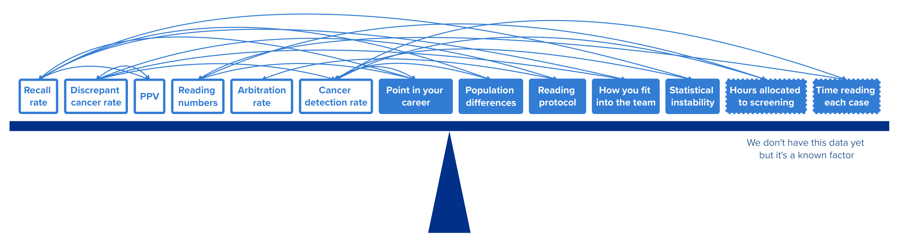

For more information on the design sprint and our data infrastructure choices, read [this introduction](https://design-history.prevention-services.nhs.uk/breast-screening-reporting/2026/04/re-designing-image-reading-data-reporting-to-stress-test-the-reporting-roadmap/).

## What we did

As part of our goal to replace the Breast Screening Information System (BSIS), we ran a design sprint to look at the Film Reading Quality Assurance (FRQA) report. Rather than creating a like-for-like replacement, we want to add insight and speed up data feedback where possible.

A range of stakeholders helped us understand the current state of image reading performance data, the context in which it is used, and the gaps and opportunities.

## What is FRQA and what is it for?

Trained clinicians closely examine mammograms with the intention of identifying any cancer present, a process known as image reading. Data from this process is recorded in the National Breast Screening System (NBSS) to form the FRQA report.

FRQA is central to understanding how well breast screening units and individual readers are performing, and it is used to identify where improvement is needed.

This report is mostly used by Directors of Breast Screening, image readers and the Screening Quality Assurance Service (SQAS).

> [!NOTE]
> Use of the word ‘film’ dates from when mammograms were printed on film. They are now 100% digital, so we use the term ‘image reading’. We use the word ‘film’ only when referring to the existing FRQA report.

## Where the data comes from and what BSIS does with it

The only way to create a national-level dataset is for each of the 75 Breast Screening Offices (BSOs) to run a report that extracts an Excel file from NBSS. These are then collected into a single dataset, either by an individual or by a software tool. In the case of annual FRQA reporting, each BSO uploads an Excel file into BSIS once a year.

BSIS then creates a series of tables, charts and graphs that cover a rolling 3 years of data.

In future there should be no need to continue manually extracting data from 75 separate systems, but until a new system is in place this is how we get the data we need.

## Highlights from what we learned

### Understanding performance can be like detective work

“How well are we reading images?” is a complex question to answer because there are so many variables at play. It is a bit like detective work, putting together clues to understand why a metric might look unusual.

Here are just a few of the variables that someone interpreting the data must consider:

- differences in the population screened, including possible skews in age, BMI and ethnicity
- what stage the reader is at in their career
- the skills mix in their team
- whether they have seen the other reader’s decision before recording their own
- how quickly they are reading cases

> [!NOTE]
> **Example**
>
> A reader may have a high recall rate. This could be because they are over-calling borderline cases, which is problematic because it risks causing unnecessary stress for participants. But a high recall rate could also be because of the physical realities of the population being screened. There may be a skew that increases recall rate in age, ethnicity, BMI or all 3.

Interpreting the data therefore requires knowledge of the programme and of the specific BSO context.

### Performance is a team sport

Readers have different strengths, so to be sure that cancer is identified to a satisfactory standard, at least 2 individuals will read an image. It is the unit’s decision, not the individual reader’s, that affects the participant. Because the performance of others in the team may influence an individual’s metrics, we have to look at performance in the context of the unit.

> [!NOTE]
> **Example**
>
> Reader A’s data shows a higher-than-average discrepant cancer rate. This metric shows when Reader A did not identify a cancer but another reader did. However, Reader A’s performance may be perfectly acceptable. The reason for the high discrepancy is that Reader B always spots the cancer that no one else in the team can, thereby driving up Reader A’s discrepant cancer rate.

### More timely data is not always usable data

There is a tension between the idea of getting an earlier heads-up on performance and the reality that some data is only statistically meaningful at higher volumes, and that takes time to accrue. Earlier data is not always an option.

### We can speed up some data feedback

While some data cannot be used earlier, we may be able to find a reliable proxy for some metrics.

One example of this is the cancer detection rate. We currently wait until cancer surgery data is finalised to confirm whether a participant who was recalled had cancer.

This gives us certainty, but it also means a delay of between 6 and 30 months between screening and outcome data, limiting a reader’s ability to take timely action if needed.

Alternatively, core needle biopsies predict cancer with a reported 97% accuracy. Therefore, if we can source this data in the interim, it would give an earlier indication of how well cancer is being identified and enable more prompt action.

### Saving time and adding insight for QA

There are several enhancements for QA that would:

- save the team time
- offer new insight
- improve usability

We expect to be able to speed up their work and, if we can source the data, deepen their insight.

### We can make it easier to monitor, compare and manage performance

As well as improving on the slow data feedback already mentioned, Directors of Breast Screening would be supported by the ability to more easily monitor, compare and cross-check the performance of their team.

Also important is the role directors of breast screening play in helping readers interpret their performance data and put it into context. New data tools need to support these conversations, not replace them.

### Image readers rely on others for data

When it comes to performance data, readers currently rely on their director of breast screening to download the report from BSIS annually, share it with them, and help them interpret it and take the right action.

They also do not have easy access to useful operational data such as progress towards reading targets. This is important because, to retain accreditation, they must read a minimum of 5,000 images per year, of which 1,500 must be first reads. Currently, they keep a rough tally in their heads because we cannot get the data out of the system in a timely way using current methods.

## What’s next?

The current programme already works well in terms of identifying cancer, but there are barriers to overcome that would enable teams to work smarter. We believe we can:

- support teams to identify issues earlier, reliably
- speed up the ability to take corrective action
- remove unnecessary manual labour
- offer better insight
- offer easier oversight

Instead of using a one-size-fits-all FRQA for readers, directors of breast screening and SQAS, we will consider different solutions to meet these different needs.

We’ll explore these options in our next posts, which will focus on distinct user groups.
