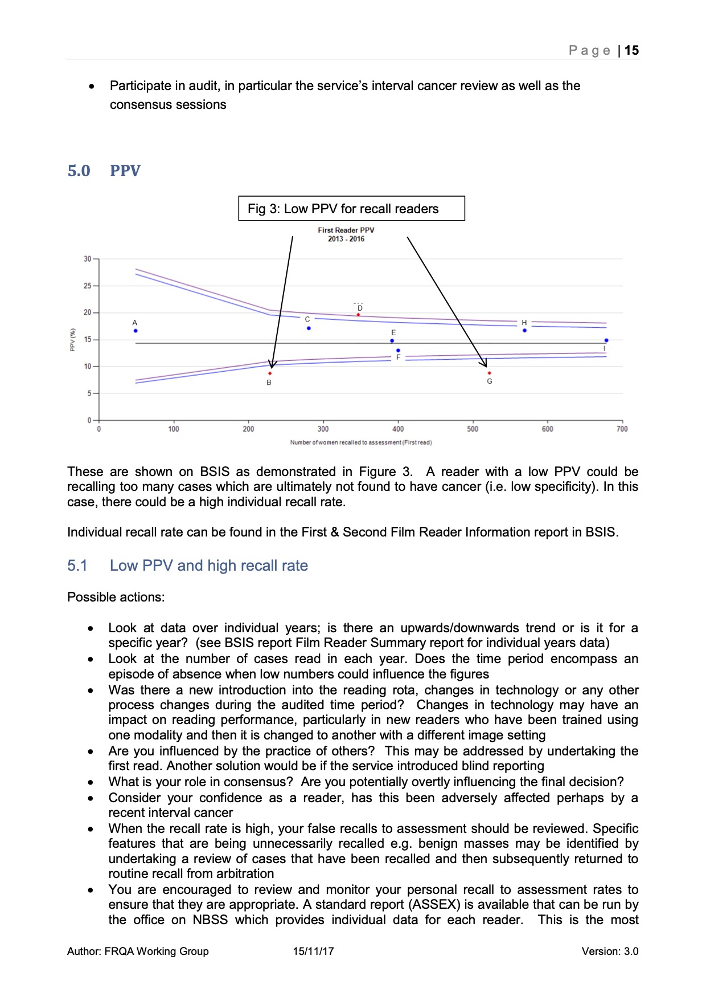
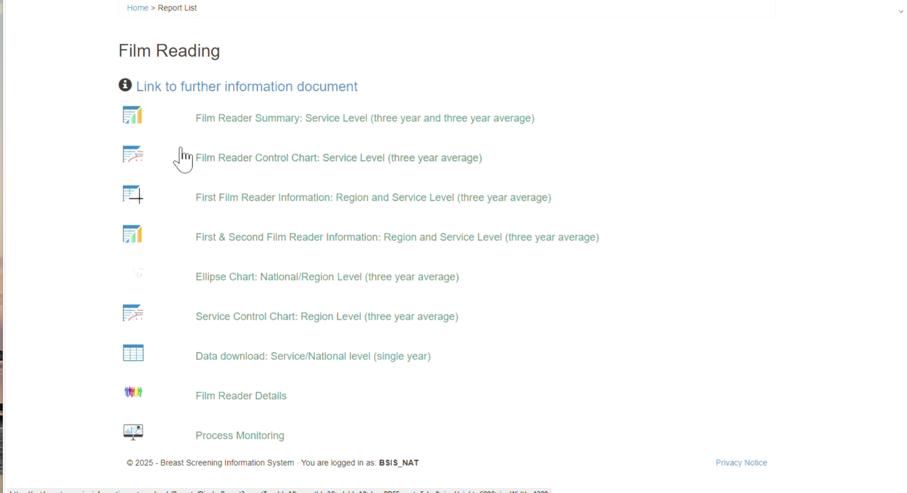
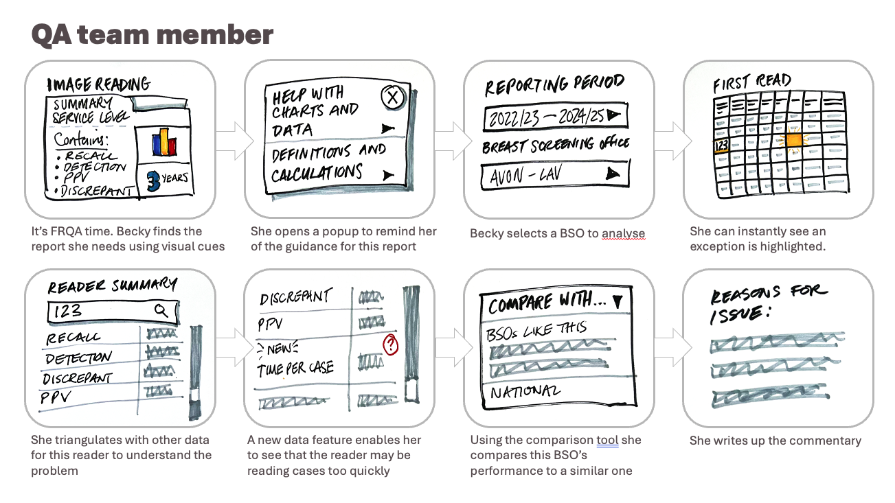

For more information on image reading data and performance, read [part 1](https://design-history.prevention-services.nhs.uk/breast-screening-reporting/2026/04/image-reading-part-1-data-and-performance/).

Part 3 will share our thoughts on supporting image readers and Directors of Breast Screening.

## Quality Assurance and film reading

Screening Quality Assurance Service (SQAS) teams examine the data to see how well Breast Screening Offices (BSOs) are meeting standards. There are often rational explanations for numbers looking worse than might be expected, but sometimes the numbers do indicate a problem. SQAS investigate and write a commentary to explain the situation and escalate if corrective action is needed.

To do this, SQAS use the annual Film Reading Quality Assurance (FRQA) report in the Breast Screening Information System (BSIS) to assess the programme’s performance.

We found 2 categories of improvements to FRQA that we hypothesise will:

- reduce manual work
- improve usability
- provide additional insight

## 1. Ways to package or present data

### Highlight exceptions

Highlighting numbers outside the norm would mean QA teams can direct their attention immediately where it is needed, saving them time.

### Guidance in context

QA teams currently search through a guidance document each year to find what is relevant to interpreting the data. Bringing this guidance into the report would mean they have what they need at their fingertips.

### Visual cues to support more fluid workflows

Currently, QA teams have to drill down into each subsection of the report to find what they are looking for. Adding visual cues would help them locate the data more quickly.

### An easy way to compare similar BSOs

QA teams would like to easily identify a BSO with similar characteristics so they can make useful comparisons.

### A longer period of rolling averages and the ability to see trends

Currently, data in BSIS shows 3 years of data. SQAS would like to see 6 years, with some of the data shown as trends.

### Better display of graphs

The team expressed a desire for better display of graphs. This is an area to explore.

### More ready-made graphs

QA teams currently download BSIS data to make their own graphs. Automating this would save time each year.

### Different views of the data

They would find it useful to have a Directorate or Management view and a Director or Lead Radiologist view of the data. We need to understand more about what this would look like.

### Better ways to compare reader performance

It would be helpful to be able to compare readers more easily, whether within the BSO or nationally.

### Monitor the impact of AI

With the Edith trial under way, it is likely that AI reading will be implemented. QA teams need a way to understand any impact on performance.

## 2. Additional data that would enhance QA’s ability to identify issues

### Arbitration data

QA teams need more data on arbitration to assess whether it is working well. There would be challenges in gaining insight from this data due to the number of arbitrated cases per year, but a new approach might help us understand how different ways of working impact cancer detection. This is something for our data scientists to look into.

### Reading targets

QA teams need data on how many readers are reaching their first and second read targets. The new NBSS system, currently known as Manage Your Breast Screening, is expected to begin collecting this.

### Performs data

Readers undergo tests using a platform called Performs. It would be helpful to have a way to demonstrate any correlations between this and real-world data. We can leverage previous discovery work when we look at this.

### Workforce data

Details of the staffing at a BSO would enable QA teams to understand performance better.

### Reading tenure

Knowing when readers qualified would enable QA teams to look at length of tenure and determine how it relates to performance.

### Breast features

It would be valuable to be able to analyse data according to features, such as mass, asymmetry, distortion, calcification, breast composition and degree of aggressiveness. This would also be useful to readers themselves. It may need aggregated data from several years to be meaningful.

### Data on trainees

Currently, trainees do not appear in the performance data in BSIS. There is a trainee status in the Role Based Access Control (RBAC) in the National Breast Screening System (NBSS), which may offer a way to surface this data.

### MRI data

No data is presented on MRI interpretation in the current system, but the very high risk programme is expanding and comparable information on reader performance would be helpful in enriching our understanding.

### Time taken per read and time of day

Currently, there is no way to analyse the impact on performance of the time it takes to read a case or the time of day the case was read. In future, we can offer this insight because the data will be recorded by Manage Your Breast Screening, the new NBSS system.

## What might the future look like?

We created a storyboard to illustrate a future where we can address several of these issues.

- Frame 1: Instead of having to manually open every report to see what is in it, QA teams are given visual cues to indicate the contents.

- Frame 2: Incorporating help and guidance into the report itself means SQAS would no longer have to search through a separate 32-page document looking for guidance relevant to the part of the report they are viewing.

- Frame 4: Highlighting exceptions would save SQAS from having to manually hunt through tables looking for numbers that fall outside the normal range, a process that currently requires deep experience to know what looks off.

- Frame 5: Rather than manually cross-referencing and searching through separate reports when investigating, this would save SQAS time by giving them an easy way to triangulate key metrics for each reader.

- Frame 6: Data on time taken per case is currently unavailable but is known to be a factor that affects quality. Surfacing this data would enable SQAS and other users to troubleshoot more quickly.

- Frame 7: There is currently no easy way to compare similar BSOs, but this is something SQAS would find valuable. This is a feature we are expecting to apply to multiple reports.

## What’s next?

Currently, we need to pause while we gain access to the data. When we return, we will start to dig into these needs to understand more about the value and the effort to deliver them. We will then prioritise based on desirability, feasibility and viability.

We also know that Team Manage are planning to collect more data on the reading process in Manage Your Breast Screening. This means we will be able to bring new metrics into the performance picture when they become available, potentially via the team’s pilot in Hull.
