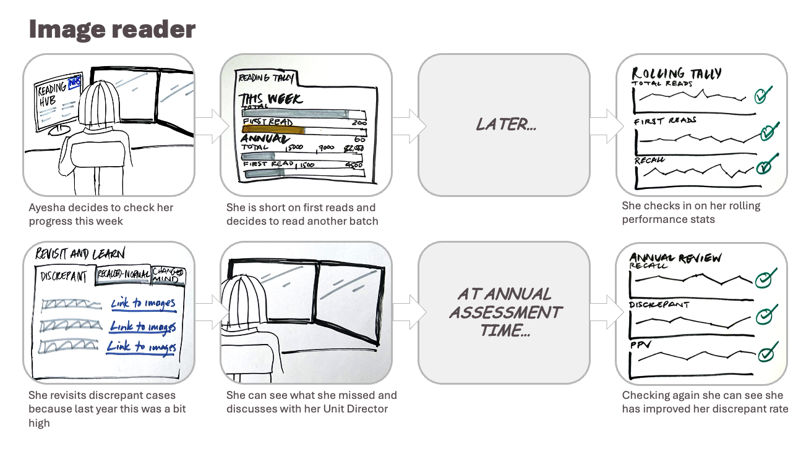
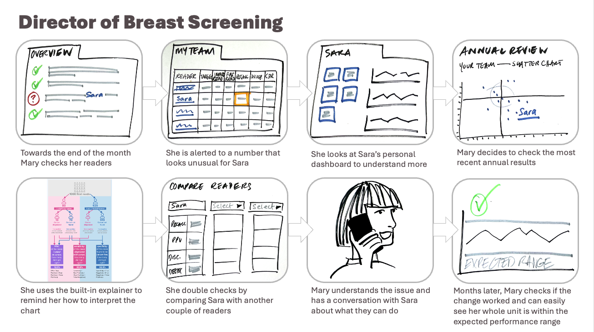

For more information on image reading data and performance, read [part 1](https://design-history.prevention-services.nhs.uk/breast-screening-reporting/2026/04/image-reading-part-1-data-and-performance/).

For our thoughts on supporting Screening Quality Assurance Service teams, read [part 2](https://design-history.prevention-services.nhs.uk/breast-screening-reporting/2026/04/image-reading-part-2-quality-assurance-teams/).

## The core users of image reading data

Image readers and Directors of Breast Screening use data to help them monitor performance and take action to improve. Currently, they mostly use the annual Film Reading Quality Assurance (FRQA) report in the Breast Screening Information System (BSIS), which has limitations and challenges.

In our design sprint, we learned about what is currently working well and where there are gaps and opportunities.

## Highlights from what we learned

### Numbers are people

> “Most of us know, ‘Oh, my God, I missed that one’.”
>
> -- Image reader

Image readers are highly aware that data represents people, and they feel it if they miss a cancer that another reader picked up, even though this is normal and to be expected sometimes. We need to be aware of the emotional impact of data and give them easier access to tools to help them improve. The challenge is to find the right balance.

### There are opportunities to reduce low-value manual work

Outside the annual FRQA reports in BSIS, some Directors of Breast Screening currently get data from their admin team via manual export from the National Breast Screening System (NBSS). We expect this data to be self-serve for Directors of Breast Screening in future. This is just one of many examples of the low-value manual processes we hope to alleviate.

> “People can’t access BSIS themselves so I have to go in and download it and email it to every reader.”
>
> — Director of Breast Screening 1

### There’s a difference between seeing data and comprehending it

For data to inform decision-making and drive improvement as intended, users must understand the data and its implications.

As mentioned in part 1, understanding performance is not straightforward because so many variables need to be considered. Image readers may misinterpret data if they are not supported to understand it in a conversation with the Director of Breast Screening.

> “Even as radiologists we don’t see specificity, sensitivity and PPV data that often. Then it’s for us to explain it to our teams, but I find myself looking it up.”
>
> — Director of Breast Screening 2

In addition, concepts and terminology used in breast screening are often derived from fields such as research and epidemiology and, in the case of FRQA, data users may not have encountered them for 12 months. It is not surprising that Directors of Breast Screening feel they need a refresher, but there is no obvious place to obtain this.

### More timely data is needed, but only if it is statistically reliable

While there is a thirst for more timely data to help understand performance and enable corrective action sooner, it would be wrong to simply supply all the data we will have access to. This is because:

- some data is only meaningful when we have a representative sample
- data from a small number of cases would be wildly inaccurate as an indicator of performance because it would be skewed by variation in the population screened
- if we automate the highlighting of exceptions with a small sample size, it would result in false alarms

One suggestion has been for a ‘per 1,000 reads’ measure, but only for certain metrics. Other metrics would require higher volumes of cases to become reliable.

There is also a risk of creating cognitive overload in a busy environment that should be focused on image reading. We need to consider the right location for data that is retrospective and focused on reflection and improvement.

> “Data is 18 months old sometimes by the time it’s validated and you’re able to act on it. So if you have issues and blips, you’re looking at it a long way down the line.”
>
> — Director of Breast Screening 1

We need to establish clearly, between breast screening and a professional statistician, how much of a deviation from the norm matters for each metric and what is statistically stable to play back at what volume of reads.

### We need to support learning and improvement

It is one thing to play back data, but another to learn from it. We need to link the 2 more closely. So if readers see data that says they have a few discrepant cancers — cancers they did not identify but which were picked up by another reader — they need an easy way to track back through images to learn from what they missed.

This is one of the key areas of value we can create over the current state.

### Easier access to data would enable more proactivity

Directors of Breast Screening currently have to request data from admin to check a team member’s performance if they suspect something is not right. More readily available data would enable them to be self-serve and proactive, ideally intervening sooner if needed.

### Directors of Breast Screening need data in different forms to readers

Directors of Breast Screening are interested in much of the same data as image readers, but they also need to keep an eye on demand and capacity, which requires a different view of the data.

They also have an interest in being able to compare:

- various metrics within their team, such as time allocated for each reader and how many images they would be expected to read
- their team with other BSOs, as well as with benchmarks and key performance indicators

### Performance is viewed in a team context

Performance of the whole team needs to be taken into account because it is never just one person reading an image. Having a clearer understanding of each reader’s strengths enables Directors of Breast Screening to better assess the work and for the team to learn from each other’s strengths. Readers themselves also need to view their performance in the context of the team.

> “When I’ve had data and it was dreadful, I rang my previous Director of Screening and said, ‘should I be doing this job?’ And they’ve said, ‘you are fine, we’re a team.’”
>
> — Director of Breast Screening 1

### The mental model of ‘How am I doing?’ includes different data types

The mental model attached to the question “How am I doing?” includes simple tallies, such as the number of first reads this week, as well as performance data that also addresses the question “How can I improve?”.

We will investigate options for displaying reporting data somewhere in the new system being built for image readers. This would reduce the number of systems used, creating a simpler and more time-saving workflow.

## What might the future look like?

We learned a lot about the specific metrics that image readers and Directors of Breast Screening would like to see. We’ll save those details for when we start developing new tools, but for now we have developed storyboards that bring multiple ideas together and imagine a more data-enabled future.

### Image reader storyboard: what’s different?

- **Frame 1 and 2:** This is already something that is not possible. Readers do not have easy access to data and often have to keep a rough tally in their heads.
- **Frame 4:** Readers currently have little or no access to data about how well they are doing until the annual FRQA report in BSIS. Having the ability to check in on how they are tracking sooner opens up more possibilities for improvement.
- **Frame 5:** Looking at performance data and then moving straight into learning by revisiting images where something was missed is currently not possible. This would be very valuable.
- **Frame 8:** The idea shown here is that, with better access to data and learning opportunities, a reader may be able to take corrective action and measure the results, reducing the likelihood of their performance going off track.

### Directors of Breast Screening storyboard: what’s different?

- **Frame 1:** Directors of Breast Screening do not currently have an easy way to get an overview of their team’s performance beyond the annual FRQA report. This idea would give them an easy overview and, if there had been a statistically significant drift for a reader, they would be alerted.
- **Frame 2 and 3:** These frames show the issue being highlighted in a summary table that gives the Director an easy way to dig deeper into an individual’s performance metrics if needed.
- **Frame 4:** This shows how, in future, extra information may be layered into charts and graphs to help users interpret the data more easily.
- **Frame 5:** This is an example of giving in-context support to help users interpret the data more easily.
- **Frame 6:** When looking into performance issues, Directors told us it would be useful to be able to compare a reader in their unit with a couple of others.
- **Frame 7:** This shows how these new data products would support conversations with team members, not replace them.
- **Frame 8:** Again, we would expect Directors to be able to intervene earlier, catching issues before they become a bigger problem. This also shows the concept of an ‘expected range’, which would be an easy way to understand whether performance is what we would expect.

## Our next steps

While readers and Directors of Breast Screening need better access to data, they do their jobs without it at the moment, so there is a balance to be achieved. We need more clarity on:

- the right type of data, rather than assuming ‘more is more’
- how and where to display day-to-day data versus data for performance reflection and learning
- the needs of other user groups, such as programme managers and professional clinical advisors

We will look into an easy-to-access, statistically stable self-improvement audit, with in-context support that helps data users interpret the data and take action when needed. We expect this to take the form of a summary, with a way to dig deeper for those who want it.

We will also need to find a way to understand what a new presentation of data does to unit and individual performance, and to monitor that closely. A pilot could help here.

Key to all of this is access to the right data and the legal basis to use it for this purpose, both of which are showing good progress.

For now, we will press pause until we can access the data we need to progress further.
