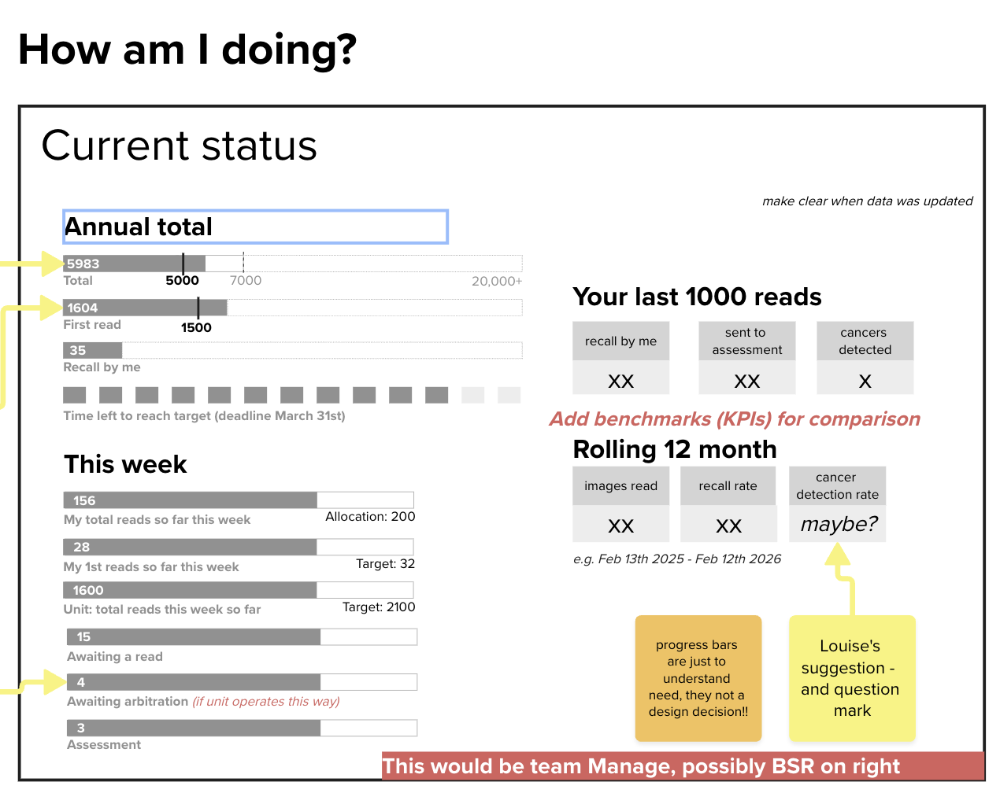
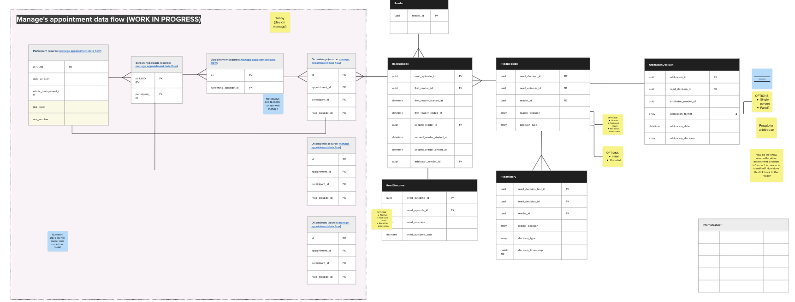
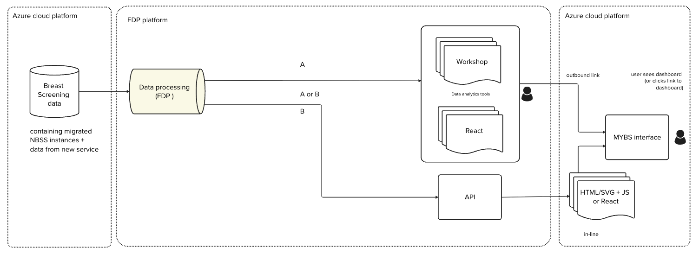
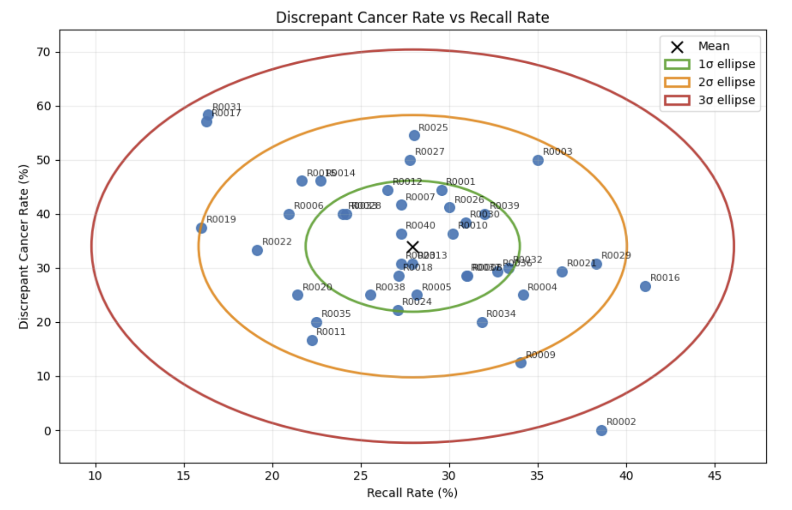

## Introduction

BSIS (Breast Screening Information Systems) primarily enables QA staff to monitor the safety of breast screening services. The FRQA (Film Reading Quality Assurance) report in BSIS, alongside the Interval Cancer report, is used mainly by image readers, unit directors and QA to understand image reading performance across services.

This work is helping us rethink image reading data reporting so that we can replace BSIS’ FRQA report and prepare for the future Breast Screening service. It also gives us a way to test the platform and tooling needed to replace other breast screening reports over time.

## Finding the right platform

As part of early testing, we explored using FDP (Federated Data Platform) for breast screening reporting. This helped us better understand how it supports our needs, particularly for user-facing dashboards.

We are now exploring where and how data should be presented so that it best meets the needs of screening users, including usability, accessibility and delivery speed.

## Why image reading is a useful stress test

FRQA represents the most complex reporting domain within BSIS, so it gave us a deliberate stress test for our future reporting approach. It involves complex logic and visualisations, the need to reconcile different instances of NBSS data, and 5 different user groups with different views of the data.

The new breast screening service also introduces additional needs. It is creating a dedicated digital workflow for image readers, including structured recording of image quality, batch reading and enhanced reader interfaces. The data generated will be richer, more timely and more structured than under NBSS, which creates an opportunity and a responsibility to rethink how image reading analysis is improved and replaced.

This work helps answer 2 connected questions:

- how do we safely replace FRQA for QA
- how can we redesign image reading data analysis in preparation for the new Breast Screening service

By tackling these questions early, we can better understand the platforms and tools needed for this use case, and de-risk the roadmap for replacing other BSIS reports.

## The design sprint

We ran a 10-day time-boxed design sprint to:

- map the underpinning logic and users of FRQA as it works today
- explore what modern image reading insight should look like, using visual concepts to test our thinking
- create a data model to validate requirements and the data needed in future
- test which data platform and visualisation tools could best support the solution
- create an early view of delivery steps and further work

## Understanding user needs and gaps

Across user groups, there is a need for more timely insight, better benchmarking against peers and national standards, clearer explanations of complex metrics, easier access to definitions and standards, improved visibility of trends over time, and better workload visibility.

There is also a need for more actionable insight. Users find BSIS difficult to access, with limited interactivity and static reports that make information harder to explore and interpret. FRQA and similar reports were designed mainly for QA oversight and reconciliation, which means image readers and unit directors are often underserved.

## Testing visual concepts

During the sprint, we prioritised the needs of image readers, screening directors and QA. Image readers and screening directors are currently more underserved and need more frequent access to performance insight, so we designed visual concepts tailored to their needs to better understand their data requirements.

For QA users, we focused on recreating the most complex FRQA infographics with improved interactivity through technical exploration.

## A common data model

Identifying KPIs for each user group helped us create an early data model for future image reading reporting. This helped confirm the fields and formats required, the identifiers needed, and the synthetic data needed to test platforms and visualisation tools.

It also helped us think through how future dashboards might use critical data such as when image reading took place and the decisions taken during arbitration.

## Technical exploration

We drafted a data flow diagram to review feasibility with Information Governance and architects. Using synthetic data, we tested visualisation tools to recreate KPIs and complex QA charts while refining the data model.

We compared FDP’s visualisation tools with Azure-based options, including default dashboarding tools, open-source options and custom web builds. We also explored whether data processed in one platform could serve dashboards both within the image reader workflow and in a separate location for QA users who need to review multiple dashboards in one place.

## What we found

Based on our testing so far, Azure-based platforms and code-driven visualisation tools better supported the requirements of image reading analysis.

This is because they better support:

- a single source of truth, by keeping reporting closer to the source data used by the new breast screening service
- user interface flexibility, including the ability to embed dashboards more easily within the new service interface
- efficient development, with greater scope to iterate, duplicate dashboards and create custom visualisations more quickly

## What happens next

We are now testing some of the riskiest assumptions in the proposed architecture and plan of work. This includes reviewing the direction with stakeholders and QA, working with teams building the new Breast Screening service, and evaluating the critical needs for a secure and scalable data platform.

The next major step is developing the Performance Viewer dashboard. This is a prototype designed in an earlier sprint that uses fields from BS Select to show higher-level metrics and demographic breakdowns in one dashboard. It is intended to replace invitation monitoring, KC63, deprivation reports in BSIS and other platforms, while also helping establish our ways of working in Azure.

## Looking further ahead

The image reading dashboards will require a clearer understanding of the fields we can extract from NBSS, how we extract them and how we calculate the required measures. We expect to begin with pilot dashboards for a small number of services, then expand incrementally as more NBSS data can be integrated and automated.

Over time, this work will help us replace FRQA for QA, improve reporting for services, and create better principles and standards for image reading data across the future Breast Screening service.
