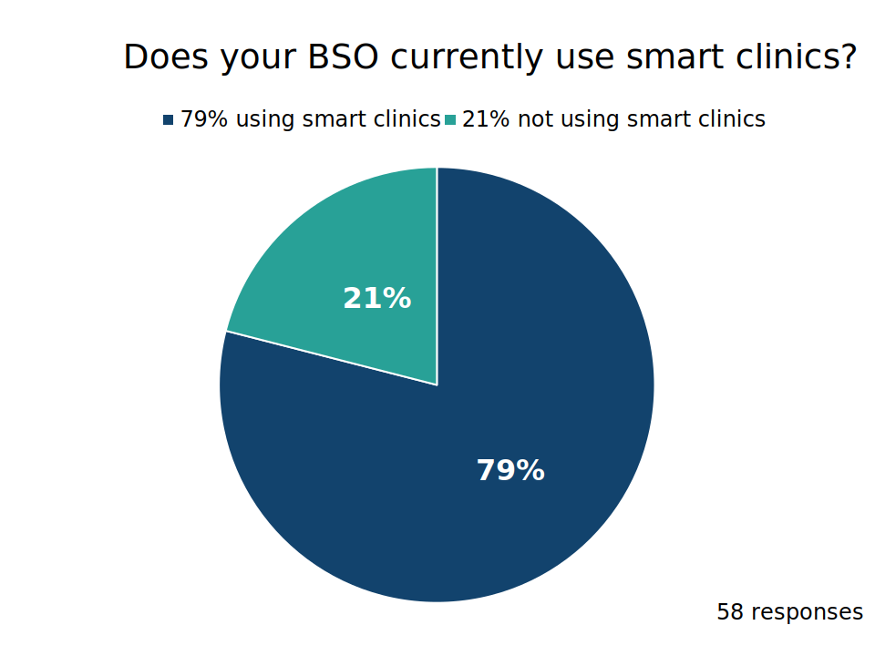

From our previous research with Breast Screening Offices (BSOs), we learned that many use a feature of the National Breast Screening System (NBSS) called 'smart clinics' to help them optimise their capacity.

We sent a short survey to BSOs to understand their experiences with smart clinics and, for those not using them, alternative approaches to optimising capacity.

Our research found that many BSOs value smart clinics because they help manage capacity, but many also told us the feature is not reliable enough to use with confidence.

This design history shares what we learned.

## What are smart clinics?
Smart clinics use previous attendance history and other information about participants to estimate how likely someone is to attend an appointment. The system then calculates an attendance probability for each participant, which it uses to overbook clinics. This means more than one participant may be booked into the same slot if the system expects some people won’t attend.

Overbooking enables BSOs to invite more participants in a period and reduce wasted capacity from non-attendance, meaning they can use their capacity more effectively.

## How many BSOs use smart clinics?
We asked respondents whether their BSO currently uses smart clinics. Of the 58 people who responded, 79% said their BSO uses smart clinics. While this doesn’t represent every BSO, it suggests smart clinics are widely used among services.

## Benefits of smart clinics
Smart clinics are seen as a valuable tool for helping BSOs use their capacity more efficiently and meet the round length target, which measures the proportion of participants invited within 36 months of their last episode. 

Round length is defined as the time between breast screening episodes. It is calculated using the time between the date of first offered appointment given to a participant in their current screening episode, and the date of their first offered appointment from their previous screening episode.

We’ve heard from previous research that many BSOs feel they don’t have sufficient capacity to be able to screen all of their eligible population within a 36-month round. Smart clinics can help with this by allowing BSOs to invite their eligible population in a shorter timeframe.

BSOs told us that when smart clinics work well, they can help relieve some of the pressures around meeting round length targets. However, many of those who use smart clinics noted limitations with their reliability. 

## Problems with smart clinics

### Unreliable probabilities
Responses highlighted that COVID-19 impacted the reliability of attendance probabilities. 

During this time, many BSOs switched to open invitations, which invite participants to contact the service to book their appointment. Open invitations are generally considered worse for uptake than inviting participants to timed appointments so this shift, coupled with the impact of COVID-19 on people’s behaviours, resulted in low attendance during this time. 

This period of lower attendance has impacted attendance probabilities for some participants. But BSO responses suggest people’s behaviours during COVID-19 aren’t good reflections or predictors of behaviours now, and many participants who didn’t attend during the pandemic are now attending their appointments.

This means smart clinics may be using attendance probabilities that are too low, which could result in too many people being booked into the same clinic or timeslot.

### Issues with first-time invitees
We heard from BSOs that there are particular issues with the algorithm's accuracy for participants being invited for the first time, who tend to be given lower attendance probabilities.  We heard that attendance among first-time invitees tends to be relatively good and, as a result, BSOs feel they should be given higher probabilities.

BSOs also told us they don’t understand how attendance probabilities are calculated, particularly for participants being invited for the first time who have no appointment history. We heard that two first-time invitees can have totally different attendance probabilities, despite never having attended before, which is confusing for BSOs and contributes to feelings of distrust.

### Uneven attendance
For BSOs using smart clinics, issues with the accuracy of attendance probabilities can lead to uneven overbooking and thus attendance levels across clinics.

In particular, BSOs told us about experiences with periods of high over-attendance and very low attendance, creating peaks and troughs of work for staff. We heard that BSOs regularly see more participants attending than they have capacity for, which can cause stress and increase the risk of repetitive strain injury (RSI) for radiographers. This may even negatively impact image quality as staff try to perform the screening in less time.

Over-attendance at clinics can also impact the participant experience. BSOs told us this can cause anxiety for participants, who may have to wait longer for their appointment, and can make it harder for staff to give the level of experience for participants they strive to provide.

## Mitigating issues
Some BSOs have put measures in place to try to mitigate the challenges they face with smart clinics. These include:
- reducing the number of appointment slots in smart clinics to leave some leeway in case attendance exceeds the level expected
- reviewing how smart clinics have booked participants into slots and manually moving participants around where they feel slots are too overbooked or think issues could occur
- scheduling dedicated break slots in the clinic, which can function as buffers so they can catch up if more participants attend than expected

While these approaches can help limit some of the issues BSOs face, they lead to additional manual effort for admin staff who are putting these mitigations in place.

## Alternative approaches to optimising capacity
For respondents who don’t currently use smart clinics, many had used them in the past but stopped. Reasons for this tended to centre around previous bad experiences with over-attendance, suggesting their rationale for not using it was driven by reliability issues, rather than the functionality not offering value.

Among those not using smart clinics, other methods of optimising capacity employed include:
- manually overbooking clinics by shortening appointment lengths and inviting more participants than they have capacity to screen
- allocating participants to appointments in the order of who is due soonest to help ensure they meet their 36-month round length target
- running dedicated clinics for participants who are considered less likely to attend, such as participants who are being re-invited after not attending their first appointment in that round, and participants with a history of repeatedly not attending

## What’s next?
Regardless of whether BSOs are using smart clinics or employing other optimisation approaches, we heard that there’s a consistent need for a reliable way to optimise capacity so that BSOs can efficiently meet their demand.

With this in mind, we recognise there will be a need for the new national breast screening service, [Rubie](/breast-screening-pathway/2026/05/naming-new-breast-screening-service/), to provide functionality to support overbooking in future. 

Before we start trying to design what this might look like, we need to first better understand how the current algorithm and attendance probabilities work from a technical perspective. This understanding will help inform thinking around how we might provide a reliable way for BSOs to manage and optimise their capacity in future.
