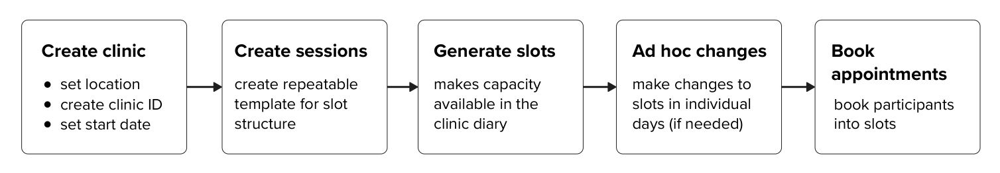
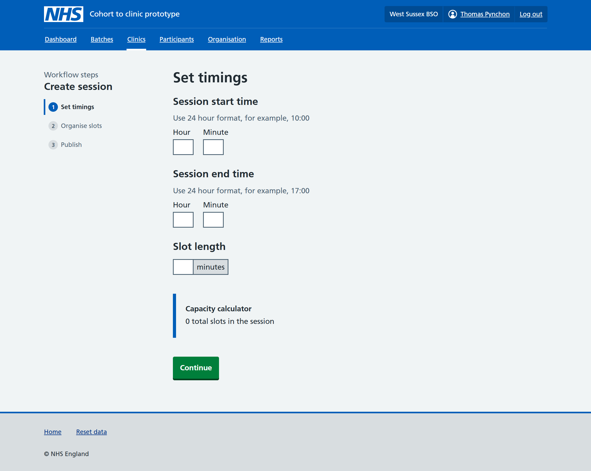
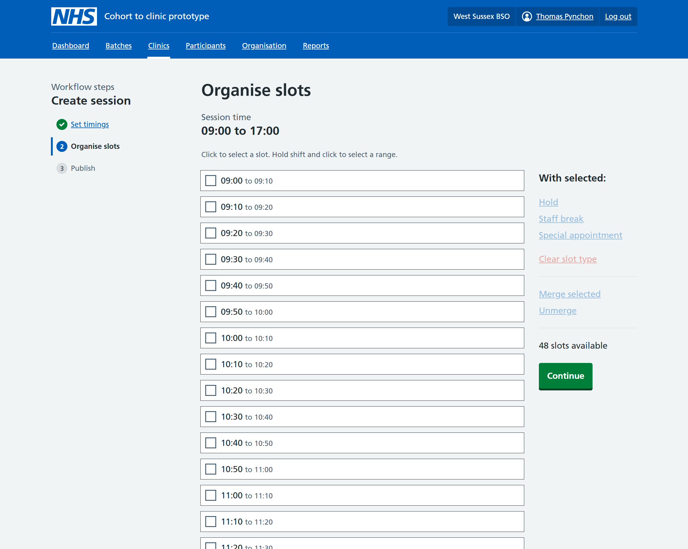

As part of creating clinics, breast screening offices (BSOs) need to define the structure of appointment slots to be used in their clinic days before they start inviting participants. In the current National Breast Screening System (NBSS), the reusable template containing this structure is known as a session.  

In NBSS, BSOs can create templates for a particular day within a clinic, such as a repeating Monday. This can be duplicated for other days in the same clinic, however it isn’t possible to apply a single template to multiple weekdays or reuse it in other clinics.

We want to design a more flexible model for Rubie, which allows BSOs to create clinic session templates that can be applied to any day of the week and reused in other clinics.  

Testing showed that BSOs need to manage two separate aspects of clinic capacity at multiple stages of the clinic creation journey: whether a slot can be booked, and what that slot is intended for. This distinction will inform how we design reusable clinic templates and manage capacity elsewhere in Rubie. 

This design history shares what we learned about managing capacity.

## What we already knew
We learned from our discovery research that BSOs sometimes make changes to the status of slots within clinics – for example, blocking out time for staff breaks or holding back capacity for rebookings. 

In NBSS, users can take two main actions on a slot: 
- stopping the slot - temporarily holding capacity that is generally intended to be used later 
- cancelling the slot - removing capacity they don’t intend to use 

We heard from BSOs that one of the main reasons for stopping slots is to hold capacity after a special appointment to create a double or longer-length slot. This is because there’s no way to combine slots together to form a longer appointment in NBSS.  

We had also understood that BSOs sometimes remove slots for staff breaks, but we were less clear on other reasons they may need to do this. 

NBSS only enables users to stop or cancel slots within individual days in the schedule. This means that if BSOs have a regular pattern of stopped or cancelled slots, they would have to go into each day individually and repeat this action manually. 

## Design hypotheses
We thought it might be helpful for BSOs to have the ability to change the status of slots as part of setting up clinic templates to reduce the manual effort involved in making these changes to each day individually.  

We tested early designs for creating a reusable session template with 6 BSO users to get early feedback on these ideas and identify where more functionality may be needed. 

<table style="background-color: white; border-collapse: collapse;">
  <tr>
    <td style="background-color: white; padding: 10px;">
    
    </td>
  <td style="background-color: white; padding: 10px;">
    
    </td>
  <tr>
    <td colspan="2"
      style="background-color: white;
              padding: 10px;
              padding-left: 15px;
              text-align: left;
              font-size: 0.85em;
              border: none;">
        Screenshots of the two consecutive prototype screens tested
    </td>
  </tr>
</table>

We tested giving users the ability to hold slots and label capacity as staff breaks and special appointments. We also tested introducing the ability to merge slots to form longer appointments, which we will explore in a separate design history. 

## What we learned
### BSOs need control over whether capacity is bookable
Testing highlighted a range of practices amongst BSOs when setting up clinics. Some made few or no changes to slots, others set aside occasional slots for breaks or ad hoc activities, whereas some labelled all slots with their intended purpose to differentiate between slots to book batches of participants into and capacity reserved for other purposes. 

Despite this variation, the underlying needs were consistent: BSOs need to control whether capacity is bookable and communicate what it is intended for. 

NBSS doesn’t support holding or labelling slots when creating templates, and few of the BSOs we tested with take the approach of setting capacity aside in advance. However, this doesn’t necessarily indicate functionality wouldn’t be useful as current practices may be shaped by limitations of the current system. 

BSOs we tested with welcomed this functionality, particularly those that currently configure slots in advance and must make changes to each day manually. Allowing them to hold and remove slots within templates could reduce this manual effort, however further research is needed to understand how this functionality might influence ways of working in other BSOs. 

### BSOs need to distinguish between slot status and purpose
BSOs told us there are many reasons they may need to hold or cancel slots in clinics. These include: 
- rebookings 
- web rebookings 
- staff breaks 
- catch-up time 
- quality assurance
- staff meetings
- technical recalls 
- very high risk (VHR) appointments 
- designating slots for booking [participants from batches](/breast-screening-pathway/2025/12/understanding-batching/) into 

Depending on local practices, some of these reasons may be actioned using hold or cancel.  

Testing highlighted that the status of a slot alone doesn’t tell BSOs why the capacity has been reserved or removed, and that held and removed capacity have distinct intentions.  

Held slots are considered usable capacity so BSOs need to know why the capacity has been reserved so it can be used for its intended purpose later – for example, if a slot has been held for rebookings, they need to know that’s its intended purpose so team members dealing with participant phone calls know they can rebook a participant into that slot. 

On the other hand, removed slots represent capacity the BSO doesn’t plan to use later and therefore shouldn’t be included in the available capacity or made bookable.  

This suggests we need to offer BSOs two key functions: 
- a way to change the status of a slot, i.e. to make it available, held or removed 
- a way to label slots with their purpose so users know how the slot should be used and whether it can be released later

## Implications
Testing highlighted that BSOs need a way to determine whether capacity is bookable and communicate what slots are intended for. We are exploring a model that handles slot status and purpose separately, however we still need to consider where structured labels may support more common needs, and where free text could offer flexibility to meet less common needs. 

We recognise that different local practices mean some BSOs may want to change the status of slots or apply labels at both the template level and on an individual day basis depending on ad hoc needs. As such, we are also considering how we might create a consistent user experience and provide this functionality at other stages of managing clinics in Rubie. 

This testing focused on a very narrow part of the clinic creation process so we’ll next be focusing on designing and testing the broader user journey which sits around creating a session template, as well as iterating slot management functionality based on our learnings.   