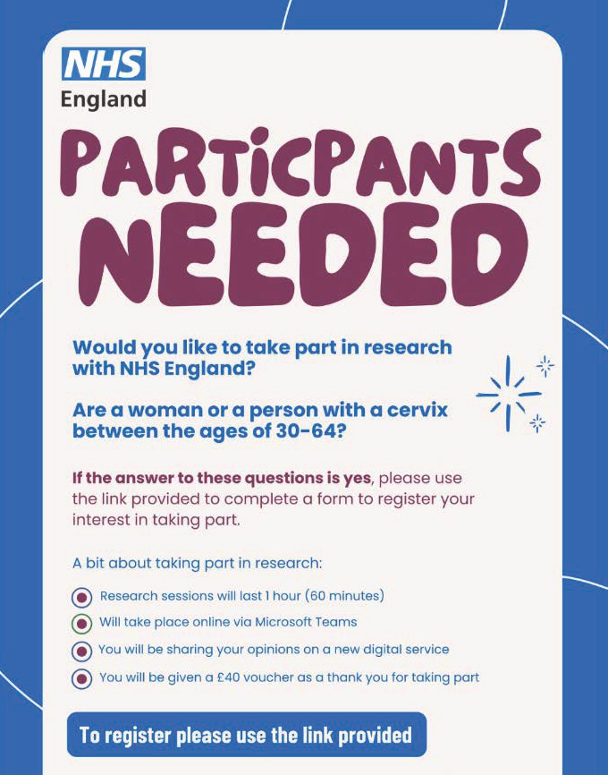

[[toc]]

### Research aims

1. To identify any potential pain points with the user journey from invite to confirmation now there have been changes to eligibility. ​

2. To assess how effective the updated content is in guiding users through the flow.​

3. Test users understanding of revised content by observing reading patterns and comprehension levels, specifically looking for any confusion or misinterpretation.

### Hypothesis

1. Users of the HPV self-testing service will not understand there is the option to send a kit to another address and so may not use the option.​

2. As HPV self-testing is a new service, users will require a lot of information upfront, and so text message invites will not test well.

### Recruitment

We had 17 participants in total. They were recruited via:

- Digital Accessibility Centre, a recruitment agency that specialises in supporting accessibility online was used to find 5 participants who used screen readers. ​

- 12 participants were found using the call out method by sharing a poster and screener via social media through a not-for-profit called Start Differently who support people who are neurodivergent.​

### Participant breakdown

Out of 17 participants:

#### Ethnicity

- Asian British Asian – Pakistani - 6 % ​
- Black British African – 11%​
- Black British Caribbean – 6%​
- Mixed or multiple backgrounds – 6%​
- White European, English – 71%​

#### Previous screening attendance​

- Always attend – 59% ​
- Has missed some – 41% ​

#### Age

- 25-34 – 29% ​
- 35-44 – 41% ​
- 45-54 – 24% ​
- 55-64 – 6% ​

#### Gender​

- Non-binary – 6% ​
- Female – 94% ​

#### Sexuality

- Asexual/ Aromantic – 12%​
- Bisexual – 6 %​
- Lesbian – 6%​
- Heterosexual– 76%

**5 participants** were screen reader users who self-identified as having no vision, one of which also used refreshable braille. ​

> Due to me being registered blind I rely on a screen reader to access various web pages and apps. If a web page or app is inaccessible for me to use, I do feel excluded...anything like unlabelled components such as buttons, links, graphics etc...

> I rely purely on-screen reader software to read websites and app to me so if things are not labelled accurately, then I am unable to understand the content"

**6 participants** self-identified as having varying levels of neurodivergent conditions. ​

**1 participant** mentioned they used captions on teams but did not explicitly mention they were deaf until asked during the research session. ​

### Methodology

**Prototypes:** HTML prototypes, 4 flows
**Where:** Online, via Microsoft Teams
**Length:** 1 hour

Depending on how participants answered initial questions on app, email and text usage, we showed them a combination of prototypes: ​

- If participant had the NHS App, we would start with the NHS App notification and invitation.​
- If participant **didn't have** the NHS App, we would start with either SMS or Email invitation and then continue. As SMS and Email are comms that will be sent at the same time, we started showing both to the user for a realistic reaction. ​

#### Prototype flows

### Research findings

#### 1. Initial impressions

1. The journey was well understood, but there were questions on accessibility​

**35% of participants** were screen reader users and had no vision. A main concern for these participants was on knowing what options there are for accessing critical information such as instructions or results in a digital format, or other formats, such as braille.

2. Cervical screening communication is mostly associated with GPs​

For participants that have accessed traditional cervical screening, they will be used to receiving communication from their local GP or to book in with their sexual health clinic or hospital. So, receiving a text from "NHS Screening" has been a change and has led to some participants feeling that the SMS could be a "scam".

3. There is still a question on if the service is free​

Despite the NHS generally being a free service, and there being content that says 'order your free kit' there were a few questions about if self-testing would be free.

From our pop-up research back in March, we understand that in many countries HPV self-testing is a paid service, so for many people with English as a Second Language or minoritised communities that have accessed HPV self-testing in another country, there is a perception that this service may be paid as well. It is acknowledged that there are paid offers for self-testing in the UK such as Daye or via private healthcare providers. This may also contribute to user perception of this service being paid for.

#### 2. Invitations

- App and Email invites were preferred over SMS​

> [!NOTE]
> At the time of testing, we only had 160 characters for our SMS content which meant there was not as much room to go into detail as there was for NHS App and Email invites.

Although many participants mentioned they check SMS more frequently, there was a lack of trust of the text message itself.​

**66% of participants** would be distrustful of the text message and either would not engage with it entirely as they perceive it to be a scam or spam message and **35%** would need to confirm it was 'real' by checking another source such as NHS website, googling or calling their GP.

> Doesn't seem to offer me anything in particular doesn't sell me the benefits, doesn't make me want to do this at all
> -- P9 usability test participant about SMS invite

**59% of participants** found the tone in the email and App feels 'sympathetic', 'personal' and makes participants feel 'excited' about the new service. ​

Neurodivergent participants mentioned it was important to have clear titles for each section of information

##### Recommendations

- Having a more personal touch to the SMS invitation – so people feel reassured the invite is for them and is not a scam.

- A need for clearer information layout within the email and App invite, especially for people who are time limited and for people who have difficulty processing larger pieces of information. ​

- Make the link between HPV, cervical screening and how it can prevent cervical cancer stronger.​

#### 3. Start page

Although the 'how it works' section was generally found to be useful, content on collecting a sample "insert a swab a few centimetres..." seemed vague.

There is a need for clarity on how far the swab must be inserted to take an accurate test and how users will receive results. This information will help users feel more informed when making a decision on whether to use HPV self-testing.

#### 4. Delivery address selection

Most participants found the address screens clear, however, there was the need to have an indication that the self-kit would be sent to them and not anyone else that may be linked to their NHS account. ​

#### 5. Order submission

All participants mentioned they felt the order confirmation screen and email confirmation was 'clear' and 'straightforward'. Making time frames clearer to users would be helpful, so they are aware of how long each step will take from submitting an order to receiving, sending their self-test back and receiving results. ​

**59% of participants** mentioned they would like to know more information ahead of their kit arriving. This will help with deciding to order a kit and the logistics of completing the self-test. ​

**35% of participants** would like to have access to instructions, to prepare themselves but also for **4 of the 5** of screen reader users this was a question as instructions will need to be available in braille or online for people who are blind or low vision who use assistive technology. ​

> cause obviously I'm not going to be able to read the leaflet when it comes [in the kit]
> -- P3, a screen reader user, talking about accessible kit instructions for sample taking

#### 6. Receiving results

**41% of participants** had the expectation that they would be able to choose how they would receive their results. It was assumed that as the journey was digital that results would be too.

When asked directly about receiving an NHS App message if HPV positive (HPV was detected in a test) **all participants** were happy to receive their results that way if the next steps were well explained. ​

However, for screen reader users receiving letters in the post poses a barrier and reduces independence. Paper letters do not have braille on them and so to access results another person will have to read their letter for them. It also exacerbates pain points for users with low vision, as we are aware there have been challenges to get large print for results when asked.

> For me the app is the most private way I can receive the information, can read it through my screen reader in my own time with headphones on
> -- P15, screen reader user, about receiving results

#### 7. Support content

As we do not yet have support content on NHS.UK, there was a need from many participants for more further information on the accuracy of self-testing and the difference between self-testing and traditional cervical screening at a local GP, hospital or sexual health clinic – this has been passed on to the relevant content/ comms teams who will be working on this.

### Updates we made based on research findings

- Added clear and consistent headings to help users scan and understand the content more easily.​

- Updated the information architecture to include a section explaining why you’ve been invited, addressing a key user need for clarity and reassurance.​

- Simplified language around HPV to make it easier to understand, especially for users unfamiliar with medical terms.​

- Made the link between cervical screening and HPV clearer, helping users understand the purpose of the test and its role in preventing cervical cancer.​

- Included more information about timelines, such as when to expect results or next steps, to better manage user expectations and reduce anxiety.​

- Having a more personal touch to the invitation by including the participants name at the start – so people feel more reassured the invite is for them and is not a scam. ​

### What's next

- We are in the process of finalising content for reminders, nudges, shutter screens and results. We will take this content into a round of testing at the end of August.

- The content for the invitations and ordering journey has been reviewed and signed-off with stakeholders and UCD team is in the process of handing over to BA and Dev.​

- Development of content for the support page on NHS.UK is starting shortly (collaboration between our two teams' content designers).​
