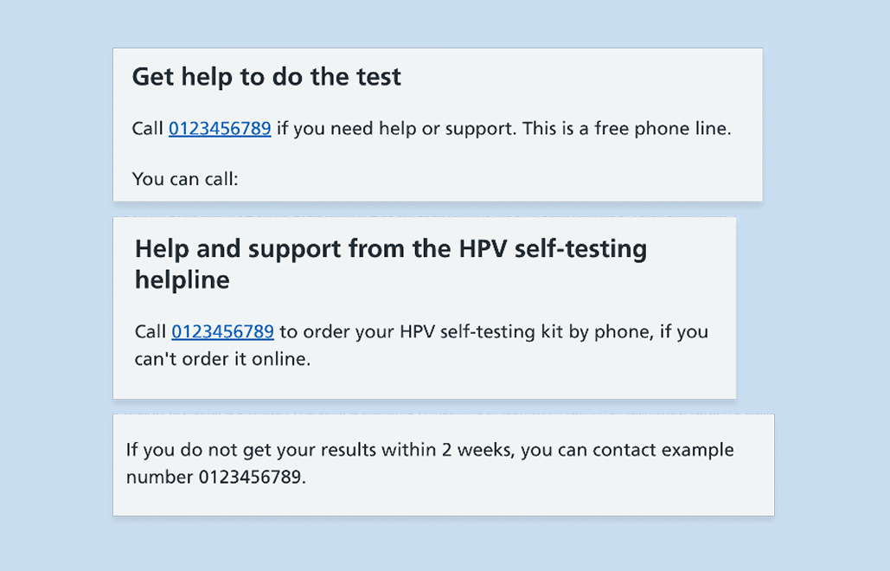
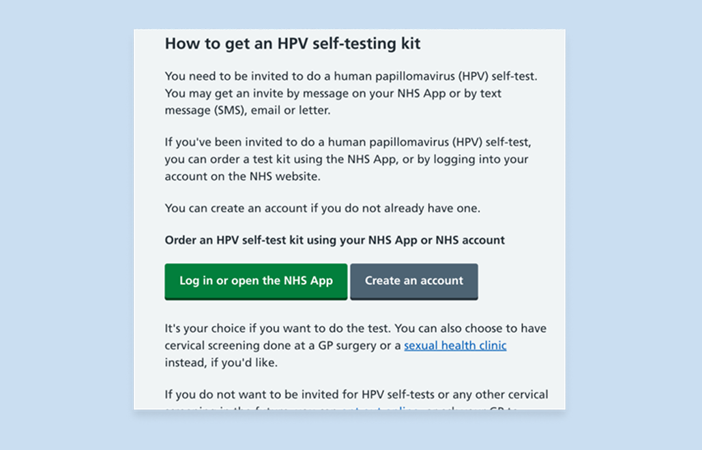
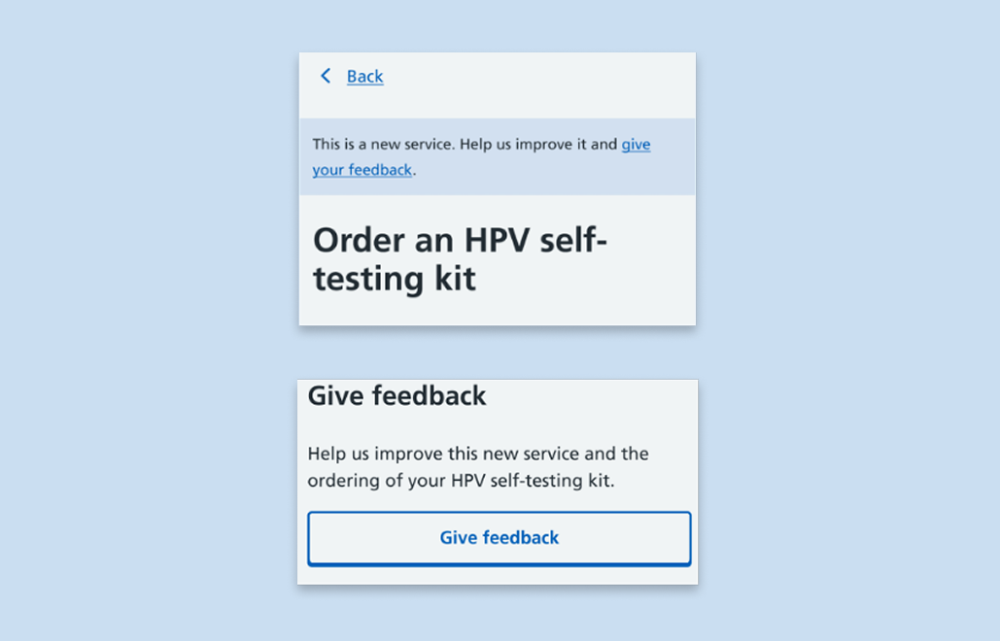
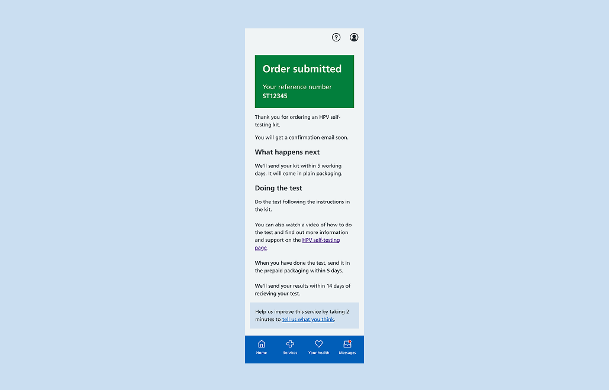

At the end of November 2025, we ran a short round of usability testing to finalise the design solution for a feedback banner on the HPV self-testing digital ordering journey on the NHS App. We also tested the first draft of content for our NHS website support page that will accompany the service when live. 

## Research objectives

As part of the HPV self-testing private beta, we wanted to implement multiple ways for users to give feedback on their journey. 

Following the NHS App design system pattern, we designed a feedback banner to go on various pages throughout the user’s journey to complete an order. 

The research session was structured like a usability testing session. We also took this opportunity to test the first draft of the content for the NHS website support page, which can be accessed in various places throughout the journey, including invitations and the service start and confirmation pages. 

Our objectives were: 

- to assess how effective the feedback banner is and if users understand its purpose 

- to make a recommendation on the most usable design to drive the most interaction 

- to better understand how effective support content is for users, and if this content affects user behaviour 

- to better understand user thoughts on providing feedback on a digital journey ahead of receiving their self-test kit 

## What we did and how we did it

### Research methodology

- Usability testing done via MS Teams 
- Think aloud method 
- Sessions lasted 1 hour 
- Participants joined with their devices 
- HTML prototypes were used to complete usability testing tasks and scenarios 

### Participant breakdown

**6** participants took part in the user research. 

**3** participants were screen reader users recruited through the [Digital Accessibility Centre (DAC)](https://digitalaccessibilitycentre.org/).

The remaining **3** were recruited through [TransLeeds](https://www.transleeds.org/). 

All **6** participants have attended cervical screening at some point in their life.

The demographic breakdown of our participants:

| Demographic characteristic | Breakdown |
| ------------ | ---------------------------- |
| Age| 25-34: 33% |
|    | 35-44: 50% |
|    | 45-54: 16% |
| Ethnicity| Black/British Caribbean: 17% |
|         | White British: 83% |
| Gender | Female: 50% |
|       | Non-binary: 50% |
| Sexuality | Bisexual: 33% |
|           | Heterosexual: 50% |
|           | Queer: 16% |
| Disability | Neurodivergent: 66% |
|            | Difficulty with memory: 16% |
|            | Physical: 33% |
|            | Visual: 50% |
|            | Sensory: 33% |              

### Test breakdown

Participants were asked a series of tasks which took them through the ordering journey, from invitation to confirmation. 

Key testing points: 

- Ease of navigation from invite to completing an order 
- Ease of navigation in and out of the NHS.UK support page 
- Content readability and comprehension, focusing on the support content around: 
  - what HPV self-testing is and why is it important 
  - why the participant was invited (eligibility criteria) 
  - next steps to take to order a kit 
  - timeframes on receiving a kit, posting and getting a result back 
  - kit instructions 
  - what type of results there are 
  - how to get help 
- Placement of the feedback banner and content inside it 

## What we learnt

### Key insights

After analysis, we grouped our insights into 3 main areas: 

1. Kit instructions on NHS website support page 
2. Other NHS website support page content 
3. Feedback banner 

#### 1. Kit instructions

For users with visual impairments or access needs, we found that: 

- it is difficult to know how far to insert the swab as they may be unable to see the red line that shows when to stop 
- they may be unable to write the date for the sample tube 
- they may need help with posting their sample, so we need to include specific information on how long a test needs to be posted after a sample is taken so they can plan when and how to return their test 
- having accessible braille instructions on paper is useful so the user does not need to bring their phone or laptop to the bathroom with them 

>It does say up to the red line, but we wouldn't be able to see that. I wouldn't be able to write the date myself. Want to be able to do it yourself as it's a private thing.
> -- P3, screen-reader user

>Does it have a shelf life? If I did the test today, but I can't go out until Monday to post it, would that affect the results? Because I'm blind, if I have no one to help to send the box to post for days, does that affect the test?
> -- P5, screen-reader user

#### 2. NHS website support page 

All 6 participants found the support page to be informative and answered most questions. 

However there were still questions on how to prevent HPV and if people should avoid sex after an HPV positive result.  

There was also a need for more clarity on if test can be done while the user is on their period. The current wording of ‘you may prefer to do it when you are not on your period’ seemed ambiguous and led to concerns it could lead to an incorrect or unclear HPV result. 

Additionally, throughout the support page, we signpost users to a helpline if they need further support. For some participants, it was not clear if they could call the helpline for any issue, or only for those listed when it is signposted, for example if they do not get their result within 2 weeks. 

Most participants were also questioning the validity, accuracy and efficiency of the test. We have heard this before in our previous rounds of testing. 

Finally, there was some confusion around navigation caused by users opening the support page as a web view inside the native NHS App. They would read the call to action on the support page -  ‘log in or open the NHS App’ - and find this jarring as they already had the NHS App open. 

 

#### 3. Feedback banner

Most participants view feedback as something that will take time and therefore do not do it as often in a rush when ordering something. 

They would give feedback even less so when it is government or health related, despite health being seen as important. 

The ‘new service’ content did not lead to more participants wanting to give feedback, with 1 participant saying they'd prefer to do further research before engaging with the service. 

The Qualtrics survey linked in the feedback banner itself was seen as “what I expected” (P4) and “easy enough to complete” (P3). 

There wasn't conclusive evidence between the two feedback design variations. 

All 6 participants missed the banner at the top of the start page. 

Most participants said they wouldn't give feedback right after ordering their kit. They would mostly use it if they needed to complain or if “something needed improving” (P2). 

For screen reader participants, the banner at the bottom of the order submission page didn't work well. Some participants missed the banner, and when prompted to go back, they would only listen as far as 'this is a new service' and miss the survey link to give feedback. 

## What we did next

### Support page

- With the NHS App and NHS.UK teams, we investigated what happens if a user tries to click on these CTAs while already in the App. Due to technical limitations, a dynamic page cannot be created, so we chose to have 2 versions of the same page depending on the route the participant is taking. 
- Added content for ‘additional support’/‘reasonable adjustments’. 
- Added the finalised kit instructions for the 2 types of kits. 
- Added finalised support info and improved strategy around signposting e.g. only for specific issues or more generic. 
- Added information on HPV prevention aligned with HPV positive result letter. 
- Added a sentence under the ‘What your results mean’ header: 

> Your cervical screening results are usually sent to you in the NHS App or by letter. Your cervical screening results will explain if human papillomavirus (HPV) was found in your sample, what your result means, and what happens next.

- Had a clinical review for wording around if a test can be done during a period. 

### Feedback banner

1. UX

- Kept feedback banner on the order submission page 
- Proceeded with the banner component for consistency with existing use in the NHS App and established feedback pattern 
- Added hidden tag on the component to let screen readers know what the section is about 
 
2. Content

- Reviewed language used and took out the 'this is a new service' sentence 
- Added how much time it will take to complete the survey  
- Explored asking for feedback in the result messages and created a new survey 

3. Product

- Explored sending a feedback survey by email triggered at the end of encounter in Dynamics but dropped this idea due to data sharing legal constraints 
- Explored building a research panel and have set it up on Qualtrics 