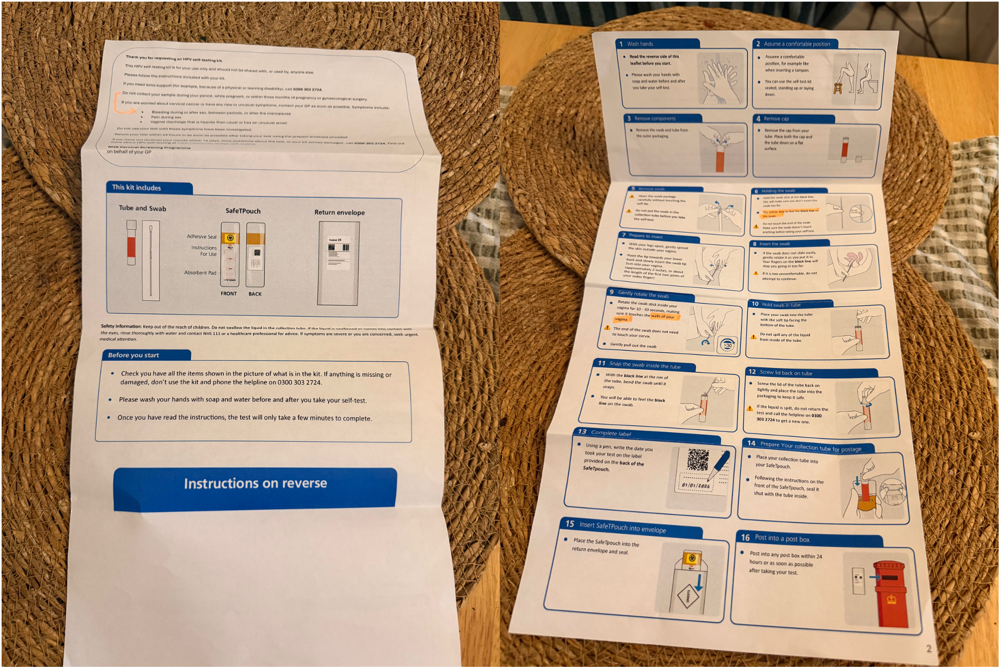
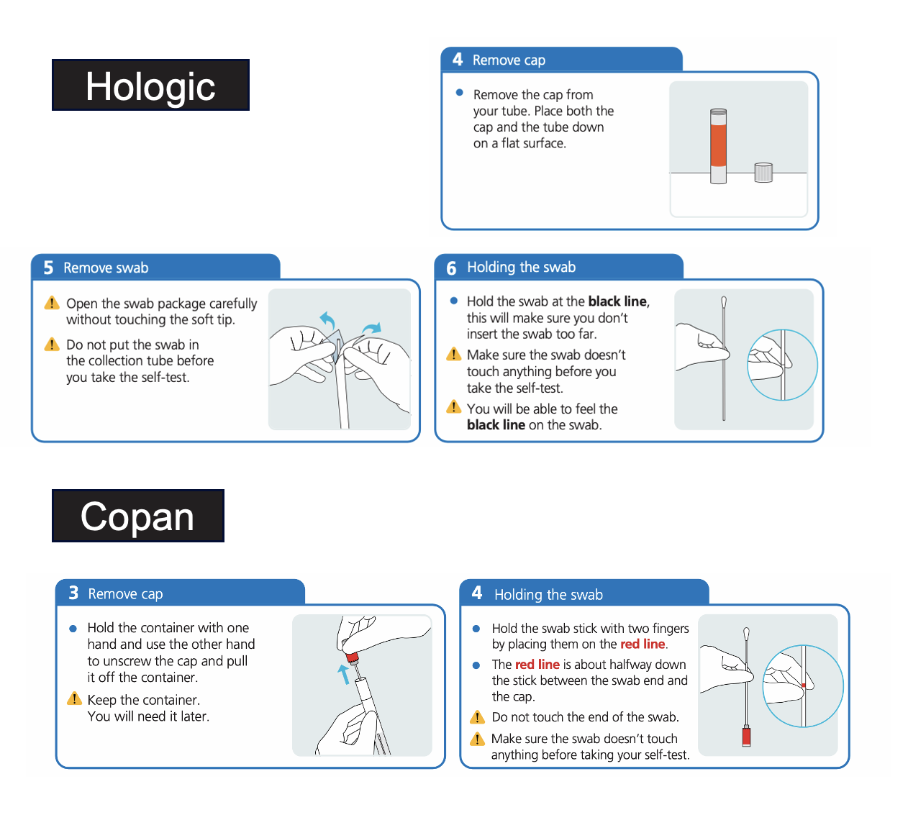
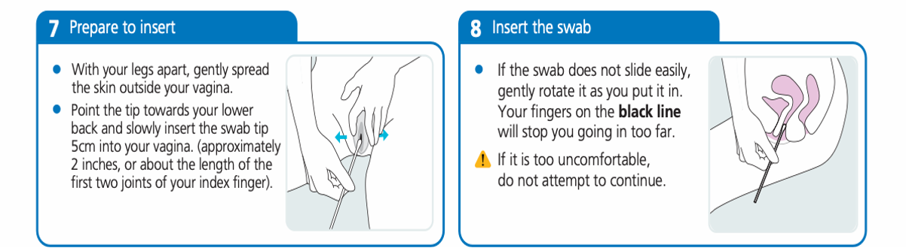
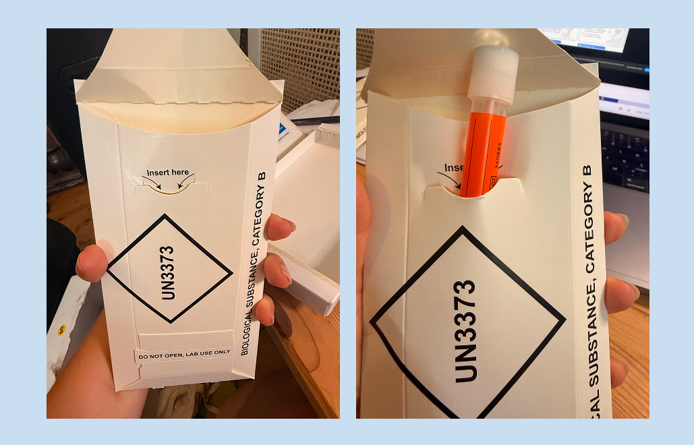

## Why we needed to test the instructions quickly

The kits and instructions are produced by a third-party supplier, RDi. We had a short window to test the instructions with time for changes to be made before they were needed for go-live. 

This is a brand-new service and people using HPV self-testing kits at home will not have a healthcare professional there to guide them. The instructions need to help people complete the test correctly and confidently, and return a usable sample that can be tested by the laboratory.

## What we did

To hedge our bets and prepare for any issues or delays, we combined: 

1. remote interviews with 4 people who had not responded to previous cervical screening invitations  
   - non-responders are notoriously difficult to recruit but are ultimately the target users of the service  
2. in-person testing with English language learners  
   - to improve accessibility, we wanted to test instructions with people who may have more challenges understanding the language 
3. unmoderated testing with 67 people through UserZoom 
   - we wanted scale to ensure we could get a sense of how common issues might be

In total, **79 people** took part. The sample included people who spoke English as a second language, people from minority ethnic groups, and people with disabilities. 

### In-person testing

The in-person testing took place in Sheffield, at an English learning centre. In total, we tested prototypes of the kits with 8 participants.

There are 2 types of HPV Self-testing kits, Copan and Hologic. RDi, the kit provider, was able to send us 8 sealed prototypes (4 of each type) of the kits that containted the draft version of instructions. This made a huge difference as participants were able to physically interact with the kit as they would do if they had ordered a kit themselves.

## What we found

Overall, the kits and instructions tested well. Most people understood the overall process and felt comfortable with the idea of self-testing.  

> It's quite quick and easy - a bit like a Covid test, but at the other end :-D

NHS branding and visuals played an important role in building confidence and reassurance. People described the instructions as clear and appropriate. The accompanying imagery helped bring steps to life, assured them they were performing the test correctly, and helped people anchor themselves/know which step they are on throughout the process. 

> Really clear, really straightforward. I would be happy to receive this

However, the insights also highlighted several areas for improvement.  

Some of the main issues the research identified were: 

- too much information to digest, making it difficult at times to pick out key information, increasing the risk of skimming and making assumptions  
- some visuals were not sufficiently distinct from one step to the next, making it harder for people to differentiate between stages of the process. Important details, such as the swabbing duration, were not always prominent enough 
- in some cases the order of the steps did not match how people naturally used the kit 

> So with my legs on the stool I have to get the packet, open it all up, hope there’s a flat surface next to me…

- some warnings appeared after people had already taken the relevant action
  - some people spilled liquid from one of the tubes before they were warned it contained liquid  
  - if someone opens the swab at the swab end, they risk having touched it before reading the warning  

- people’s biggest worry prior to receiving the kit is the insertion depth, particularly whether it needed to touch the cervix. Participants were highly focused on getting this right, and differing descriptions across the multiple steps created uncertainty and added cognitive load 

> oh good it doesn’t have to touch your cervix I was worried about that!

> it says don’t touch your cervix but how do I know where that is?

- some participants, particularly those experiencing menopause, asked whether lubrication could be used, highlighting a gap in upfront information   
- the return envelope was difficult to identify because its appearance blended in with the rest of the packaging. Some participants said they might have returned the SafeT-Pouch, placed items back in the original box, or assumed the envelope was missing
- the envelope clasp caused confusion and concern. Some participants attempted to insert the sample into the clasp opening, while others questioned whether the envelope would remain securely sealed during transit

- there was confusion around return timeframes. Participants found the wording "within 24 hours or as soon as possible" contradictory, as "as soon as possible" could be interpreted as longer than 24 hours. 

## What we changed

The recommendations were recorded in a tracker so they could be reviewed and taken forward by the wider team and suppliers. 

To improve the instructions, we: 

- restructured introductory content to make key information easier to find and absorb 
- added information on lubrication and other factors that could affect test results 
- improved imagery and use of colour to highlight important information and make steps easier to distinguish 
- added clearer anatomical guidance, including labelling where the cervix is located
- reordered steps to better reflect how people naturally use the kit 
- moved warnings earlier in the process and adding additional warnings to prevent common mistakes, such as spilling liquid or handling the swab incorrectly 
- simplified return instructions so they consistently state that samples should be returned within 24 hours 
- ensured supporting information and video content addressed common concerns, including insertion depth, movement during testing, and swabbing duration 
- introduced clearer envelope labelling and an adhesive seal to make return packaging easier to identify and use 

The live digital instructions can be accessed via:
- [How to use your Copan FLOQSwabs HPV self-testing kit (GOV.UK)](https://www.gov.uk/government/publications/hpv-self-testing-kit-instructions/hpv-self-testing-kits-how-to-use-copan)
- [How to use your Hologic Aptima HPV self-testing kit (GOV.UK)](https://www.gov.uk/government/publications/hpv-self-testing-kit-instructions/hpv-self-testing-kits-how-to-use-hologic)

## Next steps

To further iterate on the instructions, we plan to: 

- continue collecting and reviewing participant feedback throughout the private beta 
- conduct targeted research with people who have access needs to identify any usability, comprehension, or accessibility barriers 
- use findings to further refine the kit, instructions, and supporting content ahead of wider rollout 