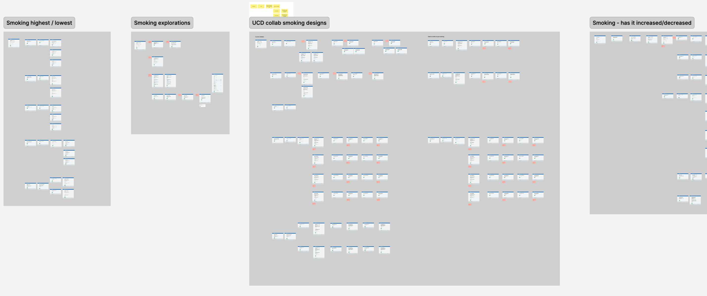
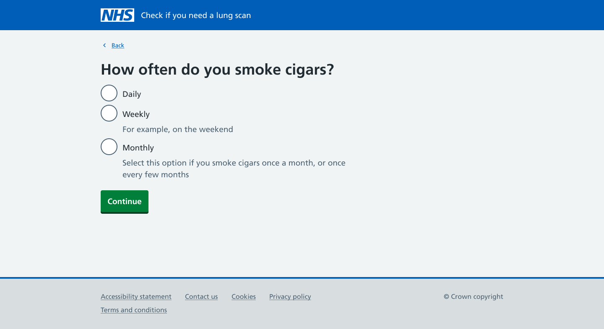
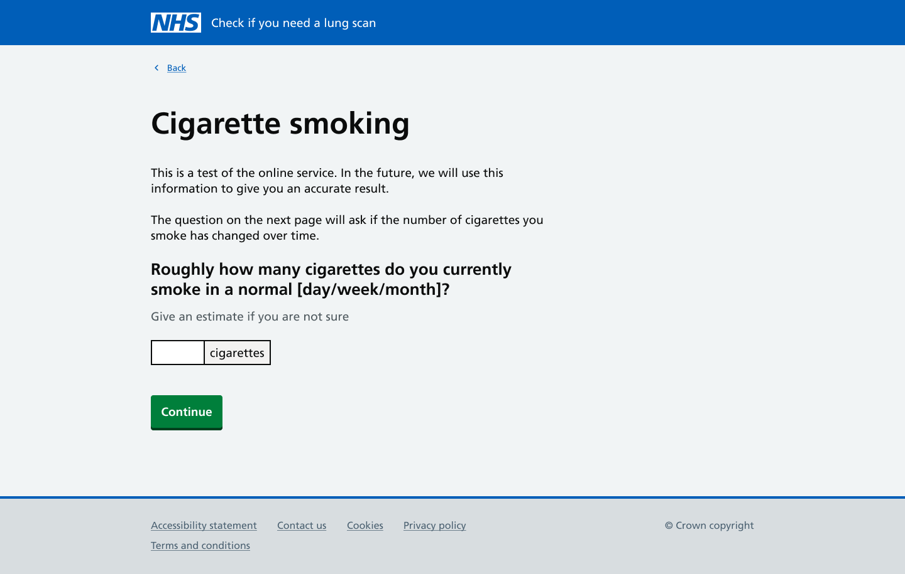
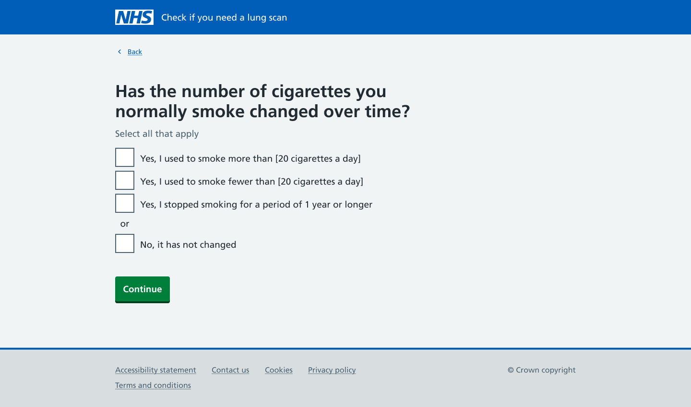

This is the third post in a 3-part series about our approach to designing questions asking participants about their smoking history. 

We are designing a new digital service for the lung cancer screening programme. The service will ask eligible participants questions about their medical history and lifestyle to work out their risk of getting lung cancer in the next 5 years. If a participant is considered at higher risk of lung cancer they will be offered a CT scan. This service is currently delivered by phone and is called the [lung health check](https://www.nhs.uk/tests-and-treatments/lung-cancer-screening/). We are exploring whether a digital offering would be desirable to users and clinically safe.  

## Learning from what’s tested well with users 

We experimented with a few different user journeys and ways of asking users about their smoking history. We considered asking users to tell us about different smoking ‘periods’. For example, if someone smoked 20 cigarettes for 10 years, and then 5 cigarettes a day for 10 years, they would be considered 2 separate smoking periods.  

But we know from our user research that not everyone will recall their smoking history accurately. There’s also the design challenge of naming a smoking period, this isn’t the language our users use.  

 

In our latest designs we ask users to tell us how frequently they smoke: daily, weekly, and monthly. This question allows users to give us more accurate information. For example, users who only smoke on the weekends can select ‘weekly’. In our previous designs we were overestimating the amount they smoked by assuming they smoked the same amount every day.  

 

We then ask users to tell us how much tobacco they normally smoke a day, week, month or year. The question will change depending on how often they told us they smoked. In our initial designs we asked users what they smoked 'on a regular basis’ but this caused a lot of confusion. Regular could mean very different things, and users were concerned that they wouldn’t answer the question correctly. Changing the language to ‘normally’ has helped reduce confusion. 

 

## Giving users a point of comparison 

In previous designs we asked users to tell us the highest and the lowest amount of tobacco they smoked. These didn’t work for users because it felt too abstract. Participants didn’t often think about their smoking history in terms of the most, or least amount of tobacco they smoked.  

We’re hoping that asking users to provide an initial amount, the amount they smoke ‘normally’, will give users something to compare to when we ask in the following question if the amount has ever changed. The next question asks users to tell us if: 

- they ever smoked more than X number of cigarettes a day 
- they ever smoked less than X number of cigarettes a day 
- they ever stopped for a period of 1 year or longer 
- their smoking has not changed 

If the user selects either of the first 2 options we’ll ask them to provide further information about their frequency and the amount they smoked.  

If they select either of the bottom 2 options they won’t be asked any further questions about this type of tobacco. We already ask users if they stopped smoking for periods of 1 year or longer earlier on in the journey. We didn’t want to overburden users by asking them a similar question multiple times.  

We include the option for them to tell us that they stopped smoking so that they feel able to share an accurate history of their smoking. It also helps distinguish between smoking fewer cigarettes, but still smoking, and stopping smoking altogether.  

 

These designs will never be ‘done’, we’ll continue to iterate and improve them. But in the spirit of ‘perfect being the enemy of good’ we'll decide on designs that we think are good enough for pilot.  We’ll learn more from the data we collect during pilot, hearing from participants, and testing our designs with users in interviews and site visits. 
