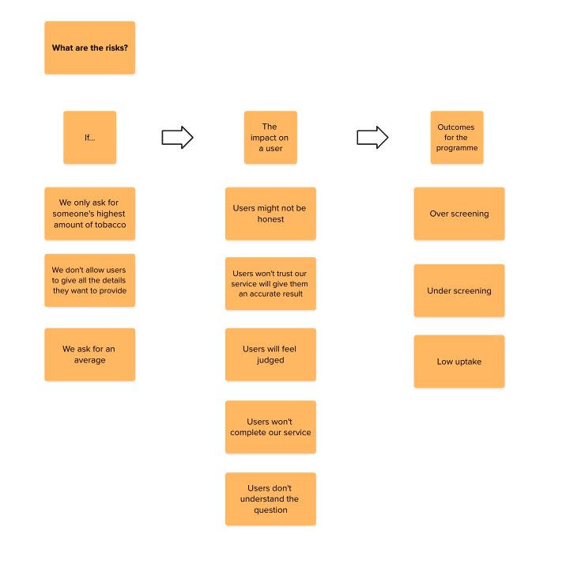
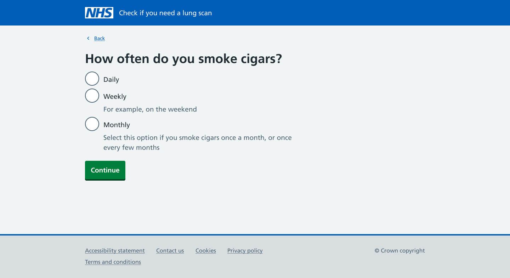
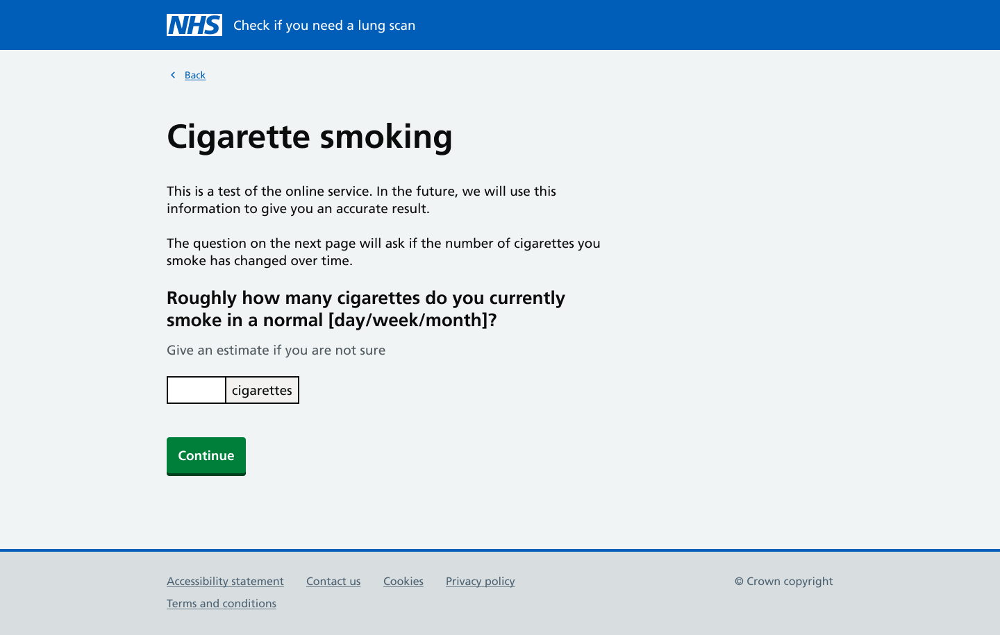
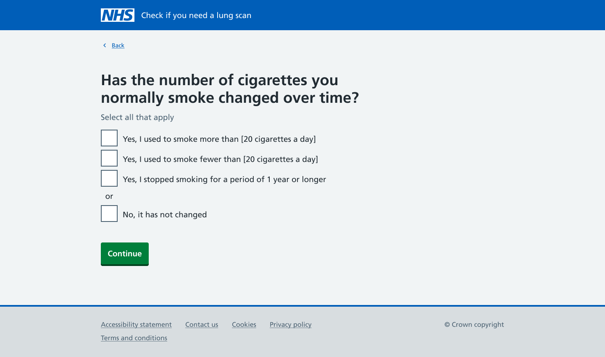

We are designing a new digital service for the lung cancer screening programme. The service will ask eligible participants questions about their medical history and lifestyle to work out their risk of getting lung cancer in the next 5 years. If a participant is considered at higher risk of lung cancer they will be offered a CT scan. This service is currently delivered by phone and is called the [lung health check](https://www.nhs.uk/tests-and-treatments/lung-cancer-screening/). We are exploring whether a digital offering would be desirable to users and clinically safe.  

## Asking participants about their smoking history 

Part of the questionnaire for the lung health check asks users about their history of smoking tobacco.  In the current phone service participants can give any additional information they think is relevant, whilst the call handler only records what they need for the calculation. This isn't something we'll be able to do in our digital service. We wrote about this briefly in our [previous design history](https://design-history.prevention-services.nhs.uk/lung-health-check/2025/08/lung-health-check-prototype/).  

Some of the other questions in the calculation are more straightforward ‘yes’ or ‘no’ answers. We’ve been able to learn from some of the iterations phone service providers have made to these questions in their phone scripts for call handlers. 

One of the benefits of the phone service is that call handlers can clarify any responses from a participant, to help record accurate information. This is especially useful when a participant might have a complex smoking history of different types of tobacco, and if the amount they smoked changed over time.  

We also know that not all users are comfortable with providing the information we need to ask for. Call handlers can explain why we need certain information to reassure participants and keep them engaged with the service. But a digital service won’t have the same level of reassurance that comes from a personal interaction on a phone call.  

Our focus has been on getting the right balance between capturing enough information for the risk calculation to be accurate, and keeping users engaged so they don't drop out of our service. 

## The information we need for the risk calculation 

For the calculation, we need to know the total number of years someone has smoked tobacco. And the average number of cigarettes they smoke or used to smoke a day. We also know that not everyone smokes cigarettes. We ask participants if they’ve smoked:  

- cigarettes 
- rolled cigarettes 
- a pipe
- cigars 
- cigarillos 
- shisha  

For the calculation, we will convert these types of tobacco into an equivalent number of cigarettes. Users can tell us how much they smoked of a type of tobacco in a way that feels familiar to them. And we will do the conversions in the background.  

The service excludes vaping from someone’s smoking history. Currently there isn’t enough evidence about the impact of vaping on someone’s risk of developing lung cancer to include it as part of the risk calculation. 

## Research activities 

To help us design the questions we: 

- recruited users for research who smoke or used to smoke different types of tobacco 
- conducted pop-up research on Edgware road to speak to people who smoke shisha 
- visited a mobile scanning unit to observe face to face appointments and speak to nurses 

Pop-up research involves conducting short informal interviews, observations or usability tests in places where the target audience typically gathers. For example, in libraries, community centres, or in our case, shisha cafes. This approach helped us get access to participants who were otherwise hard to recruit. 

We observed participants smoking shisha as we spoke to them. Making it easier for them to recall details or share instances which would not have felt as natural in a planned online setting.  

Our visit to the mobile scanning unit gave us insight into the participant’s experience of their lung health check appointment. We got consent from participants to observe their appointments with the nurse, giving us a full picture of the participant’s experience. 

## Designing for complex scenarios 

We know that some users will have relatively simple smoking histories. For example, if someone smoked roughly the same number of cigarettes a day for most of their life. But we need to design journeys for those users with more complex smoking histories. We heard from users who might have smoked cigarettes daily for 20 years, then moved on to smoking a pipe or cigars more infrequently.  

We also need to design a journey that accommodates users who cannot remember exact dates or details of their smoking history. We created mindset segmentations to help us understand the needs of the users we are designing for.  The 3 mindsets we created are:  

- I want to do the right thing, just don’t make me feel judged or confused 
- My smoking life is complicated, and I want that to be reflected 
- I’ll do it if it feels worthwhile, legitimate, and joined-up 

A participant could have one of these mindsets, a combination of all 3, or move between them at different points in their journey. They aren't necessarily relevant to all participants, but they provide a useful reference point when designing our questions. 

## Understanding the impact of our questions on users 

The information we need for the calculation may seem simple but we know these questions can have an emotional impact on our users. Someone’s smoking history can be very personal and mixed with feelings of shame and anxiety.  

One participant told us during a research interview: “I’m always fearful of it, and I know I smoked for almost 20 years or over, the damage was done, I put junk into my body, the damage was done.” 

We mapped the possible impact of different ways of asking users questions about their smoking history. We need to make sure that the questions we ask users doesn’t make someone feel judged or anxious. Not only for the obvious reason of not causing our users harm. But also because we want to keep our users engaged with our service, so they complete their lung cancer screening and can be offered a CT scan if they need one.  

We considered asking users: 

- the highest amount of tobacco they smoked 
- minimal details about their smoking history 
- for an average amount of tobacco smoked 

We first tested designs that only asked users for the highest amount of tobacco they smoked, because this is what was included in the phone scripts for the current service. These designs didn’t work for users. Some users shared that they would reduce the number because they felt it didn’t accurately reflect their smoking history.  

Someone might have smoked 20 cigarettes a day for several years, tried to quit a few times, and then reduced the amount they smoke. The question could feel judgemental to someone who’s struggled to quit and worked hard to reduce the amount they smoke. It didn’t acknowledge the effort they made trying to stop smoking.  

If users felt like they couldn’t share an accurate history it brought into question how accurate their result would be. This risked undermining a participant’s trust in our service, and possibly whether they would complete it. As a result, one of our user needs for the service is:  

As a user of the service, I need to be able to explain my unique health context, so that I feel accurately understood. 

Additionally, small inaccuracies in a participant’s history might not post a significant clinical risk to that individual. But when we scale the service nationally, they could have a significant impact at a population level.  

We decided not to test questions that asked users for an average amount of tobacco they smoked because we don’t think this would be suitable for all users. Some users might find it difficult to work out the average amount of tobacco they smoked. NHS services should be designed for everyone, including people with [low health literacy](https://service-manual.nhs.uk/content/health-literacy). We can’t easily explain to users how they can work out an average amount of tobacco they smoked in their lifetime. This was particularly relevant to users with the first mindset: I want to do the right thing, just don’t make me feel judged or confused. 

## The impact of our questions on the programme 

If the way we ask someone about their smoking history consistently over-estimates the amount of tobacco they smoked in their lifetime, we could end up over screening the population. That is, giving a higher number of participants a CT scan when it might not have been necessary. The risk from the low-dose radiation exposure is low to an individual participant. But the risk of exposing participants at a population level means it needs to be considered by the programme. 

The opposite could also be true. If we consistently under-estimate the amount of tobacco someone smoked in their lifetime, we could under screen the population. We could end up not offering someone a CT scan when they would have benefitted from it. For example, if someone is diagnosed with lung cancer, when it could’ve been diagnosed by a radiologist during lung cancer screening. This could undermine trust in the screening programme.  

Finally, someone could stop engaging with the lung cancer screening programme altogether if they feel like our service isn’t worth their time. Or if they don’t understand the benefit of completing the questionnaire. Someone might also withdraw from the service if it makes them feel judged, or if the questions are confusing. 

## Quantifying smoking is an imperfect science 

We learnt from our subject matter experts that trying to quantify the amount of tobacco someone has smoked is an imperfect science. The information we need for the calculation needs to be good enough to give an indication of someone’s level of risk. But it will never be perfect.  

We also know that people cannot always recall their smoking history accurately. During our pop-up research with shisha smokers, we spoke to people who were smoking shisha alone. But in our questionnaire they would say they only ever smoke in a group.  

How a participant interprets questions is tied to their mental model of smoking. A user’s mental model is based on their individual background and past experiences. It can change how someone identifies. For example, as someone who ‘used to smoke’, or ‘quit smoking but still has the occasional cigarette’. A participant could answer questions honestly from memory, and still not be giving an accurate answer.  

We need to get the balance right between: 

- asking questions that give us enough information to calculate an accurate result 
- allowing users to feel like they’ve told us enough information so they trust the result we give them 
- not overwhelming users by asking too many questions 
- not asking users to recall too many specific details about their smoking history  

During our pilot we are asking participants to complete their phone appointment after testing our digital service. We will then compare their responses to help us understand if a digital service is viable. We don’t expect their responses to match. And we know that a participant's responses to the smoking questions are likely to be different in our service from their phone call. What we’ll need to consider is our level of tolerance for differences between the 2 services.  

Although the phone service has the benefit of call handlers clarifying questions with participants, this doesn’t necessarily mean that it's more accurate. One thing we’re anticipating with a digital service is that participants might feel able to be more honest when they are answering a questionnaire in private, rather than telling another person.  

## Learning from what’s tested well with users 

We experimented with a few different user journeys and ways of asking users about their smoking history. We considered asking users to tell us about different smoking ‘periods’. For example, if someone smoked 20 cigarettes for 10 years, and then 5 cigarettes a day for 10 years, they would be considered 2 separate smoking periods.  

But we know from our user research that not everyone will recall their smoking history accurately. There’s also the design challenge of naming a smoking period, this isn’t the language our users use.  

In our latest designs we ask users to tell us how frequently they smoke: daily, weekly, and monthly. This question allows users to give us more accurate information. For example, users who only smoke on the weekends can select ‘weekly’. In our previous designs we were overestimating the amount they smoked by assuming they smoked the same amount every day.  

We then ask users to tell us how much tobacco they normally smoke a day, week, month or year. The question will change depending on how often they told us they smoked. In our initial designs we asked users what they smoked 'on a regular basis’ but this caused a lot of confusion. Regular could mean very different things, and users were concerned that they wouldn’t answer the question correctly. Changing the language to ‘normally’ has helped reduce confusion. 

In previous designs we asked users to tell us the highest and the lowest amount of tobacco they smoked. These didn’t work for users because it felt too abstract. Participants didn’t often think about their smoking history in terms of the most, or least amount of tobacco they smoked.  

We’re hoping that asking users to provide an initial amount, the amount they smoke ‘normally’, will give users something to compare to when we ask in the following question if the amount has ever changed. The next question asks users to tell us: 

- if they ever smoked more than X number of cigarettes a day 
- if they ever smoked less than X number of cigarettes a day 
- if they ever stopped for a period of 1 year or longer 
- or if it has not changed 

If the user selects either of the first 2 options we’ll ask them to provide further information about their frequency and the amount they smoked.  

If they select either of the bottom 2 options they won’t be asked any further questions about this type of tobacco. We already ask users if they stopped smoking for periods of 1 year or longer earlier on in the journey. We didn’t want to overburden users by asking them a similar question multiple times.  

We include the option for them to tell us that they stopped smoking so that they feel able to share an accurate history of their smoking. It also helps distinguish between smoking fewer cigarettes, but still smoking, and stopping smoking altogether.  

These designs will never be ‘done’, we’ll continue to iterate and improve them. But in the spirit of ‘perfect being the enemy of good’ we'll decide on designs that we think are good enough for pilot.  We’ll learn more from the data we collect during pilot, hearing from participants, and testing our designs with users in interviews and site visits. 
