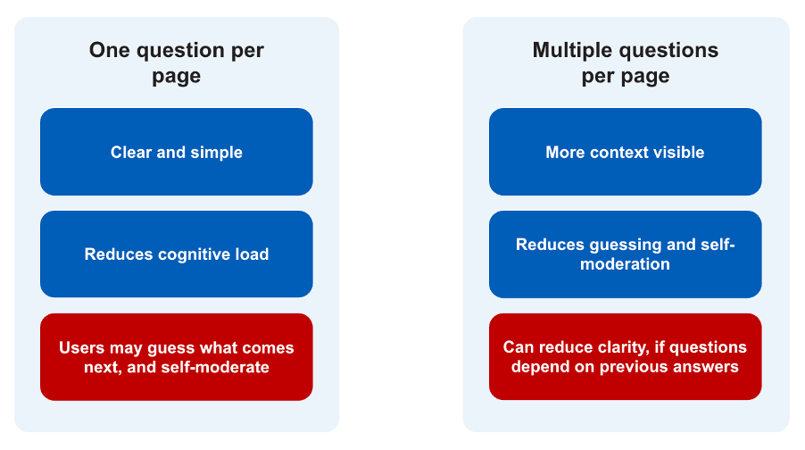
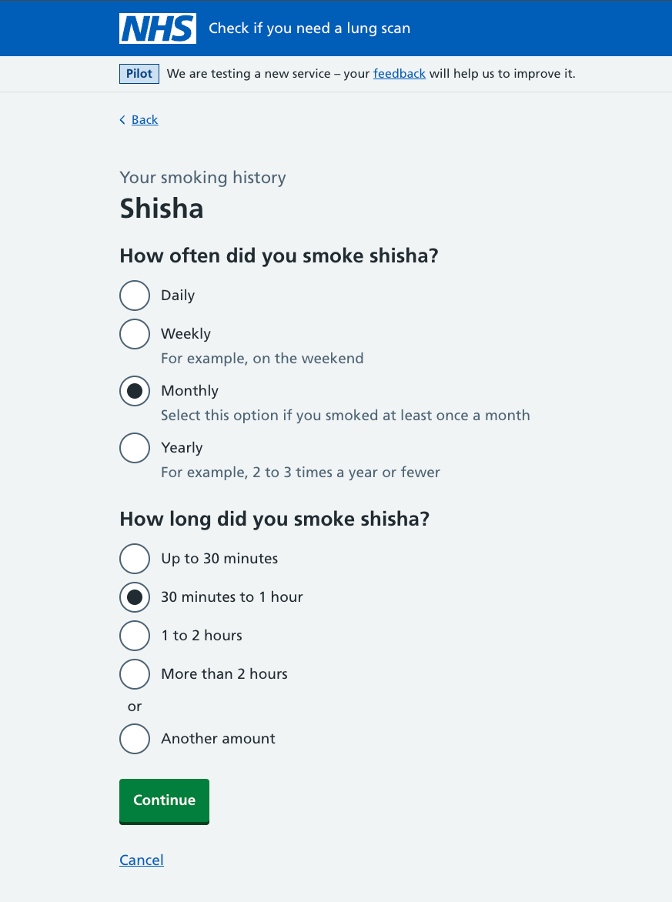
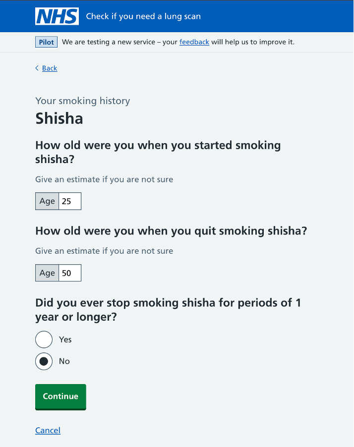

The GOV.UK Design System [encourages a "one thing per page" approach](https://www.gov.uk/service-manual/design/form-structure#start-with-one-thing-per-page). This means breaking a form into small steps, where each page focuses on a single piece of information or decision. This reduces cognitive load and makes the journey feel more like a conversation. But it does not always mean asking a single question per page.

As part of our work on a [digital service for lung cancer screening](https://www.digital-prevention-services.nhs.uk/screening/lung/), we need people to provide accurate information about their smoking history. In [earlier rounds of research](https://design-history.prevention-services.nhs.uk/lung-health-check/), we found that the way we structured questions had a direct effect on how people answered them. This led us to explore how the principle of "one thing per page" works in practice, and whether grouping closely related questions could sometimes help people answer more accurately.

## What we learned

The main thing we learned is that "one thing per page" should not be interpreted as "one question per page".

In some cases, grouping a small number of related questions helped users answer more accurately. It reduced the need for them to guess what might come next and reduced the self-moderation we had seen in earlier rounds of research.

However, this only worked when the questions were genuinely related and did not depend on each other for context. When one question relied on the answer to another, grouping them together created confusion.

This suggests that the question is not how many questions appear on a page, but whether they help users answer a single thing.

## Users were self-moderating their answers

In earlier rounds of research, we saw that when we asked a single question per page, users often tried to anticipate what the service might ask next. People would give answers that were slightly adjusted because they expected follow-up questions.

This behaviour reduced the accuracy of the data we collected. It also suggested that users were not always treating each question independently, even when we designed it that way.

## Why we tested grouping related questions

We wanted to test whether showing users more context would help them answer more accurately. Instead of separating every question onto its own page, we explored grouping closely related questions that represent a single topic.

The idea was that if users could see what was coming next, they would not need to guess or adjust their answers. They could answer more confidently, knowing exactly what information they were being asked to provide.

## Grouping related questions: where it broke down

We tested showing two questions together to ask about someone's smoking history.

This created a problem.

The duration question depends on the answer to the frequency question. Ideally, the second question would change based on what the user selected in the first. For example, asking about time smoked per day if they answered daily, or time smoked per week if they answered weekly.

When both questions are on the same page, we cannot update the second question based on the first without introducing accessibility and usability issues. Questions on a page should remain consistent, otherwise we risk confusing users.

As a result, the duration question became unclear. Some users misunderstood what they were being asked. One participant said they smoked daily, but then answered the duration question using a weekly estimate. They only corrected themselves when prompted during the interview.

This shows that grouping related questions can remove the ability to guide users through the logic step by step when those questions depend on each other.

## Grouping multiple questions: where it worked well

We also tested a different approach, where we showed three related questions on the same page. This page was in the same smoking history section, but these questions did not rely on each other for context.

In this case, the result was more positive.

By grouping a small set of related questions that represent one thing, users could see the full context of what they were being asked. This reduced the need for them to anticipate or guess what might come next.

We saw less self-moderation than in earlier rounds. Users were more likely to give answers that reflected their actual behaviour, rather than adjusting them based on assumptions about the journey.

In this example, grouping questions helped users answer more accurately, without creating the same dependency issues we saw in the two-question test.

## What this means for our design

We need to make deliberate choices about how we define "one thing", and when it is helpful to group related questions together on a single page.

For shisha smoking history, we have seen that grouping:

- related questions that represent one thing can reduce self-moderation and improve accuracy
- dependent questions without adapting them can reduce clarity

This means we should:

- keep questions separate when later questions depend on earlier answers
- group questions when they help show context and reduce guesswork

How we structure questions has a direct effect on how people answer them. Our research suggests that accurate answers depend less on the number of questions shown on a page, and more on whether the page helps users answer a single, coherent thing.

Our aim is to apply the principle of one thing per page in a way that supports accurate reporting, rather than treating it as a rule of one question per page.
