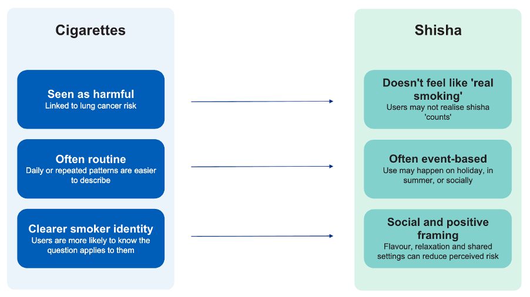
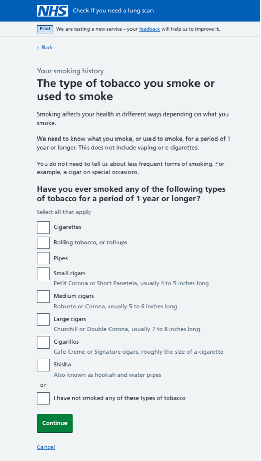
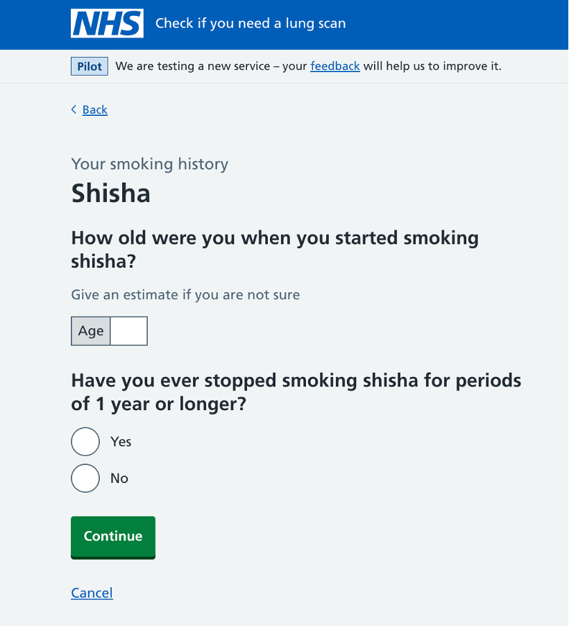

Most of our research into smoking history has focused on people who currently smoke, or previously smoked, cigarettes. This has helped us understand how users think about smoking when using our lung cancer screening service.

We wanted to understand whether people who smoke shisha (also known as hookah or waterpipe) think about, describe and report their smoking in the same way.

Our research suggests they often do not. Many participants saw shisha as something different from cigarette smoking. They were less likely to identify as smokers, less likely to associate shisha with lung cancer risk, and often found it difficult to answer questions designed around regular cigarette smoking habits.

This creates a challenge for our service. If users do not recognise that shisha is relevant to questions about smoking, or if our questions do not reflect how they use shisha, we risk collecting inaccurate information about their smoking history. These findings have implications for both eligibility checking and the wider smoking history journey.

## Shisha is understood and experienced differently to cigarette smoking

Many participants did not think shisha counted as smoking in the same way as cigarettes. Some described it as not being "proper smoking" or something that felt less harmful.

This creates a gap between how the service assesses risk and how users see their own behaviour. Users may not report shisha use at all, particularly in early eligibility questions where they are deciding whether they "count" as a smoker.

At the same time, shisha use was often described as irregular and event-based. Participants talked about smoking while on holiday, during the summer, or when socialising with friends and family. Because of this, they often struggled to answer questions that assume consistent behaviour over time.

Participants also described shisha in positive social terms. They associated it with flavour, relaxation and shared experiences. As a result, it often did not feel like a health risk in the same way as cigarette smoking.

## Testing a new question to check users' eligibility

The first eligibility question in our pilot service asks users whether they have ever smoked tobacco.

The existing answer options are:

- Yes, I currently smoke
- Yes, I used to smoke
- Yes, but I have smoked fewer than 100 cigarettes in my lifetime
- No, I have never smoked

Based on what we learned about shisha users not always identifying as smokers, we tested an alternative design.

Instead of asking users whether they smoke, we asked:

> Have you ever smoked any of the following types of tobacco for a period of 1 year or longer?

Users could then select from a list of tobacco types, including shisha.

Our aim was to encourage users who smoke shisha, but who may not think of themselves as smokers, to recognise that the question was relevant to them and continue through the service.

We included the phrase "for a period of 1 year or longer" to help distinguish regular use from having only tried a tobacco product once or twice.

## Our questions do not always fit how shisha works

These differences became even clearer when participants answered specific questions.

For example, some users found the phrase "for a period of 1 year or longer" difficult to apply to their own behaviour. People who only smoked on holiday or during particular times of year were unsure how to respond. They might have smoked regularly for short periods, but not continuously across a full year.

This means we could miss people with meaningful exposure because the question does not match how they experience their smoking behaviour.

We saw a similar issue with questions about stopping smoking. For many cigarette smokers, it is relatively straightforward to say whether they have quit. For people who smoke shisha occasionally, the idea of having "stopped" is less clear. Someone may go months without smoking and not view that as quitting.

When questions do not match users' experiences, people may guess, abandon the journey, or provide answers that do not accurately reflect their behaviour.

## What this means for our designs

The main learning from this research is that shisha is not simply another tobacco type that can be added to an existing cigarette-focused journey.

People who smoke shisha often have different mental models, different patterns of use and different expectations. If we design solely around cigarette smoking behaviour, we risk under-reporting or misrepresenting shisha use.

For cigarette smokers, the challenge is often emotional. People may feel guilt, anxiety or concern about their smoking history.

For shisha users, the challenge is more often recognition and interpretation. Users first need to understand that shisha is relevant to the service, and then need questions that allow them to accurately describe how they use it.

## Next steps

This research highlights several areas for further design work:

- make it clear that shisha counts as smoking within the context of lung cancer screening
- ensure eligibility questions do not unintentionally exclude people with irregular or episodic use
- design questions that better reflect social and event-based patterns of smoking behaviour
- continue researching how people who smoke shisha naturally describe and think about their own use

The key finding is that people who smoke shisha may approach the service with a very different mindset from cigarette smokers. If we want to collect accurate smoking history information, our service needs to recognise and accommodate those differences.

