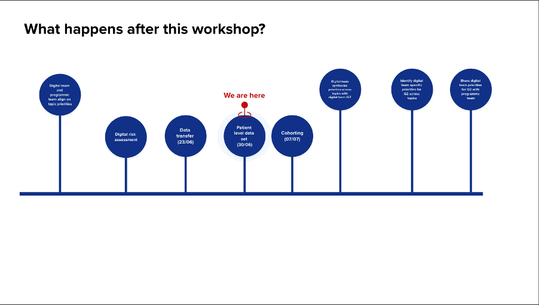
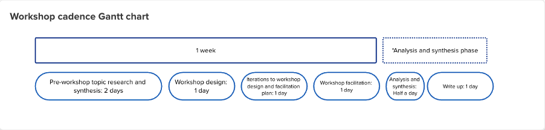

We launched a pilot in April 2026 to test [a new digital service for lung cancer screening](https://www.digital-prevention-services.nhs.uk/screening/lung/). The service is based on a digital risk assessment in the form of an online questionnaire that triages people towards, or away from, a [CT scan.](https://www.nhs.uk/tests-and-treatments/ct-scan/)

During a meeting with the lung cancer programme team, we learned more about [plans to create a national lung cancer screening programme by 2031.](https://assets.publishing.service.gov.uk/media/69dce11fd3e08b8871b6662c/national-cancer-plan-for-england-delivering-world-class-cancer-care.pdf) We learned that while the digital risk assessment is an important part of a national end-to-end lung cancer screening service, there are other elements of the service that we needed to consider alongside the development of the questionnaire.

To understand these parts of the service, we needed to bring together knowledge from across the lung programme team and digital screening, and learn from other screening programmes. We also needed to gather this knowledge quickly so we could decide what to do next.

To do this, we researched, designed, ran and analysed four workshops over four weeks.

Through the workshops we learned: 

- knowledge about how the existing offline lung health check operates is concentrated within 20 [Cancer Alliances](https://www.england.nhs.uk/cancer/cancer-alliances-improving-care-locally/)
- understanding how Cancer Alliances operate will help us design a broader digital service
- where data is transferred throughout the service and the scenarios that influence those transfers
- how performance data connects with our service
- that cohorting, the process of identifying people who share characteristics that make them eligible for a lung health check, needs to be considered as part of future service design

We will be launching a mini-discovery with the 20 Cancer Alliances to learn more.

## The areas we needed to understand better

Through conversations with the lung cancer screening programme team and [Digital Screening](https://www.digital-prevention-services.nhs.uk/screening/) leadership, we identified the areas where we needed a better understanding of the current phone-based service.

Although every part of the service is connected to another, we had limited time to bring together a large amount of information. We divided the topics into smaller categories to avoid overwhelming participants and make discussions easier to manage.

The priority topics we explored in the workshops were:

- the digital risk assessment
- data transfer
- the patient-level dataset, or performance data
- cohorting

## Designing a flexible workshop template

To make the best use of the time available and create consistency across workshop outputs, we designed a repeatable workshop template for our sessions.

The template was based on outcomes gathered from the lung programme team, Digital Screening leadership and our own team. We developed it using the following design principles.

**1. We will create a consistent story across all workshops by using a share purpose:**
> The programme and digital teams will create a shared understanding of what we want to achieve, and why, for each of the priority areas.

**2. We will make sure each workshop contributes to a shared set of outcomes, while tailoring those outcomes to the specific topic being explored.**

We used the same outcomes framework across all four workshops. This helped us maintain consistency while exploring different topics and made it easier to compare findings.

| Outcome                | Purpose                                                                                     |
|------------------------|---------------------------------------------------------------------------------------------|
| Define the theme       | Establish a shared understanding of the topic being discussed                               |
| Understand the process | Identify the essential steps, activities and requirements in the current and future process |
| Explore impacts        | Understand how decisions affect participants, patients, providers and the programme         |
| Identify dependencies  | Surface connections with other work and services                                            |
| Generate ideas         | Agree where to focus next and why                                                           |
| Discuss ownership      | Identify who might carry out the work                                                       |
| Define measures        | Agree how success could be measured                                                         |
| Define done            | Align programme and digital teams on what good looks like                                   |
| Record findings        | Inform future priorities and decision-making                                                |

**3. We will help participants quickly understand the context by showing how each workshop relates to previous and future work.**

**4. We will help participants quickly understand how the session will work by beginning every workshop with a participation charter. This includes making reasonable adjustments where needed.**

Below is an example of what the charter included:

> [!NOTE] Before we get started
> 
> We are not expecting to cover everything today. We want to share our thinking and identify the most important areas to discuss. We will arrange follow-up conversations where needed.
>
> During the workshop:
>
> - we will use Mural and share our screen for anyone who cannot access the board
> - facilitators will guide each activity and encourage participation from everyone
> - participants can raise questions in the chat or by using the raise-hand function
> - we will include a short break midway through the session
>
> We also encourage participants to:
>
> - mute notifications where possible
> - focus on the workshop activities
> - step away if needed and let us know in the chat
> - contact us if they require any additional support or adjustments

**5. We will consider how each topic affects different parts of the service by mapping it against the wider end-to-end journey.**

We designed the template in Mural because it was accessible to most colleagues. Our programme colleagues could not access the board directly, so we shared our screen during Teams calls and used dedicated note takers to capture insights on the Mural board.

## One workshop per week

We ran the workshops alongside maintaining the digital pilot, analysing data, and designing and building improvements to the pilot.

The workshop schedule needed to reflect the time and people available. It also needed to allow time for desk research and conversations with colleagues across Digital Screening before each workshop.

We adopted a weekly cycle that fit around team availability and workshop scheduling.

|             Workshop activity             | Time allocated |
|-------------------------------------------|----------------|
| Pre-workshop topic research and synthesis | 2 days         |
| Workshop design                           | 1 day          |
| Workshop iterations and planning          | 1 day          |
| Workshop delivery                         | 1 day          |
| Analysis and synthesis                    | 0.5 days*      |
| Write-up                                  | 1 day*         |

\* Analysis, synthesis and write-up took place after the four-week workshop period.

The schedule left very little room for error and required a lot of energy from the team. However, it showed the depth of knowledge across Digital Prevention Services and the willingness of colleagues to share their experience. It also demonstrated how much knowledge can be brought together in a relatively short period of time.

## Sharing responsibility for running workshops

We shared responsibility for running the workshops between colleagues based on their expertise and role in the team.

Our product lead introduced every workshop, reminding attendees of the shared purpose, participation charter and intended outcomes.

Specialists from across the digital lung screening team then led activities based on their areas of expertise. For example:

- our technical lead explained how digital data transfer currently works
- our design lead led activities exploring how data might move through different user scenarios

We also rotated workshop attendance across the wider digital team to balance pilot work with workshop delivery.

We assigned additional responsibilities during each workshop:

- a timekeeper to help us stay on schedule
- a chat monitor to respond to questions in Teams
- dedicated note takers to capture insights alongside the relevant activities

After every workshop, we collected feedback from participants on what worked well and what could be improved.

For example, participants in the first workshop told us there was not enough time to cover all planned discussion points. We used that feedback to simplify and reprioritise later workshop agendas so there was enough time to explore each topic properly.

## Creating a repeatable approach to sense-making

We designed a sense-making canvas as part of the workshop template so that findings would be recorded consistently across all four topics.

This helped us collect comparable information in a format that could be prioritised and analysed later.

The canvas included four categories:

- **Things we already know**: certainties that emerged during workshops
- **Our research so far suggests...**: evidence from existing research
- **We think we know...**: assumptions that need validation
- **We don't know...**: things we still need to understand

During group analysis sessions, team members reviewed notes, grouped related findings together, and identified themes and insights.

## Sharing what we learned

During a team retrospective, colleagues told us they found it difficult to keep up with what was happening in the workshops and what we were learning.

The need to continue running the pilot, combined with the speed of the workshops, made it difficult to keep everyone informed. We also realised that the way we had divided responsibilities across the team had made this problem worse.

In response, we decided to make the work more visible to the wider team.

We created a dedicated lung cancer screening programme workshops area within Confluence. This included:

- an overview explaining the purpose of the workshops
- a summary page for each workshop
- key insights
- agreed next steps

We then held a playback session for the wider team. We also used the workshop findings to inform a team planning day at the end of July 2026.

## Next steps

### Working with the Cancer Alliances

The workshops and the conversations around them highlighted gaps in our understanding of a future digital service and helped us identify who we need to work with to address them.

We learned that:

- much of the knowledge about how lung health checks operate in practice sits within the 20 Cancer Alliances that commission and run the service
- building relationships with these alliances and understanding how they work will help us design a future digital service that can be implemented successfully
- we already have a strong relationship with [Royal Marsden Cancer Alliance](https://www.royalmarsden.nhs.uk/about-royal-marsden/who-we-are/rm-partners-west-london-cancer-alliance) (West London), with whom we are running our digital pilot.

Our next step is a mini-discovery involving all 20 Cancer Alliances so that we can better understand how local services operate and what this means for the future of digital lung cancer screening.
