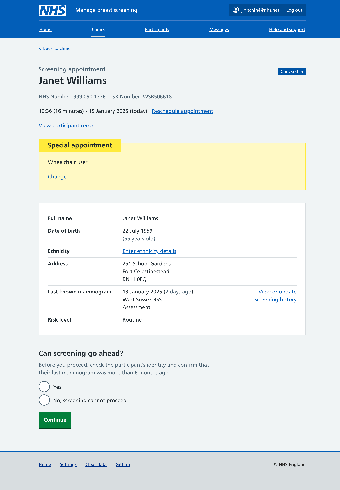
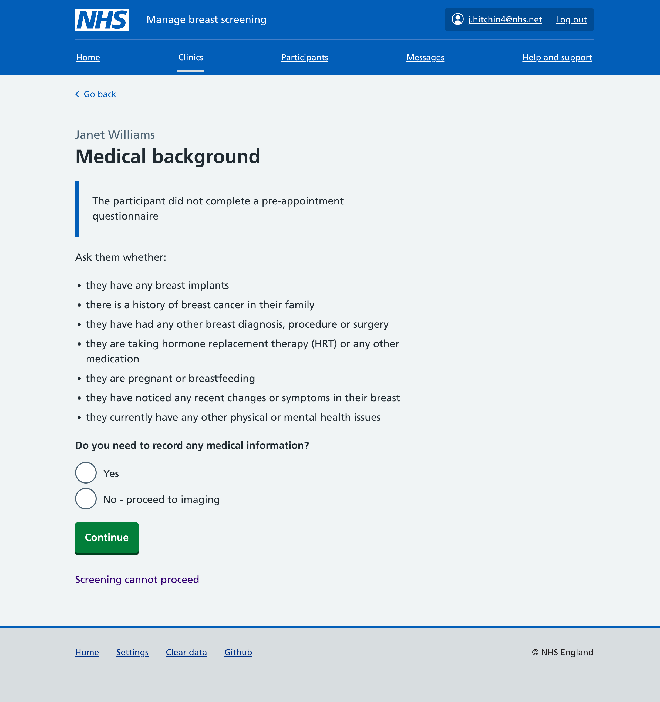
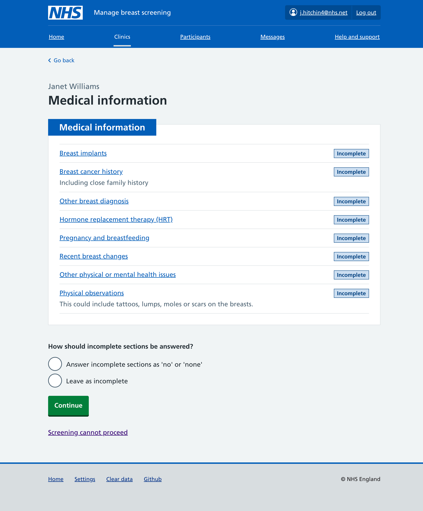
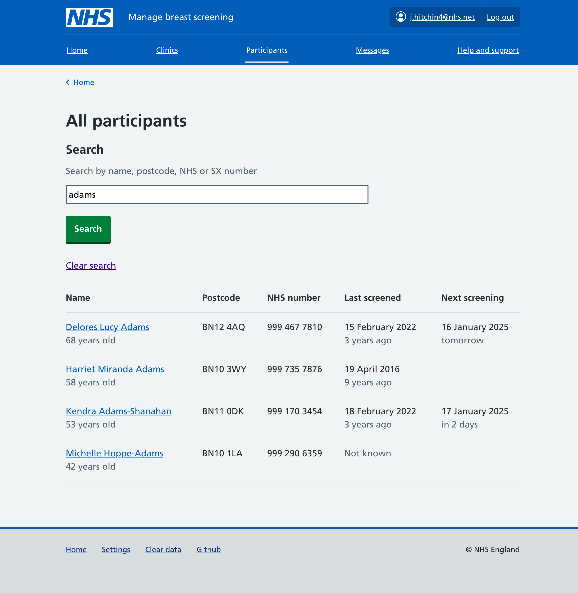
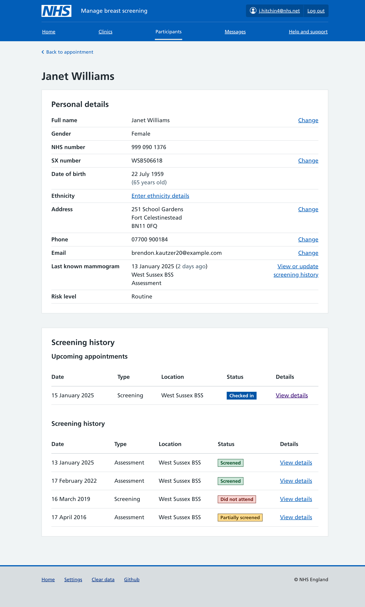
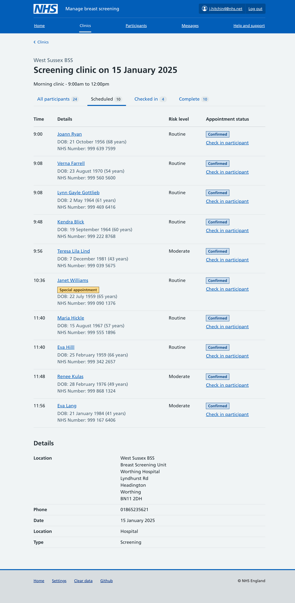
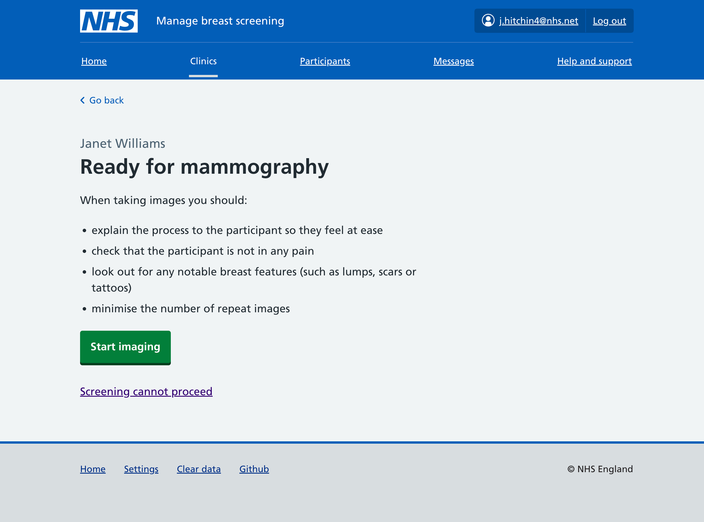
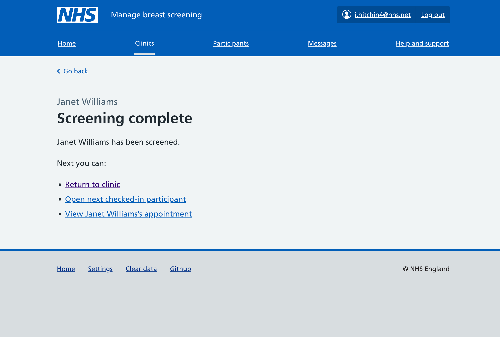
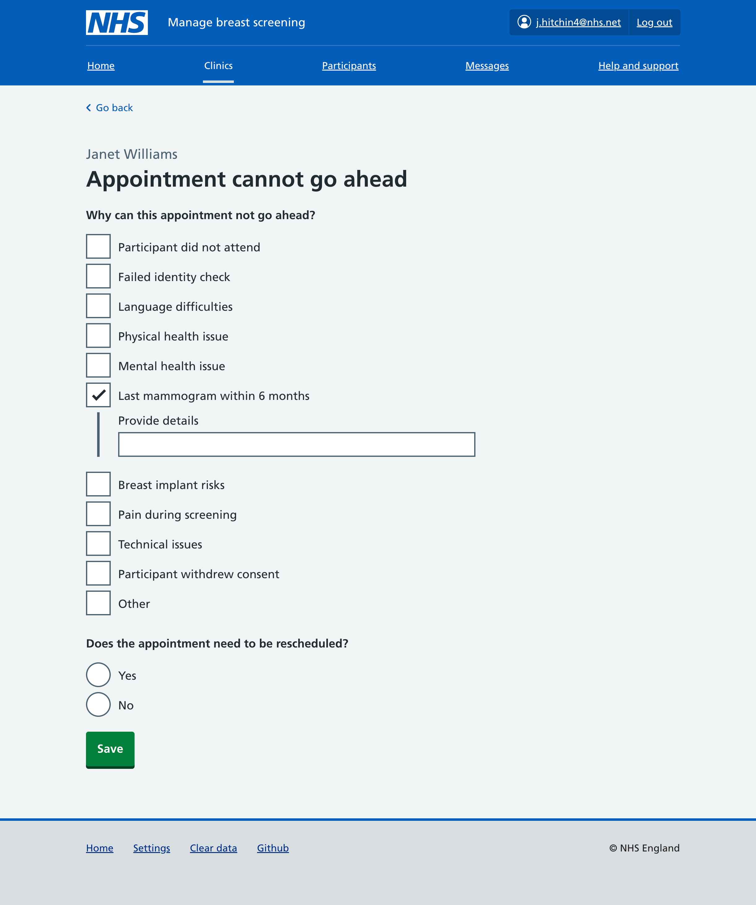

Our previous iterations didn’t focus much on medical information – they had an initial idea for being able to bulk answer questions in one go, but this wasn’t too clear to participants.

For this round we focused on refining the screening journey once a participant has been checked in.

## Reducing information on first appointment page

We’ve tried reducing the information shown on the initial screening event page – removing screening history and some participant information, and instead focusing on just the things the mammographer needs immediate access to.

We’ve also tried highlighting special appointments using a [warning callout](https://service-manual.nhs.uk/design-system/components/warning-callout) to ensure they are prominent.

## Iterating how medical information is collected

Our previous version had UI to let you answer multiple medical questions at once, but this was not immediately clear to users in usability testing. For this round, we have tried adding a guard question up front. If users answer yes, they can provide detailed medical information. If they answer no, then all sections in medical information section can get answered with ‘no’ or ‘none’.

The language of this is tricky though – are mammographers clear that answering ‘no’ to the guard question is also answering ‘no’ or ‘none’ to each medical information section? The alternative would be to leave these sections as unanswered – however the user may well have been asked this verbally – would we not want to record this?

If users say they have medical information to record they get a page to provide it.

### How it tested

Users felt that the initial guard page asked them to ask participants too much – they felt the list of bullets were a checklist to run through rather than a prompt for conversation.

On the medical information page, our use of task list was not clear. The intention was that users could still bulk answer multiple of these at once – but the use of the ‘incomplete’ tag implied to users that they’d need to go through each section.

## Participant views

Sometimes it will be necessary to look at participant data outside of the context of an appointment. Users have also told us they need to be able to search for participants – they might be called on the phone and need to look someone up, or a participant might turn up to a clinic and not be listed.

## Other changes

### Clinic list

The clinic list has been refined to show special appointments using a tag, and restructure the information shown in the table – including combining the actions column with appointment status.

### Mammography holding page

We added a mammography holding page after the medical information section to help steer the process.

### Screening complete confirmation

We added a screening complete page to be shown after the mammogram is completed. This provides links to the likely next actions – either to return to the clinic list, to go to the next checked-in participant, or to go back and view the participant they just finished.

### Expanded appointment cannot proceed

Our first version just had a text area and follow up action. We’ve now added checkboxes to collect structured reasons why an appointment is being stopped. For each of these there’s then an optional free text area to provide further context.

