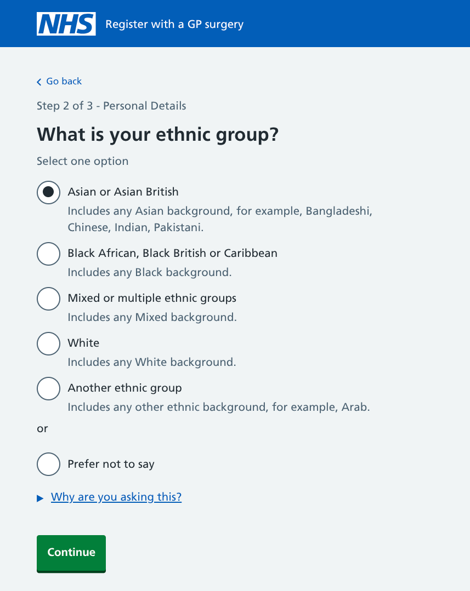
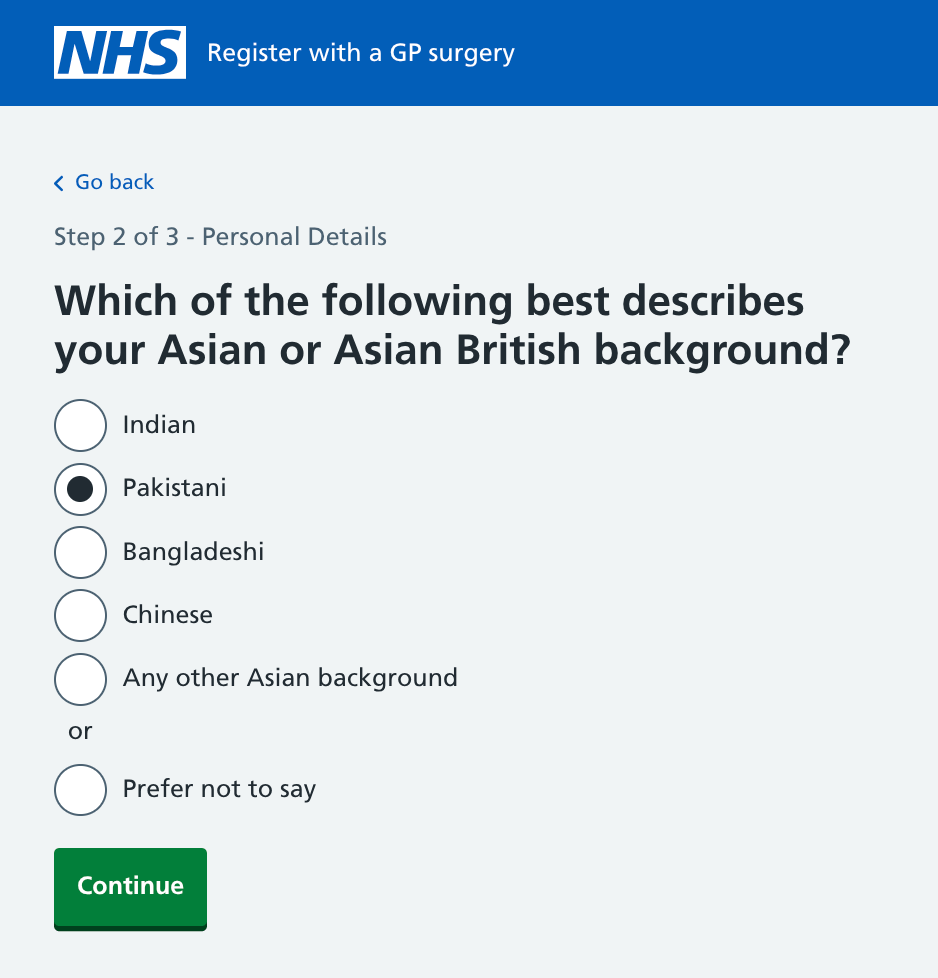
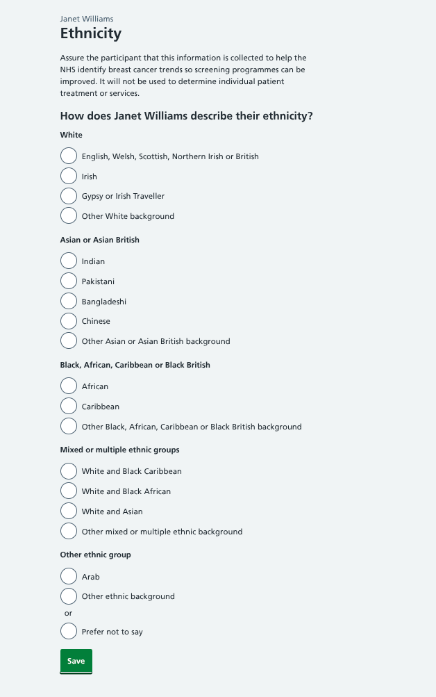
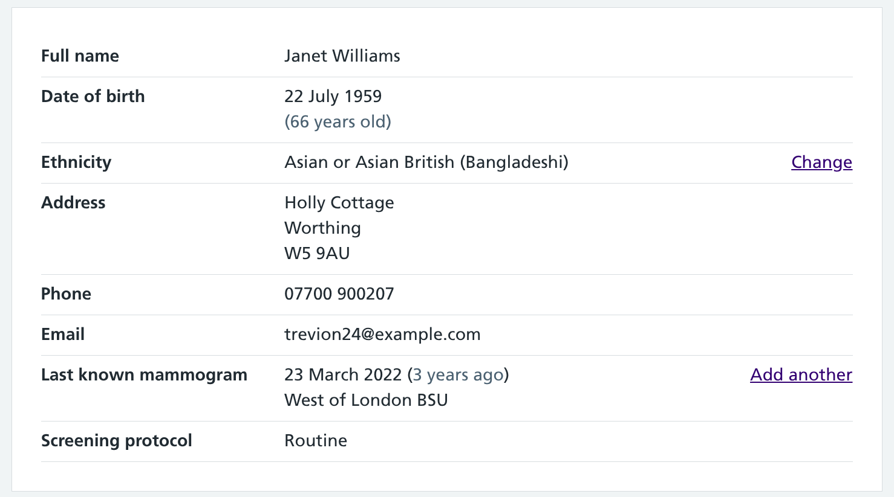

We're providing a way for the ethnicity of each participant to be collected during a mammogram appointment if we don't already know it. This allows breast screening units (BSUs) to meet data collection requirements set by the NHS.

## Why we need to know about ethnicity

Unlike much of the data collected from participants during a mammogram, establishing someone's ethnicity is not going to have any direct clinical impact on the outcome of their assessment or treatment.

But from the point of view of delivering an effective breast screening programme, this is essential information.

Part of the NHS mission is to deliver inclusive services. The more that is known about people, the easier it will be to identify trends and provide services that reflect their individual needs and circumstances.

The [Race Equality Foundation](https://raceequalityfoundation.org.uk/press-release/how-better-ethnicity-data-can-tackle-racial-health-inequalities-in-the-nhs-london-anti-racism-collaboration-for-health/) says:

> Particularly in addressing health inequalities, data plays a crucial role in identifying knowledge gaps. Through rigorous analysis, we can gain a deeper understanding of the challenges faced by specific communities, allowing for the development of tailored interventions to address inequalities in access, experiences, and outcomes.

## What we (may) already know

Across some areas of the NHS, ethnicity data is widely available. A [report from Nuffield Health](https://www.nuffieldtrust.org.uk/news-item/flawed-nhs-records-distort-our-view-of-ethnic-health-gaps-study-shows) published in 2021 on hospital, A&E and community services data found that only 13% of inpatients and 17% of outpatients did not have a known, stated ethnicity recorded.

But that data is not always reliable:

- People within some minority groups will often have different ethnicity codes assigned on different systems
- There is a general overuse of 'other' categories (for example, 'Other Asian' rather than 'Bangladeshi')
- Fewer 'mixed' ethnicity patients are recorded than would be expected based on representation across the UK population

Participant data at BSUs is sometimes syncronised with other NHS sources, but often any ethnicity data will be either held in isolation (if recorded during a previous mammogram) or not available at all.

Part of the goal of digitising the breast screening service will be to collect and store standardised information (including ethnicity) that works with systems across the organisation.

## Making it easy for mammographers

Ethnicity data is not typically captured during breast screening appointments and will be a new requirement that mammographers will be asked to complete.

We are expecting this to be met with some pushback from them. [Guidance from digital.nhs.uk](https://digital.nhs.uk/data-and-information/data-collections-and-data-sets/data-sets/mental-health-services-data-set/submit-data/data-quality-of-protected-characteristics-and-other-vulnerable-groups/ethnicity) suggests:

> Research has shown there are a number of reported barriers in the collection of ethnicity data in the UK. This is mainly due to a lack of knowledge from staff about the importance and use of data, alongside patients' perception of how data is used, specifically concerns that the information will be used to discriminate against them.

Anecdotal evidence from those working in BSUs suggests they do not like raising this topic during appointments. Having a mammogram can be an awkward experience already, and asking questions about ethnicity is unlikely to make the situation any more comfortable.

Some of the user testing we'll be conducting will evaluate the pros and cons of making this a mandatory or optional journey.

## Picking the right data approach

Our starting point for recording ethnicity was to look at the [data set guidelines provided by NHS Digital](https://digital.nhs.uk/data-and-information/data-collections-and-data-sets/data-sets/mental-health-services-data-set/submit-data/data-quality-of-protected-characteristics-and-other-vulnerable-groups/ethnicity).

This sets out 18 standard codes that should be used when designing services so the data can be integrated efficiently into other systems.

A is 'White – British', B is 'White – Irish' and other communities are represented throughout the alphabet up to Z for 'Not stated'.

The accompanying information states:

> NHS organisations are mandated to use ethnic monitoring questions and response codes set out in the NHS data dictionary, which are based on the Office for National Statistics (ONS) 10-yearly Census.

However, further reading shows that this categorisation was derived from the 2001 census.

The [data dictionary](https://www.datadictionary.nhs.uk/attributes/ethnic_category_code_2001.html) does suggest "The ONS has developed a further breakdown of the group from that given, which may be used locally."

A more recent pattern using ONS data from the 2021 census is available on the [GOV.UK design system](https://design-system.service.gov.uk/patterns/equality-information/).

As well as adding to and amending the list of ethnic backgrounds, the major change over the past 20 years has been the introduction of ethnic groups. This can be seen on services such as Register with a GP surgery, which asks users to select their ethnic group, and then a background.

## Adjusting the pattern to meet our user needs

This makes sense when a person is self-selecting their ethnicity, but users of our service will be mammographers asking this question to participants, and then having to interpret the answer.

With a two-step process, if the participant responded "I'm Sri Lankan", users would first have to select the ethnic group they think that will come under, then see if there's a relevant option to reflect the answer. In this case, that would be 'Any other Asian background'.

The initial solution we have implemented presents the available options on a single screen, with headings separating each ethnic group. The assumption is, this saves the user a click and takes away any need to assess in which group an ethnic background may be – as they get to know the service, users will instinctively know where on the list to look.

Behind the scenes, these are matched to the standard NHS ethnicity codes allowing our service to be cross-compatible with other systems.

In contrast to the Register with a GP surgery service which lists ethnic groups alphabetically, we have chosen to order the options by commonality. According to the 2021 census, the ethnic breakdown of England and Wales is:

- White - 81.7%
- Asian - 9.3%
- Black - 4.0%
- Mixed - 2.9%
- Other - 2.1%

Prioritising the most frequently selected options should make it simple for users to find the one that's most relevant.

### Supportive rather than prescriptive text

NHS advice for practices from the [Conversational Guidance for Data Collection](https://www.england.nhs.uk/london/wp-content/uploads/sites/8/2023/02/Patient-Ethnicity-Data-Posters-November-2022.pdf) document suggests those collecting the data use the phrase "What would you be comfortable with us recording your ethnicity as?"

Mammographers are all likely to approach this slightly differently, so we have simplified the question to "How does [NAME] describe their ethnicity?". This is accompanied by a short explanation of why this data is being collected to reassure any participants questioning the motives for this.

After saving this information, the user is returned to the appointment information screen and given the option to change their selection if any errors have been made. This 'Change' option is also available if ethnicity information already exists for a participant.

## Initial tests

The feedback from mammographers has been generally positive so far.

While it's not something they particularly want to be doing during an appointment, if it's something they must do then the flow we have designed is a satisfactory option.

There are some specific themes that have come from discussions which we are considering for future iterations.

### Form length

Unlike many of the questions used within the service that only have a few answers to select from, this page features 19 options. We need to test further the tradeoff between a longer list, and a two-step selection which means fewer options, but extra clicks.

There is also a solution to explore around using autocomplete functionality where users can begin to type and the suitable answers are displayed to select from.

### Classification

Feedback has suggested that 'Arab' should not be grouped under 'Other'.

While we want to reflect the reality of how people identify, we are also keen not to reinvent the wheel and to stick closely to the work done by the ONS. Ethnicity has been a question on the census since 1991 and it has gone through various iterations since then – for example, the Chinese ethnic group moved from 'Other' to 'Asian' in 2011.

There are risks to the compatibility of data if each service collects data inconsistently. We plan to monitor any future changes to standard patterns and incorporate the latest iterations into our service.

## What we're doing next

As well as continuing to iterate this journey following user testing, this work has led to some other tasks to add to our backlog.

### Data synchronization

Ideally, ethnicity data will be entered once and available across the NHS ecosystem through patient records. If this field is available from the core NHS data, we aim to pull this infomation into our service and remove the need for mammographers to collect it separately. Conversely, we plan to feed back any data we have collected to update the central database.

We need to explore how this would work and consider the implications of conflicting ethnicity information.

### Data compatibility

The datasets we have identified are a good starting point, but for full cross-compatibility with medical and non-medical systems we need to consider how the ethnicity codes we're implementing map to standards such as SNOMED CT (the Systematized Nomenclature of Medicine Clinical Terms).

### Pre-appointment data collection

If it's not already in the system, the ethnicity question is a prime candidate to go on a questionnaire that would be sent to participants before their mammogram appointment.

This will take the burden off mammographers from recording this information, while allowing participants to follow a self-selection path that they will recognise from other government and NHS services. A back-up option would still be there for mammographers to record this information or change it if any obvious errors had been submitted.

This is currently out of scope, but we are earmarking which elements are most suitable as we build each data collection journey.

### Pattern development

As the standard ethnicity patterns available through the GOV.UK and NHS design systems focus on user-entered data, we plan to share our work on a clinician-facing version for use elsewhere once further tests have been conducted.
