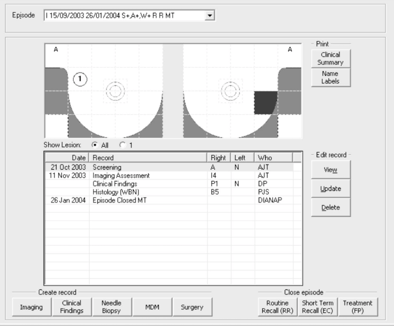
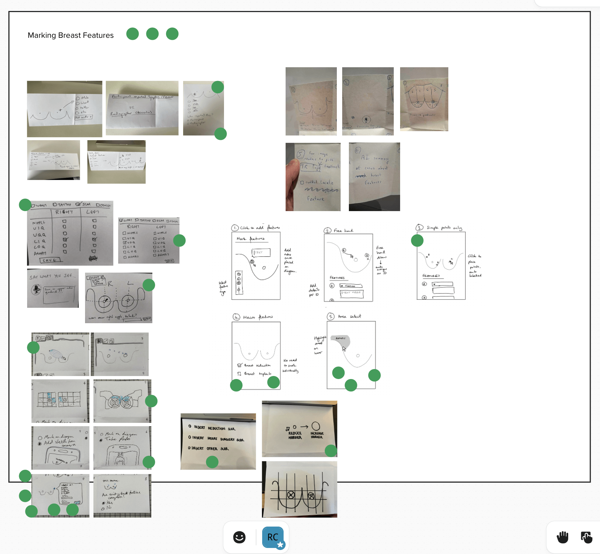
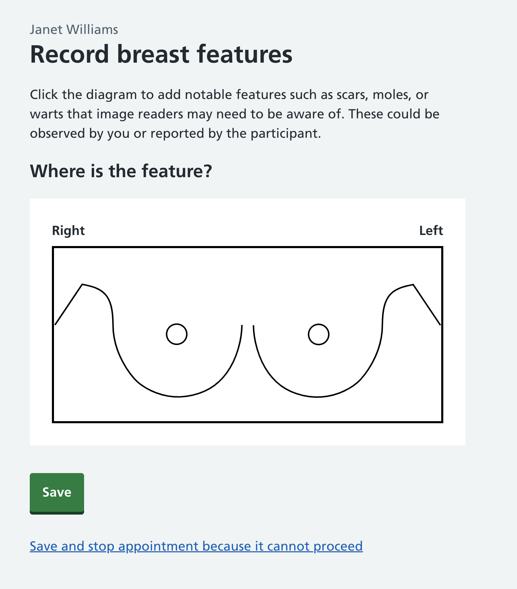
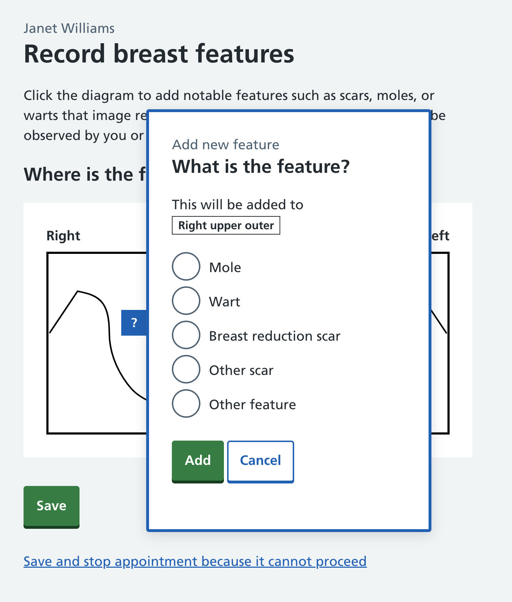
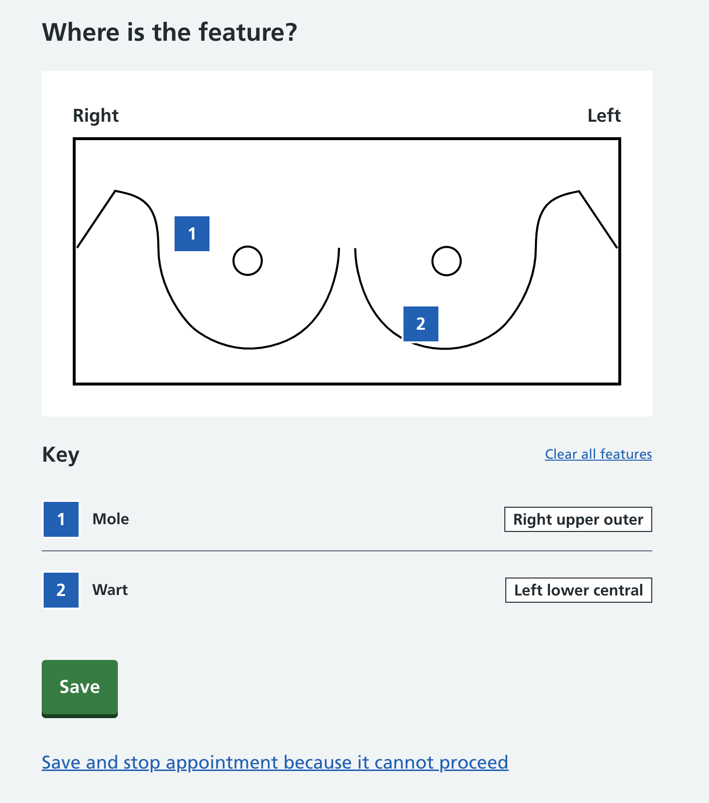
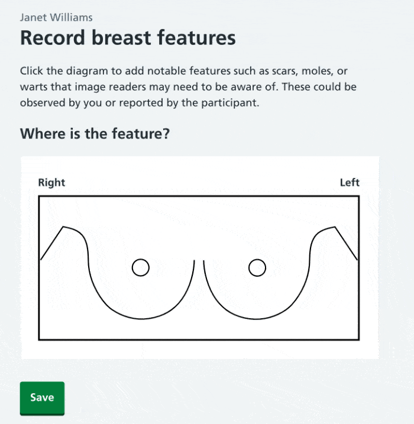
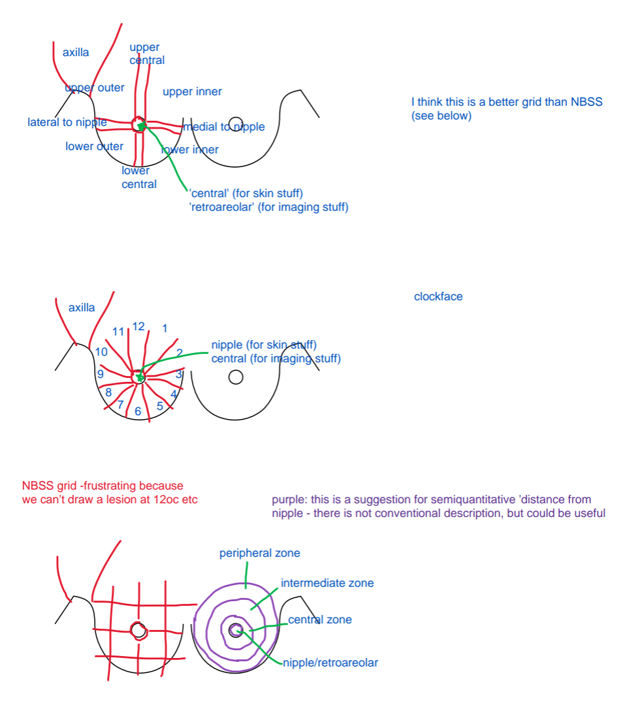

We’re designing a way for radiographers to record breast features on a diagram, so that this information can later be used by radiologists during image-reading. Breast features include things like scars, moles and warts which can affect the appearances on the mammogram.

## What's the user need?

During screening, medical information is captured. This includes breast features like warts, moles, scars or tattoos. Radiologists review mammograms at a later stage and use the annotations made during mammogram to explain changes on the mammogram. For example, if they see something suspicious on the mammogram, they can cross-check with the annotated diagram and see that a scar is in that location, that can avoid them needing to call the person back for assessment.

## Existing tools and their drawbacks

Breast features are recorded on a paper form or within the NBSS software.

Paper offers pros and cons: while drawing on paper offers an easy way for radiographers to record visual information, it also produces unstructured, offline data. It’s also difficult to amend errors.

NBSS uses a grid on a diagram to create annotations, which is a step towards structured data. However, users have told us about various issues with recording on the grid. Some areas of the grid where a mark needs to be recorded – such as immediately left or right or above or below the nipple – can’t be selected, so NBSS’s annotation tool doesn’t allow users a necessary level of accuracy.

## Starting with the wisdom of the team

We kicked off this work with a sketching workshop to access the team's wisdom, context and experience within this space.

We ended up with lots of interesting ideas and threads to explore, which formed a starting point of a prototype.

Through the process of discussing the problem and voting on the best ideas to take forward, we also gained a shared understanding of the problem and consensus on our next steps.

## Annotation methods

There are two main mechanisms that people can use to annotate a diagram: picking a point (mapped to an area) or drawing a mark.

We have an assumption that most users – at least right now – will be using a desktop computer, rather than a tablet. Drawing digitally using a mouse or trackpad isn’t easy or especially accessible. Drawing marks, aside from being a trickier way to annotate compared with clicking a point, also provides more detail than is required by radiologists at the image reading stage.

For a MVP annotation tool, we wanted to keep it as simple as possible and iterate as we learned more from our users.

## The prototype

The prototype allows users to click on a diagram to add a mark. The mark shows up with a number on the diagram and a key shown beneath it. Marks added can be moved, edited and deleted. When a mark is added, we use the map of locations our subject matter expert (Dr Louise Wilkinson) has provided to display a text description of the location.

## Diagram with no features added

This is what the user sees when no features have been added.

## Adding a feature

When a location has been selected, the user will see a popover asking what the feature is. They can select mole, wart, breast reduction scar, other scar, or other feature. We are very likely to iterate this list as we try to prioritise the most common types of features, while also allowing enough flexibility for customisation.

## Features added, key shown

The diagram below shows two features added to the diagram, with the locations displayed next to them.

## Mini GIF demo

## Designing with our subject matter expert

We worked with our subject matter expert, Dr Louise Wilkinson, to refine the locations shown in the diagram. It was important to get the right level of location accuracy when adding a mark on the diagram.

She kindly drew some options for us to explore in our prototype. The top diagram’s locations and names were used to inform our prototype's locations.

## Next steps

Our next step is to test this with our primary users – radiographers. We’ll need to make sure the tool is usable, that we’re allowing them to capture what they need, and that the diagram is easy to understand by both radiographers and radiologists.
