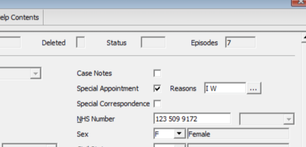
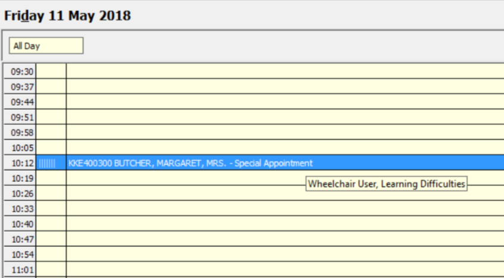
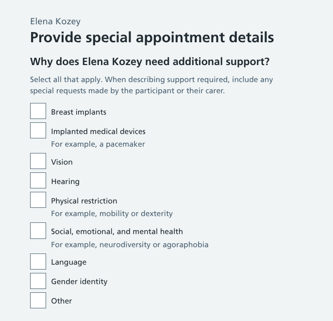
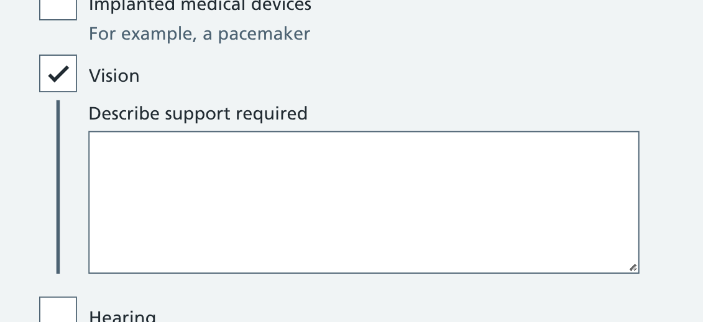
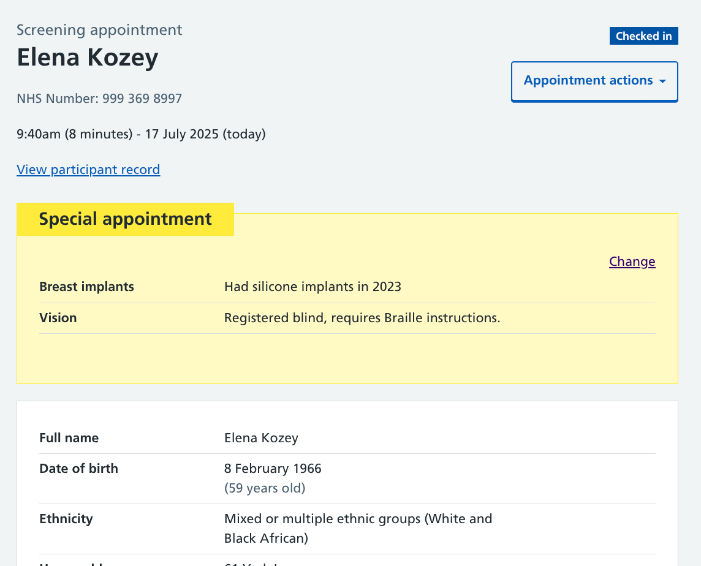
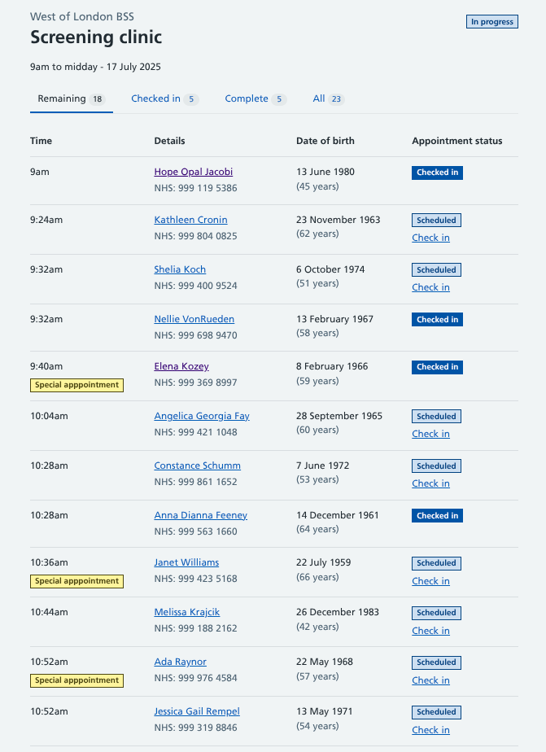

Radiographers and clinic admin staff need to know if people attending breast screening require any additional support. This is so they can arrange reasonable adjustments that will allow their mammogram to be completed successfully.

These are known as ‘special appointments'. We’ve been working on ways for users to record and view the necessary information.

## The existing process

Breast screening clinics use the National Breast Screening System (NBSS) to manage mammogram appointment information. When you view a participant in NBSS, a ‘Special Appointment’ checkbox is provided alongside other information such as their name, date of birth and NHS number.

> [!NOTE]
> The following screenshots from NBSS do not contain any real patient data

When this checkbox is ticked, a list of available ‘Reasons’ is presented to users, each with a distinct code.

After the reasons have been given, the text ‘Special appointment’ is appended to the participant in the clinic appointment list. This will typically result in a double-length appointment, with a visual indicator for those managing the clinic so they can prepare the required adjustments.

## What users told us

This isn’t a frequently accessed feature within clinics – only around 2-3% of slots need to be marked as special appointments, with the majority of those for breast implants.

But it’s a critical one for users, especially clinic admin staff who need to review the upcoming special appointments and prepare accordingly, often days in advance. This could be anything from allocating extra time to organising for an interpreter to be present.

During our research, we’ve discovered some common issues to consider as part of our redesign.

### The flag may be missed

Special appointments are included very subtlety within the digital clinic list. And when a clinic sheet is printed, the field is not included as one of the selectable options. Users have told us of instances where special appointments have been overlooked meaning the required adjustments were not ready for participants when they arrived.

Having to hastily arrange something or reschedule the appointment creates frustration for both the clinic staff and the participants.

### Reasons create confusion

When selecting a reason, the list of available options contains many potential overlaps. For example, a participant could logically have their issue marked as Registered Disabled, Physical Restriction, Wheelchair User and Mobility.

The ordering of reasons also makes it difficult to pinpoint the appropriate options. The list is not organised alphabetically or by theme, with physical, mental and social impairments spread across the options.

### There's nowhere to record details of reasonable adjustments

After selecting the relevant reason(s) in NBSS, there is no dedicated field where details of requirements can be added.

The client record and the appointment both have separate ‘General comments’ fields, but these aren't dedicated to this purpose and may contain other information. There’s inconsistency across breast screening units (BSUs) in which method is used to log special appointment information.

## Creating a solution

Special appointment information could theoretically be reported in a pre-appointment questionnaire, or merged from patient information held elsewhere in the NHS. But for our initial designs, we’re focusing on the manual addition of special appointment details at any time before, during or after an appointment.

This covers scenarios such as a participant calling a clinic in advance to share information (such as severe anxiety, or a broken arm), or a reason being uncovered by the radiographer while chatting to the participant in the mammography room.

### Entering the workflow

A lot of work has been done to remove clutter from the appointment page so users could focus on the most important information at the stage (being able to ID the participant). To keep things clean, we’ve grouped the option to make an appointment ‘special’ with a selection of other appointment related actions within an action button.

Selecting this option takes the user to a list of special appointment reasons, with multiple selections permitted.

The options have been adapted from the NBSS list and aligned more closely with the [NHS reasonable adjustment flag](https://digital.nhs.uk/services/reasonable-adjustment-flag), to allow for easier synchronisation across other NHS services.

It’s not a direct mirror however, as we’ve had to consider the specifics of breast screening clinics and the types of scenarios they encounter.

For example, a participant with breast implants may require a specialist radiographer who can use the [Eklund technique](https://radiopaedia.org/articles/eklund-technique) when taking images. Someone who does not identify as female but still requires a mammogram may prefer an end-of-day appointment.

### Recording reasonable adjustments

Each checkbox triggers a free text box where users can ‘Describe support required’.

We have opted for this over more structured data methods due to the variability of what could be entered here. For example, we could provide a language selection option, but this brings added complications, and would likely require a text explanation regardless.

### Temporary reasons

During our research, we’ve determined a potential need to mark some reasons as temporary. This could be a broken limb that affects a participant’s mobility, or a medical condition that’s affecting their vision.

These may be a consideration for any immediate follow-up appointments but will be irrelevant when they’re next invited for screening in 3 years' time. To accommodate this, we could make temporary reasons expire after a certain period of time or only associate them with a screening episode or event.

While we explore the pros and cons of each solution, it’s likely for the first iteration of this feature we will allow special appointment reasons to be quickly edited or deleted so users can easily remove anything that’s no longer relevant.

## Displaying recorded information

The special appointment information is visible in various places in the service.

### On the appointment

We wanted to make sure this information was hard to miss, so have added it as a prominent [warning callout](https://service-manual.nhs.uk/design-system/components/warning-callout) before the participant’s identity details.

### On the clinic list

Participants with a special appointment can also be easily identified within the clinic list by the yellow tag next to their appointment time.

We will be building features to allow clinic staff to search and filter by special appointments across clinics and date ranges. This will help them when planning the adjustments needed in future.

## Initial feedback

We’re yet to introduce this to users, but it has been demoed to subject matter experts and clinical assurance teams.

These discussions have given us confidence that our proposed solution is a workable one that we can take forward for further testing. The majority of questions have been around temporary reasons, which has led to this being de-scoped from the initial build.

## Further development plans

As well as plans to iterate this feature based on user feedback, we have added various items to our backlog to look at in future, including.

- **Adding a quick view** – Replicating the tooltip functionality in NBSS, it will be helpful to let users on the clinic list see a summary of special appointment reasons without having to open each appointment.
- **Ordering reasons by commonality** – We can explore NBSS data and other services recording reasonable adjustments to see if any should take priority.
- **Date and name stamps** – It could be useful for those looking at notes to know who added them and when, especially if they need additional information.
- **Connecting data fields** – There are other parts of our service where similar questions are asked, for example breast implants and medical devices sit within our medical information journey. We need to make sure any details collated here can be fed into that section, and vice versa.
- **Triggering extended appointment times** – We're currently working on the assumption that admin staff will adapt appointment times manually, but it’s feasible that adding a certain reason could automatically update the appointment duration.
- **Syncing information with invites** – If we know a participant has language or learning difficulties, we could dynamically insert a note within their invite message to bring along someone to support them during their appointment.
