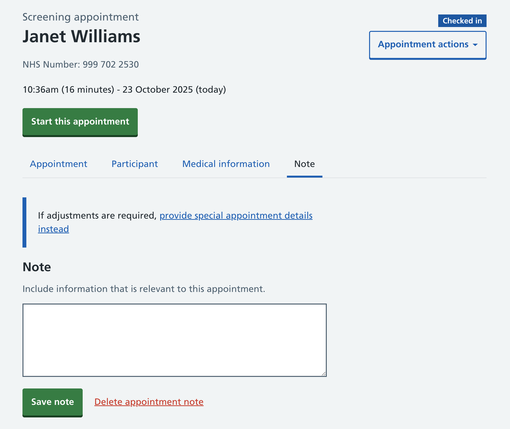
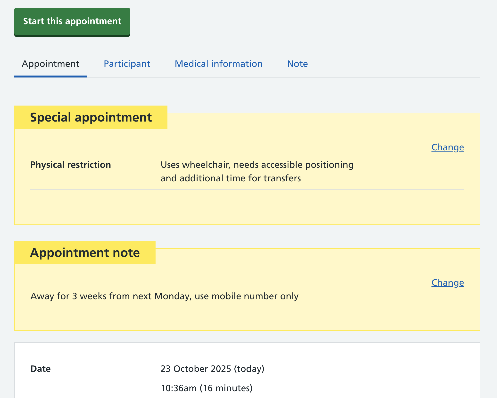

We’re exploring adding an appointment note. An appointment note highlights relevant information about a participant's screening appointment to admin staff and mammographers.

## What’s the user need?

What and who are appointment notes for? We already have a way for users to add special appointment needs: for example, if a participant needs support with vision or mobility. Participants may have other needs which should be highlighted in a screening appointment for additional support, for example, if they’re: 

* facing a difficult personal circumstance and feeling sad
* being away and uncontactable for an amount of time
* nervous and need support 
* experiencing pain during imaging 

## What notes shouldn’t include 

As mentioned above, we already have a way to capture special appointment needs. We also already have a way to capture medical information, both in a structured and a free-text way, so we want to discourage the appointment note being used for these purposes. We’ve added a callout to steer users towards adding a special appointment if that’s more appropriate for what they’re capturing. 

The appointment note offers users a degree of freedom outside of a structure, so in practice, we’ll need to monitor how this is actually used by our users. 

It may also expose interesting gaps in our product that we’ll need to find a better way to support. 

## Screenshots

## For the future 

There are other kinds of notes we may want to show in our product: 

### Radiologist notes for image reading

We’ll likely need a way to add notes for radiologists that will inform their medical opinion when reading images. In addition to the breast features diagram, radiologists would benefit from notes to help them decide:

*  if an image is classed as normal (if, for example, the participant has lost a significant amount of weight)
* whether to do a technical recall
* or a note to explain why an image isn’t perfect (for example, no paddle is available). 

### Notes for record keeping and audits
We may want to allow notes being captured for record keeping, for example, recording that a participant has been told to see their GP if they are in pain. 

### Examining how notes are used in reality

Notes add a way to add information in an unstructured way, and although we have purposes and reasons for adding notes in mind, we often find that our users surprise us. 
