We’ve been working on some changes affecting navigation between stages of a screening appointment. We’ve been calling this the ‘workflow’ to distinguish it as a distinct journey for use by mammographers during the appointment - separate from viewing an appointment record.

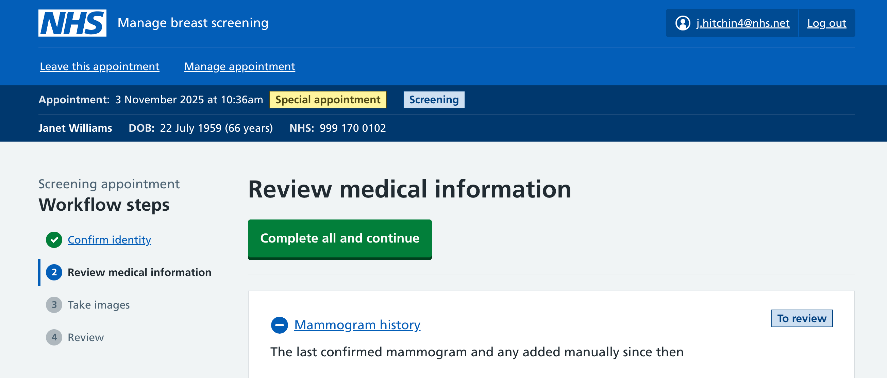

Our aim is to help facilitate the appointment, make them consistent and ensure certain actions are completed. Recent changes improve navigation between stages, while enforcing some sections and a workflow sequence.

## What we had before

Our mammogram pages were linear, moving from one to the next.

The stages were:

- confirm identity and that the last mammogram was not within 6 months
- confirm there is no medical info to add (or else go to a page to add it)
- take images
- review

This matches the ‘ideal’ appointment, but in user research with mammographers we found scenarios where a fixed order wouldn’t always work, and where we needed flexibility to return to sections easily and quickly.

### Can the appointment go ahead?

Our existing journey started with a question about whether the appointment could go ahead.

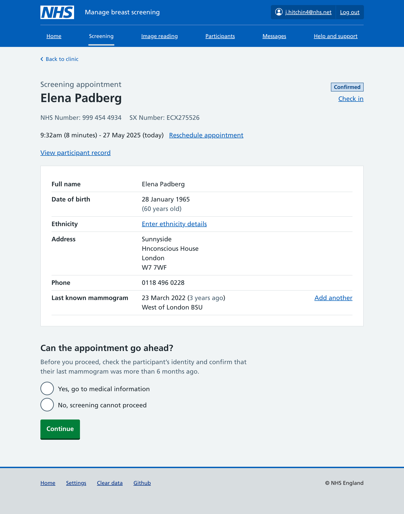

This initial guard question signified that the appointment had started. Users had to confirm the participant’s identity at the start, and also check they’ve not had a recent mammogram.

We saw several problems with this design:

1. Before the appointment, there’s no way to see prior medical information. What if a participant calls up in advance to let us know about something - how can it be checked? The only way to get to medical information is to start the appointment - even though it’s not actually started.
2. At the start of the appointment, you must say the appointment can go ahead before you can get to medical information. What if we know the appointment shouldn’t go ahead, yet we also want to add medical information?
3. On the appointment page there is a summary list row showing their last known mammogram, with ability to [add details of reported mammograms](/manage-breast-screening/2025/06/recording-previous-mammograms/). If a participant reports one less than 6 months ago, should it be added here first? or should the mammographer say the appointment cannot go ahead? if they choose the later, we won’t actually collect details of the prior mammogram.

### Medical information guard question

On the next page we had a guard question asking about medical background as a way of prompting a conversation with the participant and skipping past the medical information page for the common case where there’s nothing to add.

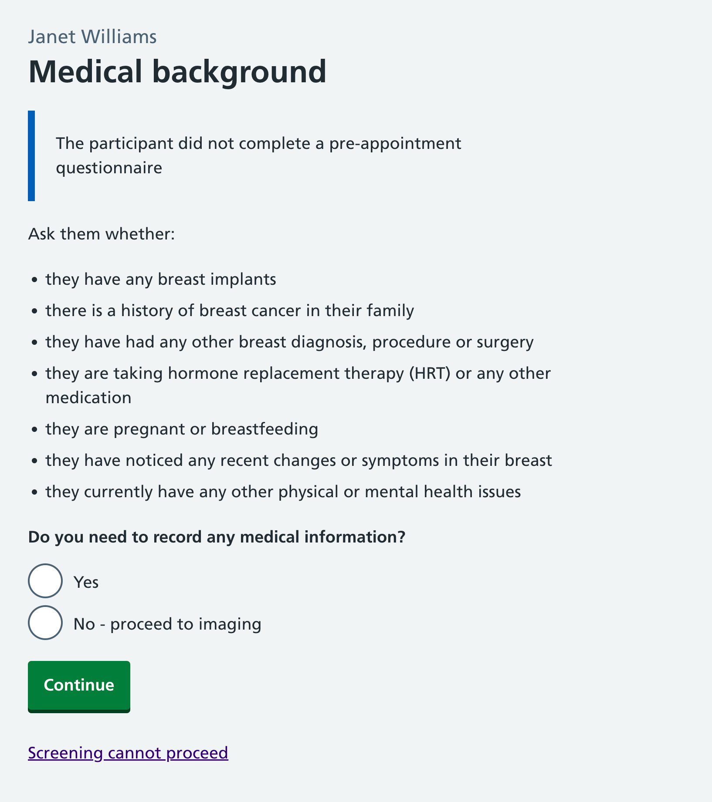

This page emulated the conversation mammographers already have with participants - asking them a series of unstructured questions about any current concerns and medical history, and in the common case where there’s nothing to add, moving forward to take images. We’ve found that breast screening units can be quite varied in how these conversations go, including what’s asked about - and our hope was that this page might help standardise the key things that are important to be asked.

In user research we had team members pretend to be participants arriving for screening so that we could simulate these conversations. For the common case of ‘nothing to add’, this page worked fine. But for a case where our team member said they had history of breast cancer, the mammographer had indecision - should they continue with their conversation running through these bullets, or should they immediately answer ‘yes’? If they try to continue the conversation, how would they remember what they needed to later add? The participant may want to immediately go in to detail about the thing, but the mammographer needs to remember it so they can add it later.

### Medical information

Where there was some medical information to add, we had a long page that was designed to capture relevant elements of the participant's medical history.

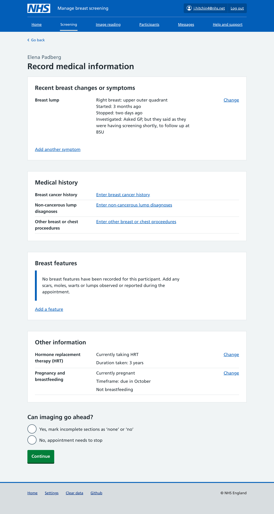

One thing we wondered was whether we could skip the medical information guard page and just come to this page directly. Our concern was that whilst this page links to everything you might want to add and not easily scannable or supportive of the conversation mammographers have with participants. If we’d like to help standardise what’s asked about, this is too detailed to be helpful.

### Summary of issues

Navigation: Need to be able to get to medical information without starting the appointment, and add to it even if you know the appointment cannot go ahead.

Medical information can be lengthy and detailed, but most of the time there’s nothing to add. We need to facilitate and standardise the conversation, while allowing detail to be added in place when necessary.

## Our new workflow

Our changes are subtle, but we hope will address the issues and be flexible for the future. They mostly relate to navigation between existing stages, and keeping track of what you’ve done.

We’re introducing a dedicated mode - the 'workflow' - that will be distinct from viewing the appointment. We somewhat had this already but are now being more explicit about it - referring to it as a thing, and making it visually distinct from looking at the appointment. The aim is to help guide and support screening appointments, partly acting as a checklist / reminder. We think a separate mode is necessary because it allows us to have dedicated interface asking things like ‘Have you checked x?’ while not cluttering views in other contexts such as checking information on the phone.

Here’s a video moving through all the stages with no medical information to add:

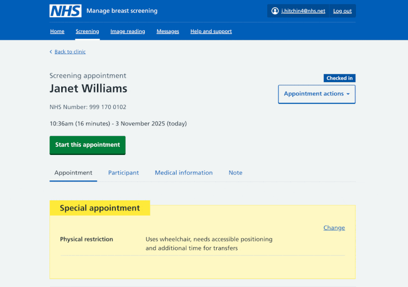

When not in the workflow (running the appointment) we maintain our prior appointment page:

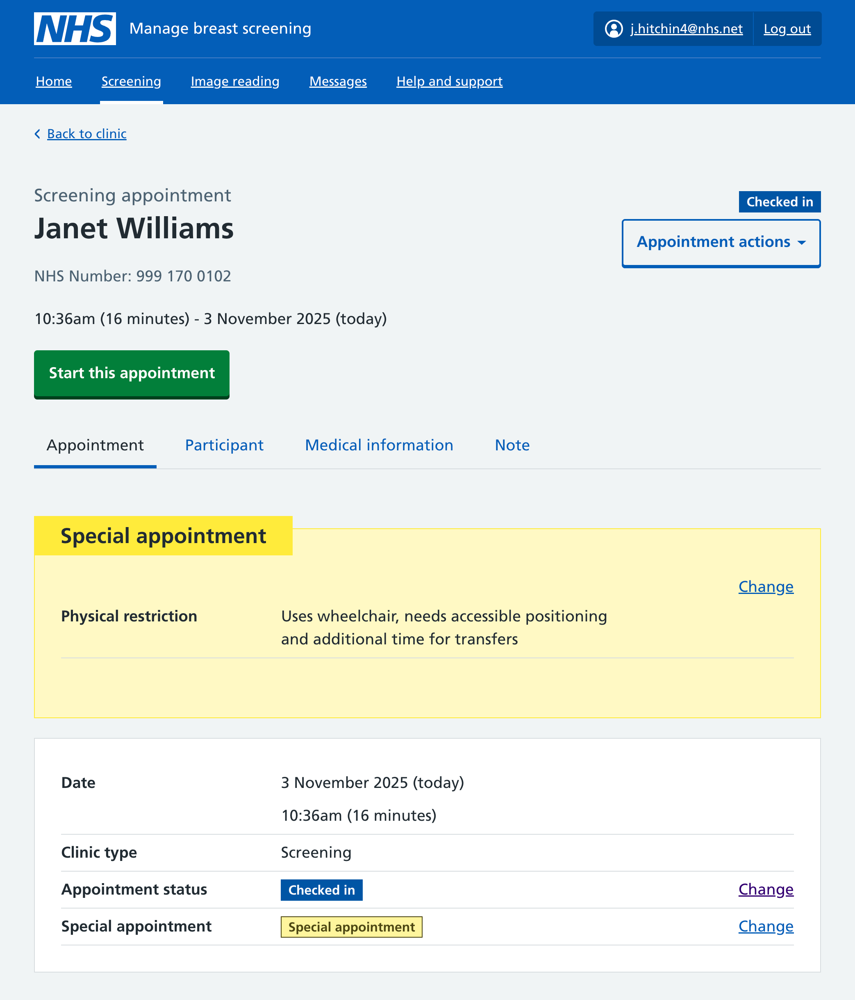

This view now includes participant and medical information tabs allowing access to this information outside the context of running an appointment. We’ve introduced a new ‘Start this appointment’ button which launches the workflow. We’ll use this button to transition the appointment status to ‘in progress’, track who is doing the appointment, and when it started.

### The key stages of the workflow

We’ve identified four stages we think it’s important appointments go through, but allow for some freedom in moving between them. Our sages are: confirm identity, review medical information, take images, review. These are close to the pages we had before, but we’re now explicitly showing them in a new secondary navigation. You can only get to the next after completing the ones before it - but you can still use the navigation to return to sections. We’re experimenting with showing a green tick on sections you’ve completed as a checklist of steps that all stages appointments should go through.

### Reviewing medical information

Our medical information page has several new interactions that we’re testing as a way of facilitating the conversations mammographers have with participants, while also allowing detailed data collection.

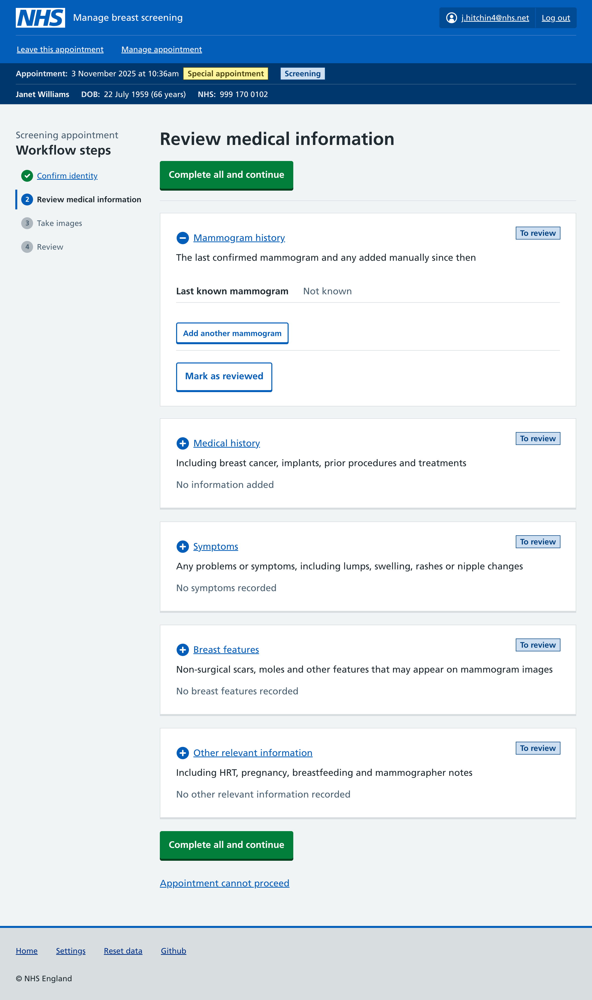

We’ve grouped medical information in to five sections: mammogram history, medical history, symptoms, breast features, and other medical information. Each of these is within a customised expander component. When collapsed they show a summary of sort of information suitable for the section, and counts of any items that have been added. The aim is that when collapsed, the subtitles should be sufficient to support the conversations mammographers have with participants. If something comes up in conversation, the section can be expanded to provide detail there and then.

We’re also experimenting with having a status tag ‘to review’ for each section. When expanded, each section has a button ‘Mark as reviewed’ that updates the status of the section, collapses the current section, and expands and scrolls to the next section. This somewhat emulates a checklist - someone could click through each in turn:

At the moment using these ‘reviewed’ statuses is optional. A mammographer could choose to leave them and use the ‘Complete all and continue’ button when they’re done at the end. Or they may use them to help ensure each section has been reviewed - we’ll evaluate how things test in usability testing and see if there are any preferences. We anticipate we may later have some sections where we want the mammographer to explicitly acknowledge they’ve asked about it, and this provides a mechanism to do so.

Here’s what medical history might look like before anything has been added:

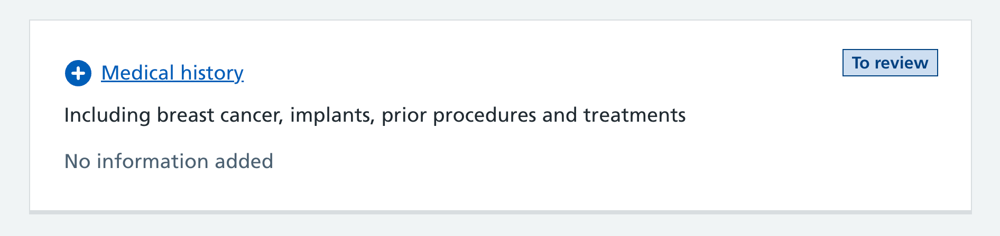

If there’s nothing to add, the mammographer could mark it as reviewed, or just move on - their choice. If there’s something to add, they can expand it to reveal UI for all the [different sorts of medical history we might need to collect](manage-breast-screening/2025/09/capturing-medical-history/).

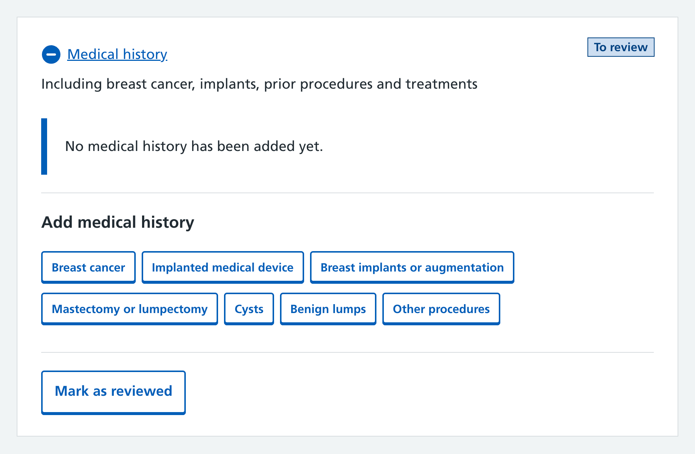

Once they’ve added an item, it’s shown inside the expanded section.

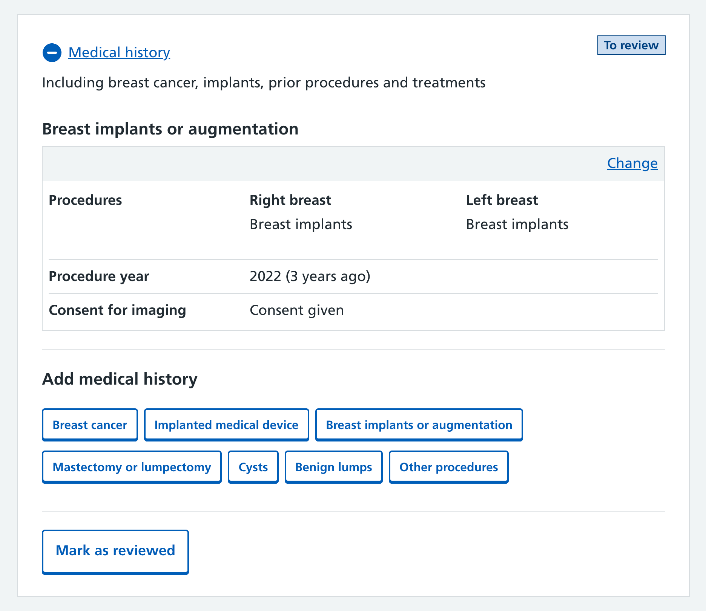

Once reviewed, the collapsed expander shows that an item has been added. In the future we could look at whether we can dynamically show a summary of what’s been added.

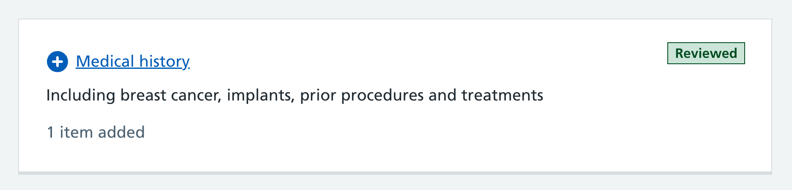

### How it’s testing

In usability testing the workflow seems to support appointments well - providing access to the right sections at the right time. Having a dedicated mode for the appointment allows us to have bespoke UI tailored for different situations, and to track status as sections are completed.

We’ve also identified a few issues with the workflow. Firstly a dedicated mode means many views are accessible from two different contexts. We worry about the risk of confusion between them. We’ve seen this in usability testing - mammographers forgetting to start the appointment and working from the non-workflow screens instead. If they don’t start the appointment we won’t track who’s doing it, and the participant will still show as checked in and available for other mammographers to collect.

Secondly, mammographers can think they have to ask about all items displayed on screen since they currently ask about everything on the screening forms they use. Our design does not intend this. For example, ‘Other medical information’ should only be recorded if it comes up, not routinely asked about, to avoid extending appointments.

Finally there is uncertainty over how to show that something has been reviewed or confirmed. Mammographers want to demonstrate that they have done their job thoroughly, especially in case of later review or audit. For example, when a participant reports no symptoms, some staff prefer to record this explicitly as no symptoms, whereas others feel that marking no symptoms too early could cause problems if symptoms are later observed during the appointment.

The phrase mark as reviewed was introduced to strike a balance as it means that the information has been checked for now, without implying that the situation cannot change.

# Next steps

Usability testing alone cannot confirm whether the issues mentioned above will persist in live use, as staff may adapt their behaviour when using our service multiple times outside of research sessions.

While we will continue to test the the workflow, we're at a stage where we are likely to wait until we can observe some live users of the workflow before making any significant changes.
