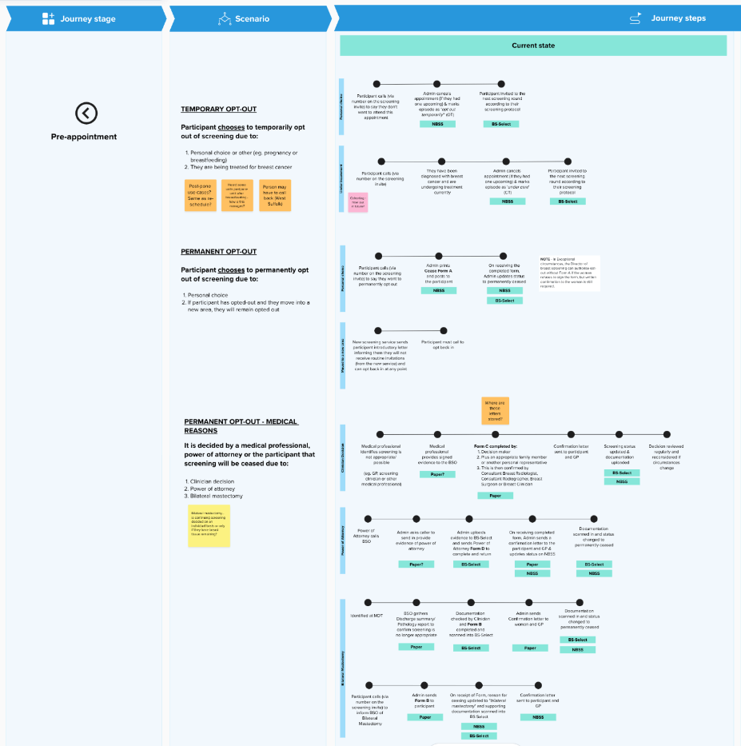
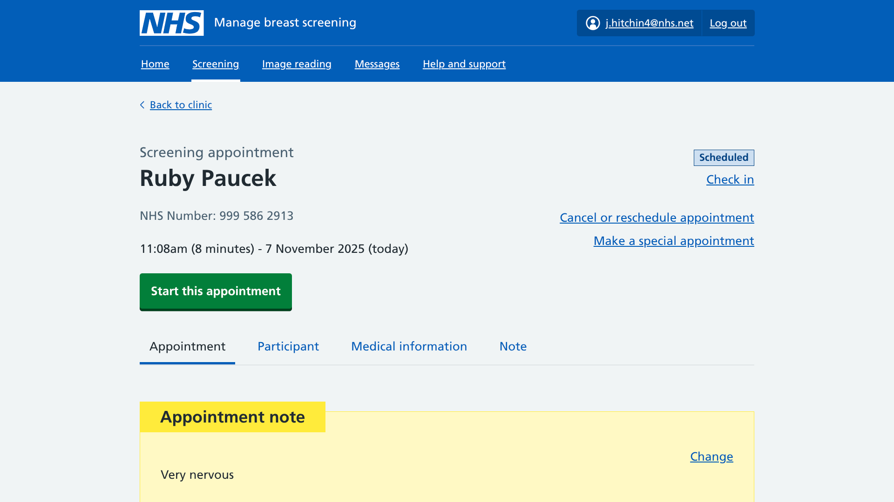
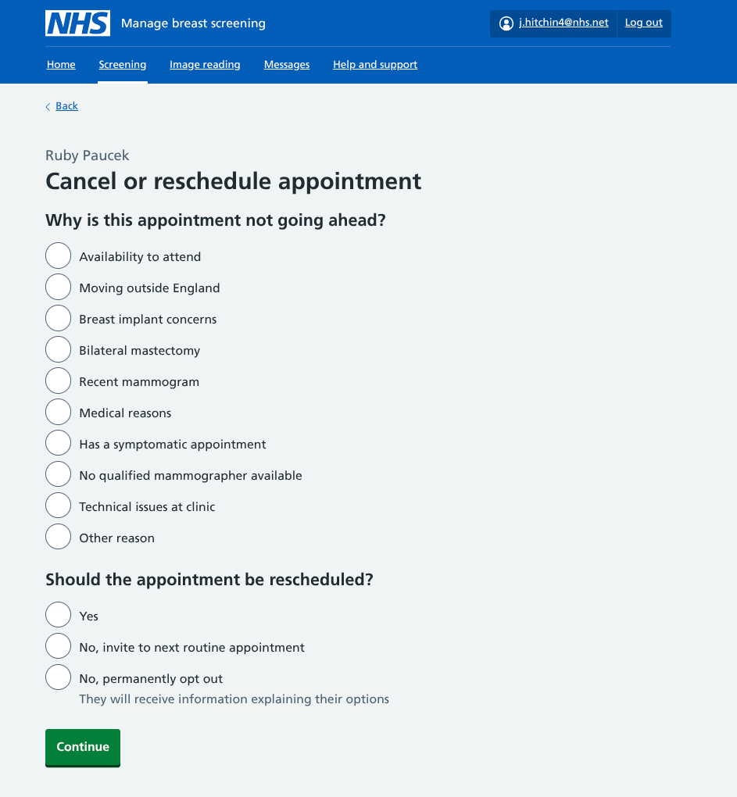
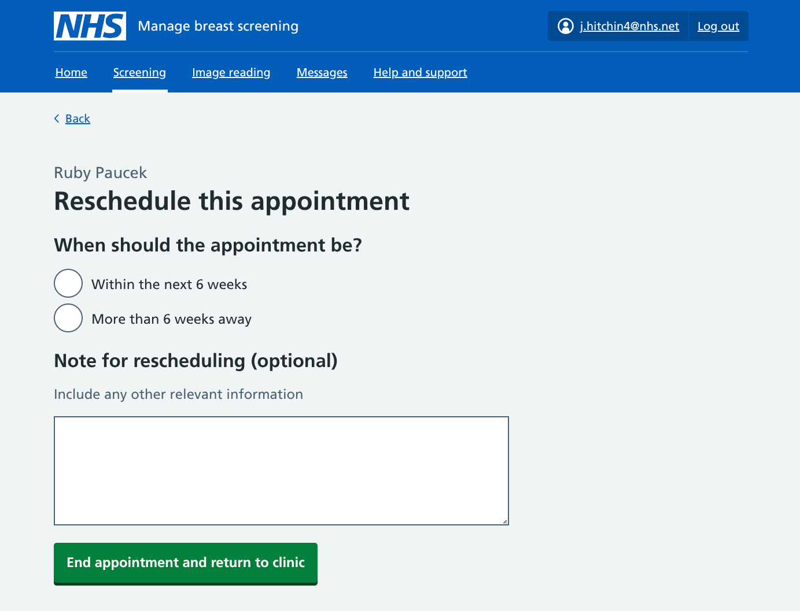
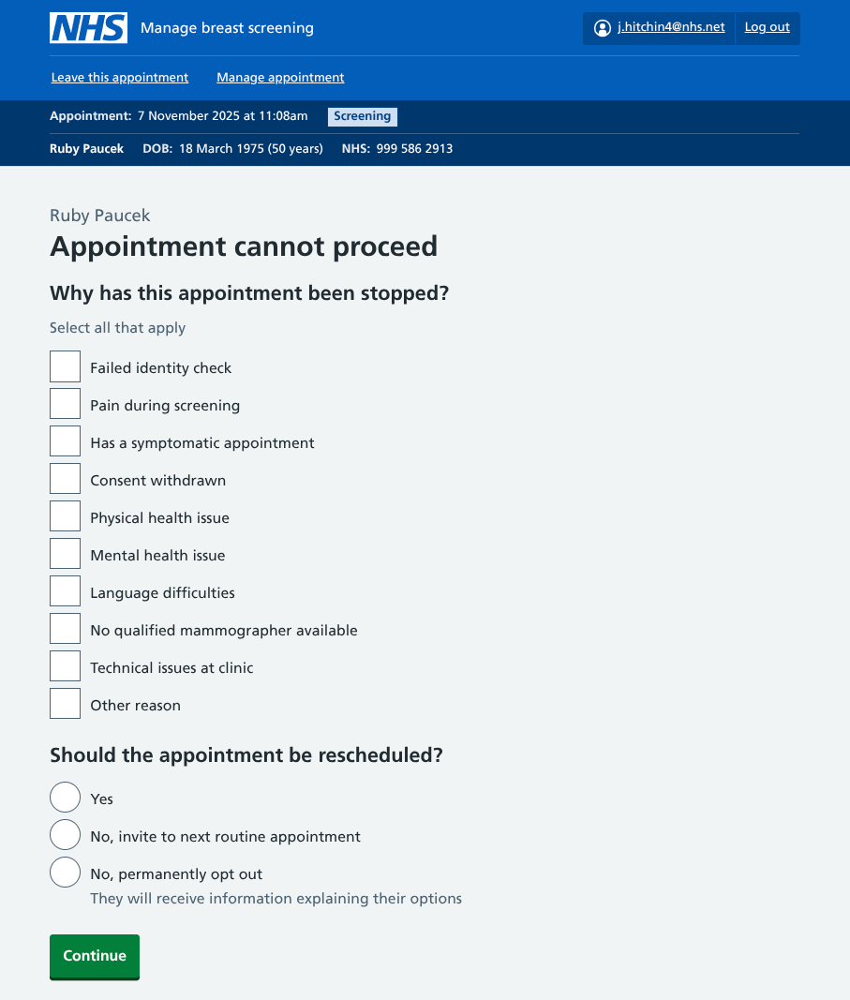
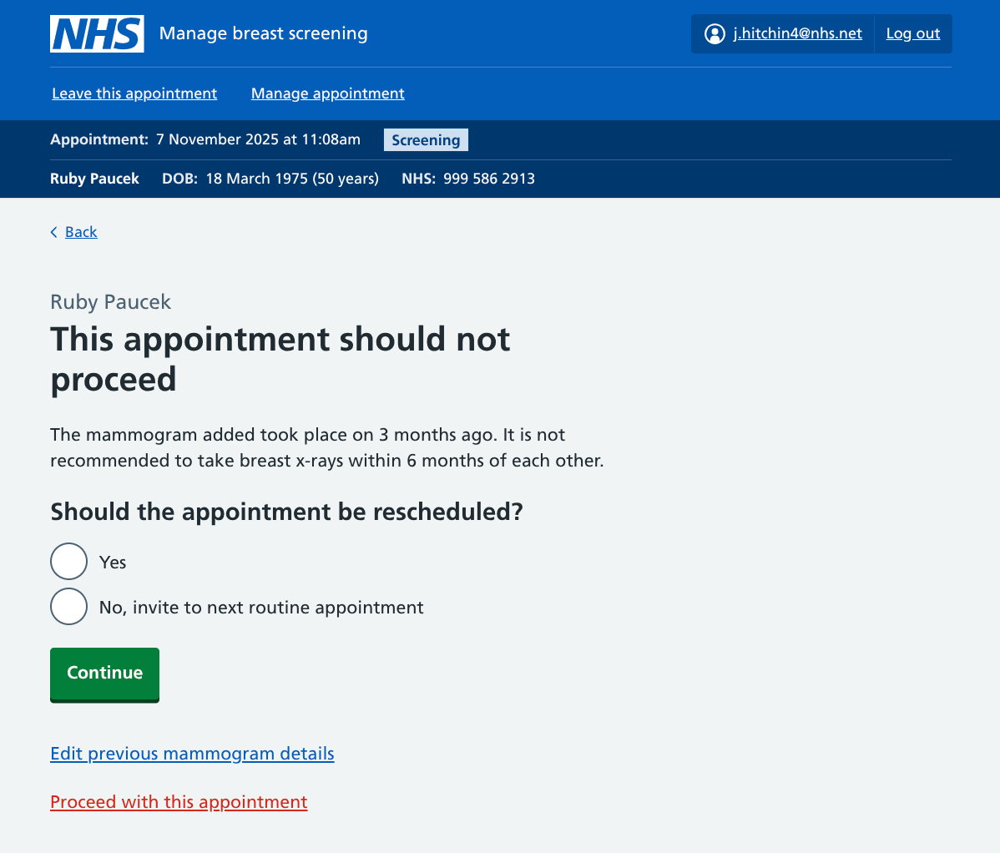
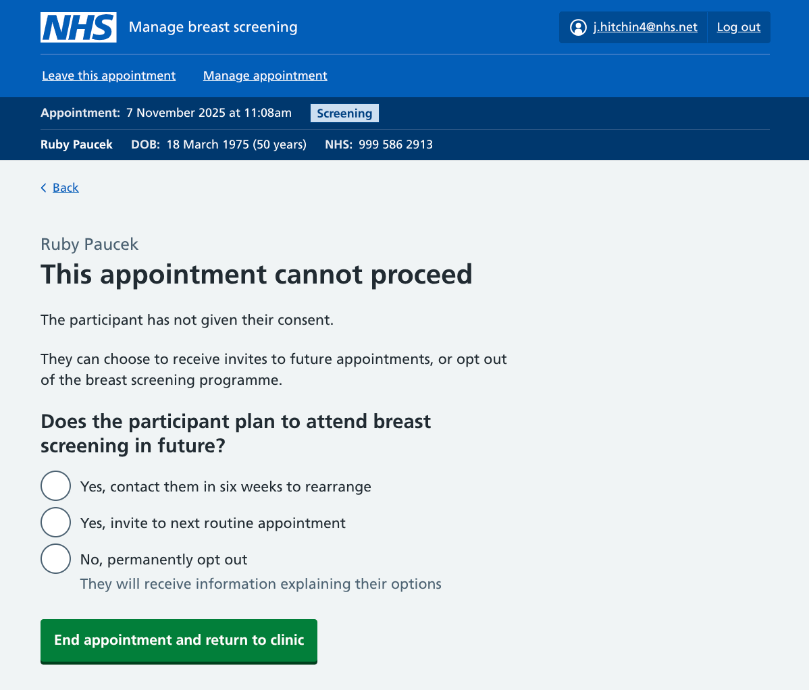

We've been looking at all the reasons why a breast screening appointment might not take place or be fully completed. 

Various journeys have been added to our prototype so the appropriate information can be captured for each scenario.

## Ideal and non-standard paths

A regular breast screening appointment will finish when the participant has had a set of four mammogram images taken.

But during each clinic there will be cancellations, appointments that need to stop partway through, and participants who don't turn up at all. Each of these needs to be accounted for with reasons provided where possible. The recorded information can be used for rearranging appointments, or to make sure no future screening invites are sent. It could also be used to identify trends across the breast screening programme for reasons why appointments are cancelled or aborted.

The National Breast Screening System (NBSS) provides staff with options to record many of these reasons. We're looking to simplify the experience, reflect the latest guidance and eliminate the need for some paper-based processes.

### Exploring each scenario

Before drafting the journeys, we reviewed information created for breast screening offices (BSOs) that determines what they're being asked to collect. This included guidance on [opting out](https://www.gov.uk/government/publications/opting-out-of-breast-screening/guidance-on-opting-out-cease-from-breast-screening), marking participants who [attended a clinic but were not screened](https://www.gov.uk/government/publications/breast-screening-attended-not-screened/breast-screening-attended-not-screened-guidance), and [reporting equipment faults](https://www.gov.uk/government/publications/breast-screening-quality-assurance-for-mammography-and-radiography/guidance-for-breast-screening-mammographers).

We wanted to see how this matches the processes that clinic admin teams and mammographers actually follow. We spoke to staff at numerous clinics and produced a map to identify gaps and see where improvements could be made.

We're aiming to create as few routes as possible to capture the widest number of scenarios. If an appointment is not going to go ahead, it should be straightforward for users to stop it and take any necessary actions from there.

Analysis of the current journeys narrowed our focus to three situations where reasons to stop might be recorded:

1. Before the appointment begins
2. After the appointment starts
3. After the clinic ends

## 1. Stopping the appointment before it begins

This includes any time before check in (including the days and weeks leading up to the appointment), or after the participant has been checked in at the clinic reception.

Two [appointment statuses](/manage-breast-screening/2025/02/defining-appointment-status-labels/) can be triggered at this stage; `Cancelled` or `Attended not screened`. This is determined by whether they make contact before they arrive, or come to the clinic and a reason is given there.

Some scenarios for why a participant's appointment cannot be started may include:

* they do not want to be screened (opting out)
* they're unavailable and need to reschedule
* they're concerned about their breast implants
* they fail the ID check at reception
* the clinic can't support their needs
* a technical issue at the clinic

For each of these, admin teams would view the appointment then select 'Cancel or reschedule appointment'.

They will first be asked to explain why. The options for the second question cover whether a participant is opting out of screening (either temporarily or permanently), and whether the appointment needs to be rescheduled.

### Working to current constraints

If rescheduling is required, we're offering the option to rearrange it. The options of arranging an appointment within or beyond the next 6-weeks mirrors the current booking functionality. We're using this as a starting point while working with colleagues rebuilding the screening invitation system to ensure any options provided here are in line with future functionality.

## 2. Stopping the appointment after it starts

Once the mammographer conducting the screening has actively begun the appointment workflow, two statuses are possible; `Attended not screened` (ANS) and `Partial mammogram`.

The partial mammogram scenario covers any instance where at least one X-ray has been taken, but the mamographer was unable to take the typical set of four. This is a more complicated journey that we are tackling separately.

At each stage of the workflow, an 'Appointment cannot proceed' link is available. When users select this they are asked for a reason. This list is very similar to the 'Cancel appointment' options, but has been adapted to include some things that can only occur once the appointment has actually begun, such as:

* they fail the ID check in the mammogram room
* they don't understand instructions given to them
* they need additional support that the clinic can't provide
* they have a medical issue that prevents screening
* they've had a total bilateral mastectomy
* there are technical issues with equipment before any images are taken

As well as actively stopping an appointment, users may reach an end point based on other information they enter into the service.

### Recent mammograms

One of the required steps during an appointment is for mammographers to ask participants about any recent mammograms that may not be on their system. If the participant reports that they have had a mammogram within the last 6 months, our service will let the mammographer know the appointment should not to go ahead and give them options on how to proceed.

### Withdrawn consent

Regulations state that mammographers need the participant's consent to continue if they have breast implants. If consent is not given, the mammographer is given options for how to end the appointment. This pattern may be reused in other scenarios where consent is required, such as when a participant has a carer.

This is only relevant where there's a specific consent workflow. If a participant chooses to withdraw consent for any other reason, mammographers can select the appropriate option from the 'Appointment cannot proceed' screen.

### Bilateral mastectomy

If the participant tells the mammographer they have had a double mastectomy and have no breast tissue remaining, no images need to be taken. In this scenario, the mammographer will be taken on a path to end the appointment.

## 3. Handling outstanding appointments after the clinic ends

The only status that can be applied here is `Did not attend` (DNA). This is where the participant does not turn up for their appointment and does not make contact to actively cancel it. 

When a breast screening clinic finishes, staff at BSOs currently run a series of end-of-clinic checks to ensure all appointments are accounted for. We've not yet designed a version of this in our service, but if any open appointments exist at the end of a clinic we will need a way to tell users about any DNA statuses they are about to create.

There may be instances where participants have called to cancel but this information has yet to be entered into the system. We will be providing a way to make changes at this point before closing the clinic.

## Testing each outcome 

We're including scenarios that would trigger each of these journeys within our user testing.

We're specifically looking to find out if:

* we've captured all the reasons why an appointment needs to be cancelled or stopped
* users can mark that an appointment needs to be rescheduled
* users can opt out a participant
* there are any other conditional end points that we've missed

## Future plans 

We're starting to develop ideas for what happens to the output of this information. In future, tasks such as rescheduling or opting out could be automated, but for our pilot we need to provide clinic staff with the necessary details to enable any post-clinic actions.

An early thought is to generate a report following each clinic for BSO admin teams to action. This would summarise any appointments to rearrange, any support requirements that need to be added to a participant record, and a list of participants who did not turn up that need to be contacted.
