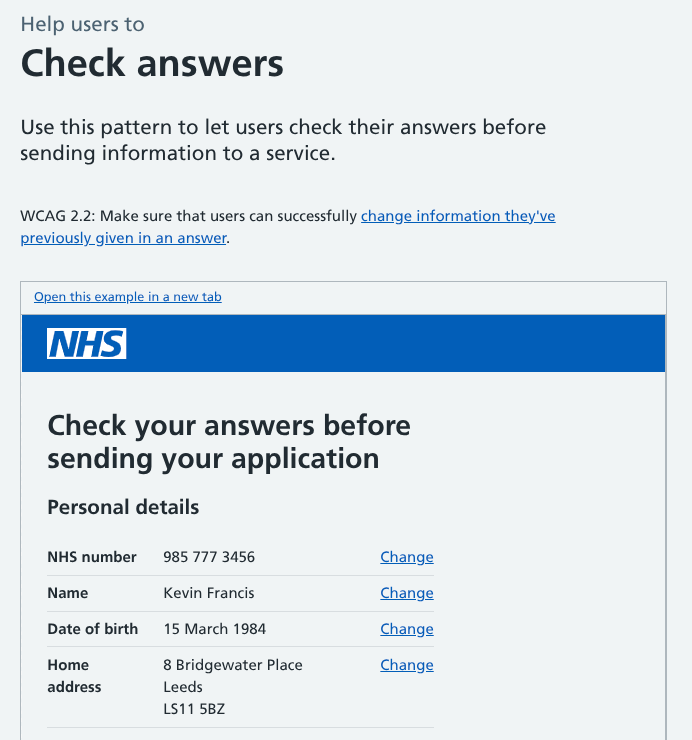
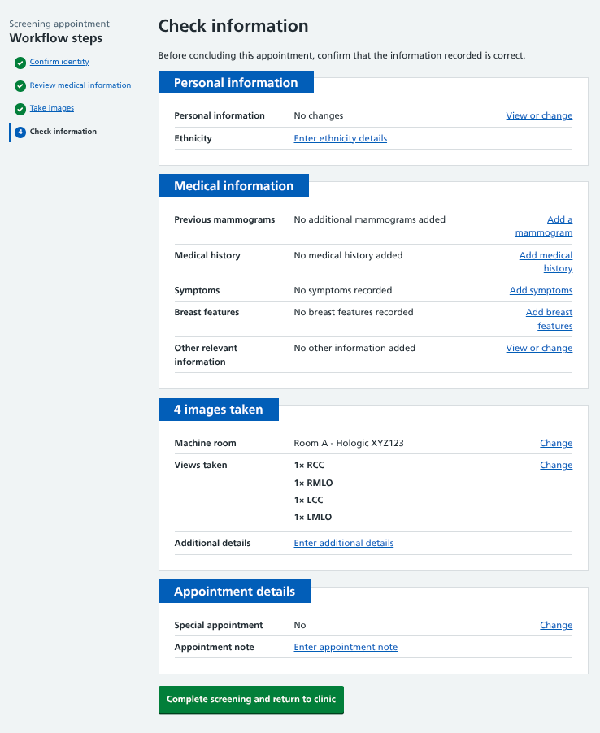
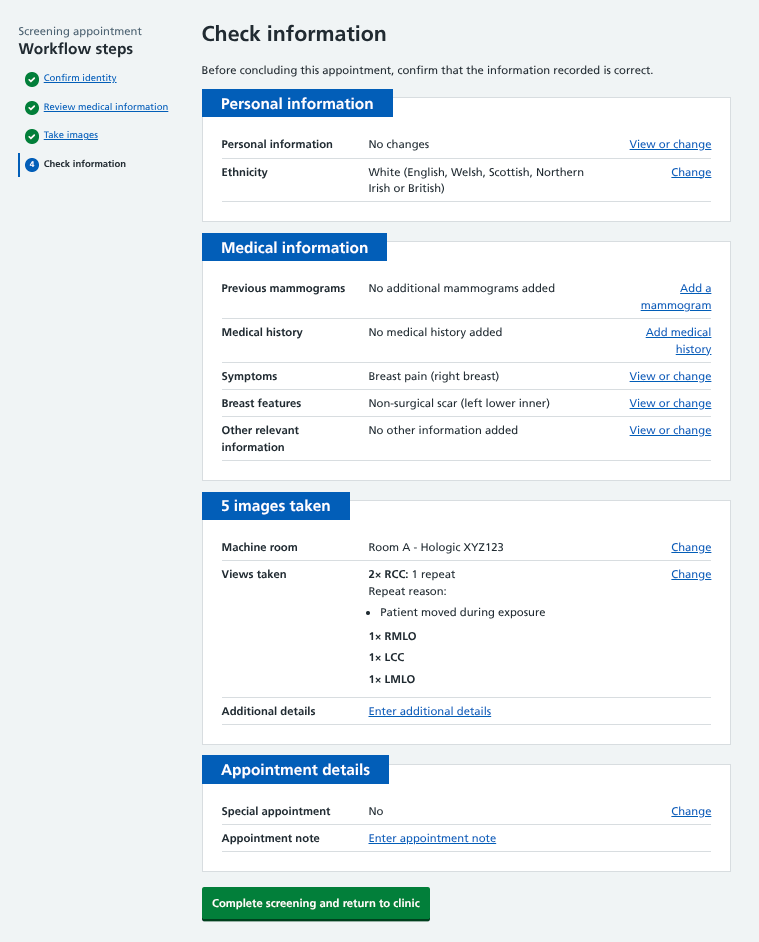
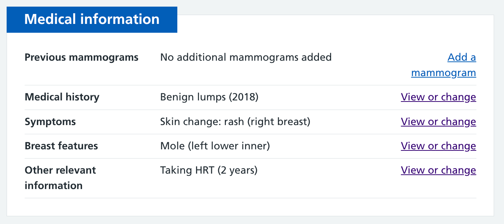
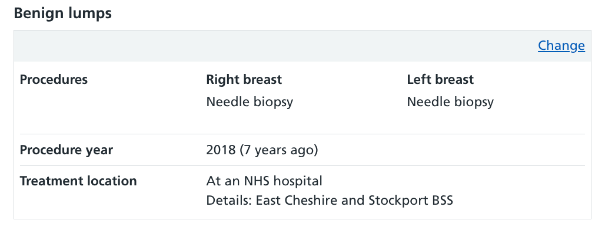
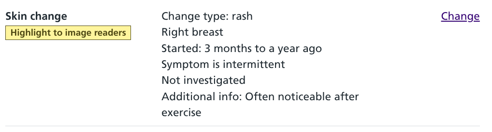
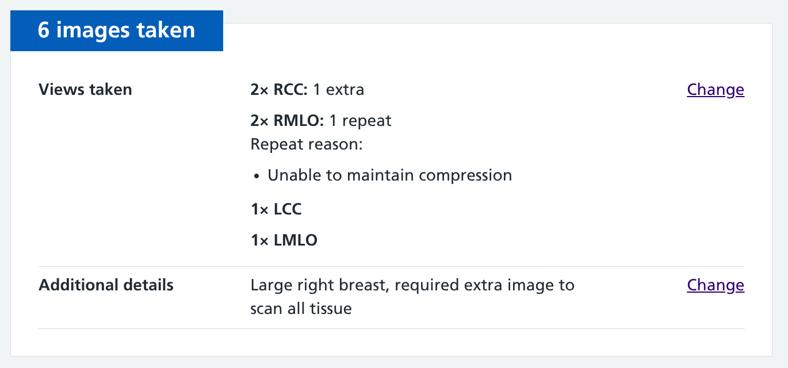
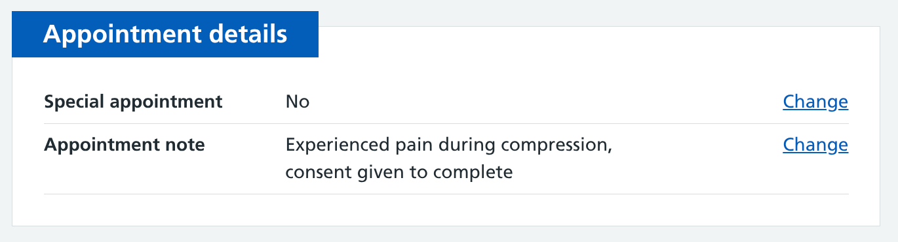

We're creating a way for mammographers to efficiently check the information they've collected during an appointment before they mark it as complete.

With current paper-based processes, any information recorded during the mammogram is later transcribed into a digital system. By asking for things to be confirmed before ending the appointment, we're aiming to make the overall process more efficient. 

## Bringing the appointment to a close

The steps of a breast screening appointment include checking the participant's identity, reviewing relevant medical information, and taking mammogram images.

Once these tasks have been done, the appointment can be considered complete. But before doing so, it's good practice to give users an opportunity to go through what they've done in case they've made a mistake or missed something.

A pattern for this called [check answers](https://service-manual.nhs.uk/design-system/patterns/check-answers) already exists in the NHS and GOV.UK design systems, using the [summary list](https://service-manual.nhs.uk/design-system/components/summary-list) component.

It shows all data submitted through a service, with links to change each entry where required. It helps users to:

- confirm that their data has been captured
- see they have completed all the required sections
- notice and correct any errors before sending data

This works for users who have time to review the accuracy of each line when registering with a GP surgery, applying for a passport, or filing their self assessment. 

But a mammography is a more time pressured environment. Our users will have already seen a summary of data when it was entered, and they have told us they don't want to have to repeatedly confirm things they've already done.

So we've customised the standard pattern, presenting 'just enough' detail so users can see a summary of what has been recorded, and quickly make any necessary adjustments.

## A succinct review

All the elements we need for this page have already been generated for the service, so our main task was to determine how best to summarise and organise them.

The workflow first asks users to confirm the participant's identity, then collect relevant medical information, and finally take images. Unless users tell us different in testing, it seems logical to show these details in that order on the review step, which we're calling 'Check information'.

This is how information would appear in the most basic appointment scenario. No participant details have been changed, there was no medical information to collect, and a standard set of four images has been taken.

In the next instance, the participant's ethnicity was recorded, a symptom and breast feature were added, and a repeat image was required. This is a lot more information in the service, but the way we've summarised the details means users only see a slightly longer review page.

### Reviewing personal information

When nothing has been edited, there seems little need to list out the name, address, GP details and other elements of the participant record.

So we've simply shown 'No changes' with a link to make amends if required. Where some items have been updated, just those are displayed, making it easy for users to see the details they submitted earlier.

The exception to this is ethnicity details. There's a push across the NHS to improve the accuracy of participant [ethnicity data](/manage-breast-screening/2025/06/recording-ethnicity/), so where this has not been recorded there's a second (still optional) opportunity for users to do so.

### Reviewing medical information

This step is broken down into previous mammograms, medical history, symptoms, breast features and other information. We're displaying each of these sections individually, with 'Nothing added' text against each where the participant has not shared any relevant information.

The default for summary lists where nothing has been entered is to show 'Enter details' within the middle column. But that could suggest to users that a necessary action has not been completed. We want to make it clear to mammographers that if there is nothing to record, there's nothing for them to do, and that's fine.

Where information has been added, we've made a conscious effort to only show a summary of details.

We're just going to show them the thing, and a piece of data related to that thing. This should give them the confidence that what they added earlier has been recorded correctly.

That can be slightly different for each section depending on what's going to be most useful for users when reviewing it. For medical history we're including a year, for symptoms a breast side, and for features a specific location.

The full medical history about benign lumps consists of procedures and treatment location. 

For the recorded symptom there's detail on the type of skin change, how long they have had it, whether it has been investigated and other relevant notes.

Showing all this raw data for each item at the review stage could have created a long and unwieldy step, so we made the decision to truncate it to just the essential info.

### Reviewing image information

Mammographers are mostly interested to know that the number of images being submitted matches the number they have taken. We're explicitly highlighting that in the component heading with 'X images taken'.

Users can see (and change if necessary) the machine they took images on, and the number of individual views. This will typically be one of each, but where additional images were taken or a partial mammogram was recorded, details are presented for review.

As the mammographer will have only just completed this step, the information should be very fresh in their mind. Unlike the other summarised review sections, it's being shown in full as it's the only time it's presented as one during the workflow.

There is also an 'Additional details' line, designed to be used as a way to pass on any pertinent information to image readers. We need to test this to make sure it's used as intended, and not for more general appointment notes.

### Reviewing appointment details

Mammographers sometimes pick up extra information from a participant during the appointment that would be useful for them to record for the next person performing their mammogram.

This could be highlighting requirements for a special appointment, or other information that would help the appointment be organised or managed more smoothly. The appointment details section provides a final opportunity to make these notes before concluding the workflow.

## Facilitating changes

We're expecting in most instances, users will skim through this section, confirm that everything is as expected, and click the 'Complete screening' button.

But sometimes they will need to add information, or make changes to what they entered previously.

On the first iteration of this review step, we tested two journeys when adding new or amending existing information:

* returning them to the review step without seeing a confirmation page for what they've entered
* taking them back to an earlier step in the workflow where they could see what has been entered, but had no easy way to return to the final review

Neither option felt right, so we've added in a series of mini confirmation pages. From the review page, users can perform any necessary action, confirm that they've entered the data correctly, and then go back to the final check information step. 

If a new symptom comes up in conversation while images are being taken, or they forgot to record that the participant is currently taking HRT, this information can be added quickly without the mammographer losing their place in the process.

## What we’re doing next 

We've shown this to some of the subject matter experts working within our team, and have included scenarios to test its usefulness in upcoming user testing. 

The initial feedback suggests that users are appreciative of the brevity of what is displayed.

We're going to iterate this page based on feedback, and look at other ways to incorporate these summaries within different areas of the service where they may help us to meet user needs.
