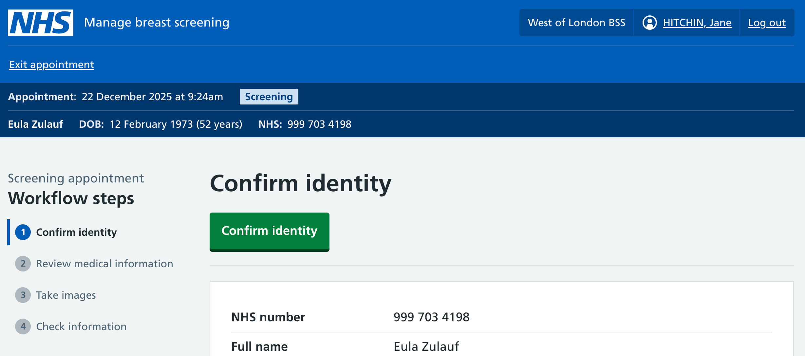
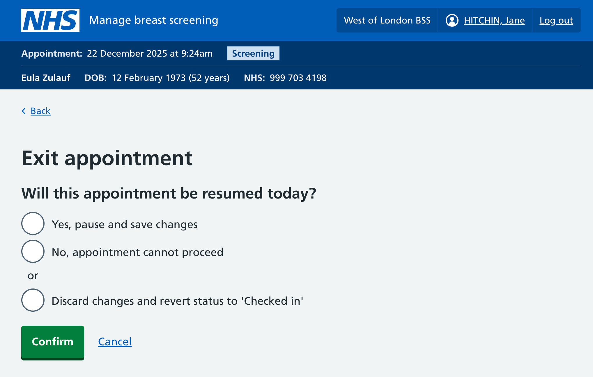
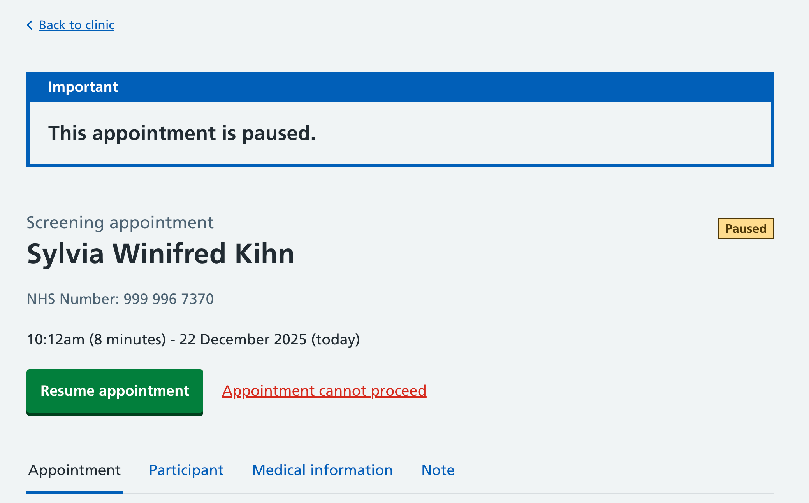

We've added the functionality for users to exit, pause and resume a breast screening appointment. This flow is accessed from a link in the top header ('Exit appointment'). 

We've added the link to the top left because that's a strongly established software pattern: closing a window is normally in the top left, where it’s easy to find. This is normally where the site navigation sits, which we hide during the workflow to allow the user to focus on the task. 

## Exiting an appointment

Users need to be able to exit an appointment. They might need to do this in a few situations: 

* They’ve selected the wrong person from the clinic list and need to switch to another participant
* There is pain during screening, or there’s a technical issue in the clinic (for example) – which means the appointment cannot proceed 
* The mammographer can’t continue the appointment, or there’s an interruption to the appointment leading to the appointment needing to be paused and resumed later that day

## Pausing and resuming an appointment

If the appointment is being resumed the same day, saving and pausing allows the appointment to be resumed later. To allow this, we introduced a new appointment status, 'paused', and when the appointment is viewed, it can be resumed or stopped. 

Paused appointments are considered to be 'in progress' appointments, and are grouped the rest of the in progress appointments on the clinic list. 

### Adding flexibility and helping users to recover from mistakes

We're providing flexibility so that more than one clinician can complete a screening appointment: for example, if one clinician starts then pauses the appointment, the appointment can be resumed by a different clinician. In future, we'll focus on more robustly supporting multiple clinicians in the screening workflow – this is just the start of this work, and there's more questions to answer and puzzles to solve. 

If this feature works as intended, it should help screening appointments to recover from unexpected disruptions. 

After an appointment is paused, and it turns out it can't be resumed after all, the user can select "Appointment cannot proceed" from the paused appointment page state. 

## If the appointment cannot proceed

If the appointment cannot proceed, the user can choose ‘No, appointment cannot proceed’ to be redirected to the appointment cannot proceed flow. The clinician can then select a reason why it can’t proceed, and can optionally request to reschedule the appointment. For more on ending breast screening appointments, see this design history post: [ending breast screening appointments](https://design-history.prevention-services.nhs.uk/manage-breast-screening/2025/11/ending-breast-screening-appointments/).

If images have been taken at this point, we won’t show this option, as the appointment can’t be stopped. 

## Selecting the wrong person by mistake

If the clinician mistakenly selects the wrong person and starts to complete information for this person, the clinician can choose ‘Discard changes’ to discard information and reset the appointment status back to ‘checked in’. 

## Next steps

### Exploring an interim review step when data is saved

We might want to explore showing the review page to the appointment pauser or resumer, so they’re aware of what data has been added during the appointment so far. 

### User research and usability testing

We’ll need to do user research and usability testing to find out how well users understand these options. 
