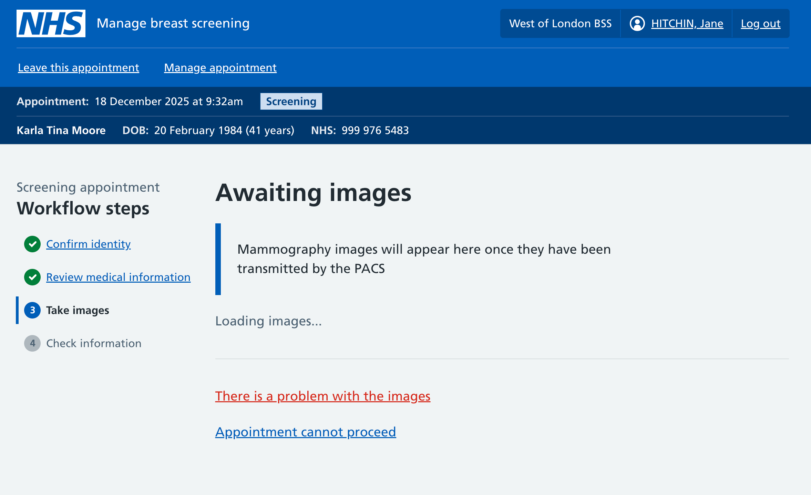
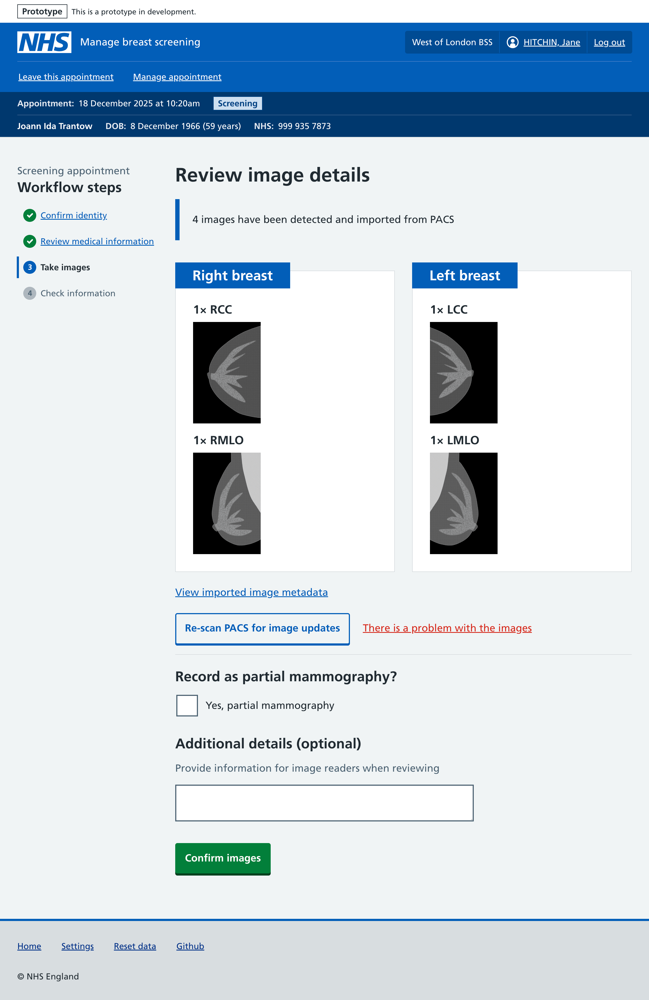
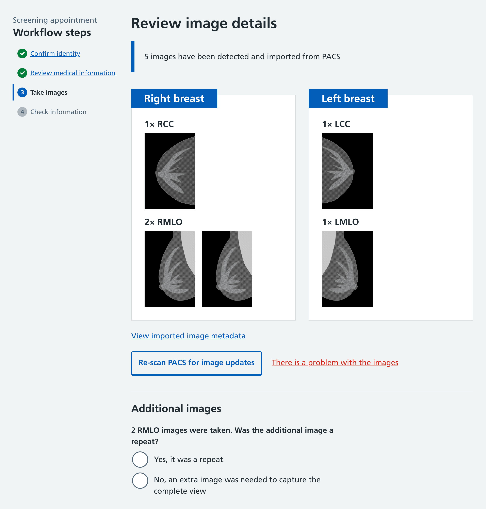
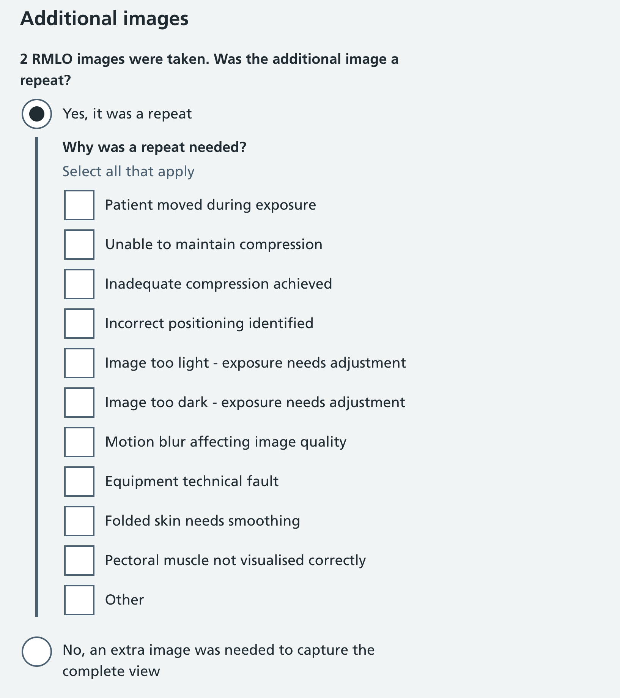
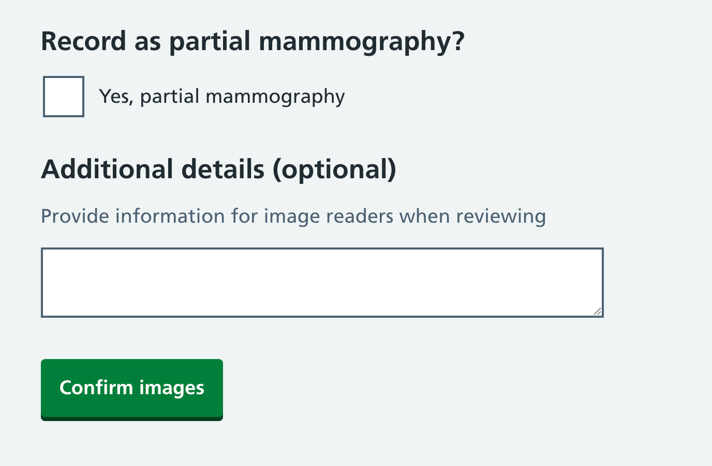
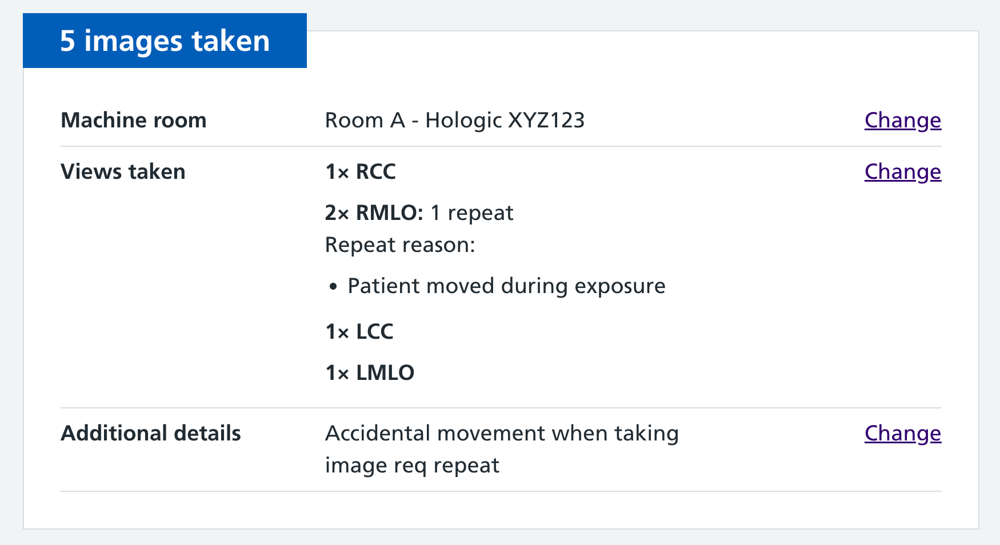
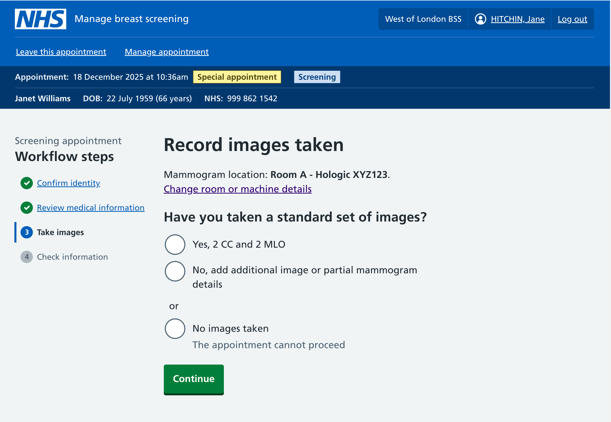
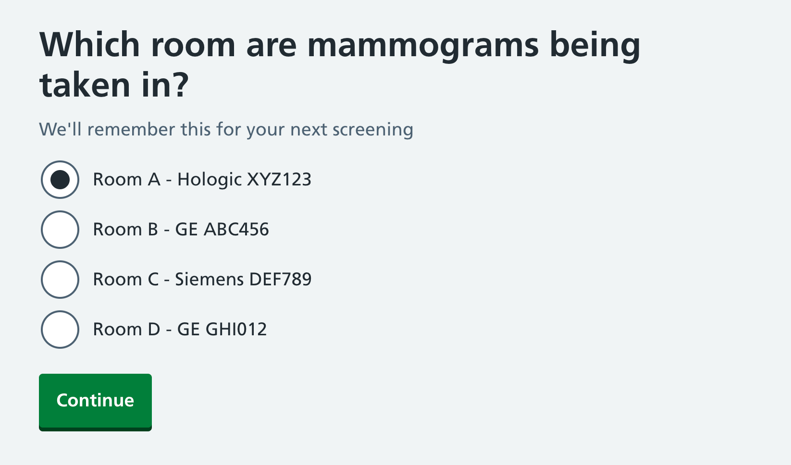
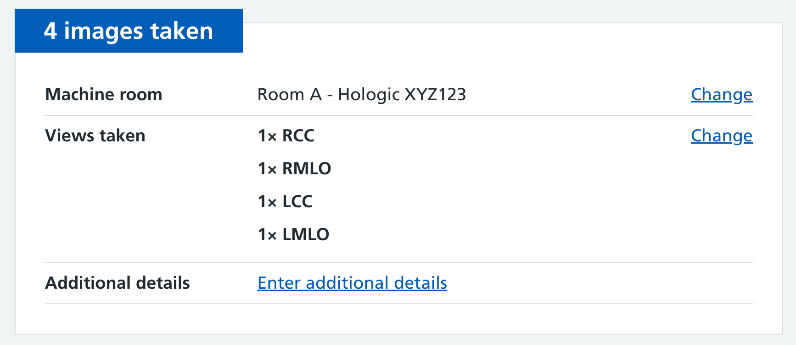
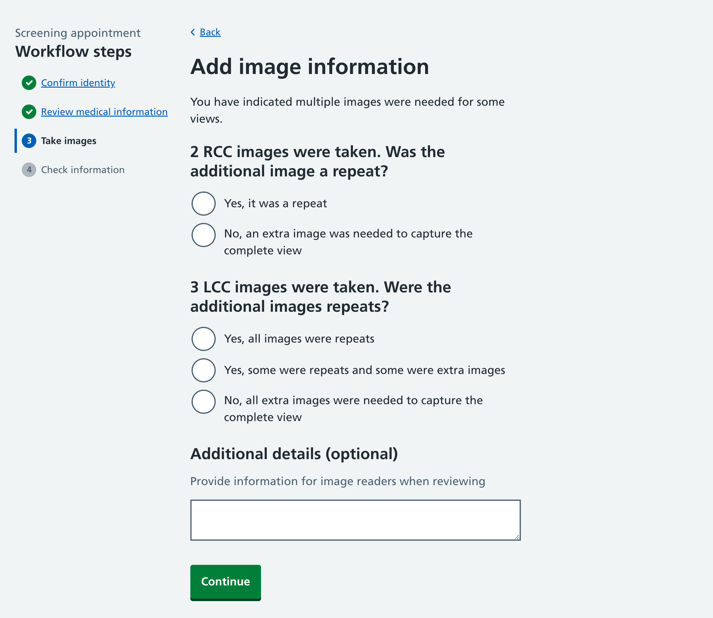

We’ve been working on way to capture information about the images (x-rays) that have been taken during the screening appointment. This post explains why we're collecting certain pieces of data, and our approach for private beta.

## The current service

After images are taken, there’s no direct link between the mammogram machine and the current service (National Breast Screening System, NBSS). Mammographers need to manually record details about the images they took, either on paper (which is later transcribed into the digital system) or directly into NBSS.

They record things including:

- the location and equipment used to take the machines
- the name of the mammographer who took the images
- any general comment on the imaging
- which views were taken on each side
- how many images were taken (labelled exposures in the screenshot)
- how many repeats, and a reason why
- if it was partial mammography, with a reason code and free text comment
- the radiation dosage (not always collected manually)

For the majority of appointments, most of this information is identical - the current mammographer has taken 4 standard views. NBSS has a ‘Save as Defaults...’ feature that helps to avoid wasted time by preselecting the current values for the next session.

## Why this data is needed

This data is primarily used for:

- Safety checks
- Regulatory compliance

### Safety checks

When the images are first taken, they are available on the local computer attached to the x-ray machine (called the modality). The group of x-rays taken per participant are called a study. The mammographer will review the study on the machine before ‘completing’ it. Once completed, it will be sent to the hospital’s picture archiving and communication system (PACS), where it will be available to radiologists. Transferring from the modality to PACS can take anywhere from minutes to hours.

It’s rare, but things can go wrong in some of these steps. Images might fail to transfer to PACS, or metadata could be wrong on the images. The metadata being wrong could be as simple as a RCC view being accidentally recorded as a LCC view, or a more serious mistake might be the images being recorded against the wrong participant.

Breast Screening Units (BSUs) have multiple safety checks in place to prevent, mitigate and catch mistakes or errors. One of those is manual recording of image data - so that later the images in PACS can be compared to the manually recorded notes. If the notes say 5 images were taken but only 4 are in PACS, then something has gone wrong and it should be investigated.

### Regulatory compliance

Regulatory compliance primarily comes from the [Ionising Radiation (Medical Exposure) Regulations (IR(ME)R)](https://www.gov.uk/government/publications/ionising-radiation-medical-exposure-regulations-2017-guidance).

There’s lots of detail to the regulations, but the overall aim is to minimise exposing individuals to radiation from medical equipment, and make sure there are clear records of what’s happened. For the purposes of the regulations, it’s important to record who took the the x-rays, how many were taken and of which type, the dosage, and details about repeats. Recording this in NBSS as you take them (or on paper to be transcribed) is an immediate record of the radiation exposure of the participant.

## Could we get this data elsewhere?

When an image is taken on the x-ray machine the image file itself has metadata that includes the mammographer who was using the machine, the view, the side, the dosage, and much more.

Given all this available information, an obvious question might be: why are the same details recorded manually?

The manually recorded details serve as a backup record for when some of the thing noted above go wrong. This is important when there can be a significant time delay before the images are available in PACS.

## Automatic image flow (our ideal workflow)

Our automatic image flow hopes to change the existing workflow by retrieving the images immediately after they’re taken, allowing us to capture the metadata about them. Rather than a mammographer telling us about what they did, we can show them what they did, and get them to confirm it’s correct. They can then add any extra details they need - such as telling us about partial mammography or repeats.

### Awaiting images

Once the mammographer has Oncereviewed a participant's medical information and is ready to proceed to taking images, our interface will await receiving them.

### Review image details

When the mammographer has marked the study as complete on the mammogram machine, our service will display low res thumbnails of the images. We can use the image metadata to retrieve the view name, dosage, and other details.

In most cases there’s nothing further to do - the mammographer can continue. We have a free text box where they can add further details if necessary.

### Annotating repeat and extra images

If we detect 2 or more of any view, we need to ask the mammographer if it was a ‘repeat’ or an ‘extra’ image. These terms are defined in the guidance:

- Repeats - where some issue has occurred (blurring, technical issue, etc) that required re-doing an image.
- Extras - where additional images were needed to fully capture the breast.

We can’t automatically work out the reason for the additional image, but we can avoid asking about repeats unless there is an additional image for a view that we’re not expecting:

If the user selects ‘Yes it was a repeat’, then we can conditionally collect a reason for the repeat:

### Additional details

Finally, a user can tell us if it was partial mammography, and give us a free text comment. The comment is primarily for the mammographer to give more context to the image reader about the images.

### Data display

When we show this image information on the [final review step](/manage-breast-screening/2025/12/checking-information-collected-during-an-appointment/), here’s how it looks:

## Manual image flow (backup workflow)

Our automatic image flow is our medium term ambition, which we hope will help reduce some of the current administrative paperwork. But we also anticipate that we may not always have the ability to get the images immediately, so we should have a fallback flow to manually record the images taken, similar to how it’s currently done in NBSS. We may launch with this first for our private beta, and hope to later replace with the automatic flow in most cases.

### Record images taken

Our flow starts by asking if a standard set of images have been taken. If there have, there’s nothing further to collect. This is a similar shortcut to the NBSS ‘Save as defaults...’ option.

We also display the room we think the screening is taking place in, and let the mammographer change it if needed. There will be more research and design needed on room and machine setups, but for now we’re assuming that BSUs will be able to set up their rooms and machines - when first signing in to the service we can ask which room they’re in that day. This will be relevant for clinics running at the hospital, but not for clinics running from a mobile screening van.

After selecting that they took a standard set of images, we can default the values:

### Provide image details

If the mammographer needed to take fewer or more images than expected, the second option takes them to a page where they can record more specific details about which views and how many were taken:

### New stepper component

Mammographers will be adjusting the default view counts by 1 or 2. To do that they could type in to the text entry boxes. But as they’ll usually need to only make a small relative adjustment, we’ve designed a new stepper component to let them adjust the numbers without typing. They can click the plus or minus button to adjust the counts. This component progressively enhances from a text input and we have [opened a PR to contribute back to the NHS Design system](https://github.com/nhsuk/nhsuk-frontend/pull/1719).

### Recording repeats

If the mammographer adds 2 or more of any view, after submitting this page they’ll be shown a conditional page asking about those additional images. The question is the same as the automatic image flow:

## Usability testing

In our usability testing, mammographers have quickly become familiar with the interface to add the standard set of images or to add more complex details.

### Freetext comments for standard sets of images

They’ve told us that currently they may often write freetext like “Best possible images” as a message to go to the image readers. They can do this with our flow in our ‘additional details’ box - but this isn’t currently shown if they select the initial option to say they’ve taken a standard set of images. We could choose to move this box earlier - but would like to evaluate how helpful comments like ‘best possible images’ really are. Can it already be assumed that a mammographer has taken the best possible images? Do image readers do anything with this information? Is this message masking a deeper need or something we could solve in a different way?

### Recording repeats on the same page

We’ve found some challenges with the conditional repeats page in usability testing. Users are very used to recording details of repeats on the same screen - so look for a place to do that. We’d need to rely on javascript to insert this content on the prior screen as it depends on the answers they give on that screen.

We may also find that once users are familiar with the new service, then this extra page works well. Repeats are relatively uncommon - 1-3% of screenings - so an extra page focused on these details feels like a good starting point we can work from in the future.

## Future work

There’s still a fair amount of ambiguity in the imaging area - especially the automatic image flows. A lot will depend on our private beta partners and on experiments to see what’s feasible. There’s several links in the chain from x-ray machine to PACS, and we’re still trying to technically work out where we can insert ourselves to avoid multiple minute to hour delays in images arriving.

One future focus is the need to provide troubleshooting information that tells mammographers what to do if it appears something has gone wrong with the images. This will go further towards our goal of making the whole process more efficient, helping mammographers to fix information there and then, rather than having to log issues to be looked into later.
